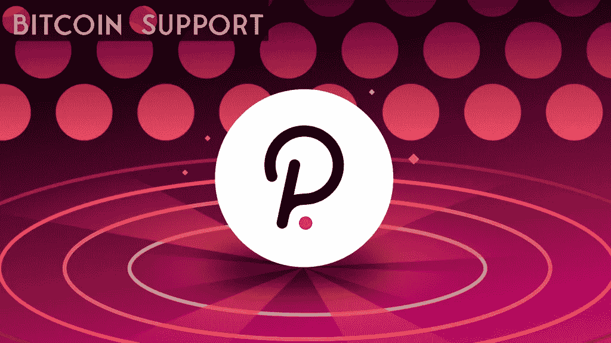

# Polkadot 驱动的初创企业引发互操作性的最新发展

> 原文：<https://medium.com/coinmonks/polkadot-powered-start-ups-triggers-latest-developments-in-interoperability-d80e2a54d75e?source=collection_archive---------38----------------------->

**Visit our website:-** [**https://bitcoinsupports.com/**](https://bitcoinsupports.com/)

以太坊虚拟机有可能存在于其他区块链网络上吗？

区块链发展是一个快速增长的领域。新的计划和网络每天都在发展，声称可以提供更快的性能或前所未见的新功能。

不管那些断言是否准确，众多区块链网络的存在迫使开发者在开发一个去中心化的应用之前权衡每一个的优缺点(DApp)。而且，通常情况下，开发人员从一开始就被束缚在他们喜欢的网络上。

**一个至关重要的选择**

创造一个 DApp 并不容易。开发团队必须能够用一种或多种语言编程，使用沙盒环境和虚拟机，并创建不同复杂程度的智能合约。除此之外，评估哪些网络已经或可能吸引大量用户也很重要。

与其他现代网络相比，以太坊(ETH)速度慢且价格昂贵，但它拥有一个强大的虚拟机——以太坊虚拟机(EVM)，以及比许多竞争对手更多的用户。万维网联盟甚至创建了以太坊应用标准(W3C)。在功能层面，其他网络，如 Polkadot (DOT)可能更快更强大，但缺乏以太坊的海量用户群。dapp 现在被分为以太坊和非以太坊 dapp，互操作性具有挑战性，但开发者不会因此而止步。一些公司甚至正在开发虚拟机和智能合约，支持以太坊和他们首选的网络。

**一个潜在的答案**

ParaState，一个 DAO 构造一个基于 WebAssembly (WASM)的虚拟机，兼容以太坊(eWASM)和 Polkadot，是一个寻求解决这一发展鸿沟的项目。使用准状态电子货币技术创建和部署的智能合约，从本质上讲，从一开始就是以太坊兼容的。开发人员可以简单地将它们拖放到 Polkadot 中。

由于精简的互操作性，开发者不必掌握几种编程语言，也不必拘泥于单一平台。他们可以专注于开发，然后担心网络部署。

不仅如此，用 eWASM VM 创建的 DApps 符合所有 W3C 标准，让开发者在技术熟练程度上少了一件担心的事。该平台还可以与当前的 DApps 兼容，这可能是最显著的特点。使用这种方法，开发人员可以快速地将他们基于以太坊的项目迁移到 Polkadot，反之亦然。未来，ParaState 希望支持其他区块链网络。虽然 ParaState 支持 Solidity 等现有语言，但它已经通过支持 RUST 和其他智能契约语言而被开发为“面向未来”的语言。另一方面，ParaState 的表现取决于开发人员，DApp Geminis Network 正致力于在一个平台上为所有 Polkadot parachains 提供内置以太坊兼容性(eWASM + EVM)。为了做到这一点，双子座网络正在寻求在 Polkadot 的 crowdloan 拍卖中获得一席之地。它自豪地称自己是 ParaState 尖端技术支持的第一个 parachain。

双子座网络如果被波尔卡多特和准州社区投票通过，将获得波尔卡多特杰出副链之一的席位，并通过众筹贷款方法获得资金，如果他们被投票通过，他们将获得波尔卡多特杰出副链之一的席位，并通过众筹贷款方法获得资金。

“双子座网络需要 dot 持有者 ParaState 和 Polkadot 社区的支持，”根据双子座网络。你的投票可以帮助双子座网络成为一个 Polkadot parachain，与分权治理的理念保持一致。通过在 Polkadot crowdloan 拍卖中为 Geminis Network Network parachain 投票，您正在启用一项技术，使开发人员能够更轻松地构建高性能区块链应用和基础设施。"

**访问我们的网站:-**[**【https://bitcoinsupports.com/】**](https://bitcoinsupports.com/)

**免责声明:这些是作者的观点，不应被视为投资建议。读者应该自己做研究。**