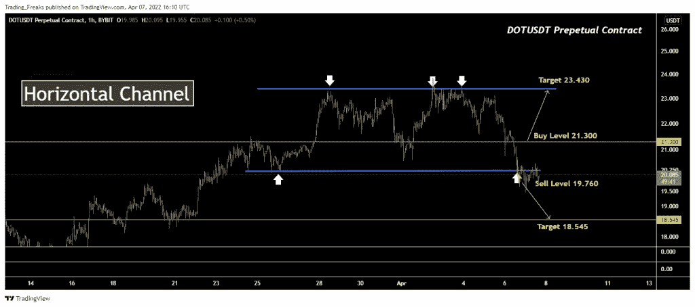
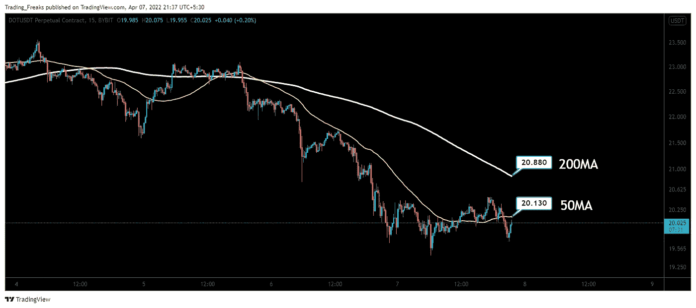

# 4 月 8 日波尔卡多特价格预估

> 原文：<https://medium.com/coinmonks/polkadot-price-estimates-on-april-8-6da64e721ad5?source=collection_archive---------74----------------------->

**Visit our website:-** [**https://bitcoinsupports.com/**](https://bitcoinsupports.com/)

-4 月 8 日，乐观点价格研究表明，该股交易价格为 23.430 美元。

— DOT 预测 2022 年 4 月 8 日的负市价 18.545 美元。

—波尔卡多特的移动平均线呈现下降趋势。

2021 年 4 月 8 日的 Polkadot (DOT)价格分析使用价格趋势和移动平均线来预测加密货币的未来走势。

**波尔卡多特(DOT)**

DOT 是波尔卡多特的原生加密货币。2016 年，制定了区块链互操作性标准。这是一个分片区块链，这意味着多个链连接到同一个网络，允许在链之间并行处理和数据移动，而不会危及安全性。

**波尔卡多(dot)价格分析**

2022 年 4 月 8 日 DOT 价格分析按小时详细如下。

**Visit our website:-** [**https://bitcoinsupports.com/**](https://bitcoinsupports.com/)

水平通道或横向趋势的外观类似于矩形形态。它至少有四个接触点。这是因为它需要至少两个低点和两个高点来连接。买卖压力相等，价格运动主要是横向的。水平通道出现在价格整合时期。在水平通道中，买入和卖出的压力是相似的，直到突破或崩溃发生。

DOT 目前售价 20.51 美元。如果该模式成立，DOT 的价格可能会达到 23.430 美元的阻力位，而买入位为 21.3 美元。如果趋势逆转，DOT 的价格可能低至 18.545 美元，而卖出水平为 19.760 美元。

**带圆点的移动平均线**

下图说明了圆点的移动平均线(MA)。

**Visit our website:-** [**https://bitcoinsupports.com/**](https://bitcoinsupports.com/)

DOT 目前看跌。值得注意的是，点价格在 50 毫安(短期)和 200 毫安(短期)下方交易，表明它完全看跌。因此，总是存在点趋势反转的风险。

**访问我们的网站:-**[**https://bitcoinsupports.com/**](https://bitcoinsupports.com/)

**免责声明:以上为作者观点，不应视为投资建议。读者应该自己做研究。**

> 加入 Coinmonks [电报频道](https://t.me/coincodecap)和 [Youtube 频道](https://www.youtube.com/c/coinmonks/videos)了解加密交易和投资

# 另外，阅读

*   [CoinFLEX 评论](https://coincodecap.com/coinflex-review) | [AEX 交易所评论](https://coincodecap.com/aex-exchange-review) | [UPbit 评论](https://coincodecap.com/upbit-review)
*   [AscendEx 保证金交易](https://coincodecap.com/ascendex-margin-trading) | [Bitfinex 赌注](https://coincodecap.com/bitfinex-staking) | [bitFlyer 评论](https://coincodecap.com/bitflyer-review)
*   [麻雀交换评论](https://coincodecap.com/sparrow-exchange-review) | [纳什交换评论](https://coincodecap.com/nash-exchange-review)
*   [支持卡审核](https://coincodecap.com/uphold-card-review) | [信任钱包 vs 元掩码](https://coincodecap.com/trust-wallet-vs-metamask)
*   [Exness 点评](https://coincodecap.com/exness-review)|[moon xbt Vs bit get Vs Bingbon](https://coincodecap.com/bingbon-vs-bitget-vs-moonxbt)