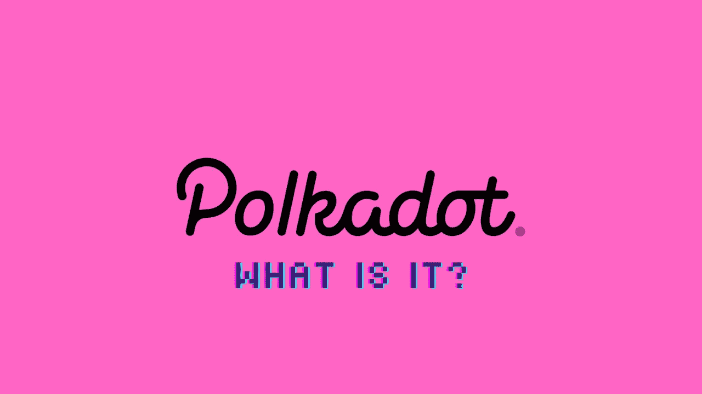

# 波尔卡多特会成为百万富翁，但它是什么？

> 原文：<https://medium.com/coinmonks/polkadot-will-make-millionaires-but-what-is-it-2278fffa9631?source=collection_archive---------31----------------------->

以太坊联合创始人加文·伍德领导的 Web3 基金会开发了 Polkadot。由于缺乏一个能够以分散和并行的方式运行多个链的平台，这个项目诞生了。

正因为如此，一个开源项目应运而生。它支持区块链网络之间的互操作性。尽管 Polkadot 去年 5 月才推出，但它已经在由比特币和以太坊主导的区块链世界中声名鹊起。

可扩展性和互操作性是比特币在不需要中央机构的情况下促进价值转移的主要障碍。像以太坊这样更灵活的网络也因此而诞生。

此外，以太坊创造了一个生态系统，价值可以通过智能合约更快地转移，允许在没有中介的情况下构建和运行更大范围的应用程序。然而，以太坊网络的拥堵和高昂的燃气费正在挤出越来越多的项目。那是波尔卡多…已进入游戏。

波尔卡多特拥有 4000 多种加密货币，它的崛起可谓一日千里。短短几个月，Polkadot 的原生令牌 dot 就成为了排名前 10 的加密货币。随着 Gavin Wood 在最近的一篇博客文章中宣布推出 parachains，Polkadot 推出的最后阶段已经开始。

2016 年，伍兹发表了题为《波尔卡多特》的白皮书。据说以太坊前 CTO 伍兹在以太坊基金会工作期间编写了 Solidity 编程语言。

据报道，2015 年与以太坊联合创始人 Vitalik Buterin 密切合作的伍兹对以太坊 2.0 开发的拟议启动不得不推迟感到失望。

切分是一种新的以太坊运行方式，伍兹在 2016 年离开了这种方式。之后，他创立了 Web3 基金会，这是一个非营利组织，致力于研究和推进像 Polkadot 这样的去中心化技术。

点

在这段视频中，Polkadot 的 DOT token 是市值排名第十的加密货币。在网络中，效用令牌充当治理、绑定和赌注机制。

dot 的持有者可以通过治理功能对 Polkadot 网络行使权力。网络的所有者可以完全控制运营费用、拍卖动态和添加新副链的时间表。这些人还可以安排升级和平台修复。

为了更安全，交通部(DOT)积极参与。点持有者的任务是验证跨副链的交易，作为利害关系证明协议的一部分。要想参与，点令牌持有者必须拿出他们的令牌作为赌注。

作为第三个功能，“键合”允许使用 DOT 向网络中添加新的副链。一旦键合期结束并且对位链被移除，点标记将可再次使用。

Polkadot 的未来值得关注，因为它对企业家、开发者、用户和投资者都有好处。

为了鼓励参与，DOT 充当协议的治理令牌，用于保护网络安全或绑定新链。凭借平均 10%的年收益率，押点已经成为加密领域最有价值的激励措施之一。

平台的稳定性和可靠性，以及平台对其路线图的承诺，有助于该项目的美好未来。无论从技术还是经济价值来看，Polkadot 都是最具创新性的区块链项目之一，未来几个月将是决定该网络真实能力的关键时期。

所以起价

2020 年夏天，我们所知的 Polkadot 的价值约为 2.75 美元。

例如，当年 8 月 20 日，它以 2.79 美元开盘，随后跌至 2.69 美元，这是加密货币的历史低点。

波尔卡多特的未来价格？

波尔卡多特有潜力在未来五到十年成为最有价值的货币。交易所之间的永久合约有可能提高货币价值，并将其推至新高。LINK 和其他著名的区块链网络之间的合作可能会扩大。如果只有少数买家和卖家，交易价格可能会在 2023 年至 2024 年期间达到 200 美元。尽管这不是财务建议，只是一种观点，请记住在投资前做自己的研究。