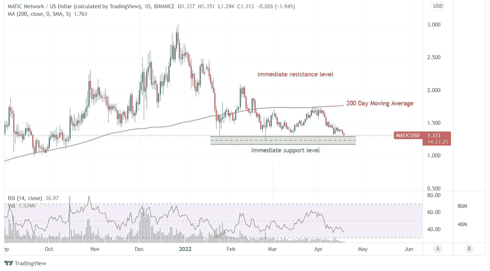

# Polygon 面临来自 200 DMA 的阻力:现在应该买 MATIC 吗？

> 原文：<https://medium.com/coinmonks/polygon-faces-resistance-from-200-dma-should-you-buy-matic-now-4df01dcfeca0?source=collection_archive---------25----------------------->

Source photo TradingView.com

自 2022 年初以来，MATIC 的价格一直在稳步下降。对于 MATIC 持有者来说，1.3 美元水平已经成为最大的购买点。200 天移动平均线(DMA)正在严重打击从这些水平产生的购买热情。这种购买兴趣的减弱阻碍了价值的稳步上升，否则就会出现这种情况。