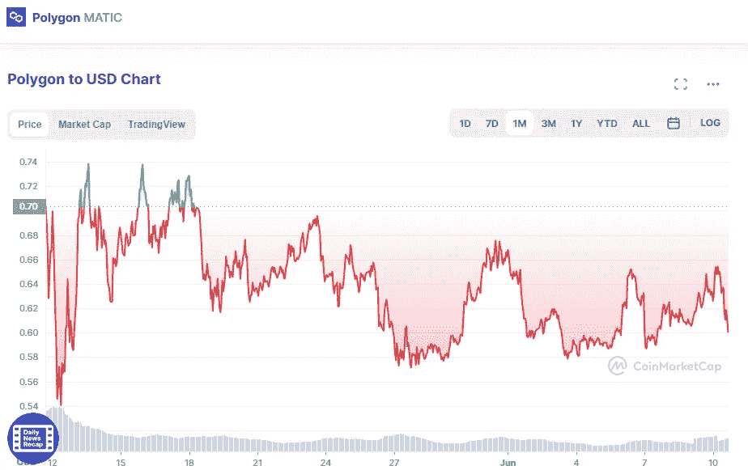

# 多边形:MATIC 是一个好的投资吗？

> 原文：<https://medium.com/coinmonks/polygon-is-matic-a-good-investment-7c9f6246ade7?source=collection_archive---------50----------------------->

MATIC 的价格在最近一天上涨了 3%，至 0.644031 美元。从上周开始，在过去的两周里，它已经增长了 4%和 7%。然而，在过去的 30 天里，它与市场其他股票一起下跌了 27%。

Source photo [Polygon price today, MATIC to USD live, marketcap and chart | CoinMarketCap](https://coinmarketcap.com/currencies/polygon/)

从 MATIC 的迹象来看，该股最近似乎已经触底，现在又开始回升。到 5 月中旬，其相对强弱指数…