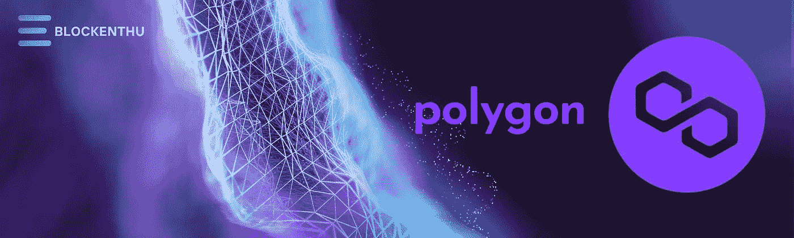
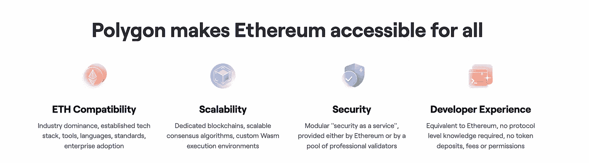
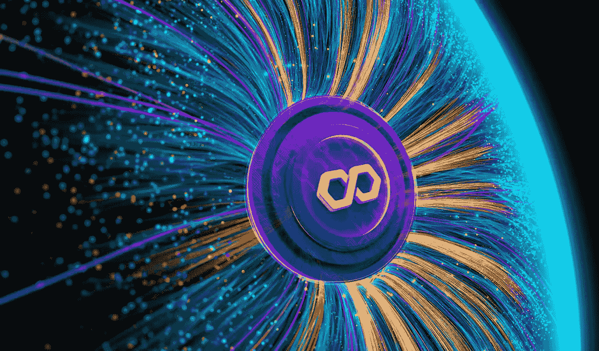
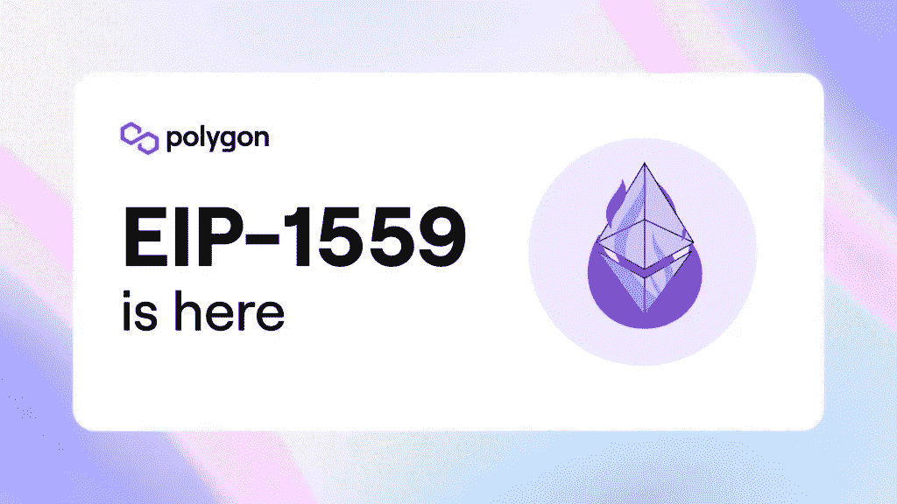
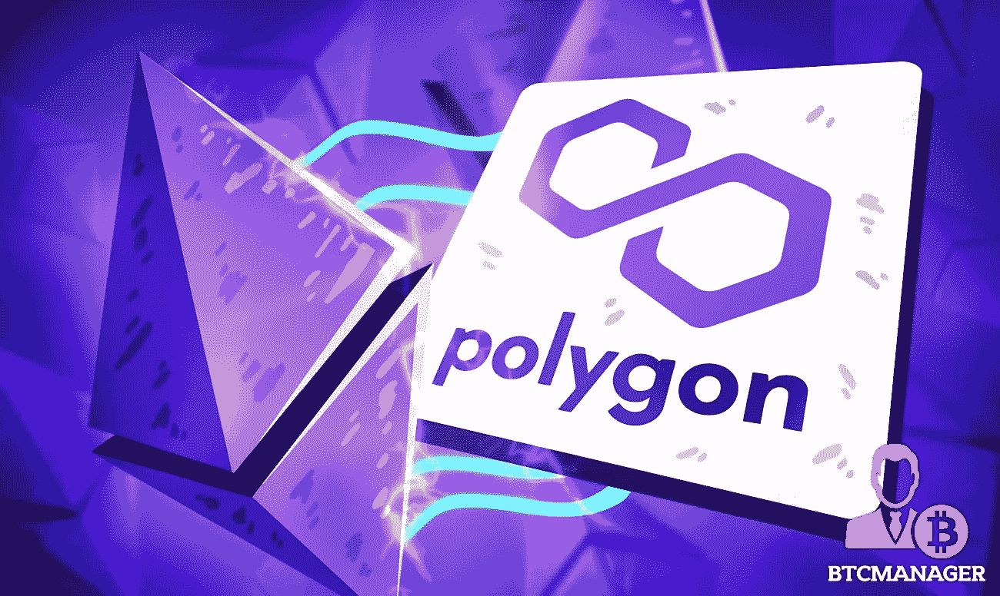

# 多边形(MATIC)

> 原文：<https://medium.com/coinmonks/polygon-matic-5d6ac4bbe316?source=collection_archive---------26----------------------->

> ***可扩展、即时、安全的区块链。***

由于未来是多链系统，单个区块链不可能主宰其他系统，除非建立一个大型的多链互联网络。因此每个网络都具有不同的性能、安全性和可扩展性。

多边形的主要目的是将上述与以太坊兼容的事物带入现实。我们可以创建**乐观汇总链、ZK 汇总链、独立链**或用户需要的任何类型的链。

# **什么是多边形？**

Polygon 是一个**第 2 层扩展解决方案**区块链，它通过侧链上的**链外处理**和**证据(PoS)** 验证器**的分散网络来实现扩展。Polygon SDK** 是它的主要组件，这是一个模块化、适应性强的框架，有助于各种 dapps 的开发。

Polygon 解决了以太坊的一些主要困难，包括高昂的费用、糟糕的用户体验和缓慢的交易吞吐量。该项目最初被命名为 **MATIC** ，后来随着从第 2 层解决方案扩展到多个网络，它被改为 Polygon。它是在以太坊生态系统上特别设计的。

# **多边形侧链**

侧链是除了母链之外还存在的区块链。sidechain 背后的想法是让另一个区块链与另一个“主要”区块链并行。这两个区块链可以相互通信，允许资产在两个链之间流动。

侧链提高了交易吞吐量和低费用。与以太坊相比，多边形以低成本执行快速交易。这些侧链的独特性允许 polygon 上的每个侧链在不到两秒的时间内实现每个块多达 65，536 个事务。

# **血浆**

Plasma 是一个由**子链**组成的系统，充当以太坊可伸缩性解决方案(或任何区块链)。

像侧链一样，等离子体链也有一个产生阻断的共有机制。然而，与侧链相反，每个等离子体链块的“根”发布到以太坊。块“根”本质上是用户可以用来证明那些块的内容的某些方面的小块信息。

多边形结合了**等离子框架**和桩子区块链架构。plasma 框架由以太坊**创始人 Vitalik buter in**创建，允许轻松执行可扩展和自主的智能合同。

plasma 框架赋予 polygon 在其基础设施上容纳无限数量的分散应用程序的潜力。该框架允许在单一基础区块链上创建全球可用的分散式财务应用程序。

Polygon 支持以太坊虚拟机(EVM)，现有的应用程序可以相对容易地移植。

我们在以太坊上表演的东西，毫不奇怪，我们可以在多边形上更便宜更快地表演。一些最受欢迎的 DeFi dapps，如 Aave、1inch、Curve 和 Sushi 已经部署。

# 那么，谁建造了多边形？

多边形是由**杰恩蒂·卡纳尼**、**桑迪普·奈瓦尔**和**阿努拉格·阿琼**创建的。

该团队是以太坊生态系统的一大贡献者。Jaynti 是 fullstack 的开发者，区块链工程师目前担任 polygon 的首席执行官。Sandeep 曾担任 polygon 的联合创始人和首席运营官，是一名区块链程序员和企业家。Anurag Arjun 是 polygon 唯一的非编程联合创始人。他是不同公司的产品经理。

## **多边形的加工**

多边形框架由两个主要的以太坊兼容链组成:安全链和独立链。

安全链不必采用自己的安全模型。这些连接依赖于基础架构。这些都有很高的安全性。

独立的链能够保护自己的安全。这些是灵活的，用于特定的需求。

在进一步的多边形可以支持零知识(ZK 总结)，乐观总结和 validum 链。此外，我们可以期待所有这些都与现有的以太坊工具和钱包兼容，如 MetaMask。

## **标记组学**

Matic 是目前最大的 20 种加密货币之一，截至 2022 年 3 月 31 日，目前的 matic 价格为 **$1.67 (126 印度卢比)**，市场规模超过 128 亿美元。

如初始名 Matic 重命名为 0x **多边形**。Matic 用于天然气支付网络费用和参与治理。

自动代币每月发行一次。Matic 目前的流通供应量为**77 亿元**

自动代币和 100 亿自动代币的最大供应量

2017 年，MATIC 最大供应量的 3.8%在首次私人销售中提供。总供应量的另外 19%在 2019 年 4 月的 launchpad 销售中售出。MATIC 的价格是每枚代币 0.00263 美元，筹集的资金总额是 500 万美元。

剩余的 MATIC 令牌分布如下:

*   总供应量的百分之十六。
*   顾问代币:总供应量的 4%。
*   **网络运营代币:**总供应量的百分之十二。
*   **基础代币**:总供应量的 21.86%。
*   **生态系统代币:**总供给量的 23.33%。

根据发布时间表，所有令牌将于 2022 年 12 月发布。

## **多边形桥**

最好和最方便的方式把你的资金从另一个区块链网络带回多边形侧链。请记住，您仍然需要支付交易费用，因为桥接交易是在 mainnet 上进行的。

# **多边形(MATIC)伦敦硬叉和 EIP-1559 升级**

据 Polygon 报道，备受期待的伦敦硬叉子和以太坊改进提案(EIP) 1559 更新已于 2022 年 1 月 18 日在 mainnet 上上线。升级从根本上改变了以太坊网络收费机制的运作方式，取消了第一价格拍卖作为主要费用计算方法，转而采用燃烧而非分配给矿商的基本费用。虽然它没有减少交易费用，但它确实使交易更加稳定，让客户更好地预测费用，避免超支。

## **多边形 Dapp 的**

> **果冻三明治**

Jelly 是一种 DeFi 设备，能够在多个网络之间进行价值转移，以提供跨链的互操作性。因此，你现在可以用一种真正去中心化的、无权限的、非托管的方式用 BTC 交换以太网。除了转移硬币，Jelly 还允许用户通过提供流动性来换取费用，从而成为做市商。

> **不透明度**

不透明(OPCT)是一个文件存储服务，有一个主要的区别:通过分散隐私。你拥有你的数据，只有你才能通过一个加密的“句柄”访问它，这个句柄就像一个私钥。这意味着没有人，甚至不透明，可以访问你的信息。但是，只需轻轻一点，您就可以与好友共享任何文件。

> **分散游戏**

如果你像我一样喜欢赌场和纸牌，你会喜欢分散式游戏的玩 2 赚机制(DG)。ICE Poker 是目前第一款也是唯一一款可用的游戏，但它完全免费玩和赚。要玩的话，你只需要买一个 NFT 牌的可穿戴设备，然后你就可以坐在牌桌旁了。

> 快速交换

Quickswap 是 Uniswap 的一个分支，uni swap 是最流行的分散式交换(DEX)。由于 Polygon 与以太坊虚拟机(EVM)兼容，因此 Quickswap 客户可以从 Uniswap 审计的安全性中受益。

## **结论**

为了发展以太坊网络，Polygon 采用了一种利益证明(PoS)机制。开发人员正在努力使加密货币完全无缝和可访问，Polygon 通过追求互操作性和解决长确认时间而走在了前列。

在以太坊 2.0 完全部署之前，多边形网络为各种新兴项目提供了一个引人注目的替代方案。在这个新兴的去中心化金融生态系统中，该计划大有可为。

# **加入我们的社区**

## Whatsapp

 [## ⚡BLOCKENTHU⚡

### WhatsApp 群邀请

chat.whatsapp.com](https://chat.whatsapp.com/FTKme4XzkOU73ZDv99Oatj) 

## 电报

 [## ⚡·布洛克登胡·⚡

### 可以马上查看并加入@blockenthu。

t.me](https://t.me/blockenthu) 

## 照片墙

【https://www.instagram.com/blockenthu/ 号

## 商务化人际关系网

 [## Blockenthu | LinkedIn

### blockenthu | LinkedIn 上有 246 名粉丝。“面向大众的 Web 3.0 福利”加密和区块链| BlockEnthu 是社区…

www.linkedin.com](https://www.linkedin.com/company/blockenthu/?viewAsMember=true) 

使用印度最安全的加密交换# COINDCX。

 [## CoinDCX -加密交易所|购买、出售和交易比特币和顶级替代币

### CoinDCX 是印度最大、最安全的加密货币交易所，在这里你可以买卖比特币和其他…

coindcx.com](https://coindcx.com/) 

#区块链# BLOCKENTHU # CRYPTO # coincxpath breaker # coincdx

> 加入 Coinmonks [电报频道](https://t.me/coincodecap)和 [Youtube 频道](https://www.youtube.com/c/coinmonks/videos)了解加密交易和投资

# 另外，阅读

*   [3 商业评论](/coinmonks/3commas-review-an-excellent-crypto-trading-bot-2020-1313a58bec92) | [Pionex 评论](https://coincodecap.com/pionex-review-exchange-with-crypto-trading-bot) | [Coinrule 评论](/coinmonks/coinrule-review-2021-a-beginner-friendly-crypto-trading-bot-daf0504848ba)
*   [莱杰 vs n rave](/coinmonks/ledger-vs-ngrave-zero-7e40f0c1d694)|[莱杰 nano s vs x](/coinmonks/ledger-nano-s-vs-x-battery-hardware-price-storage-59a6663fe3b0) | [币安评论](/coinmonks/binance-review-ee10d3bf3b6e)
*   [Bybit Exchange 评论](/coinmonks/bybit-exchange-review-dbd570019b71) | [Bityard 评论](https://coincodecap.com/bityard-reivew) | [Jet-Bot 评论](https://coincodecap.com/jet-bot-review)
*   [3 commas vs crypto hopper](/coinmonks/3commas-vs-pionex-vs-cryptohopper-best-crypto-bot-6a98d2baa203)|[赚取秘密利息](/coinmonks/earn-crypto-interest-b10b810fdda3)
*   最好的比特币[硬件钱包](/coinmonks/hardware-wallets-dfa1211730c6) | [BitBox02 回顾](/coinmonks/bitbox02-review-your-swiss-bitcoin-hardware-wallet-c36c88fff29)
*   [BlockFi vs 摄氏](/coinmonks/blockfi-vs-celsius-vs-hodlnaut-8a1cc8c26630) | [Hodlnaut 点评](/coinmonks/hodlnaut-review-best-way-to-hodl-is-to-earn-interest-on-your-bitcoin-6658a8c19edf) | [KuCoin 点评](https://coincodecap.com/kucoin-review)