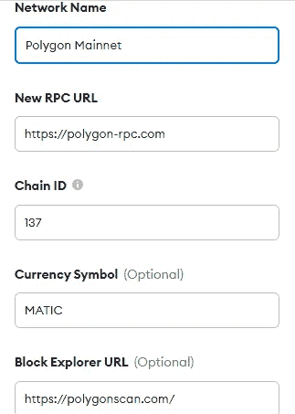
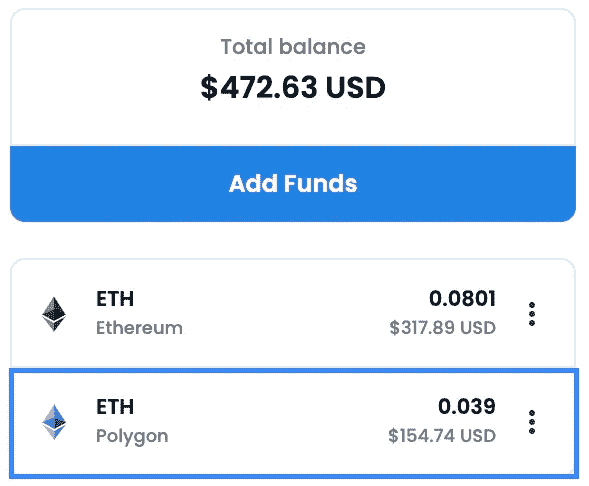

# 多边形(MATIC)网络概述和桥接教程

> 原文：<https://medium.com/coinmonks/polygon-matic-network-overview-and-tutorial-595be9a124a2?source=collection_archive---------4----------------------->

# 概观

Polygon，以前称为 MATIC network，是以太坊区块链的第 2 层扩展解决方案。$MATIC 是多边形的本地标记。它最初的目标是提高交易处理速度和降低交易成本——这两个都是以太坊的明显问题。随着时间的推移，Polygon 已经发展成为一个网络平台，用于构建和启动可互操作的区块链，使用利益证明侧链，然后在以太坊主链上完成交易。

关于 NFTs，Polygon 已被许多项目用来避免过多的以太坊燃气费。你可能已经在以太坊上看到了他们主要收藏的项目，而其他的同伴或可制造的 NFT 在多边形网络上。

在以下教程中，我们将设置一个元遮罩钱包来连接到面网络。这将要求您将资产从 ETH“桥接”到 Polygon 网络。

# 目录

*先决条件
MetaMask 钱包设置
获取$MATIC 令牌的方式
将$MATIC 从以太坊主网桥接至多边形网络
将 ETH 从以太坊主网桥接至多边形网络
故障排除*

# 先决条件

1.  元掩码 wallet 已经设置
2.  ETH 支付交易费用

# 元掩码 Wallet 设置

您需要配置 MM 设置以连接到多边形网络。

1.  打开你的 MM，点击下拉菜单，点击“添加网络”

Top of MM wallet, click yellow highlighted area

2.填写设置以匹配下面的截图，然后单击保存。

您现在已经将多边形网络添加到您的 MM 钱包中，并且可以在以太坊主网络和多边形之间切换。

# 获取$MATIC 代币的方法

比方说，你只需要一点点 MATIC 来支付 Polygon 上的一笔交易，通常相当于 0.002 MATIC 或几美分。最好的建议和首选是使用水龙头。免费的！

一个水龙头是一个捐赠基金池，允许任何需要少量资金的人参与网络。一个流行的是[https://matic.supply/](https://matic.supply/)。

如果您需要大量的 MATIC:

1.  您可以从比特币基地、币安、FTX 或 KuCoin 购买 MATIC。
2.  您可以使用 Uniswap、Sushiswap 等将 ETH 或其他适用货币兑换成 MATIC。

# 以太网到多边形网络的桥接

“桥接”简单地说就是将货币从一个网络转移到另一个网络。在这个例子中，我们将把你的 MATIC 令牌从 ETH 桥接到 Polygon，这样你就可以用 MATIC 支付 Polygon 交易费。如果你想知道实际发生了什么，这个过程包括锁定区块链联邦理工学院的资产，然后在 Polygon 上铸造资产以桥接它们。这分为两个单独的交易—批准和存款/完成。桥接大约需要 7 分钟。

1.  通过连接您的 MM 进入您的多边形钱包([https://wallet.polygon.technology/wallet](https://wallet.polygon.technology/wallet))

2.点击“将资金从以太坊转移到多边形”

Click the highlighted button

3.选择存款，然后从下拉列表中选择自动令牌。输入您希望从以太网桥接至多边形网络的 MATIC 数量。单击转移。

In this example, I am wanting to transfer 73.9 MATIC on the ETH chain to the Polygon chain. Please note that I have 4.21828 existing MATIC already moved over to Polygon previously.

4.按照提示操作。该流程由两个独立的交易组成——批准和存款——每个交易都有自己的 ETH 交易费。如果你还没有切换到以太坊主网，MM 会提示你切换到以太坊主网，并批准/签署交易。您的资金转移大约需要 7 分钟。

*请注意，我建议你存足够数量的 MATIC，因为不管你存多少 MATIC，你仍然要支付相同的 ETH 汽油费。*

First prompt you’ll see

Example of what a transfer looks like in progress (Source: consensys.net)

5.交易完成后，您可以在您的多边形钱包和多边形网络下的 MetaMask 钱包中查看您转移的资产。

View of MATIC tokens in MM Wallet under Polygon Mainnet

View of MATIC tokens in Polygon Wallet

# 以太网到多边形网络的桥接

OpenSea 支持 Polygon，经常用于 NFT 的销售和上市。你必须将以太网从以太坊桥接到多边形网络。有关说明，您可以参考以下步骤或访问 [OpenSea 的支持文章](https://support.opensea.io/hc/en-us/articles/1500012881642-How-do-I-transfer-ETH-from-Ethereum-to-Polygon-):

1.  将你的 MM 连接到 OpenSea，点击右上角的钱包图标。
2.  单击您的 ETH 资产右侧的 3 个点，然后单击“桥到多边形”

3.在提示中，添加您要转移的 ETH 金额，然后单击“转换令牌”

4.MM 会提示您确认 ETH 气费和交易。

5.桥接过程也需要 7 分钟左右。一旦完成，你将会在你的 MM 钱包中看到另一个资产条目。

Source: OpenSea support page

# 解决纷争

如果 MetaMask 没有连接到 Polygon 网络，请使用列在 [Polygon 网站](https://docs.polygon.technology/docs/develop/network-details/network/)上的备用 RPC URLs。

需要帮助更改 RPC URL 吗？访问这篇[文章](https://docs.dfyn.network/guides/changing-polygons-rpc-endpoint-on-metamask)。

使用 [POS Bridge Explorer 工具](https://bridge-explorer.polygon.technology/deposits)跟踪您在 Polygon Network 和 Ethereum Mainnet 之间的交易。

与[以太扫描](https://etherscan.io)类似，您可以利用[多边形扫描](https://polygonscan.com/)来检查交易。

> 加入 Coinmonks [电报频道](https://t.me/coincodecap)和 [Youtube 频道](https://www.youtube.com/c/coinmonks/videos)了解加密交易和投资

## 另外，阅读

*   [AscendEx Staking](https://coincodecap.com/ascendex-staking)|[Bot Ocean Review](https://coincodecap.com/bot-ocean-review)|[最佳比特币钱包](https://coincodecap.com/bitcoin-wallets-india)
*   [霍比审核](https://coincodecap.com/huobi-review) | [OKEx 保证金交易](https://coincodecap.com/okex-margin-trading) | [期货交易](https://coincodecap.com/futures-trading)
*   [Cloudbet 赌场评论](https://coincodecap.com/cloudbet-casino-review) | [点火赌场评论](https://coincodecap.com/ignition-casino-review)
*   [Godex.io 评审](/coinmonks/godex-io-review-7366086519fb) | [邀请评审](/coinmonks/invity-review-70f3030c0502) | [BitForex 评审](https://coincodecap.com/bitforex-review)
*   [Crypto.com 费用](/coinmonks/binance-fees-8588ec17965) | [僵尸密码审查](/coinmonks/botcrypto-review-2021-build-your-own-trading-bot-coincodecap-6b8332d736c7) | [替代品](https://coincodecap.com/crypto-com-alternatives)
*   [如何在 Bitbns 上购买柴犬(SHIB)币？](https://coincodecap.com/buy-shiba-bitbns) | [印度的币安](https://coincodecap.com/binance-in-india)
*   [币安 vs 比特邮票](https://coincodecap.com/binance-vs-bitstamp) | [比特熊猫 vs 比特币基地 vs Coinsbit](https://coincodecap.com/bitpanda-coinbase-coinsbit)
*   [如何购买瑞波(XRP)](https://coincodecap.com/buy-ripple-india) | [非洲最好的加密交易所](https://coincodecap.com/crypto-exchange-africa)
*   [非洲最佳加密交易所](https://coincodecap.com/crypto-exchange-africa) | [胡交易所评论](https://coincodecap.com/hoo-exchange-review)
*   [eToro vs 罗宾汉](https://coincodecap.com/etoro-robinhood)|[MoonXBT vs Bybit vs Bityard](https://coincodecap.com/bybit-bityard-moonxbt)
*   [Stormgain 回顾](https://coincodecap.com/stormgain-review) | [Bexplus 回顾](https://coincodecap.com/bexplus-review) | [币安 vs Bittrex](https://coincodecap.com/binance-vs-bittrex)