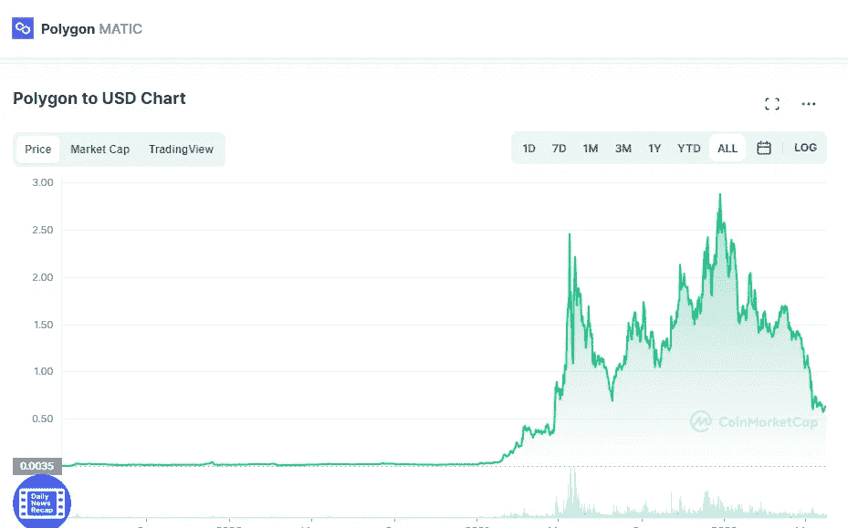

# 多边形 MATIC 价格预测 2022

> 原文：<https://medium.com/coinmonks/polygon-matic-price-prediction-2022-67c41387986b?source=collection_archive---------2----------------------->

Source photo [Polygon price today, MATIC to USD live, marketcap and chart | CoinMarketCap](https://coinmarketcap.com/currencies/polygon/)

## 什么是多边形(MATIC)令牌？

由 Jaynti Kanani、Anurag Arjun 和 Sandeep Nailwal 建立的基于印度的加密平台解决了独特的缩放问题。此外，它还提高了网络的可扩展性和交易速度。

为了解决以太坊的可扩展性问题，Matic 网络已经建立。为了更好地反映其新的…