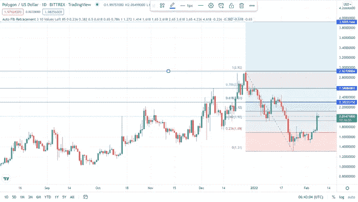

# 2022 年多边形(MATIC)价格预测

> 原文：<https://medium.com/coinmonks/polygon-matic-price-predictions-for-2022-da5d579fc93f?source=collection_archive---------23----------------------->

Source photo TrandingView

Polygon 在 2021 年表现异常出色，价值增长了 16，192%。2022 年，MATIC 的增长有可能继续吗？

Polygon 是一种以太坊令牌，可以在第 2 层侧链上提供更便宜、更快速的交易，并作为以太坊的扩展选项(在以太坊主链上运行的区块链)。