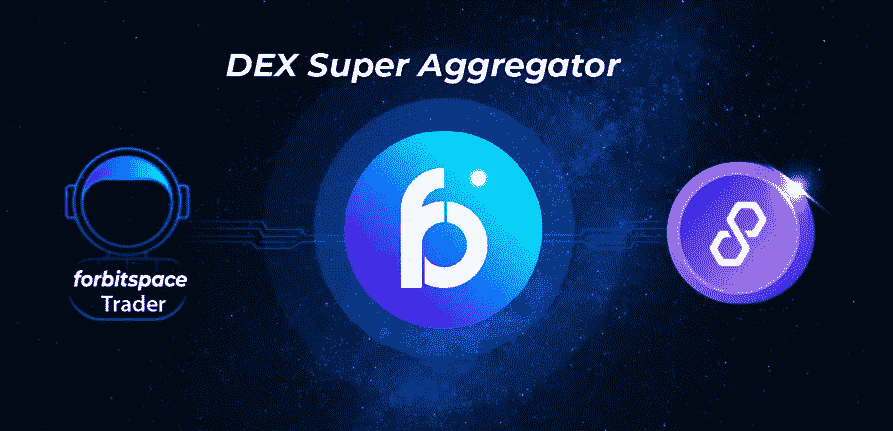
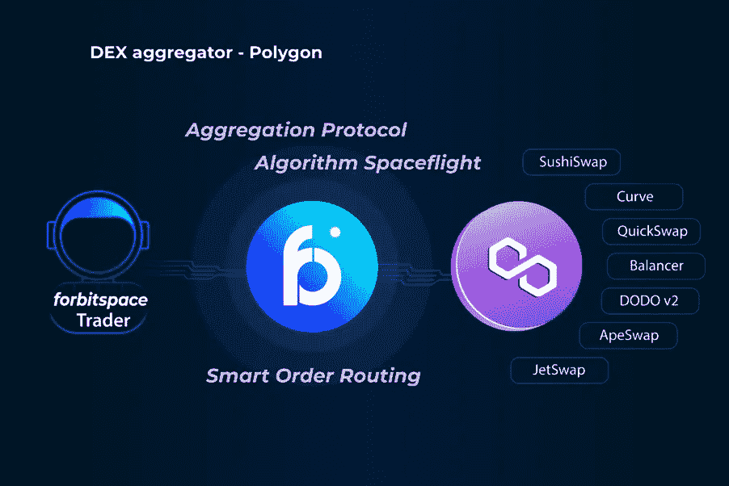
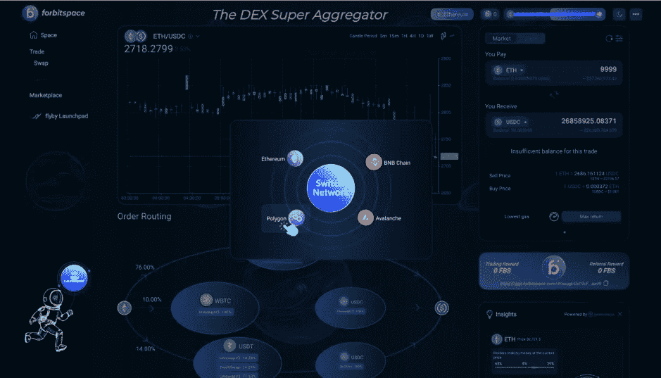
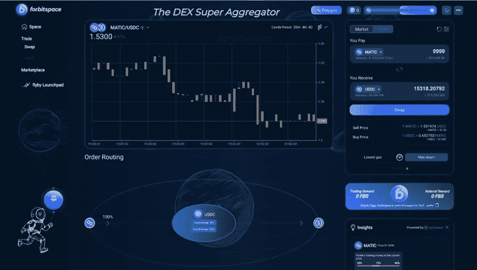

# 多边形平台和 DEX 超级聚合器

> 原文：<https://medium.com/coinmonks/polygon-platform-and-dex-super-aggregator-4b7c45a9a61?source=collection_archive---------48----------------------->

Polygon(以前称为 Matic Network)是一个区块链可伸缩性平台和框架，用于连接和构建以太坊兼容的区块链网络。因为 Polygon 的主要目标之一是聚合可扩展的解决方案以实现多链以太坊环境，所以该网络也称自己为“以太坊的区块链互联网”

以太坊区块链的第二个缩放解决方案是多边形。是一种可以在现有区块链上工作而不是使用其自己的区块链的解决方案。在这种情况下，Polygon 在以太坊平台上工作

平均每秒约有 14 笔交易，价格约为 25 美元。然而，在网络高度拥塞期间，该费用可能会激增。从那以后，事情变得困难和不可预测。今年 5 月，以太坊的平均费用飙升至 71 美元。

目前，多边形平台上的交易所越来越多，如 Ape Swap、Curve V2、Curve V1、DODO V2、Jet Swap……多边形平台越来越受欢迎，被许多人所知。满足用户在 Polygon 平台上进行 Dapps 交易时在时间和成本方面的需求。能够做到这一点的应用之一是使用 DEX Super Aggregator 协议。可以在 Polygon 平台上从 DEX 交易所聚集流动性。从而给用户最好的价格。forbitspace DEX 超级聚合器可以从 14 个不同的 DEX 交易所聚合流动性，从而为交易者提供稳定的价格。

**forbitspace** 是一个聚合器协议，允许交易者通过单一界面访问广泛的金融工具。我们正在开发新的汇总方法，以应对分散式交易所众所周知的流动性脱节问题。

成为一个去中心化的平台。其运作方式不同于分散式交易所。这意味着你只需要将你的钱包链接到平台，而不需要提供任何额外的 KYC 相关信息。

要在多边形上使用 **forbitspace** ，下一步需要将默认 mainnet 改为多边形网络。

一旦您访问了 forbitspace，您将需要连接您的钱包才能开始在 forbitspace 上进行交易

forbitspace 现在支持加密市场上这么多流行的钱包，包括 Metamask、币安链钱包、比特币基地钱包、钱包连接等。在这篇文章中，我将指导你如何使用 forbitspace 和 Metamask Wallet。

第一步:改变主网

点击“以太坊”按钮，会出现一个弹出窗口，显示 bitspace 支持的四个主网络。接下来，通过选择多边形将网络切换为多边形，然后单击“切换网络”进行切换确认。

第二步:选择代币和互换

更换 mainnet 后，您现在可以开始在 forbitspace 上进行交易。在具有“你支付”和“你收到”部分的仪表板上，你可以选择你想要支付的令牌以及你想要获得的令牌。

然后，输入您支付的代币金额，您将在“您收到的”部分看到您可以获得的金额。

之后，再次仔细检查代币以及金额，然后单击“交换”。

第三步:确认交易

单击“交换”后，您需要进行两次确认，一次确认交换的代币数量，另一次接受使用您钱包中的资产进行交易。就这么定了。

> 加入 Coinmonks [电报频道](https://t.me/coincodecap)和 [Youtube 频道](https://www.youtube.com/c/coinmonks/videos)了解加密交易和投资

# 另外，阅读

*   [3 商业评论](/coinmonks/3commas-review-an-excellent-crypto-trading-bot-2020-1313a58bec92) | [Pionex 评论](https://coincodecap.com/pionex-review-exchange-with-crypto-trading-bot) | [Coinrule 评论](/coinmonks/coinrule-review-2021-a-beginner-friendly-crypto-trading-bot-daf0504848ba)
*   [莱杰 vs n rave](/coinmonks/ledger-vs-ngrave-zero-7e40f0c1d694)|[莱杰 nano s vs x](/coinmonks/ledger-nano-s-vs-x-battery-hardware-price-storage-59a6663fe3b0) | [币安评论](/coinmonks/binance-review-ee10d3bf3b6e)
*   [Bybit Exchange 审查](/coinmonks/bybit-exchange-review-dbd570019b71) | [Bityard 审查](https://coincodecap.com/bityard-reivew) | [Jet-Bot 审查](https://coincodecap.com/jet-bot-review)
*   [3 commas vs crypto hopper](/coinmonks/3commas-vs-pionex-vs-cryptohopper-best-crypto-bot-6a98d2baa203)|[赚取加密利息](/coinmonks/earn-crypto-interest-b10b810fdda3)
*   最好的比特币[硬件钱包](/coinmonks/hardware-wallets-dfa1211730c6) | [BitBox02 回顾](/coinmonks/bitbox02-review-your-swiss-bitcoin-hardware-wallet-c36c88fff29)