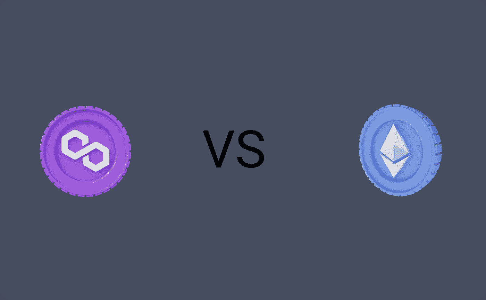

# 多边形 vs 以太坊:你应该在哪里启动你的 NFT 项目？

> 原文：<https://medium.com/coinmonks/polygon-vs-ethereum-where-you-should-launch-your-nft-project-bdcb70a3e67c?source=collection_archive---------0----------------------->

Polygon MATIC Vs Ethereum

你可能正在阅读这篇文章，因为你即将启动一个令人兴奋的 NFT 项目，或者你可能很好奇这个主题意味着什么。不管你的意图如何，我很高兴地说你是对的。

当你在 OpenSea 上创建一个新的 NFT 系列时，你可以选择一个区块链来发布它。这些区块链不是多边形就是以太坊。

选择其中一个区块链是一个重大的决定，如果做得不好，甚至可能在它上市之前就毁掉你的 NFT 项目。

> 交易新手？试试[加密交易机器人](/coinmonks/crypto-trading-bot-c2ffce8acb2a)或者[复制交易](/coinmonks/top-10-crypto-copy-trading-platforms-for-beginners-d0c37c7d698c)

## **快速回顾一下**

以太坊是一个区块链，NFT 就是在这里推出的。NFT 是在区块链上铸造的。当铸造或购买这些 NFT 时，交易必须得到批准。

交易的批准需要能源，使用以太坊区块链意味着你必须通过一种叫做[气费](https://www.investopedia.com/terms/g/gas-ethereum.asp#:~:text=Gas%20fees%20are%20payments%20made,spend%20on%20a%20particular%20transaction.)的机制来支付能源。

供气量和需求量之间存在线性关系；因此，需求越高，煤气费就越高，反之亦然。此外，在繁忙时间，这些费用更高；因此，建议在一天中的淡季以较低的价格去 NFT 造币。

随着时间的推移，有人抱怨以太坊区块链上同时提交多个交易会造成拥堵。因此使煤气费昂贵！

这就是 Polygon 的用武之地，它为以太坊最大的问题提供了解决方案。

Polygon 是 ETH 的侧链或第 2 层解决方案，它允许您部署以太坊智能合约，尽管您不是部署到 ETH，而是部署到 polygon 网络。

我们很容易得出以太坊为主链，多边形为侧链的结论。

在某种程度上，这两条链之间存在着某种联系。这个桥通过在一端锁定资产，在另一端解锁，将资产从一个链转换到另一个链。

为了更好地理解这种比较，我们需要讨论这些区块链之间的最大区别。

## **多边形 VS 以太坊:燃气费**

Polygon 的一个独特的价值主张是，你不需要支付疯狂的汽油费来铸造一辆 NFT。

在 OpenSea 上使用 Polygon 没有直接的天然气费用。然而，要在 Polygon 上购买 NFT，你仍然需要间接支付汽油费，因为 Polygon 区块链的 NFT 只能通过 Polygon ETH 购买。

但是，要获得 Polygon ETH，你需要将 ETH 桥接到 Polygon，而要桥，你需要支付一笔油费。所以从技术上来说，多边形有一个气费，但这个费用更低。

另一方面，与 ETH 相关的天然气费用很高，因此投资组合较小的人不可能进行任何掉期交易。

这些气费可分为**一次性费用和**经常性费用。

一次性费用细分为**初始化费和拍卖审批费。**

当你决定通过 OpenSea 在以太坊上出售 NFT 时，你需要支付一次性的初始化费用。该费用不是固定的，因为它取决于当前的天然气费用。

OpenSea 的一个令人惊讶的功能是你可以选择拍卖一个 NFT，而不是以固定的价格出售。然而，要拍卖 NFT，你需要批准使用一种叫做 [WETH](https://support.opensea.io/hc/en-us/articles/360063498293-What-s-WETH-How-do-I-get-it-) (包裹的 ETH)的特殊令牌。

在以太坊-区块链，有很多经常性的费用。每当你接受拍卖报价、转让 NFT、购买 NFT、取消 NFT 上市、取消竞标以及将 wet 转为 ETH 时，都会产生这些费用。

这些费用平均在 50 到 200 美元之间。

## **多边形 MATIC:权衡**

几乎不可能有完美的产品。以下是与多边形相关的一些权衡:

1.  **没有拍卖**

在 OpenSea 上，你可以拍卖你的 NFT，而不是以一个固定的价格列出来。

你可以把它拍卖给出价最高的人，从而增加你卖出更好价格的机会。

然而，这仅适用于区块链联邦理工学院。多边形目前正致力于在他们的区块链上安装这个。

**2。不太安全**

这并不意味着多边形区块链一点也不安全。这只是意味着与以太坊相比，它的安全性较低。

**3。不太熟悉的**

70%的 NFTs 爱好者听说过 ETH，听说过 Polygon 的不到 30%。然而，Polygon 最近已经得到了一些认可，它将获得更多的人气只是时间问题。

第一次使用 Polygon 对于新手和非技术人员来说可能很困难，因为不是每个人都知道如何将 ETH 桥接到 Polygon。

因此，建议如果你在多边形区块链上发布你的 NFT，尽力提供一个如何进行桥接的分步指南。

## **最终外卖**

Polygon 是开展高频低价值交易的 NFT 项目的最佳区块链。另一方面，ETH 是最好的区块链 NFT 项目，交易频率低，价值高。

因此，如果你要发布 7，000 到 10，000 件 NFT 艺术品，我建议你考虑在 Polygon 上发布。

此外，如果您相信您的 NFT 即使很贵也会卖完，您可以选择 Ethereum。但是，如果您希望省钱，您应该考虑多边形。

我观察到，严肃的项目选择区块链 ETH，是因为这些天然气费形成了进入壁垒，从而将新的不严肃的投资者拒之门外。此外，由于出售 NFT 需要支付汽油费，这也是持有 NFT 的一种激励。

Polygon 已经证明了低成本与区块链以太网上更快的交易是可能的。

未来是光明的，我相信多边形会留在这里。我热切期待在这个领域取得更多的进展和里程碑。

然而，在接下来的几年里，我们可能会做一个以太网 2.0 Vs 多边形。Ethereum 目前正在努力使其网络更具可扩展性、安全性和可持续性。

*注意:不可作为理财建议最好是你总是在做决定之前先做研究。*

> 加入 Coinmonks [电报频道](https://t.me/coincodecap)和 [Youtube 频道](https://www.youtube.com/c/coinmonks/videos)获取每日[加密新闻](http://coincodecap.com/)

## 此外，请阅读

*   [拷贝交易](/coinmonks/top-10-crypto-copy-trading-platforms-for-beginners-d0c37c7d698c) | [密码税务软件](/coinmonks/crypto-tax-software-ed4b4810e338)
*   [网格交易](https://coincodecap.com/grid-trading) | [加密硬件钱包](/coinmonks/the-best-cryptocurrency-hardware-wallets-of-2020-e28b1c124069)
*   [密码电报信号](http://Top 4 Telegram Channels for Crypto Traders) | [密码交易机器人](/coinmonks/crypto-trading-bot-c2ffce8acb2a)
*   [最佳密码交易所](/coinmonks/crypto-exchange-dd2f9d6f3769) | [印度最佳密码交易所](/coinmonks/bitcoin-exchange-in-india-7f1fe79715c9)
*   [开发人员的最佳加密 API](/coinmonks/best-crypto-apis-for-developers-5efe3a597a9f)
*   最佳[密码借出平台](/coinmonks/top-5-crypto-lending-platforms-in-2020-that-you-need-to-know-a1b675cec3fa)
*   [自由加密信号](/coinmonks/free-crypto-signals-48b25e61a8da) | [加密交易机器人](/coinmonks/crypto-trading-bot-c2ffce8acb2a)
*   杠杆代币的终极指南