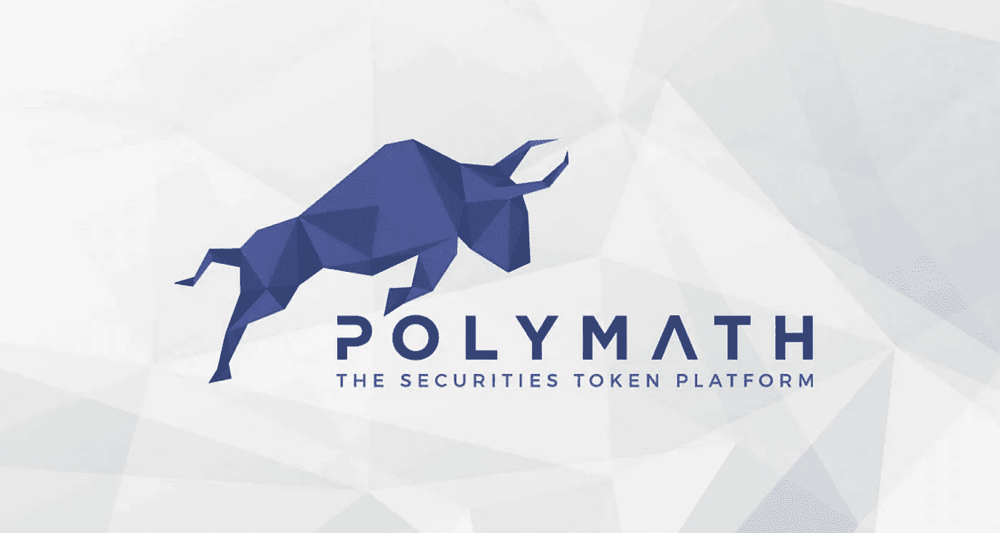

# 博学者(POLY)正在引领安全令牌革命

> 原文：<https://medium.com/coinmonks/polymath-poly-is-leading-the-security-token-revolution-69e93c3bdfc5?source=collection_archive---------45----------------------->

# 什么是 Polymath (POLY) crypto？

Polymath (POLY) Crypto 提供了在区块链上创建、发布和管理特定安全令牌的技术。Polymath (POLY) Crypto 率先在以太坊 ERC 1400 上创建了统一的安全令牌标准，并且使用 Polymath (POLY) Crypto 的基于以太坊的解决方案部署了 200 多个令牌。

[**密码夹**](https://www.youtube.com/channel/UCqdw4OBQlzy4eXjEjFmIegQ)

认识到现有的区块链不足以满足资本市场的监管要求，Polymath (POLY) Crypto 构建了 Polymesh，这是一个专门为某些受监管资产构建的机构级区块链。Polymath (POLY) Crypto 通过解决公共基础设施在合规性、身份、治理和结算方面的固有挑战，简化了过时的流程，并为新的金融工具打开了大门。

> 在[T5【procommun.com】T6](https://procommun.com/)上多看一些这样有趣的故事

# 谁创建了 Polymath Crypto？

Polymath (POLY) Crypto 是在寻找一种将私募基金令牌化的解决方案时创建的。在整个过程中，很明显，各种技术和复杂的法律挑战进一步加大了在区块链发行证券的难度。此外，它还带来了一个更大的愿景，与其推出一个单一的令牌化小额基金，为什么不让任何人都可以轻松地推出一个安全令牌。有了这个新想法，Polymath (POLY) Crypto 就诞生了。Polymath (POLY) Crypto 由来自全球各地的不同团队成员和贡献者组成，并拥有超过 50 家全球服务提供商。

# 博学者的独特之处是什么？

安全令牌代表了巨大的市场机会，但在机构采用的道路上存在重大障碍。Polymath (POLY) Crypto 通过 Polymesh 解决了这些障碍，POLY mesh 并不复杂，只是一个为安全令牌构建的简单的机构级区块链，也是第一个这种性质的专用链。

此外，Polymesh 的基础侧重于通过基本设计原则提供不同投资者和发行人需要的以及监管机构和机构要求的最关键要素:合规性、身份、保密性和治理。当所有这些放在一起时，四大支柱还支持更复杂的操作，如管理数字证券时的结算。Polymath (POLY) Crypto 的特殊性使它以及基于它构建的应用程序比通用区块链具有明显的优势。专门构建的基础设施还解决了标准区块链架构中的不同差距，以使区块链的功能符合现代资本市场的要求。除了工程 Polymesh 之外，Polymath (POLY) Crypto 还在该链上构建了一系列工具。它为非技术用户提供了访问链功能的直观方式。通过结合 Polymesh 的深度功能，Polymath (POLY) Crypto 还在链上构建了一系列工具，为一些非技术用户提供了访问链功能的直观方法。通过将 Polymesh 的深度功能与用户友好的工具相结合，Polymath (POLY) Crypto 将改变资本市场。

# 流通中的 Polymath (POLY) Crypto 有多少？

在成功推出 Polymath 平台后，Polymath (POLY) Crypto 被创建来与平台交互。Polymath (POLY) Crypto 是为以太坊上的 Polymath Token Studio 提供燃料的实用工具令牌，发行者使用它来创建和管理平台上的安全令牌。大约 100，000 个钱包拥有 Polymath (POLY) Crypto，在发布期间分发了 240，000，000 个令牌。Polymath (POLY) Crypto 的最大供应量是 10 亿。到 2000 年 1 月 31 日，将有大约 9.25 亿美元流通。该团队锁定了最后的 75 米，直到 2024 年 1 月。Polymesh 目前处于测试 net 阶段。当 Polymesh Mainnet 启动时，ERC 20 保利持有者可以选择以 1:1 的比例升级他们的保利。唯一存在的 POLYX 是通过升级过程创建的，以及任何由区块链制作的(POS)股份奖励证明。一旦主网被激活，以太坊的聚合网的流通供应量将会减少，减少量与聚合网的交换量相同。

> 文章原载于

> **加入 Coinmonks [电报集团](https://t.me/joinchat/Trz8jaxd6xEsBI4p)，了解加密交易和投资**