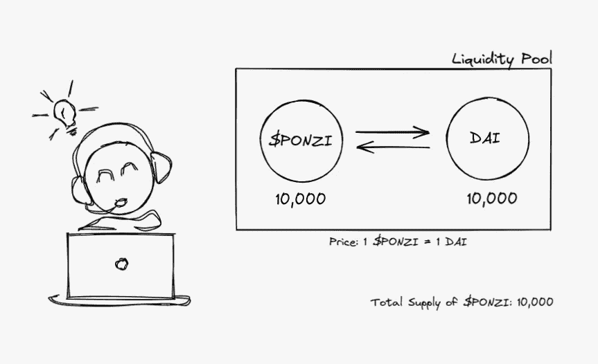
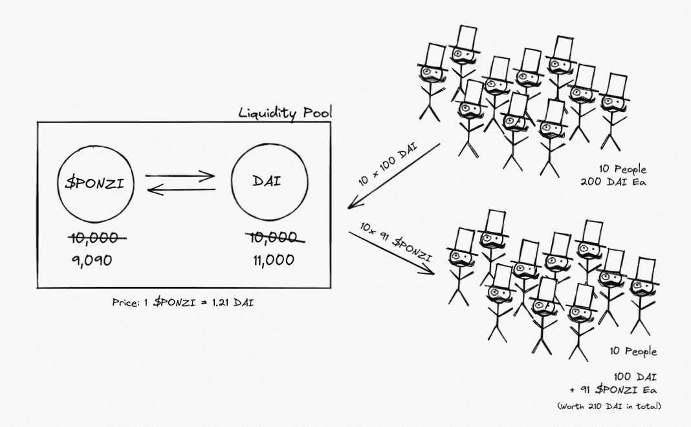
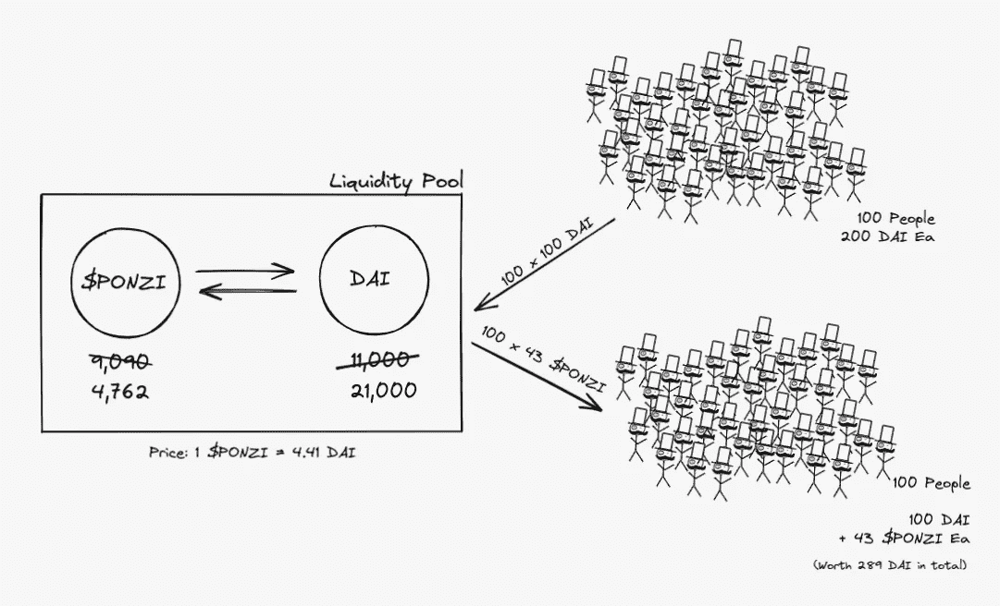
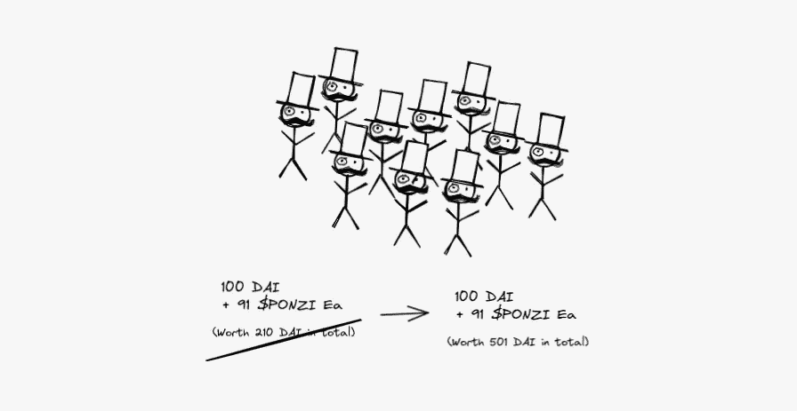
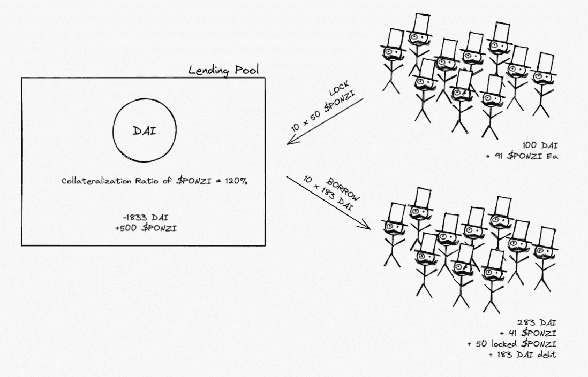
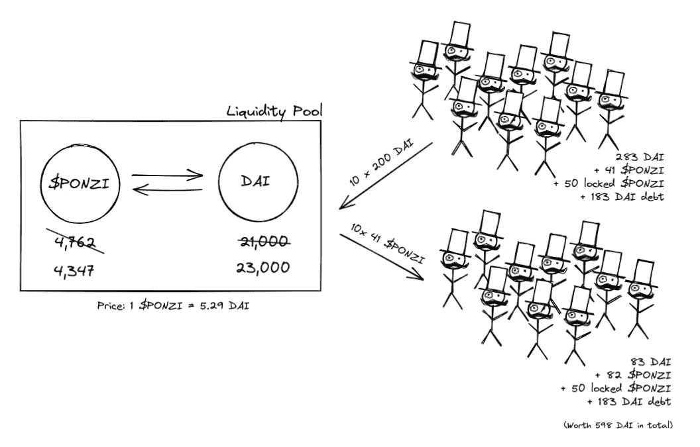
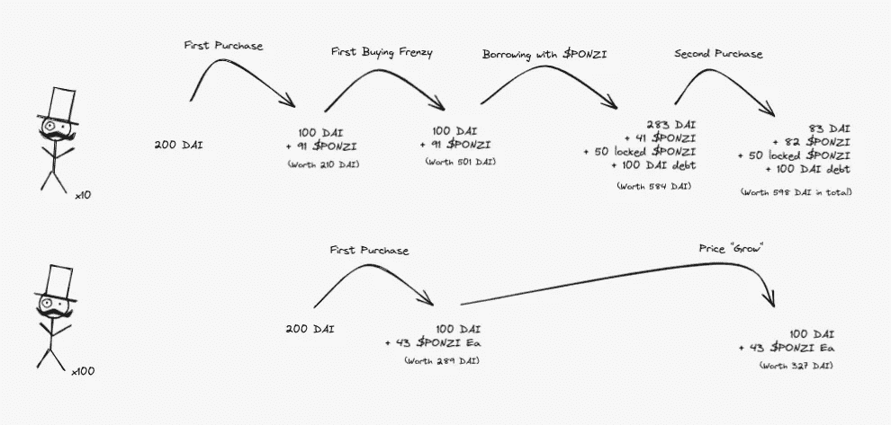
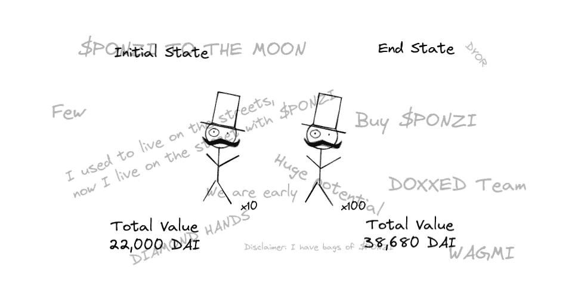
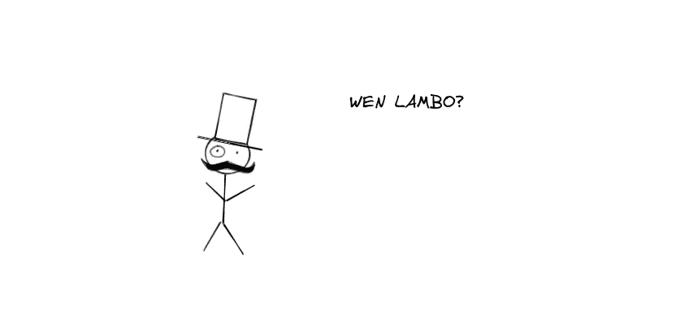

# Ponzinomics 简化版(第一部分)

> 原文：<https://medium.com/coinmonks/ponzinomics-simplified-part-1-b2235ac98676?source=collection_archive---------2----------------------->

## 一个关于每个人如何在贫困中致富的小故事

故事从一个开发人员启动一个新项目开始。凭借 10，000 戴(一种稳定的美元硬币)的初始资本，他铸造了 10，000 枚新的美元庞氏硬币，并创建了一个 Uniswap 流动性池，任何人都可以为戴买卖硬币。

在这个时间点上，每 1 美元的庞氏骗局可以用 1 DAI 进行买卖。

开发商的 10 个朋友收到了关于这个项目的消息，并决定支持它。由于他们每人有 200 戴，他们决定谨慎起见，只投资 50%的袋子。他们每个人用 100 戴换 91 美元的庞氏骗局。现在他们每人有 100 戴和 91 美元的庞氏骗局。

由于 DAI 的供应量增加，而流动性池中的美元 PONZI 下降，美元 PONZI 的现货价格现在是 1.21 DAI。这些朋友中的每个人发现他们的净资产现在是 210 戴。他们每个人都赚了 10 美元！

他们开始告诉其他朋友和不同的社区关于这个项目，以及每个人对这个游戏有多早。

很快，一个大型社区聚集在这个项目周围。与前 10 名支持者类似，他们每人都有 200 戴，并用 100 戴换了闪闪发光的$庞氏硬币。他们从他们的 DAI 中获得 43 美元的 PONZI，将流动性池中 1 美元 PONZI 的现货价格推至 4.41 DAI。

虽然他们没有收到最初那批人那么多的钱，但他们很满意，因为他们现在的净资产是 289 戴。他们光是这次购买就赚了 89 戴！

在他们看来，硬币必须贬值一半，他们才能在明智的投资中赔钱。由于他们是超级早期的项目，如果价值下降，他们会直接购买！

“WAGMI”通过加密 Twitter 和各种不和谐团体发出回声。

当新成员发现自己更富有时，该项目的组织者发现自己坐在巨大的袋子上。在没有任何交易的情况下，他们的持股现在价值 501 戴！

随着对$庞氏项目的关注，社区成员设法与贷款池建立了合作关系，使用$庞氏作为抵押，以 120%的抵押率贷出其他资产。这是显而易见的，因为它为贷款协议创造了更多的收入，并使两个社区走到了一起。

这种新的贷款机制允许任何拥有 100 万美元庞氏资金的人将其锁定为抵押品，并以戴的名义贷出约 80%的资金。这 10 个 OGs 决定，这是在更多的人听说这个项目、不和爆发以及$PONZI 精神失常之前，再积累一袋$PONZI 的最佳时机。

10 个 OG 每个锁定 50 $庞氏(价值 220 戴)借 183 戴。

利用借来的戴，他们每人又买了 41 美元的流动资金。现在他们每个人都有 83 戴，82 美元庞氏，50 美元庞氏锁定在借贷池中，欠借贷池 183 戴。

由于购买了 1000 万美元的庞氏资产，使得流动资金池的价格达到了 5.29 戴，他们每个人现在的净资产为 589 戴。从只有 200 戴开始算不错了。

当然，他们不是唯一在这里赚钱的人。在(3，3)游戏中的其他社区成员也发现他们的净值在波动！

虽然 OGs 的投资几乎是其初始投资的 3 倍，但新社区成员现在拥有的资产是其初始资产的 150%以上。

奇怪的是，每个人都赚了钱！110 名成员最初将 200 DAI(总共 22k DAI)带入系统，他们的合并净值现在是 38k！

没人问多出来的戴是哪来的。与…相比，这是一个如此不重要的问题

Wen ser?

未完待续…

这篇文章旨在展示一个毫无价值的项目的“投资者”是如何在一个充满泡沫的市场中赚取大量金钱的。

这个故事设置了一个场景，夸大了对 DeFi 领域流动性的缺乏理解，以及保证金交易的使用是如何增加风险的。请继续关注下一部分，看看当市场转向时，我们的“投资者”会如何(提示:有人得到了一辆兰博基尼)。

我是一名开发人员，从事于 Bluejay Finance 项目，该项目致力于创造高效的非美元稳定收入。

如果你想关注我的工作或者在这个故事的下一部分出来时得到更新，请随意[在我的邮件列表上注册](https://geek.us2.list-manage.com/subscribe?u=bfcc21792349f4f0eaff4a2a3&id=694896a0df)或者[在 Twitter 上关注我](https://twitter.com/geek_sg)。

一些计算已经汇总和简化，以供读者参考。如果你对其背后的数学很感兴趣，请阅读 Uniswap 的常数乘积公式，这是大多数流动性池中使用的公式。对于贷款池，您可以查看白皮书中的复合、Aave 等。

> 加入 Coinmonks [电报频道](https://t.me/coincodecap)和 [Youtube 频道](https://www.youtube.com/c/coinmonks/videos)了解加密交易和投资

## 另外，阅读

*   [3 商业评论](/coinmonks/3commas-review-an-excellent-crypto-trading-bot-2020-1313a58bec92) | [Pionex 评论](https://coincodecap.com/pionex-review-exchange-with-crypto-trading-bot) | [Coinrule 评论](/coinmonks/coinrule-review-2021-a-beginner-friendly-crypto-trading-bot-daf0504848ba)
*   [Bitsgap 审查](/coinmonks/bitsgap-review-a-crypto-trading-bot-that-makes-easy-money-a5d88a336df2) | [Quadency 审查](/coinmonks/quadency-review-a-crypto-trading-automation-platform-3068eaa374e1) | [Bitbns 审查](/coinmonks/bitbns-review-38256a07e161)
*   [密码本交易平台](/coinmonks/top-10-crypto-copy-trading-platforms-for-beginners-d0c37c7d698c) | [Coinmama 审核](/coinmonks/coinmama-review-ace5641bde6e)
*   [印度加密交易所](/coinmonks/bitcoin-exchange-in-india-7f1fe79715c9) | [比特币储蓄账户](/coinmonks/bitcoin-savings-account-e65b13f92451)
*   [OKEx vs KuCoin](https://coincodecap.com/okex-kucoin) | [摄氏替代品](https://coincodecap.com/celsius-alternatives) | [如何购买 VeChain](https://coincodecap.com/buy-vechain)
*   [币安期货交易](https://coincodecap.com/binance-futures-trading)|[3 comas vs Mudrex vs eToro](https://coincodecap.com/mudrex-3commas-etoro)
*   [如何购买 Monero](https://coincodecap.com/buy-monero) | [IDEX 评论](https://coincodecap.com/idex-review) | [BitKan 交易机器人](https://coincodecap.com/bitkan-trading-bot)
*   [CoinDCX 评论](/coinmonks/coindcx-review-8444db3621a2) | [加密保证金交易交易所](https://coincodecap.com/crypto-margin-trading-exchanges)