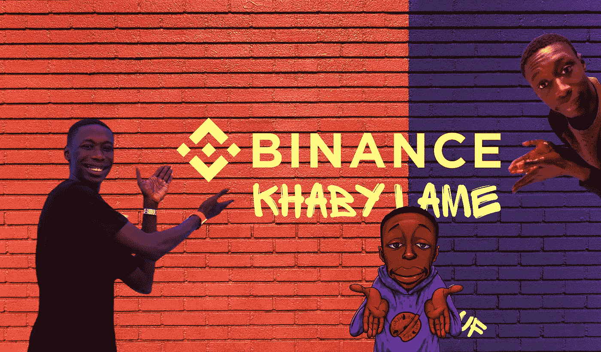
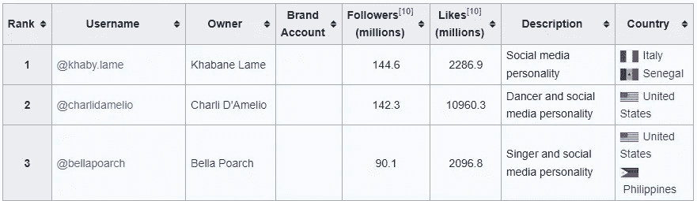

# 受欢迎的抖音博主卡比·拉梅成为币安大使

> 原文：<https://medium.com/coinmonks/popular-tiktok-blogger-khaby-lame-becomes-binance-ambassador-303f56dbb315?source=collection_archive---------37----------------------->

币安宣布与视频博主卡比·拉梅合作。一名塞内加尔裔意大利人在抖音拥有 1.44 亿粉丝，他成为了比特币交易所的大使。

**This preview will be included in the NFT collection called “**[**Uncle Fibonacci News**](https://opensea.io/collection/uncle-fibonacci-news)**”**

就用户数量而言，Leim 在抖音账户排名中领先。由于视频中他一言不发地讽刺嘲笑那些把简单任务复杂化的人，他变得很受欢迎。

[Wikipedia data](https://en.wikipedia.org/wiki/List_of_most-followed_TikTok_accounts)

该视频博主将推广 Web3 技术和与币安的联合 NFT 项目，“进一步扩大其粉丝的体验，”该公司解释说。

> 交易新手？试试[密码交易机器人](/coinmonks/crypto-trading-bot-c2ffce8acb2a)或者[复制交易](/coinmonks/top-10-crypto-copy-trading-platforms-for-beginners-d0c37c7d698c)

据推测，合作将有助于币安生态系统和整个密码行业的发展。

让我提醒你，NBA 球星斯蒂芬·库里和日本网球运动员大阪直美之前已经成为 FTX 交易所的形象大使。

Crypto.com 加密货币平台选择了奥斯卡获奖演员马特·达蒙来饰演这个角色。

📰 ***订阅*** [***斐波那契***](/@unclefibonacci) ***我来保持最新***

☕️eth:0x40a 8443813 e 8 fa 4a 9 f 88 f 18 b 77442 aa 4ed 91 fd4c

☕️BTC:1kkekcmdrghajztfxjoq 5 otg bv 1 mgucwdj

> 加入 Coinmonks [电报频道](https://t.me/coincodecap)和 [Youtube 频道](https://www.youtube.com/c/coinmonks/videos)了解加密交易和投资

# 另外，阅读

*   [十大最佳加密货币博客](https://coincodecap.com/best-cryptocurrency-blogs) | [YouHodler 评论](https://coincodecap.com/youhodler-review)
*   [my constant Review](https://coincodecap.com/myconstant-review)|[8 款最佳摇摆交易机器人](https://coincodecap.com/best-swing-trading-bots)
*   [MXC 交易所评论](/coinmonks/mxc-exchange-review-3af0ec1cba8c) | [Pionex vs 币安](https://coincodecap.com/pionex-vs-binance) | [Pionex 套利机器人](https://coincodecap.com/pionex-arbitrage-bot)
*   [我的加密副本交易经历](/coinmonks/my-experience-with-crypto-copy-trading-d6feb2ce3ac5) | [比特币基地评论](/coinmonks/coinbase-review-6ef4e0f56064)
*   [CoinFLEX 评论](https://coincodecap.com/coinflex-review) | [AEX 交易所评论](https://coincodecap.com/aex-exchange-review) | [UPbit 评论](https://coincodecap.com/upbit-review)