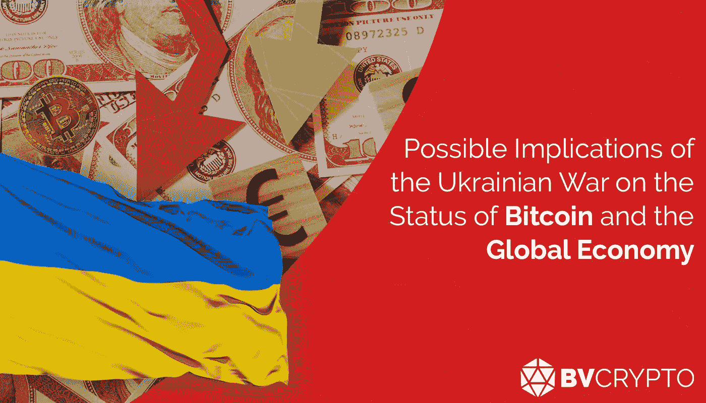
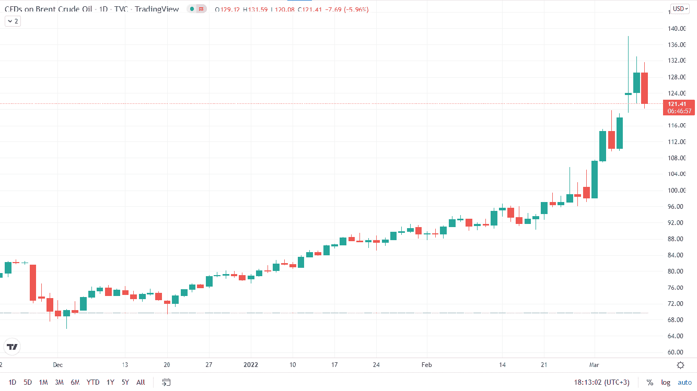
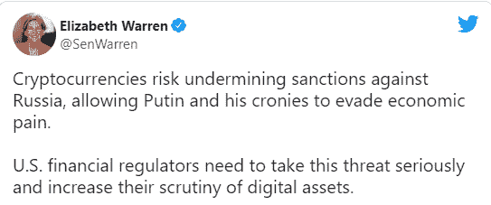
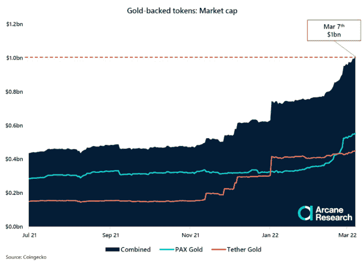
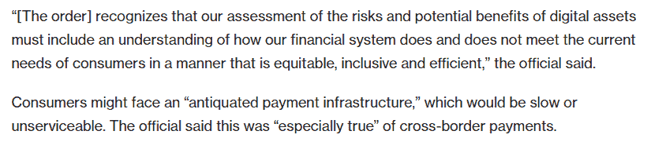
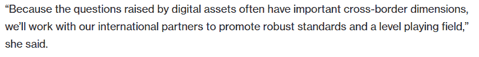
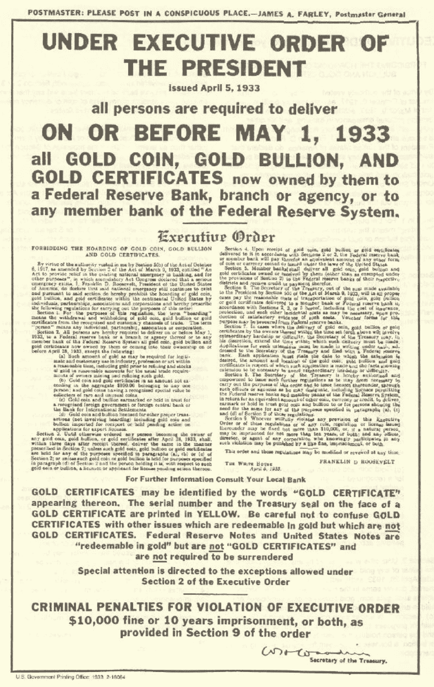

# 乌克兰战争对比特币和全球经济地位的可能影响

> 原文：<https://medium.com/coinmonks/possible-implications-of-the-ukrainian-war-on-the-status-of-bitcoin-and-the-global-economy-3b373443ab9a?source=collection_archive---------13----------------------->

在任何领域，全球崩溃都会改变全球系统。否则，一个国家决定改变全球体系的成本将会非常高。因此，各国必须要么通过共同要求变革来分担成本，要么就不可避免地为国家承担高成本。俄罗斯在乌克兰军事行动后被排除在全球经济机制之外，这开始迫使俄罗斯选择第二种选择，由它来承担成本。对俄罗斯银行和寡头的制裁旨在继续石油和天然气贸易。在下一个阶段，人们看到，可能导致全球危机的措施开始采取，美国期望限制石油贸易，冻结俄罗斯中央银行的储备，并防止俄罗斯使用 Visa-Mastercard 系统。可能没有比全球经济危机更好的全球崩溃的例子了。因此，由于乌克兰危机，经济体系可能会发生严重变化，可能会出现与 2008 年危机大不相同的后果。

在这篇文章中，在简要讨论了为什么对俄罗斯的制裁可能引发危机之后，我们将看看为什么加密货币可以成为替代解决方案的重要机会的各种想法。

**货币政策**

由于冠状病毒疫情造成的近两年的经济问题已被中央银行试图顺利克服，推动了其货币扩张政策的极限。今天，尽管冠状病毒疫情开始逐渐失去其影响，但其经济影响仍在继续。由于大规模的货币扩张，特别是美联储的货币扩张，一个全球性的通货膨胀问题已经在世界各地出现，包括发达国家。随着贸易的正常化，中央银行开始通过逐步减少证券购买来提高利率，以控制通货膨胀。

在对俄罗斯实施制裁后，供应不足和物流问题，特别是在能源部门，直接影响到电力和工业生产，导致通货膨胀率进一步上升。在这一点上，可以预期央行会采取更严厉的货币政策。然而，如果对俄罗斯实施的经济禁运破坏了国际收支平衡，并造成更深层次的危机，各国央行可能很难遵循货币紧缩政策。在这种情况下，要选择的方法是非常关键的。

如果各国央行再次采取货币扩张政策，已经严重受损的货币购买力预计会遭受更大打击。如果不放弃货币紧缩政策，那些被视为坚不可摧、永不沉没，或者换句话说被称为“太大而不能倒”的组织将因缺乏足够的资源而被牺牲。在这种情况下，与 2008 年危机后的软转型不同，未来可能会有一场艰难得多的转型。

只要俄罗斯在乌克兰的军事行动继续，同时越来越接近这两个选项的负面影响，尽快结束行动和软化制裁似乎是最有效的方式，以便以尽可能小的损害克服这场危机。然而，当审查各国目前的政策时，可以看出双方都没有打算退出。

**贱民制度**

俄罗斯很快超过伊朗，成为世界上受制裁最多的国家。除了俄罗斯在国外的资产，在中央银行金库的 6500 亿美元储备中使用美元和欧元已经被禁止。俄罗斯旨在通过将 2014 年占其储备 43%的美元减少到 2022 年的 16%来保护自己免受此类制裁的影响。然而，对俄罗斯中央银行的制裁引发了一个问题，即保留法定货币作为储备是否有效。对于储备的应急使用，除了拥有一个全球公认的强大市场外，储备中的资产不能被封锁也是非常重要的。由于黄金不属于任何国家，因此它是最合适的资产。然而，尽管黄金是一种全球资产/商品，但它不能被视为一种货币。例如，当万事达卡和维萨卡禁止俄罗斯公民在俄罗斯境外使用自己的卡进行支付时，黄金的不可触摸性并不能解决这个问题。在这一点上，比特币的不可触及性使其不仅作为储备资产，而且作为支付方式，都比黄金具有显著优势。由于比特币是一种不属于任何国家的资产，像黄金一样供应有限，长期保持其价值，并且像美元和欧元等法定货币一样易于使用，因此它可能在乌克兰战争导致的危机中发挥重要作用。下面的推文，参议员沃伦表达了对俄罗斯可能利用加密货币逃避制裁的担忧，这是加密货币豁免权的一个很好的例子。

在文章的开头，我们提到改变一个全球体系的成本对一个国家来说是很高的，俄罗斯开始被迫支付这一成本。尽管长期以来一直在努力确保比特币既被用于日常支付，又被接受为储备，但这一过程的启动只有在全球崩溃——乌克兰危机——的情况下才成为可能。

**担保**

国家的低风险溢价或高风险溢价会影响所有宏观指标，因为它们决定了该国可以借入多少资金。保费低跟国际市场的信任度有关。要建立信任，除了国家经济政策的合理性，储备中的资产也要表现为抵押品。出于这个原因，许多国家希望通过将部分黄金储备存放在英美等枢纽国家，来增强市场对它们的信任。这个在政治上和经济上都已经变得相当原始的体系之所以还在继续，是因为黄金的运输和储存成本很高。与美国或欧盟在政治上意见相左的国家多次将黄金运往自己的国家，以避免制裁。因此，显然需要一种能够建立信任的创新方法。

**标记化-CBDC-斯威夫特**

尽管比特币作为全球抵押品的出现是最优的，但应该记住的是，比特币还不够成熟，不足以支持这样的转型。因此，可以认为，首要问题是降低黄金的成本，但也要保持保障功能。

信任是通过智能合约获得的，尤其是加密货币。区块链网络的高安全级别通过防止钱包余额和智能合同中的资产的任何变化或抵押品的提取，允许双方安全地进行相互交易。一个类似的黄金系统只有通过黄金的令牌化才有可能实现。这样，在代表黄金储备的代币可以在国家之间安全转移的同时，可以创建适用于这些代币的智能合约系统以用作抵押品。通过这种方式，当前的抵押品体系可以持续下去，而无需将黄金存放在英美等枢纽国家。如果国家无法偿还债务，代币可以自动转移到贷方，使这一系统值得信赖。

由于令牌化黄金将有利于在贸易中使用黄金进行兑换，美元目前的全球货币地位可能会被动摇。例如，众所周知，各国需要一种共同的货币，因为用当地货币进行贸易效率不高。在这种情况下，虽然国家的偏好通常是美元，但通过令牌化，可以优先选择黄金而不是美元。在这一点上，中央银行数字货币(CBDC)的作用对于这个新系统也非常重要。

各国央行开始通过 CBDC 测试类似区块链的网络和智能合约。由于已经有 100 多家央行开发了 CBDC，可以说新操场的地基已经打好了。各国受困于 Swift 等系统的官僚作风，尤其是在大量国际汇款方面，这增加了 CBD 的吸引力。由于有了 CBD，各国也将更有可能以本币进行贸易。例如，在印度和俄国之间的交易中，以数字卢比(CBDC)支付的款项首先被转换成代币化的黄金，然后代币化的黄金可以以数字卢布记入账户。

记住 NFTs 在这幅图中的作用也很重要。NFTs 对各种物理和数字对象的适用性加速了令牌化。记号化实验不仅在艺术和游戏领域继续，在金融领域也是如此。最后，桑坦德银行发行了一种名为 Agrotoken 的代币，代表农民的产品，并开发了一个系统，允许农民通过出示产品作为抵押来借用他们的产品。在目前的系统中，还有代表股票的代币。

因此，尽管包括黄金和法币在内的各种资产的代币化是可能的，但建立一个所有这些代币可以一起工作的新交易系统可能会使 Swift 等系统过时，并导致美元地位的崩溃。

**新操场**

由于上文讨论的各种原因，通过社区发展中心创建的新游戏场正在经历许多变化。中国很早就开发了数字人民币，并将其整合到该国几乎所有的支付系统中，这促使其他国家加快了在这一领域的举措。美国希望美元在当前经济中的主导地位继续下去，它是走在数字美元道路上的国家之一。在拜登总统的行政命令中，可以看到美国对数字资产采取了创新的方法，而不是禁止的方法。该行政命令总结了美国对 CBDC 和稳定货币的看法，特别是关于国际货币转移在满足消费者需求方面的不足以及数字资产在这个意义上的重要性的部分。

除了这一命令，美国财政部长耶伦关于财政部正在努力确定新游戏规则的声明可以被视为美国反对中国控制这一领域的举措。

另一方面，虽然印度经济部长 Nirmala Sitharaman 解释说，该国的 CBDC 项目可能会比预期更早启动，但应该记住，迪拜的目标是通过与币安合作，制定适合该行业需求的法规，并在该领域共同发起倡议。

**采矿**

我们在 CBDC 变换中谈到了当地货币在全球贸易中的突出地位，在这个体系中，黄金的共同货币和储备地位可以通过令牌化来维持。黄金是平稳过渡的首选这一事实，并不妨碍比特币在这一体系中获得储备资产地位。比特币不断增长的市场容量逐年增强了这种可能性。比特币达到储备资产地位的一个最重要的发展是各国在加密货币挖掘领域采取的步骤。成为最受制裁国家的俄罗斯，可以通过购买该国矿工生产的比特币，在对外贸易中使用，就像乌克兰战争前最受制裁的国家伊朗所发生的那样。

这种做法可以被称为美国在 1933 年呼吁人们将黄金交给美联储的现代版本，可能导致比特币在今天出于类似目的而广泛使用，因为它在当时被用来加强担保。

此外，不应该忘记，萨尔瓦多从 BTC 债券市场获得了 10 亿美元的贷款，这是它无法从国际货币基金组织获得的。随着萨尔瓦多等例子数量的增加，那些希望避免艰难谈判以获得 IMF 贷款、减轻制裁损害或无法克服通胀问题的国家可能会要求更多 BTC。最后，瑞士城市卢加诺事实上与 Tether 合作在日常支付中使用 BTC，以及美国各州在税收和发票等支付中接受 BTC 等因素，都或多或少地支持了 BTC 的储备货币地位。

**来自 BV Crypto**

在这篇文章中，我们通过提及乌克兰危机可能产生的多米诺骨牌效应，列出了以 CBDC 为导向的新经济模式在各国流行的可能原因和后果。无论乌克兰危机是否会持续很长时间，这种转变预计迟早会发生。因此，作为 BV Crypto，我们想指出的是，我们意识到人的生命比战争可能带来的经济崩溃更有价值，我们想强调的是，我们赞成尽快结束战争。

编制人:Berkay Aybey

*此处表达的观点和评论归 BV Crypto 所有。BV Crypto 对基于此帖子的任何金融交易概不负责。每一次投资和交易都有风险。当你做决定时，你应该自己做调查。*

> 加入 Coinmonks [电报频道](https://t.me/coincodecap)和 [Youtube 频道](https://www.youtube.com/c/coinmonks/videos)了解加密交易和投资

# 另外，阅读

*   [如何购买 Monero](https://coincodecap.com/buy-monero) | [IDEX 评论](https://coincodecap.com/idex-review) | [BitKan 交易机器人](https://coincodecap.com/bitkan-trading-bot)
*   [CoinDCX 评论](/coinmonks/coindcx-review-8444db3621a2) | [加密保证金交易交易所](https://coincodecap.com/crypto-margin-trading-exchanges)
*   [红狗赌场评论](https://coincodecap.com/red-dog-casino-review) | [Swyftx 评论](https://coincodecap.com/swyftx-review) | [CoinGate 评论](https://coincodecap.com/coingate-review)
*   [Bookmap 评论](https://coincodecap.com/bookmap-review-2021-best-trading-software) | [美国 5 大最佳加密交易所](https://coincodecap.com/crypto-exchange-usa)
*   [如何在 FTX 交易所交易期货](https://coincodecap.com/ftx-futures-trading) | [OKEx vs 币安](https://coincodecap.com/okex-vs-binance)