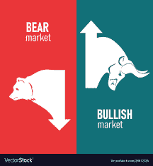
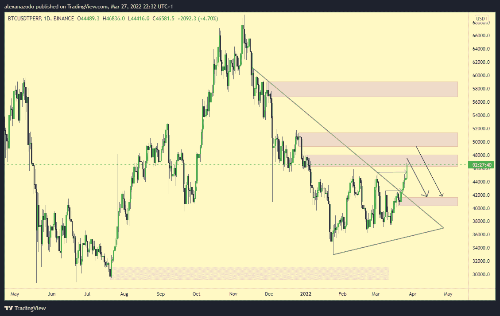
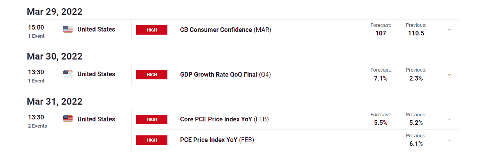
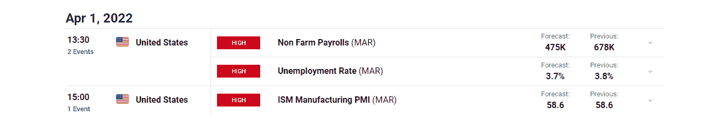
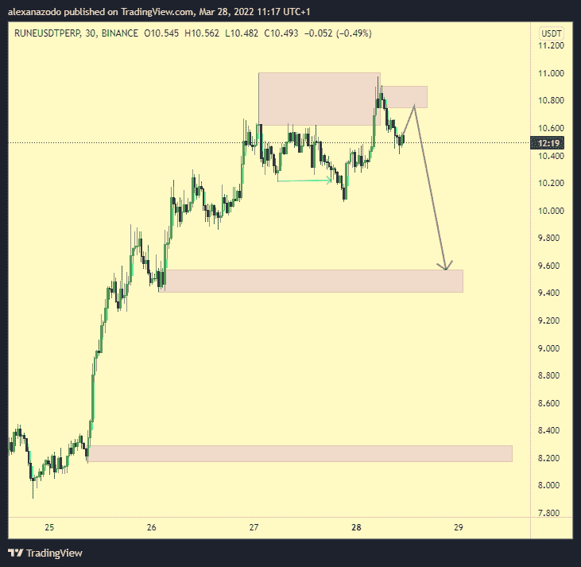
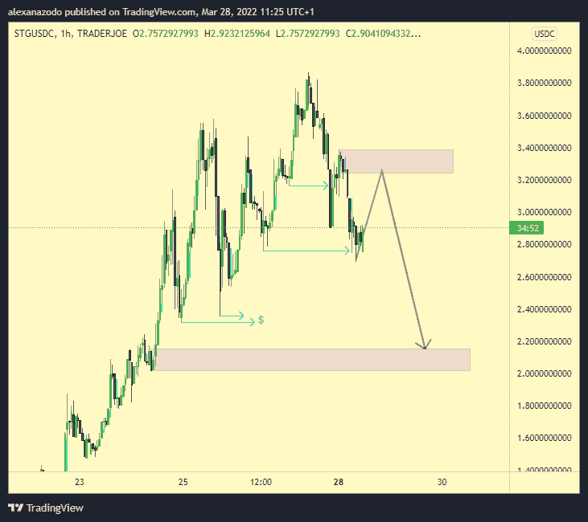
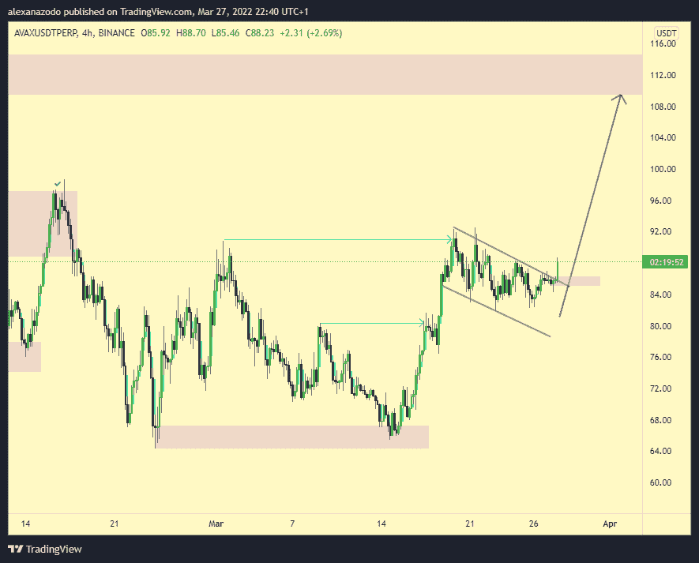
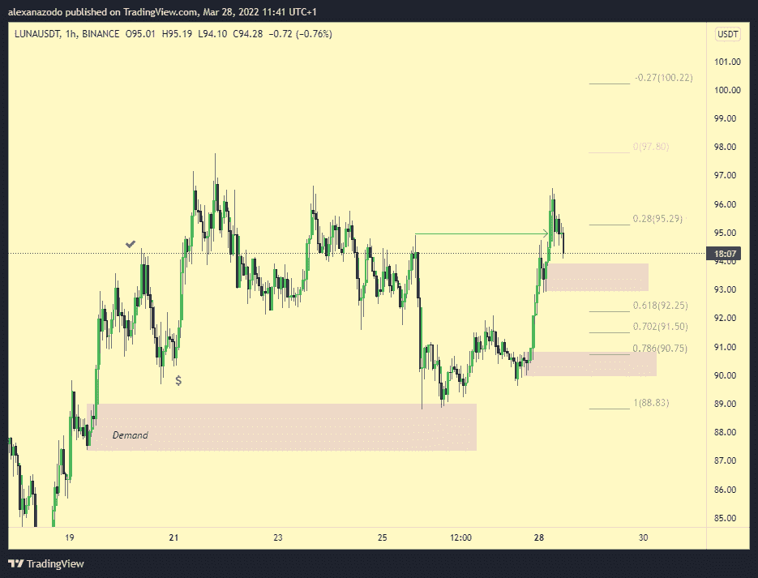
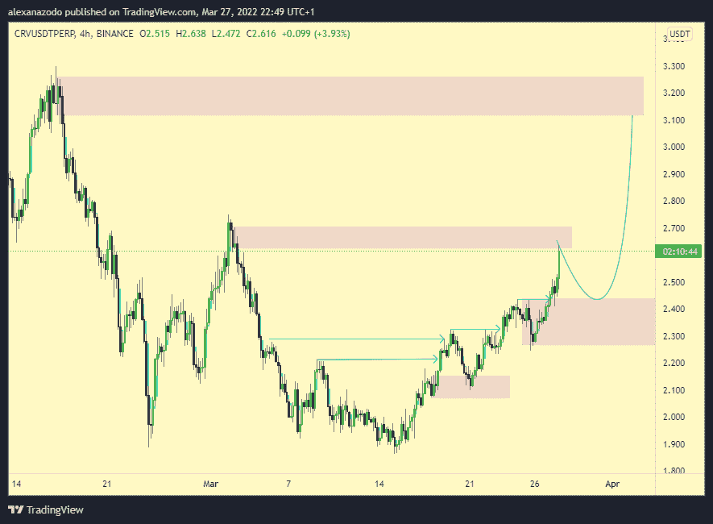

# 加密市场的可能市场方向以及实现良好投资回报的顶级标志

> 原文：<https://medium.com/coinmonks/possible-market-direction-of-the-crypto-market-along-with-top-tokens-for-good-roi-f073a7d5c9e6?source=collection_archive---------14----------------------->

我们又一次度过了一个不错的交易周。BTC 突破了我们设定的范围，从那里开始，交易相当容易。你只需要做多，直到价格触及下一个供应，正如我们在之前的[文章](/@alexanazodo/possible-market-direction-of-the-crypto-market-along-with-top-tokens-with-good-roi-part-2-102e3dba15eb)中概述的那样。我们挑选的一些股票表现优于市场，一些则不然。表现突出的是$APE，$RUNE，$LUNA 和$ZRX。$AVAX 最终表现不佳，而我们的主要失误是$OGN。

随着上周总结的结束，让我们来看看我们对本周的期望。

**$BTC:**

我有点看跌本周的$btc，他们有很多看跌的理由。从技术角度来看，btc 突破了一个大的盘整阶段，但现在也处于一个主要的供应区域。如果$btc 确实看涨，我们不认为它能够很容易地打破这一供应，因为空头目前仍占上风。此外，从回溯测试数据来看，我知道每周蜡烛线在百分比增长方面并不引人注目。自 2021 年以来，每当周线收盘通过关键的明显 S/R 水平时，通常会立即回调，甚至是摆动失败。亚当用这条[推特](https://twitter.com/abetrade/status/1508139223995453441?t=0Q3bvwcpJvIk3E3zGleQbA&s=03)更好地解释了这一点。我们还需要记住流行的秘密叙事“绿色星期天招致血腥星期一”。

从基本面分析的角度来看，有一个主要的催化剂导致了最近的突破。这是 LFG(卢娜基金会卫队)的决定，抵押美元 UST 与美元 BTC。这些频繁的 1.25 亿美元的购买是由 Jump Capital 完成的，人们显然试图抢先进行这些购买，在这个过程中，$btc 打破了其整合。但以目前的供应量，我认为这些购买不会持续。负责这些购买的加密公司由世界级的交易员组成，他们可能会在回撤期间购买打折的比特币，而不是在供应时购买。如果他们真的在阻力位买入，那么这可能是一场自我游戏(他们试图强迫一个看涨的叙述)。

从宏观分析的角度来看，我们有重要的市场移动消息出来。像就业报告，非农就业报告，CPI 打印和许多其他新闻。

除了看跌$btc，我们还看跌:

**$符文:**

符文看起来像是处于分配模式的早期阶段。由于全链条叙事，它显然被过度延伸了。符文已经在我们的文章中出现了两次，我认为在我们放弃安全收益之前是时候放下它了。我们对这种看跌的无效这些将是一个新的蜡烛接近 11 美元。

**$STG:**

我在关于零层技术及其众多可能性的文章中谈到了$STG。这是一个完全可组合的流动性传输协议，位于 omnichain Defi 的核心，允许用户和各种 Dapps 跨链转移原生资产，同时访问协议的统一流动性池，即时保证最终结果。

我短期看跌 STG 价格(因为现在充斥着短期价格投机者),但长期来看，我超级看好他们要实现的目标。我觉得 220 万到 200 万美元的区域是一个值得重新出价的地方。

对于异常值，我再次选择$avax 和$luna。我的理由可以在我上一篇[文章](/@alexanazodo/possible-market-direction-of-the-crypto-market-along-with-top-tokens-with-good-roi-part-2-102e3dba15eb)里找到。

**$AVAX:**

**$露娜:**

**$CRV:**

我看好$Crv 是因为曲线战。曲线战争基本上是当协议试图为他们的项目获取流动性时，他们要么必须买下$CRV 来投票，要么“贿赂”他们的用户来投票。

当前$CRV 奖励的大部分倾向于$MIM，这是 Abracadabra 协议的稳定币。为了实现$MIM 使用量的大幅增长并保持稳定的挂钩，Abracadabra 一直在用$SPELL“贿赂”流动性提供者，他们在$CRV 资金池的奖励之外赚取这些钱。但知道这可能导致他们的本地令牌面临巨大的销售压力，最终没有人愿意被贿赂，许多协议正在积累$CRV。

这样的平台有向往金融、股份道和【编审】卡特尔。但是这个领域最大的玩家仍然是凸的，所有这些协议都在积累大量的$CRV 来控制投票权。

**结论:**

像往常一样，记住这不是财务建议。总是努力进行进一步的个人研究，以进一步弄清楚诸如此类的事情。

> 加入 Coinmonks [电报频道](https://t.me/coincodecap)和 [Youtube 频道](https://www.youtube.com/c/coinmonks/videos)了解加密交易和投资

# 另外，阅读

*   [有哪些交易信号？](https://coincodecap.com/trading-signal) | [Bitstamp vs 比特币基地](https://coincodecap.com/bitstamp-coinbase) | [买索拉纳](https://coincodecap.com/buy-solana)
*   [ProfitFarmers 回顾](https://coincodecap.com/profitfarmers-review) | [如何使用 Cornix 交易机器人](https://coincodecap.com/cornix-trading-bot)
*   [十大最佳加密货币博客](https://coincodecap.com/best-cryptocurrency-blogs) | [YouHodler 评论](https://coincodecap.com/youhodler-review)
*   [MyConstant Review](https://coincodecap.com/myconstant-review) | [8 款最佳摇摆交易机器人](https://coincodecap.com/best-swing-trading-bots)
*   [MXC 交易所评论](/coinmonks/mxc-exchange-review-3af0ec1cba8c) | [Pionex vs 币安](https://coincodecap.com/pionex-vs-binance) | [Pionex 套利机器人](https://coincodecap.com/pionex-arbitrage-bot)