# 帖子 3:选定的传统第 1 层加密货币分析

> 原文：<https://medium.com/coinmonks/post-3-selected-legacy-layer-1-cryptocurrencies-analysis-6556189c9c67?source=collection_archive---------37----------------------->

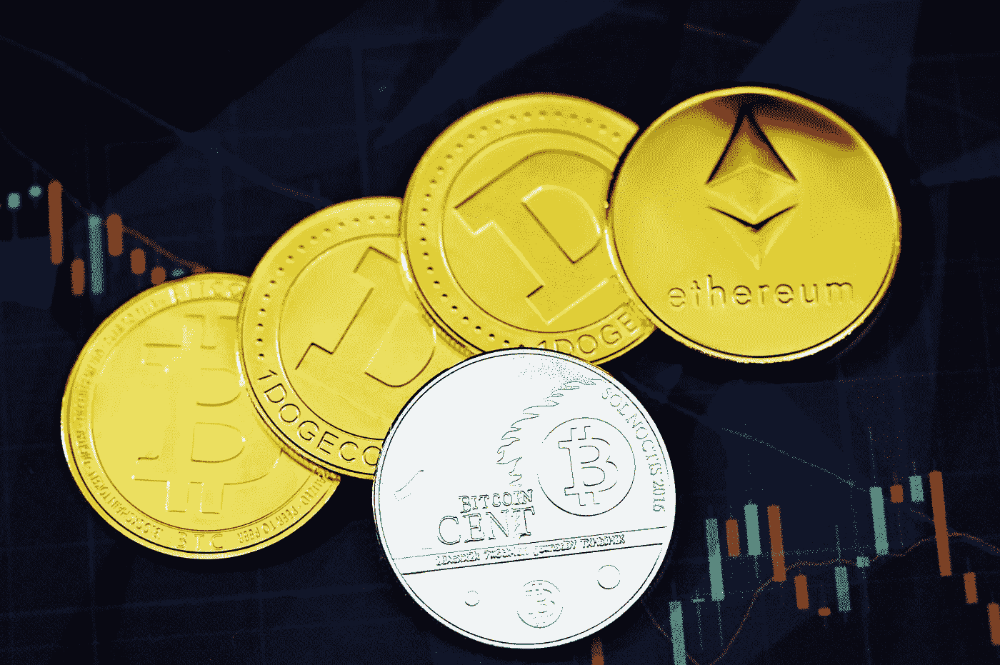

Photo by [Kanchanara](https://unsplash.com/@kanchanara?utm_source=medium&utm_medium=referral) on [Unsplash](https://unsplash.com?utm_source=medium&utm_medium=referral)

*按市值对精选的顶级区块链进行高层次分析*

这是与我的论文(第一层网络的好、坏和价值)相关的一系列帖子的第三部分，旨在从高层次上理解是什么使每个选定的第一层加密货币有价值。 [**帖子一**](/@danielmtz_25212/the-good-the-bad-and-the-value-of-layer-1-networks-f03167d2e02e) 是对基于市值的分析所涵盖的加密货币的介绍，以及为什么相关。 [**帖子二**](/@danielmtz_25212/the-good-the-bad-and-the-value-of-layer-1-networks-de5884c71022) 涵盖了区块链技术的基础知识(是什么，如何工作等。);但是，您可以在这里 **访问完整的 PDF 报告 [**。**](https://bit.ly/3GQNUU6)**

**免责声明:**这不是理财建议。我的观点是我个人的看法。所有投资都有资本损失的风险。

本文涵盖的加密货币:**比特币、莱特币、Ripple、Dogecoin 和以太币**

## 2008 年至 2009 年:比特币——建立在区块链基础上的货币新时代开始了

为了应对 2007-2008 年全球金融危机，(化名)中本聪发布了比特币白皮书，其中介绍了区块链的概念，并概述了一种新的通过比特币的点对点电子现金版本。

**比特币(BTC):** 互联网第一个去中心化的数字货币。它被创建为“一个纯粹的点对点版本的电子现金…一个不依赖信任的电子交易系统”。比特币 genesis block 于 2009 年在 mainnet 上推出。

市值排名:BTC 目前以 5930 亿美元的市值排名第一。

**区块链架构:**编程记录每一个发送、接收或持有的比特币。本质上，它允许用户将比特币从一个账户转移到另一个账户。

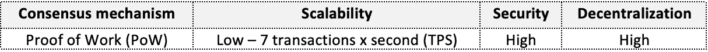

Bitcoin key blockchain architecture features

**好的&值:**

*   **数字黄金标签:**比特币被认为是黄金作为价值储存手段的新替代品。投资者通常采用总可寻址市场法，根据比特币相对于黄金当前市值的比例来确定其代理价值。
*   **上限最大供应量—通货紧缩:**自然界的稀缺性，21，000，000 BTC 的最大供应量，约 90%的总供应量已经开采，使得 BTC 具有通货紧缩的性质。
*   **强大的 Maximalism 和不断增长的社区:**比特币 maximal ism 最大部落的主流名称识别。它在 Reddit 上有大约 400 万会员。

根据“BitInfoCharts”的数据，比特币每天有数千条推文(即高模仿欲)，如下图所示。

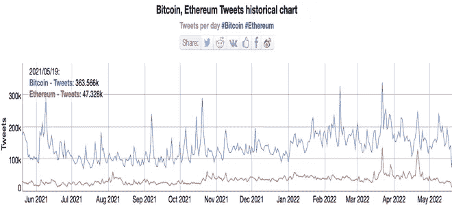

Snapshot source: [https://bitinfocharts.com/comparison/tweets-btc-eth.html#1y](https://bitinfocharts.com/comparison/tweets-btc-eth.html#1y)

*   **CME-衍生品市场:**比特币是 CME 提供的两种加密货币之一，用于通过期货、期权和微型比特币期货管理风险敞口。
*   **关键机构支持:**富达将允许退休储户将比特币存入 401(k)账户。除了富达，潘迪拉资本，Bitwise，gray，Placeholder Ventures，文克莱沃斯资本，MassMutual 等。，允许投资者投资或支持比特币。
*   **活跃交易:图 4** 显示了 2021 年 1 月至 2022 年 6 月 1 日在币安交易所交易的选定加密货币的美元交易量。按总量计算，比特币是迄今为止交易最活跃的加密货币。

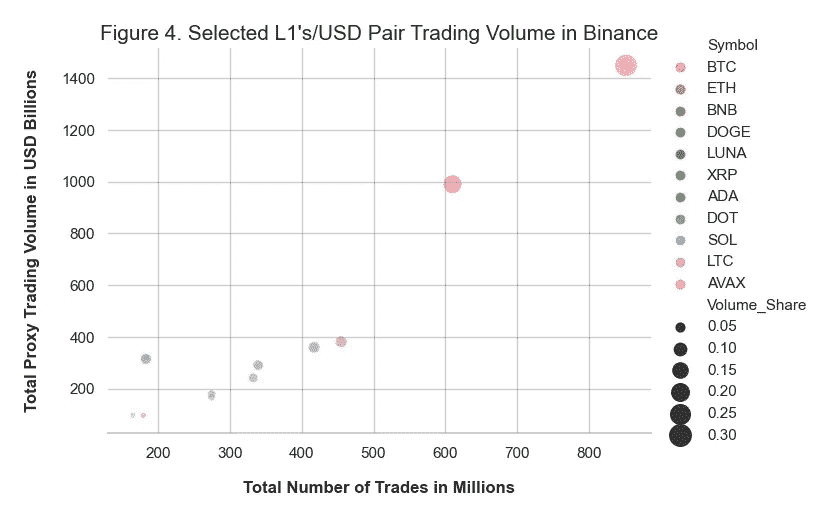

Plot by: Daniel Martinez, CFA with Data Source: Binance

拥有超过 9000 个市场对，BTC 被广泛用作替代硬币的事实上的交易货币对之一。

**坏消息:**

*   **不环保:** PoW 速度慢且不环保，原因是矿工在验证交易时使用了大量能源(见图片 blow)。

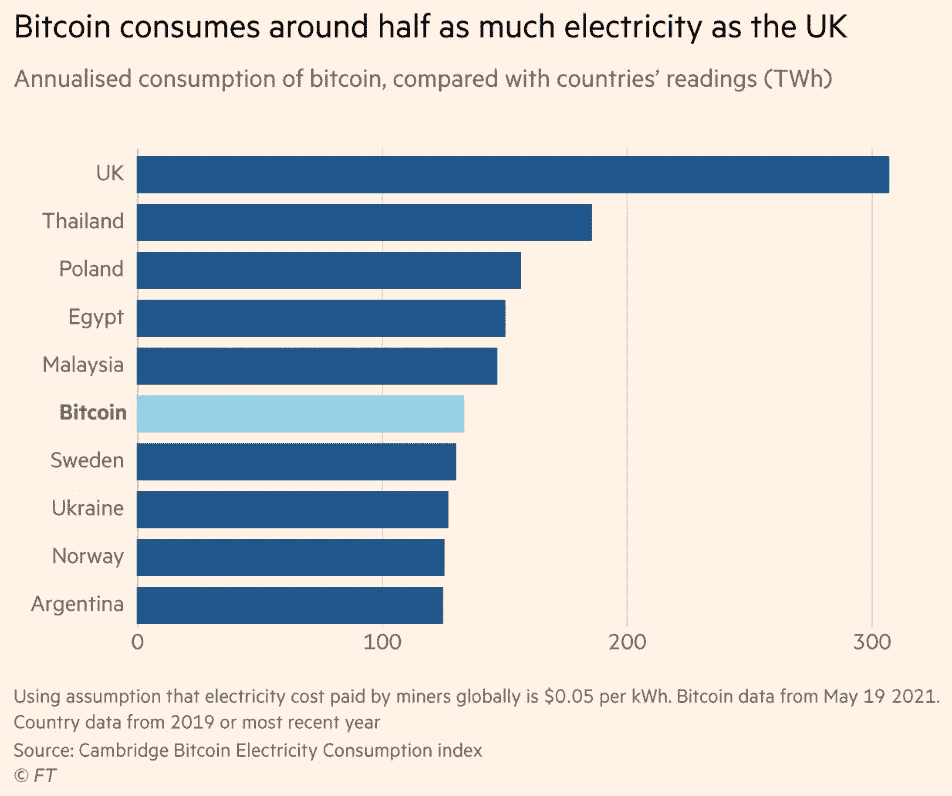

Snapshot source: [https://www.ft.com/](https://www.ft.com/)

*   **有限的可扩展性**:比特币脚本语言不是图灵完整的(即不允许 for 循环)，因此难以实现可扩展性。
*   **高波动率** : **图 5 和图 6** ，对比了比特币和黄金的波动率。它的高波动性和单日波动幅度违背了将比特币作为价值储存手段的理念。

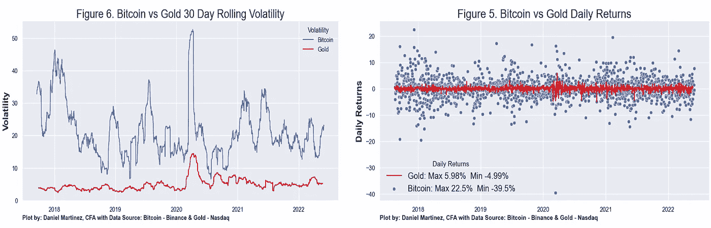

Bitcoin vs. Gold Volatility & Magnitude of Returns

## 2011 年:莱特币——让叉子开始

当区块链网络出现分裂时，就会出现分叉，导致出现两个不同的版本[【2】](#_ftn1)如果分叉很难，它可以以一种全新的数字货币结束，区块链和网络用户各走各的路。

**莱特币(lite coin):**作为一种“精简”的改良替代品，通过比特币的分支产生，旨在成为支付的加密货币。这些改进是通过调整比特币区块链的一些技术方面实现的，比如用于验证数据有效性的加密哈希函数。这带来了更快、更便宜的网络，阻塞时间从 10 分钟减少到 2.5 分钟。

市值排名: LTC 目前以 47 亿美元的市值排名第 18 位。

**区块链建筑:**编程记录每一个发送、接收或持有的硬币。其最近的升级版 Mimblewimble 扩展块(MWEB)为用户提供了在交易中对其财务细节保密的选项。这复制了一些“传统银行系统提供的基本隐私措施”[【3】](#_ftn2)

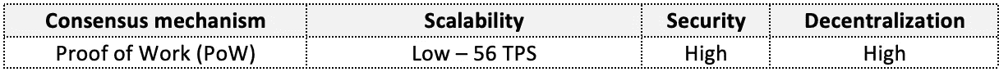

Litecoin key blockchain architecture features

**好的&值:**

*   **交换媒介标签:**与比特币类似，LTC 被一些商家接受为正式的支付来源。RE/MAX London 在 2015 年成为新闻，当时它宣布英国居民可以用比特币、莱特币或 Dogecoin 支付房租。
*   **上限最大供应量:**虽然比比特币最大供应量多 4 倍，但 LTC 也遵循稀缺性模型，供应量上限为 8400 万枚比特币(约 84%已被开采)。

**坏消息:**

*   **有限的可扩展性:**尽管比比特币更快(56 对 7 TPS)且交易成本更低，但 Litecoin PoW 共识机制对于实现真正的可扩展性来说仍然不是最理想的。
*   **失去市场份额:**曾经有一段时间，LTC 被视为比特币黄金的“白银”替代品。如下图所示，随着其他区块链协议的进入，从 2020 年年中(LTC 红线)开始，Litecoin 的市场份额一直在稳步流失。只有时间才能证明莱特币是否应该保留“商品类型标签”、交换媒介或价值储存地位。

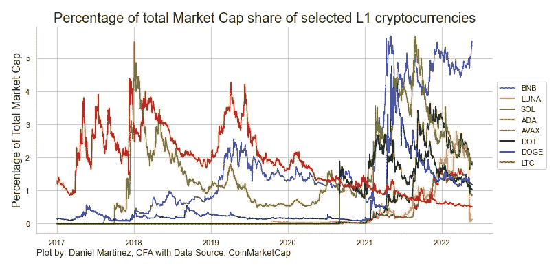

Litecoin loss of market share plot

## 2012 年:涟漪——私营部门加入革命

涟漪(XRP):涟漪的起源要追溯到 2004 年。 XRP 的诞生是为了“轻松、迅速、经济高效地将资金转移到世界各个角落”[【4】](#_ftn1)。本质上，它希望成为银行用于跨境支付交易(如国际汇款、企业支付等)的旧 SWIFT 系统的增强版。).与比特币不同，XRP 被视为私人区块链，因为 RippleNet 属于一家名为 Ripple Labs 的私人公司。

市值排名: XRP 目前以 199 亿美元的市值排名第六。

**区块链建筑:**

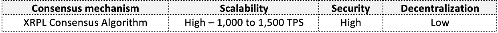

Ripple key blockchain architecture features

**好的&值:**

*   知名客户名单: Ripple 的客户和合作伙伴包括顶级金融机构，如:美国银行、美国运通、桑坦德银行、渣打银行等。
*   **高吞吐量:** XRP 提供可扩展的解决方案，因为它可以以较低的交易成本(约 1000 TPS x 0.00001 XRP 交易成本)处理每秒的交易量。
*   **Medium of exchange tag:** 它的按需流动性池为 XRP 的 Ripple 客户提供廉价、快速的融资。这有助于客户在国际交易中避免处理多种法定货币或加密令牌。此外，它允许客户“消除目的地账户的预先融资，降低运营成本并释放资本。”
*   **上限最大供应量:**上限为 1000 亿枚硬币，约 48%已经开采，XRP 略有通货紧缩。此外，为了帮助保存其价值，分类账中的每一笔交易都必须说明有多少交易成本将用于摧毁 XRP。

**坏消息:**

*   **正在进行的诉讼:**自 2020 年 12 月以来，Ripple 一直在与美国证券交易委员会(SEC)进行诉讼。这导致比特币基地等主要密码交易所暂停了对 XRP 的交易活动。
*   **围绕分权的争议:**尽管《XRP 纪事报》已经分权，但它仍是一家私人公司的一部分。涟漪批评者认为这违背了分权精神。

## 2013 年:doge COIN——向最初的 MEME COIN 问好

**DOGE coin(DOGE):“**一种开源的点对点数字货币，受到全球柴犬 Inus 的青睐。”许多人认为 Dogecoin 是迷因硬币运动之父。然而，DOGE 是作为一个笑话创造出来的，用来取笑比特币和其他加密货币；它后来被埃隆·马斯克命名为“人民的密码”。

**市值排名:** DOGE 目前以 113 亿美元的市值排名第十。

**区块链建筑:**doge coin 创建于一个分叉的分叉处，从莱特币到比特币，包含了其前身区块链的许多相似之处。其挖掘过程使用比特币 PoW 共识机制和 Litecoin Scrypt 的组合进行加密。

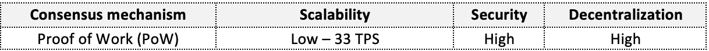

Dogecoin key blockchain architecture features

*   **显著的社区验证:**如图**图 7** 所示，2021 年 4 月下旬至 5 月上旬的大部分时间里，DOGE 旺盛的价格上涨都归功于埃隆马斯克和马克·库班关于 Dogecoin 的推文。

因为金币是人们实际上用来交易的一种硬币。我们通过@BitPay 还有很多其他的。但是人们花费他们的 Doge，这意味着更多的企业将开始接受它。它发展的最大阻碍是你不能把你买的狗花在罗宾汉身上”——马克·库班 2021 年 4 月 26 日发推文

*“狗爸爸 SNL 月 8 日”——埃隆·马斯克 2021 年 4 月 28 日发推文*

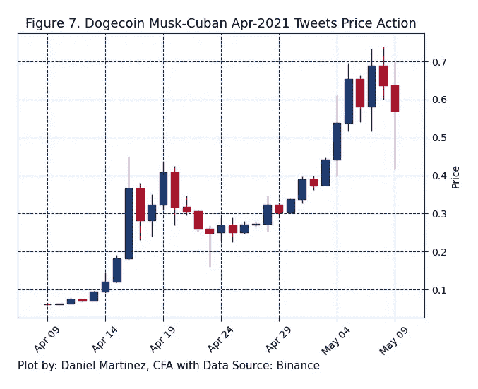

2021 Elon Musk & Mark Cuban DOGE Tweet Mania

*   **交易媒介标签:** Dogecoin 是被包括达拉斯小牛队和特斯拉[【7】](#_ftn1)在内的数百家在线零售商接受。
*   **强大且不断增长的社区:** Dogecoin 社区在 Reddit &其他社交媒体平台上拥有大约 230 万活跃的“子成员”。

**坏消息:**

*   **无供应上限:**与比特币的稀缺性不同，无上限的加密货币本质上是通货膨胀的，因为无限的供应会稀释货币的价格。
*   **坏名声:** Dogecoin 价格变动一直与“泵送-倾销”计划联系在一起，在这种计划中，价格在误导性正面陈述的基础上被人为抬高，以便以更高的价格向后期买家出售抬高的价格。
*   **模仿欲的丧失&其他模因代币:**柴犬(SHIB)和无数更多的模因代币与 Dogecoin 争夺最终的社交模因桂冠。**图 8** 显示了 Dogecoin 繁荣和萧条的价格变化。Dogecoin 怀疑论者认为，DOGE 炒作是过去的事情，越来越少的人会停止渴望它作为人们的秘密(即，模仿欲望的丧失)。

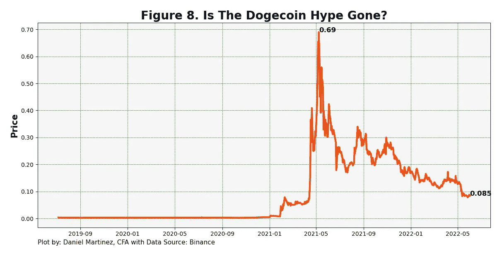

DOGE last price as of June 1, 2022

## 2015 年:以太坊——智能合约和 DAPPS 的崛起

什么是智能合约？用代码编写的预编程协议，当且仅当合同中规定的某些条件得到满足时，该协议在区块链自动执行。

**以太坊(ETH):** 第二代区块链，作为比特币的增强替代品，用于通过智能合约构建去中心化应用。智能合约是用一种叫做 solidity 的图灵完整编程语言编写的。这允许开发人员构建完整的分散式应用程序(dApps)。

市值排名: ETH 目前以 2308 亿美元的市值排名第二。

**区块链架构:**在单链中，以太坊能够记录每一笔以太交易，并通过允许开发人员通过智能合约构建完整的去中心化应用程序来扩展其功能。

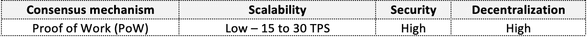

Ethereum key blockchain architecture features

**好的&值:**

*   **市场采用&生态系统的规模:**以太坊区块链拥有近 4000 个应用程序，是最大的令牌化 dApps 社区，以及围绕生态系统的众多项目。在**图 9** 中，我们可以看到自 2020 年下半年以来，令牌化应用的爆炸式增长。

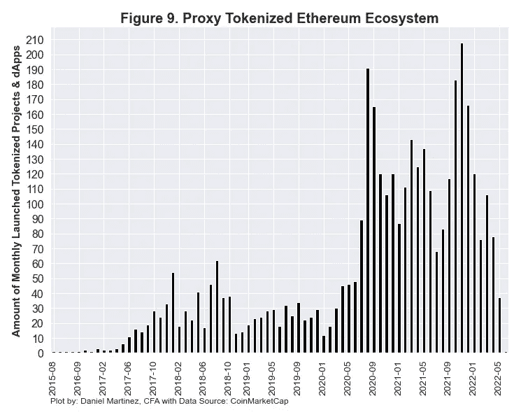

Proxy Ethereum ecosystem based on listed tokens on CoinMarketCap

在**、**下方的**表格**中，我们可以看到以太坊生态系统的代理规模。有了这么多的活动，社区作为一个整体可能是有价值的。

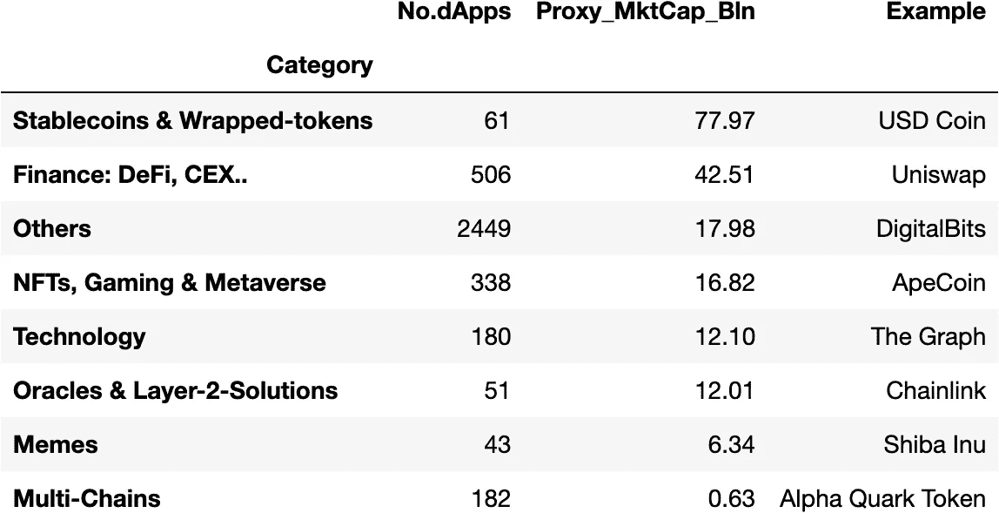

根据 DeFi Llama 的说法，在分散金融领域，以太坊的市场份额主要被币安、Avalanche、Solana 和 Terra 夺走。然而，以太坊以约 510 亿美元的总价值仍然是最大的区块链(TVL)，因为它占据了近 60%的总市场份额，如图**图 10** 所示。

**什么是总价值锁定(TVL)？**“它代表在某一时间在 DeFi 申请中部署(即锁定)的资本总额。”[【8】](#_ftn1)

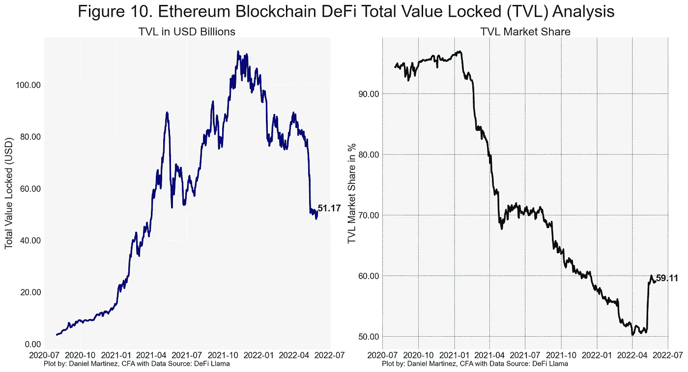

Ethereum TVL data as of June 1, 2022

以太坊的一线希望主要依赖于 Terra 的辐射尘。Terra 的崩溃凸显了以太坊这种“更古老”的区块链协议的弹性。这将使 ETH 成为 DeFi 平台上事实上的抵押品。

*   **强大且不断增长的社区:**它拥有大约 160 万名爱好者和开发人员，分布在 Reddit 上的不同论坛，还有 discord 聊天室、YouTube 和 Twitter 上的数十万名成员[【9】](#_ftn1)。此外，以太坊的联合创始人 Vitalik Buterin 是一位久负盛名的传奇人物，在 Twitter 上拥有超过 360 万名粉丝。
*   **关键机构支持:**以太坊的支持和比特币一样令人印象深刻，因为它包括许多同样的顶级金融机构，外加无数更多的机构。
*   **交易活跃:**根据比特币分析显示，无论从交易量还是交易次数来看，以太都是流动性第二高、交易活跃的加密货币。
*   **CME —衍生品市场:**除了比特币，以太是 CME 中另一种可用的加密货币，用于管理通过期货和微以太期货(1/10 以太大小)进行的加密货币敞口。
*   **平台升级:**以太坊正在从其工作证明挖掘模型转向利益证明模型，因为它的目标是成为“更可扩展、更安全和更可持续的”[【10】](#_ftn1)平台。赌注的含义很重要，因为随着投资者寻找被动收入来源，它增加了货币的吸引力。

**坏:**

*   **可扩展性限制:**它的多功能性加上它的迅速成功，已经成为它自己的课程。以太坊网络经常会拥堵，燃气费很高(哎哟。已经达到 200 美元)，背后是蓬勃发展的 NFTs 等应用，如图**图 11** 所示。

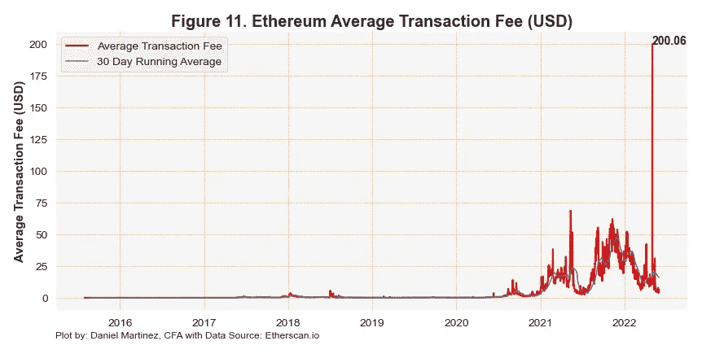

Historical Ethereum Average Transaction Fee in dollars

*   **费用高波动性:**除了以太坊的高交易费用之外，实际费用的波动性导致了其他第 1 层协议的出现，因为开发人员寻求更便宜和稳定的选择。
*   **无限供应:**与比特币不同，ETH 缺乏稀缺性，因为它没有确定的最大供应限制。

今年晚些时候，所有人都将关注以太坊 2.0 的实现。

**未完待续……**

下一篇文章，post 4，将涵盖对选定的第三代第 1 层加密货币(Cardano、BNB、Terra、Solana、Polkadot 和 Avalanche)的分析。

希望你喜欢进入秘密兔子洞。

**参考文献**

[【1】](#_ftnref1)[https://bitcoin.org/bitcoin.pdf](https://bitcoin.org/bitcoin.pdf)

[【2】](#_ftnref1)[https://coinmarketcap . com/Alexandria/glossary/fork-区块链](https://coinmarketcap.com/alexandria/glossary/fork-blockchain)

[【3】](#_ftnref2)[https://lite coin-foundation . org/lite coins-pivotal-mweb-upgrade/](https://litecoin-foundation.org/litecoins-pivotal-mweb-upgrade/)

[【4】【https://ripple.com/】](#_ftnref1)

[【5】](#_ftnref1)[https://ripple.com/ripplenet/on-demand-liquidity/](https://ripple.com/ripplenet/on-demand-liquidity/)

[【6】](#_ftnref1)[https://dogecoin.com/](https://dogecoin.com/)

[https://www.tesla.com/support/dogecoin](https://www.tesla.com/support/dogecoin)

[【8】](#_ftnref1)逐位:分散金融(DeFi):专业投资者入门

[【9】](#_ftnref1)[https://ethereum.org/en/community/online/](https://ethereum.org/en/community/online/)

【10】[https://ethereum.org/en/upgrades/](https://ethereum.org/en/upgrades/)

> 加入 Coinmonks [电报频道](https://t.me/coincodecap)和 [Youtube 频道](https://www.youtube.com/c/coinmonks/videos)了解加密交易和投资

# 另外，阅读

*   [面向开发者的 8 个最佳加密货币 APIs】](https://coincodecap.com/best-cryptocurrency-apis)
*   [支持卡审核](https://coincodecap.com/uphold-card-review) | [信任钱包 vs 元掩码](https://coincodecap.com/trust-wallet-vs-metamask)
*   [赢取注册奖金——10 大最佳加密平台](https://coincodecap.com/earn-sign-up-bonus)
*   [Exness 回顾](https://coincodecap.com/exness-review)|[moon xbt Vs bit get Vs Bingbon](https://coincodecap.com/bingbon-vs-bitget-vs-moonxbt)
*   [如何开始通过加密贷款赚取被动收入](https://coincodecap.com/passive-income-crypto-lending)