# 帖子 4:精选第三代第 1 层加密货币分析

> 原文：<https://medium.com/coinmonks/post-4-selected-third-generation-layer-1-cryptocurrencies-analysis-9024e89b8c6d?source=collection_archive---------35----------------------->

Photo by [Kanchanara](https://unsplash.com/@kanchanara?utm_source=medium&utm_medium=referral) on [Unsplash](https://unsplash.com?utm_source=medium&utm_medium=referral)

*按市值对精选的顶级区块链进行高层次分析*

这是与我的论文(第一层网络的好、坏和价值)相关的一系列帖子的第四部分，旨在从高层次上理解是什么使每个选定的第一层加密货币有价值。

*   [**帖子 1**](/coinmonks/the-good-the-bad-and-the-value-of-layer-1-networks-f03167d2e02e) **:** 对基于市值的分析中所涵盖的加密货币的介绍，以及这种指标为何相关。
*   [**岗位 2**](/coinmonks/the-good-the-bad-and-the-value-of-layer-1-networks-de5884c71022) 涵盖了区块链技术的基础知识(是什么，如何工作等。)
*   [**帖子 3:**](/coinmonks/post-3-selected-legacy-layer-1-cryptocurrencies-analysis-6556189c9c67) 涵盖了围绕**比特币、莱特币、Ripple、Dogecoin、以太币的一些好的和不好的特征(虽然不是穷尽列表)。**
*   您可以在此 **访问完整的 PDF 报告 [**。**](https://bit.ly/3GQNUU6)**

**免责声明:**这不是理财建议。我的观点是我个人的看法。所有投资都有资本损失的风险。

本文涵盖的加密货币:**卡尔达诺、BNB、特拉、索拉纳、波尔卡多特和雪崩**

为什么我们需要以太坊或比特币之外的其他区块链？

就像我们看到以太坊通过设计成图灵完全来解决比特币的可编程性限制一样，它也暴露了自身的局限性。最终，所有的传统区块链都有一些问题——要么它们不能扩展，不能与其他网络通信，要么治理不善，导致难以启动升级，这反过来会导致社区通过 forks 分裂。

这些挑战被称为区块链三难困境。

为了理解这种三难困境，我们需要记住，在一个完美的场景中，女神般的区块链协议是完全**去中心化**，防弹**安全**，并且它可以轻松处理“无限”数量的事务(即非常**可扩展**)。

以太坊的联合创始人 Vitalik buter in[【1】](#_ftn1)提出了区块链三难理论。它指的是一种“第 22 条军规”的情况，即在使用简单技术的区块链中需要放弃某些东西。例如，区块链非常分散和安全，以牺牲可伸缩性为代价拥有大量参与者。

正如我们将看到的，新区块链提案旨在创建自己的利基，在其中他们选择围绕区块链三难困境工作的具体特征。

# 2017 年:卡尔达诺——第三代区块链革命开始

**卡尔达诺(ADA):** 由以太坊联合创始人之一查尔斯·霍斯金森(Charles Hoskinson)创建。Cardano 是第一个基于同行评审研究系统的区块链协议。它是通过使用被称为“大毒蛇”[【2】](#_ftn1)的利害关系共识算法作为以太坊的增强替代方案而开发的。

**市值排名:**截至 6 月 15 日，ADA 目前以 160 亿美元的市值排名第七。

**区块链架构:**双层设计，“会计与计算分层分离”[【3】](#_ftn2)。这意味着其区块链分为两层，Cardano 结算层(CSL)和 Cardano 计算层(CCL)，一方面，它可以跟踪 ADA 的分类账交易，另一方面，部署智能合同执行活动。

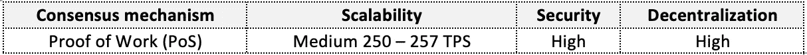

Cardano key blockchain architecture features

**好的&值:**

*   **更环保:**通过使用 PoS，由于 PoW 共识机制，Cardano 的能耗远低于比特币的摄入量。
*   **上限最大供应量:**相比比特币的 2100 亿的供应量，ADA 的 450 亿的最大供应量偏向于真正稀缺的稀释面。另一方面，约 75%的 ADA 已经流通，仍然被认为是通货紧缩。
*   **被动收入:**作为股权证明，ADA 持有人可以参与保护区块链网络，并通过将 ADA 投入资金池获得奖励。根据 Staking Rewards，截至 2022 年 6 月 15 日，ADA 最新平均年化 stake 收益率约为 4.99%[【4】](#_ftn1)。

除了被动收入，3 月 23 日，在比特币基地将 ADA 加入赌注奖励合格硬币名单的消息下，ADA 暂时上涨了 10%(约 3.75% APY[【5】](#_ftn2))。

*   **快速便宜的网络:**相比比特币的 7 或者以太坊的每秒 15 到 30 次的交易，Cardano 的 250 TPS 看起来就像光速一样。与以太坊最近 200 美元的平均交易费相比，正如 Messari 的下图所示，我们可以看到 Cardano 的最高交易费不到 70 美分。

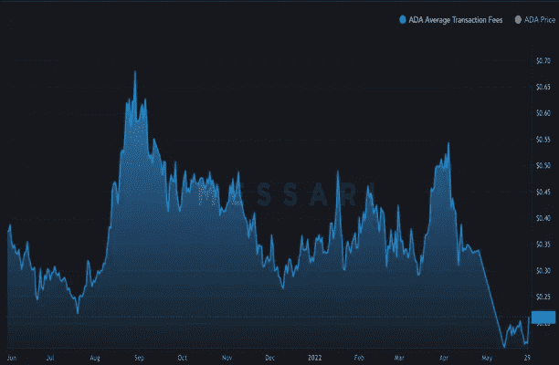

Snapshot source: [https://messari.io/asset/cardano/chart/txn-fee-avg](https://messari.io/asset/cardano/chart/txn-fee-avg)

*   **清晰详细的路线图:**卡尔达诺的《区块链详细实施战略》基于五个时代:布赖翁、雪莱、高更、巴绍、伏尔泰。“每个时代都围绕着一组功能，这些功能将在多个代码版本中交付”[【6】](#_ftn1)。其路线图还举例说明了 Cardano 如何围绕区块链三难困境开展工作(有关路线图的更详细分析，请参见完整报告的附录 5)。
*   **这一次是为了非洲:** Cardano 与埃塞俄比亚教育部的最新合作[【7】](#_ftn2)，旨在为数百万学生和教师创建数字身份，这是该网络解决全球所有社会经济领域实际问题的潜力的体现。

**坏消息:**

*   **结构化路线图:** Cardano 的怀疑者认为其路线图过于僵化和缓慢，因此使网络处于漫长的发展阶段。例如，ADA 在 2017 年部署为可用的加密货币与 2021 年发布智能合约功能之间的时间差距被认为是快速发展技术的长期差距。
*   **生态系统攻坚战:**同行评审的性质有助于更安全、更好的地面项目。然而，智能合同平台之间的竞争快速而激烈，使得 ADA 的上山之路又长又陡。

截至 2022 年 6 月 1 日，使用 CoinMarketCap 数据，围绕 Cardano 生态系统部署的项目屈指可数。例如，Cardano 的一些主要合作伙伴包括 Chainlink、Nexo、COTI、API3，启动的引人注目的本地项目包括 Ardana、SundaeSwap 和 Pavia。另一方面，根据 cardancrowd[【8】](#_ftn1)的说法，准备部署的 dApps 数量很大，涵盖了广泛的类别(例如 DeFi、NFTs、GameFi)。

# 2017–2019:BNB—从 CEX 和 ERC-20 TOKEN 到 DEX 和区块链本土

**BNB (BNB):** 币安已经从一个纯粹集中式加密货币交易所(CEX)发展成为一个完整的生态系统，包括其自己的区块链及其本地加密货币、分散式交易所(币安 DEX)、NFT 市场、币安 Visa 卡等等。2017 年，币安硬币最初在区块链以太坊作为 ERC-20 代币推出，并于 2019 年改用本国货币区块链。由于其快速扩张，币安决定将其生态系统——币安链和币安智能链(BSC)——更名为 BNB 链，以便更接近其 BNB 加密货币名称。

**市值排名:**截至 6 月 15 日，BNB 目前以 347 亿美元的市值排名第五。

**区块链架构:**币安链使用了 BFT 共识下的利益证明机制。它的程序可以记录每一枚 BNB 硬币和发送、接收或持有的数字资产。它可以发行新的数字资产以及“铸造/刻录、冻结/解冻、锁定/解锁数字资产”。[【9】](#_ftn1)币安智能链(BSC)和币安桥的加入，通过允许创建智能合同和 dApps，以及与以太坊和其他区块链生态系统的互操作性，推动网络达到可扩展性。

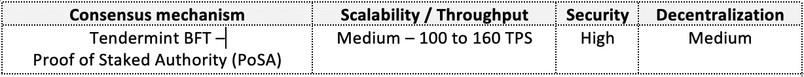

BNB key blockchain architecture features

**好的&值:**

*   **强有力的领导:**赵昌鹏(“CZ”)在 Twitter 上拥有超过 560 万名粉丝，是加密行业中一位受人尊敬、广受关注的梦想家。
*   **效用性质:**币安交易所客户可以使用 BNB 支付交易费用。更有价值的是，它的用户可以“通过 BNB 支付交易费用时享受 25%的折扣”。拥有 9000 万注册用户和 760 亿美元的 24 小时交易量，BNB 的用例故事变得非常引人注目。
*   **通缩性质:**币安制定了 BNB 自动烧钱政策——一系列规则让一些 BNB 退出流通，因为它“承诺从流通中去除 1 亿 BNB，或总供应量的一半”[【11】](#_ftn2)。除了季度自动燃烧之外，币安智能连锁公司(BSC)的天然气费中还有每日 BNB 燃烧部分。
*   **被动收益:**根据跑马圈地回报，截至本文撰写时，BNB 最新平均跑马圈地 APY 在 5.72%左右。
*   **兼容以太坊虚拟机(EVM):** BNB 桥允许开发者在 BNB 链上部署和利用 ETH 智能合约生态系统。
*   **低费用结构:**中位数为 33 美分，BNB 连锁店在他们的网络上执行交易时拥有最低的平均日费用。**图 13** 显示一美元上方出现暂时的尖峰；然而，这被认为与一些用户为了在他们的交易执行中获得优先权而过度激励网络有关。从右边的图表中，我们可以看到这是不必要的，因为网络从来没有完全拥塞。

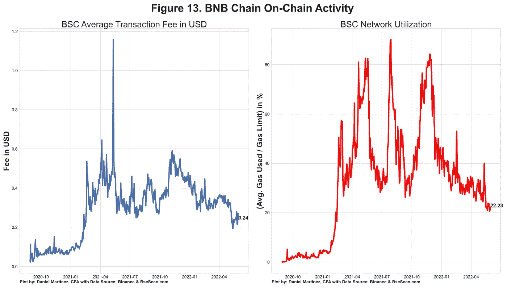

BNB On-Chain Fees & Network Utilization

*   **市场采用&生态系统规模:** BNB 连锁生态系统规模仅次于以太坊；然而，符号化新项目和整体市场采用的速度是惊人的。如图**图 14** 所示，看起来以太坊在 2021 年期间不稳定和高昂的交易费用促使开发者寻求其他更便宜的网络，如币安。

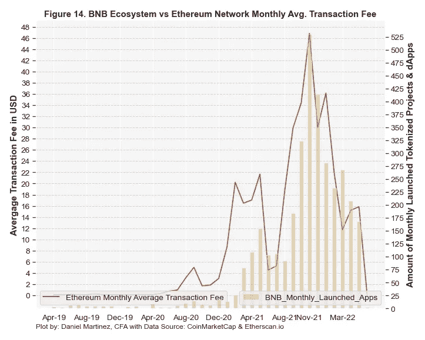

据 DeFi Llama 称，就 TVL 而言，BNB 是第二大区块链，拥有约 71.5 亿美元的市场份额，占总市场份额的近 8.25%，如图**图 15** 所示。

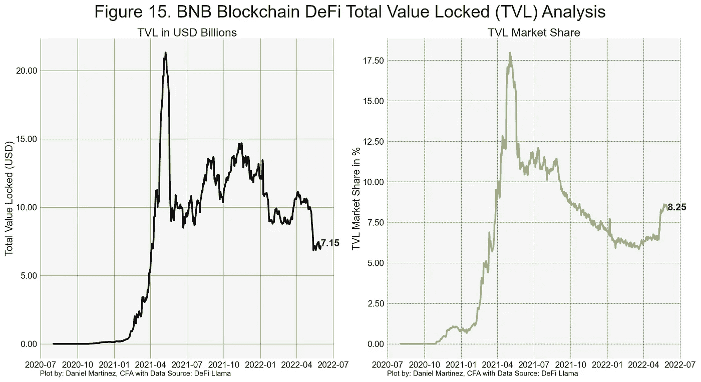

Data: As of June 1, 2022

其快速的智能合同 dApp 增长和整体强劲的 DeFi 地位相结合，使币安成为一个完整和多元化的区块链生态系统。

**坏消息:**

*   **围绕去中心化的争议:**除了作为币安集中交易所(CEX)的一部分，BNB 链还要求少数验证者达成共识(即 **"** 只有前 21 个最高利益节点被选为验证者集合的一部分。"[【13】](#_ftn1))。这些观点在去中心化的最大主义者中引发了关于网络易受中心化影响的问题。
*   监管问题:币安继续面临全球范围内的监管挑战。例如，英国、意大利和新加坡的监管机构已经禁止币安运营。

# 2019 年:TERRA-un stabe stable coins 的区块链

什么是 stablecoins？Stablecoins 是“追踪基础货币价格的加密资产”。只要稳定的货币能够维持其联系汇率，它们就是有用的。

**Terra (LUNA):** 旨在通过提供最终不稳定的稳定货币来解决比特币等加密货币固有的价格波动问题。在 UST 脱钩惨败之前，Terra 是法定货币的竞争对手，也是算法稳定货币的领先区块链协议。本质上，Terra 是或曾经是一个稳定的货币家族，每个货币都与一种世界法定货币挂钩。

与泰瑟-UST 或美元硬币-USDC 等其他稳定货币的一个关键区别是，Terra 的稳定货币不是使用储备的一对一法定资产进行挂钩的。相反，Terra 使用了一种扩张和收缩算法市场方法，即使用其本币 Luna 来支持和保持 1 比 1 的稳定汇率。

总的来说，Luna 用于或曾经用于通过赌注来保护网络，支付网络费用，治理和通过吸收价格波动来保持 Terra 稳定。

市值排名:在泰拉最大的稳定货币 UST 失去联系汇率后，LUNA 排名和市值仍处于自由落体状态。截至 6 月 15 日，更名后的 Terra Classic 市值约为 3.8 亿美元。

**区块链建筑:**由可互操作的区块链 Cosmos SDK 提供支持，Terra 区块链被设计成抗审查，并帮助其用户消费、交易或交换 Terra stablecoins。总的来说，该协议由两个主要令牌 Terra 和 Luna 及其套利算法市场模块组成。在这种方法下，如果 Terra stablecoin 的价值高于或低于其公平票面价值，用户将受到激励铸造或焚烧 Terra 's stablecoin vs. Luna。例如，如果 Terra 的 UST 美元稳定币交易高于 1.00，用户可以访问 Terra wallet，用 1 美元兑换 1 UST，然后在市场上出售新铸造的 UST，并捕捉高于其 1.00 面值美元的价格差异。

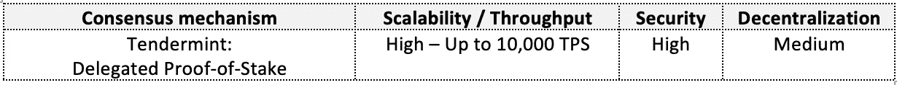

Original Terra key blockchain architecture features

**好的&价值:在特拉区块链崩溃之前**

*   **互操作:**在 Luna 崩溃之前，Terra bridge 使 Terra 成为领先的跨链协议，支持领先的区块链，如:以太坊、索拉纳、币安、宇宙等等。
*   **被动收入&高效用:**根据主播[【16】](#_ftn1)和赌注奖励，月神持有者能够赚取接近 5%的 APY。对于稳定的 UST 币，用户可以获得 16.50%到 18% APY 的惊人收益率。
*   **重要的合作伙伴关系&成长中的生态系统:**截至 2022 年 5 月 12 日，Terra 报告了 114 个上市项目(75 个已上线，37 个正在开发中)。值得注意的令牌化项目包括 DeFi 的 Anchor & Mirror 协议，以及游戏& NFTs 的 StarTerra。非令牌化的韩国移动支付应用 CHAI 使许多零售公司和银行能够接受 KRT 的支付。似乎币安[[17]](#_ftn1)、Polygon 以及其他公司正在帮助将 Terra 项目迁移到他们的网络中。

**坏消息:**

*   **稳定币可能失去其挂钩&其后果:**如下图所示，一旦 1:1 挂钩被打破，我们可以看到 Luna 和 Terra USD 稳定币的总价格暴跌。

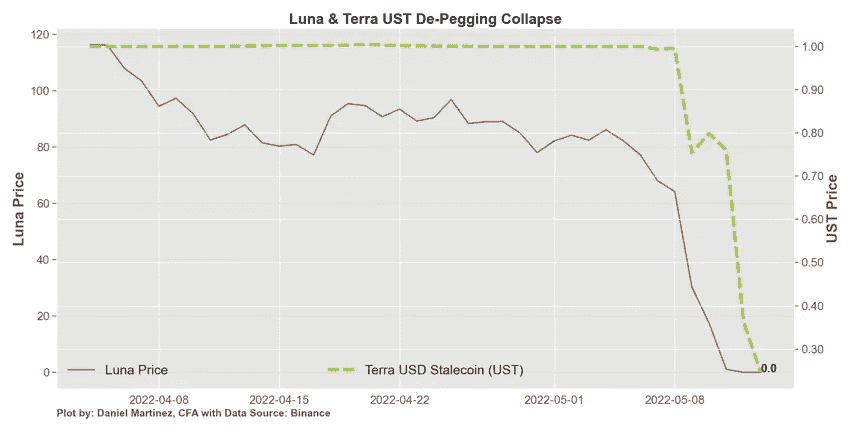

**哪里出了问题？**我会在深入 twitter 兔子洞后，尝试解释 Terra 的崩溃。首先，月神有一个弹性供应模型，与 Terra 的稳定铜需求密切相关(你可以焚烧或铸造月神来获得 UST，反之亦然)。第二，它的算法模型似乎有一个内在的可变“利差”风险，即为了造币和获得 UST 而焚烧 Luna 的平均价格与 Luna 的当前市场价格之间的风险。要澄清的是，如果铸造 UST 所用的月神平均价格远远高于当前的月神价格，那么当人们离开 UST 时，月神将会出现过量供应(即，UST 被重新焚烧以铸造月神)。第三，如下面的**图 17** 所示，Terra 在 TVL 拥有约 200 亿英镑，但严重抵押不足，因为它拥有约 30 亿英镑[【18】](#_ftn1)。

总之:只要有兴趣持有 UST，支付接近 20%的 APY，卢纳的下行风险是有限的。然而，一旦 Luna 价格开始下跌，市场参与者开始做空 UST，利用 Terra 的弱点，一切都崩溃了。为了重建 UST，Terra 清算了自己的比特币储备。这只是为当前风险资产的退出火上浇油，最终导致了信心完全丧失、恐慌和整个 Terra 生态系统崩溃的恶性循环。

在 DeFi，崩溃之前，Terra 拥有超过 200 亿美元和大约 14%的 TVL 市场份额，是 TVL 第二大区块链。崩盘后，UST 脱钩引发了锚平台的资金外流，最终导致其持有的资产崩盘，如图**图 17** 所示。

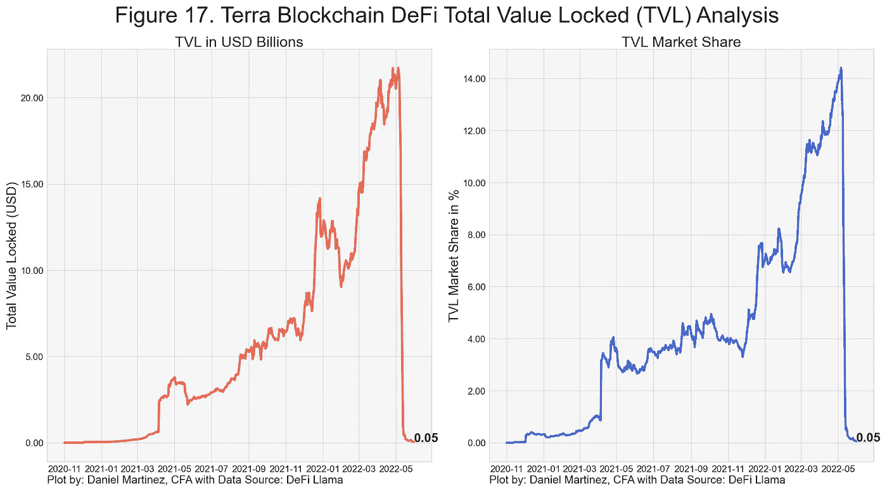

Data: As of June 1, 2022

*   **加密交易所将 Luna 退市:**2022 年 5 月 13 日，币安决定，一旦 Luna、Terra 的 stablecoins 及其交易对的价值下跌 100%，就暂停其交易。其他主要交易所如 crypto.com eToro 也纷纷效仿，将禁令扩展到 Terra 的 dApps Anchor 和 Mirror。
*   **监管问题:**所有加密货币都面临潜在的监管挑战；然而，Terra 的案例特别有意思，因为稳定资本可以对支付系统、中央银行实施货币政策等构成额外的破坏性风险。
*   **激烈的稳定货币市场竞争&政府成为参与者:**在下表**，**中，我们可以看到 Terra 的 UST 是或曾经只是许多与美元相关的稳定货币之一。

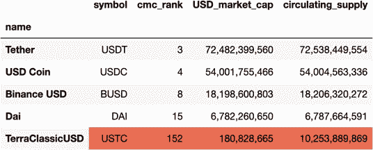

Data: As of June 1, 2022

除了潜在的拥挤市场，目前的 stablecoins 还面临着新进入者来自政府发行自己的数字货币的风险。例如，墨西哥央行 Banxico 计划在 2024 年推出自己的数字货币。[【19】](#_ftn1)

# 2020 第一部分:索拉纳——对速度的需求

**索拉纳(SOL):**Packy McCormick 在他的文章《索拉纳的夏天》[【20】](#_ftn1)中指出，索拉纳的精髓在其品牌声明“强大的开发者”中得到了完美的体现。大家快来”。Solana 的高吞吐量使区块链的可扩展性成为现实。这通过吸引开发者创造了一个良性循环，开发者反过来吸引用户，这导致了 Solana 的采用。

**市值排名:**截至 6 月 15 日，SOL 目前以 100 亿美元的市值排名第九。

**区块链架构:** Solana 是一个快速且高度可扩展的智能合同区块链，它依赖于一个扭曲的共识机制的利益证明。Solana 将历史证明(PoH)添加到其区块链建筑设计中。有了 PoH，索拉纳的区块链就能跟踪交易发生的顺序。

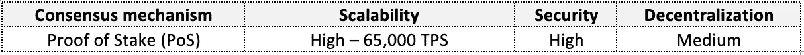

Solana key blockchain architecture features

**好的&值:**

*   **快速、廉价且可扩展的网络:**根据截至 2022 年 5 月底的数据，Solana 的每笔交易平均成本约为 0.00025 美元，是一款非常便宜的区块链。从理论上讲，网络能够处理 65，000 TPS，Solana 的事务活动的随机 6 小时截图显示，网络可以轻松处理 3，000 TPS，如下图所示。

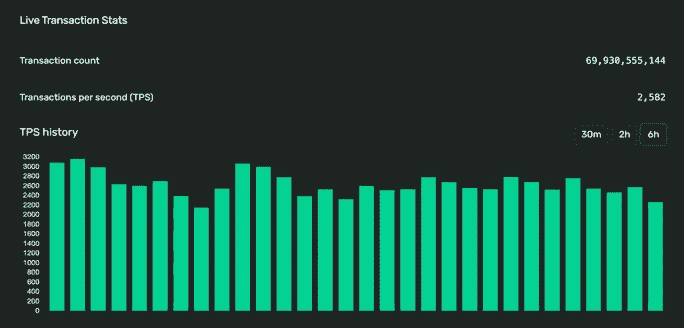

Snapshot source: [https://explorer.solana.com/](https://explorer.solana.com/)

凭借超过 2，500 的 TPS，我们可以看到 Solana 的高事务吞吐量和可伸缩性潜力。

*   **被动收益:**根据 Staking Rewards 和 solanabeach . io[【21】](#_ftn1)，SOL 持有者通过将 SOL 赌注入池，可以获得 4.75%-5.25%的 APY。
*   **更环保:**如前所述，利益相关证明共识算法验证交易的计算成本更低。

**坏消息:**

*   **网络不稳定:**索拉纳怀疑论者认为索拉纳容易出现网络中断。在下图**、**中，我们可以看到 Solana 在选定月份的正常运行状态。在 1 月和 5 月期间，我们可以看到红色区域的网络性能有所下降，网络不稳定。只有时间才能证明中断是由于任何正在发展的新生技术的正常进化过程，还是 Solana 选择了以稳定性为代价的可扩展性。

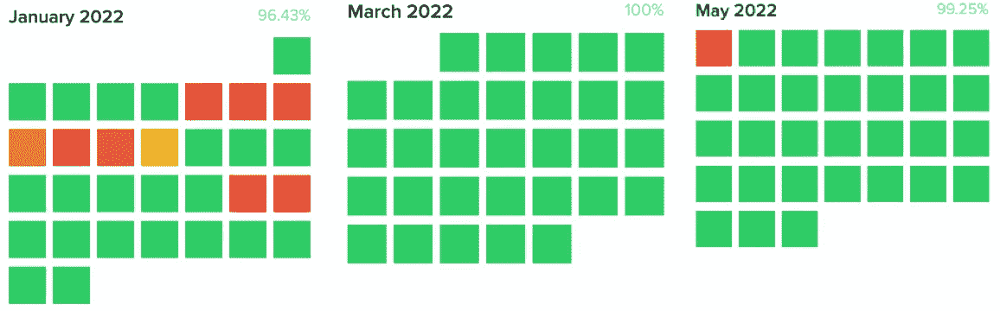

Snapshot source: [https://status.solana.com/uptime](https://status.solana.com/uptime)

*   **小型生态系统&攻坚战:**考虑到 Solana 的可扩展性潜力，其生态系统的规模相对较小，如果打算废黜以太坊，将面临一场攻坚战。如图**图 20** 和**表 4** 所示，当对 CoinMarketCap 标签进行分组时，我们可以看到 Solana 当前标记化生态系统规模的一个代理。索拉纳的生态系统大约有 300 个项目，与以太坊的 3700 多个令牌化项目相比，只是一小部分。另一方面，看看索拉纳的网站[【22】](#_ftn1)，有超过 1500 个注册项目，其中包括索拉纳背后蓬勃发展的 NFT 地区。另一个重要的方面是像 Audius 这样的项目从以太坊迁移到索拉纳。很快我们就可以看到索拉纳符号化项目的爆发。

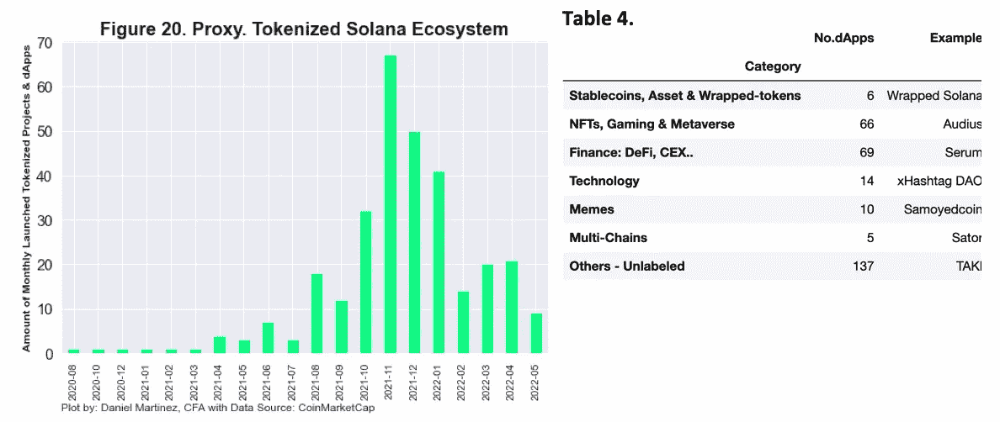

Data: As of June 1, 2022

*   **没有固定的供应上限&通货膨胀率:**如前所述，Solana 等没有供应上限的加密货币本质上是通货膨胀的(即，它稀释了代币的价值)。在 Solana 的案例中，未下注的代币持有者更容易受到影响，因为他们没有获得回报，同时仍然面临以下通胀时间表:SOL 供应每年以 8%的初始通胀率增加，该通胀率向下调整 15%，直到达到 1.5%的长期通胀率，如下图所示。

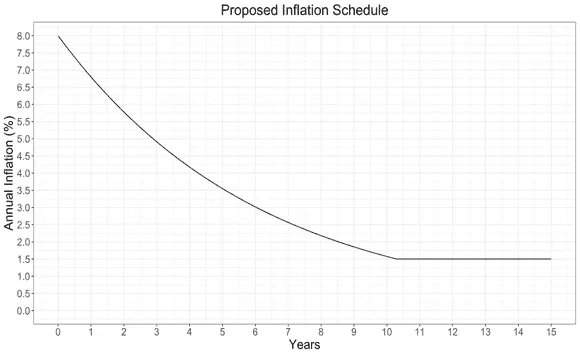

Image source: [https://docs.solana.com/inflation/inflation_schedule](https://docs.solana.com/inflation/inflation_schedule)

*   **围绕去中心化的争议:**根据 solanabeach.io 的数据，Solana 目前的超级少数数，即理论上可以共谋、审查或停止网络的最小验证者数，约为 25 个(即，他们总共控制了总股份的 33%以上)。

# 2020 第二部:波尔卡多特和雪崩——和我谈谈区块链

**Polkadot(DOT):**Polkadot 由以太坊联合创始人 Gavin Wood 博士发起，旨在解决大多数传统 L1 系统面临的互操作性限制。本质上，它的目标是成为一个一站式商店，在这里它可以提供区块链所需的所有元素；例如单一生态系统中的互操作性、可扩展性、分散性和共享安全性。

**市值排名:**截至 6 月 15 日，DOT 目前以 71 亿美元的市值排名第 11 位。

**区块链建筑:**

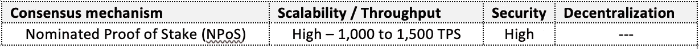

Polkadot key blockchain architecture features

**Avalanche(AVAX):**Avalanche 由康奈尔大学的计算机科学家团队开发，是一种可互操作的区块链，允许创建定制的区块链、智能合同和分散的应用程序。

**市值排名:**截至 6 月 15 日，AVAX 目前以 44 亿美元的市值排名第 16 位。

**区块链架构:**如下图所示，Avalanche 由三个独立的内置区块链组成。X-Chain 用于创建和跟踪数字资产的所有交易。P 链用于协调验证器并为自定义区块链创建子网。C 链创建智能合同，并与以太坊虚拟机(EVM)完全兼容。

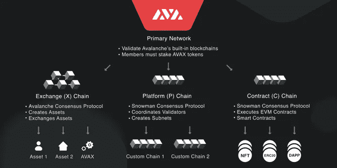

Snapshot source: [https://docs.avax.network/overview/getting-started/avalanche-platform/](https://docs.avax.network/overview/getting-started/avalanche-platform/)

这些区块链由主网络验证和保护。主要网络的所有成员必须至少下注 2,000 AVAX。

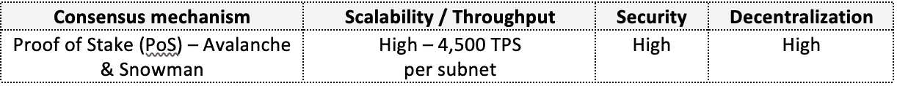

Avalanche key blockchain architecture features

**好的，价值&坏的:**

*   **有上限与无固定供应:**波尔卡多特的点是通货膨胀的，它应该倾向于稀释价值，因为它有无限的代币供应和 10%的通货膨胀率。另一方面，Avalanche AVAX 具有通货膨胀性，并遵循稀缺资产模型“最高上限为 7.2 亿代币”。[【23】](#_ftn1)除了有固定供应外，雪崩网上的费用全部烧掉，截止 2022 年 6 月 1 日；近 180 万枚价值约 4500 万美元的 AVAX 代币被烧毁。
*   **快速、廉价且可扩展的网络:**Polkadot 1，500 和 Avalanche 4，500 TPS 这两种网络都可以为现实生活中的应用提供可扩展且廉价的解决方案。除了其高吞吐量之外，Avalanche 声称具有接近即时的事务终结性(即，它可以在 1 秒内确认事务)。
*   **提供互操作性解决方案:**比特币或以太坊等传统协议需要第 2 层扩展解决方案来提供其本地区块链与外部世界之间的通信。Polkadot 和 Avalanche 都为这个问题提供了解决方案，它们使交易成为可能，而不需要包装令牌，也不需要通过添加其他应用程序层来将网络安全置于风险之中。一个关键特性是对创建 solidity 智能契约(以太坊的编程语言)的雪崩支持。
*   **小生态&攻坚战:**正如我们所见，智能合约区块链平台竞争激烈，在某种程度上已经饱和。波尔卡多特和雪崩都是新出现的，如果他们想废黜以太坊，还有很长的路要走。从好的方面来看，两家公司都与 Chainlink 等网络建立了重要的合作关系。

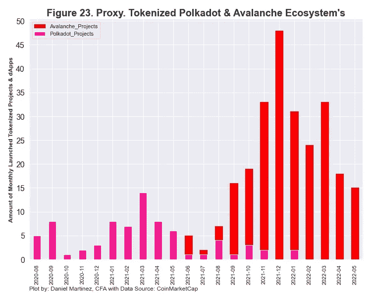

波尔卡多特的符号化生态系统相对较小，但非常多样化。它与独立的应用程序和 parachains 平台，如:Moonbeam，Acala，Polkaswap 等。,

另一方面，Avalanche 可以处理无限数量的子网，并拥有更强大、数量更多的令牌化应用程序(例如 Trader Joe、Crabada、Pangolin 等)。)，如图**图 23** 所示。

**图 24** 显示了 Polkadot 和 Avalanche 的 DeFi 生态系统。根据 DeFi Llama 的说法，由于总价值约为 36.3 亿美元，Avalanche 无法保持 2021 年 11 月达到的 5%的市场份额。另一方面，Polkadot 的主要副链在 TVL 接近 10 亿大关，占总市场份额不到百分之一。

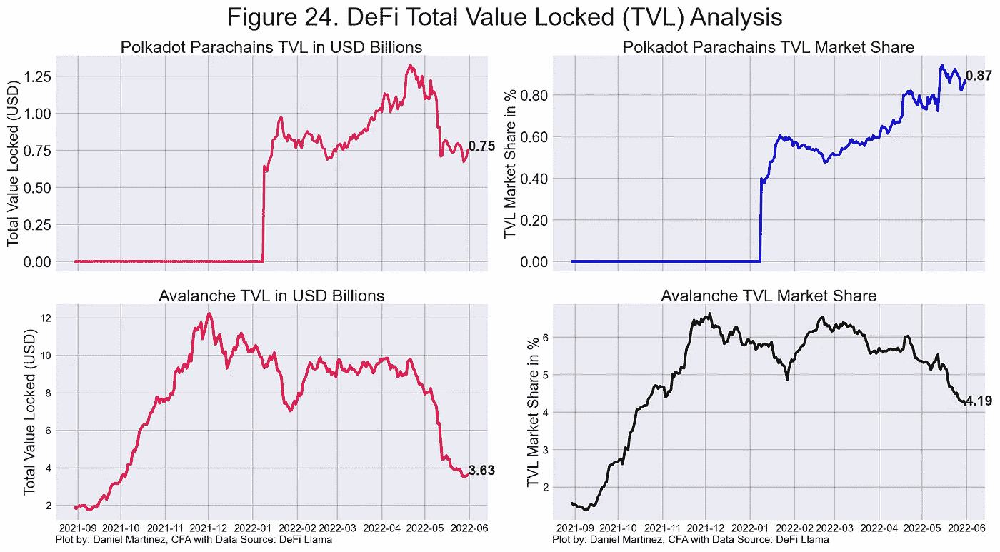

Data: As of June 1, 2022

*   **被动收入:**根据赌注回报，截至本文撰写时，DOT 平均年赌注收益率约为 14%[【25】](#_ftn1)和 AVAX 约为 9%，根据雪崩文件，可高达 11%的 APY。
*   **高能效:**两者都使用利益证明，而不是工作证明。

未完待续……

下一篇也是最后一篇文章，post 5，将涵盖选定的第一层加密货币的底线和关键分析

希望你喜欢进入秘密兔子洞。

**参考文献**

[【1】](#_ftnref1)[https://vitalik.ca/general/2021/04/07/sharding.html](https://vitalik.ca/general/2021/04/07/sharding.html)

[【2】](#_ftnref1)[https://cardano.org/ouroboros/](https://cardano.org/ouroboros/)

[【3】【https://why.cardano.org/en/introduction/motivation/】](#_ftnref2)

[【4】](#_ftnref1)[https://www.stakingrewards.com/staking/](https://www.stakingrewards.com/staking/)

[【5】](#_ftnref2)[https://blog . coin base . com/coin base-expands-staking-officies-to-include-cardano-e5cb 35 f 7 fb0e](https://blog.coinbase.com/coinbase-expands-staking-offerings-to-include-cardano-e5cb35f7fb0e)

[https://roadmap.cardano.org/en/](https://roadmap.cardano.org/en/)

[https://africa.cardano.org/](https://africa.cardano.org/)

【8】【https://cardanocrowd.com/】T42

[【9】](#_ftnref1)【https://docs.binance.org/guides/intro.html】T2

[【10】](#_ftnref1)[https://www . binance . com/en/support/announcement/2af 5831727164545 b 8 a2 c 665 FAE 8 BC 04](https://www.binance.com/en/support/announcement/2af5831727164545b8a2c665fae8bc04)

[【11】](#_ftnref2)[https://www . binance . com/en/blog/ecosystem/18-bnb-burn-421499824684903294](https://www.binance.com/en/blog/ecosystem/18th-bnb-burn-421499824684903294)

[https://www.bnbburn.info/](https://www.bnbburn.info/)

[【13】](#_ftnref1)[https://docs.binance.org/](https://docs.binance.org/)20 日% 20 日%20mainnet。

[【14】](#_ftnref2)[https://time . com/next advisor/investing/cryptocurrency/币安-美国-review/](https://time.com/nextadvisor/investing/cryptocurrency/binance-us-review/)

[【15】](#_ftnref1)[https://docs.terra.money/docs/learn/protocol.html](https://docs.terra.money/docs/learn/protocol.html)

[【16】](#_ftnref1)[https://app.anchorprotocol.com/earn](https://app.anchorprotocol.com/earn)

[https://coin telegraph . com/news/bnb-chain-offers-another-lifeline-to-terra-ecosystem-projects](https://cointelegraph.com/news/bnb-chain-offers-another-lifeline-to-terra-ecosystem-projects)

[【18】](#_ftnref1)[https://www . CNBC . com/2022/05/16/what-happed-to-the-bit coin-reserve-behind-terras-ust-stable coin . html](https://www.cnbc.com/2022/05/16/what-happened-to-the-bitcoin-reserve-behind-terras-ust-stablecoin.html)

[【19】](#_ftnref1)[https://www . wsj . com/articles/bank-of-Mexico-plans-to-launch-digital-currency-by-2024-11640896506](https://www.wsj.com/articles/bank-of-mexico-plans-to-launch-digital-currency-by-2024-11640896506)

[【20】](#_ftnref1)【https://www.notboring.co/p/solana-summer】T2

【21】[【https://solanabeach.io/validators】](https://solanabeach.io/validators)

[【22】](#_ftnref1)[https://solana.com/ecosystem](https://solana.com/ecosystem)

[【23】](#_ftnref1)[https://www.avalabs.org/whitepapers](https://www.avalabs.org/whitepapers)

[【24】](#_ftnref2)[https://burnedavax.com/](https://burnedavax.com/)

[【25】【https://www.stakingrewards.com/staking/】](#_ftnref1)

> 加入 Coinmonks [电报频道](https://t.me/coincodecap)和 [Youtube 频道](https://www.youtube.com/c/coinmonks/videos)了解加密交易和投资

# 另外，阅读

*   [加密货币储蓄账户](/coinmonks/cryptocurrency-savings-accounts-be3bc0feffbf) | [加密交易机器人](https://coincodecap.com/best-crypto-trading-bots)
*   [BigONE 交易所评论](/coinmonks/bigone-exchange-review-64705d85a1d4) | [CEX。IO 审查](https://coincodecap.com/cex-io-review) | [交换区审查](/coinmonks/swapzone-review-crypto-exchange-data-aggregator-e0ad78e55ed7)
*   [最佳比特币保证金交易](/coinmonks/bitcoin-margin-trading-exchange-bcbfcbf7b8e3) | [比特币保证金交易](https://coincodecap.com/bityard-margin-trading)
*   [加密保证金交易交易所](/coinmonks/crypto-margin-trading-exchanges-428b1f7ad108) | [赚取比特币](/coinmonks/earn-bitcoin-6e8bd3c592d9)
*   [WazirX vs CoinDCX vs bit bns](/coinmonks/wazirx-vs-coindcx-vs-bitbns-149f4f19a2f1)|[block fi vs coin loan vs Nexo](/coinmonks/blockfi-vs-coinloan-vs-nexo-cb624635230d)
*   [BlockFi 信用卡](https://coincodecap.com/blockfi-credit-card) | [如何在币安购买比特币](https://coincodecap.com/buy-bitcoin-binance)
*   [火币交易机器人](https://coincodecap.com/huobi-trading-bot) | [如何购买 ADA](https://coincodecap.com/buy-ada-cardano) | [Geco？一次回顾](https://coincodecap.com/geco-one-review)