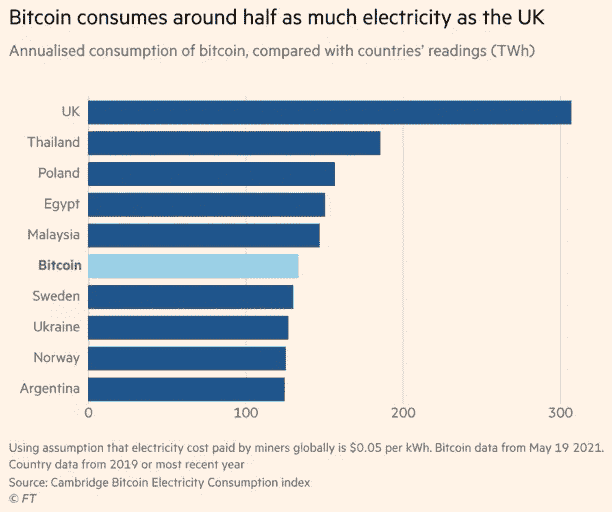
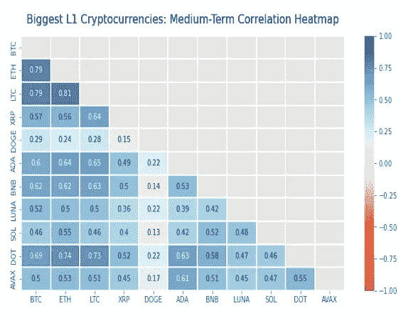
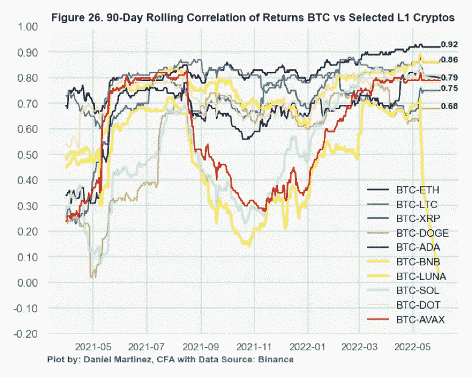

# 帖子 5:最终顶层 1 区块链分析总结

> 原文：<https://medium.com/coinmonks/post-5-final-top-layer-1-blockchains-analysis-wrap-up-e22aea630e4c?source=collection_archive---------21----------------------->

Photo by [Chris Liverani](https://unsplash.com/@chrisliverani?utm_source=medium&utm_medium=referral) on [Unsplash](https://unsplash.com?utm_source=medium&utm_medium=referral)

*按市值对精选的顶级区块链进行高层次分析*

这是与我的论文相关的一系列文章的最后一部分:**第一层网络的好、坏和价值**这篇文章涵盖了分析的主要收获。

*   [**Post 1**](/coinmonks/the-good-the-bad-and-the-value-of-layer-1-networks-f03167d2e02e) **:** 对基于市值的分析中所涵盖的加密货币的介绍，以及为什么这种指标是相关的。
*   [**岗位 2**](/coinmonks/the-good-the-bad-and-the-value-of-layer-1-networks-de5884c71022) 涵盖了区块链技术的基础知识(是什么，如何工作等。)
*   [**帖子 3:**](/coinmonks/post-3-selected-legacy-layer-1-cryptocurrencies-analysis-6556189c9c67) 涵盖了围绕**比特币、莱特币、Ripple、Dogecoin、以太币的一些好的和不好的特征(虽然不是穷尽列表)。**
*   [**帖子 4:**](/coinmonks/post-4-selected-third-generation-layer-1-cryptocurrencies-analysis-9024e89b8c6d) 涵盖了围绕**卡尔达诺、BNB、Terra-Luna、Solana、Polkadot 和 Avalanche 的一些好的和坏的特征(尽管这不是详尽的列表)。**
*   您可以在这里 **访问完整的 PDF 报告 [**。**](https://bit.ly/3GQNUU6)**

**免责声明:**这不是理财建议。我的观点是我个人的看法。所有投资都有资本损失的风险。

## 关键要点

*   **工作证明(PoW)加密货币:**无法真正自行扩展，并面临额外的环境监管风险(见下图的比特币电力消耗示例)。

Snapshot source: [https://www.ft.com/](https://www.ft.com/)

*   **利益证明(PoS)加密货币:**除了解决可扩展性问题，PoS 加密资产还有一个有趣的固定收入支付类似结构(即，你可以赚取收益率)。
*   **无限供应硬币:**从长期、买入并持有的角度来看，通货膨胀的加密货币似乎违反直觉，因为它们应该稀释价值。
*   **比特币:**这一切都是关于比特币的“品牌”主流认可，这主要导致散户投资者及其最大化主义者部落。比特币和所有加密资产不那么光明的一面是持续的高波动性。当我们目前在美国和海外经历高通胀，而比特币今年下跌超过 30%时，很难裁定支持比特币作为交换或通胀对冲的媒介。
*   **莱特币:**一方面，莱特币已经能够成为比特币黄金的白银替代品。另一方面，随着新的期权进入市场，由于市场份额和整体硬币相关性的损失，长期来看很难有建设性。
*   **Ripple:** 尽管 Ripple 拥有一系列顶级客户，为金融机构建立了坚实的区块链平台，但美国证交会的诉讼可能会损害 Ripple 的形象和未来的市场采用。
*   **Dogecoin:** 一个社区验证，a-la Elon Musk，vs .一个饱和的 meme coin 部门。这是不是很讽刺，DOGE 的历史新高与 Elon Musk SNL 的推特重合，你不觉得吗？
*   **以太坊**:以太坊 2.0 除了是一个完善的、领先的构建智能合约项目的生态系统之外，更应该为皇冠增添钻石。坏处:在当前以太坊高昂的天然气费用背后，面临着激烈的竞争。
*   **卡尔达诺:**类似于应用价值投资于股票，可以认为卡尔达诺的长期价值在于其路线图的成功执行。Genius X 的推出和即将推出的 Vasil hard fork 为 ADA 的路线图执行及其长期未来提供了支持。
*   **BNB:** 我对 BNB 持长期建设性态度。它的快速增长和在所有区块链相关使用案例中的强大定位，主要是 DeFi，使 BNB 成为击败以太坊的有力候选人。从短期来看，BNB 的主要风险更偏向于监管方面，而非市场采纳方面。
*   **Terra:** Terra 的 stablecoin 算法模型让人想起乔治索罗斯(George Soros)击垮英格兰银行(Bank of England)的那一天，或是 21 世纪初阿根廷 1:1 美元脱钩的货币危机。稳定密码的欠抵押主张已被证明是有风险的主张，可能会拖累加密市场的其他部分(只要看看 Luna 崩溃后的雪崩式下跌就知道了)。
*   **Solana:** 一个快速、廉价和可扩展的网络，Solana 在 2021 年以惊人的 11，177%的回报率席卷了密码社区。如果 Solana 打算跟上饱和且要求苛刻的智能合同平台，它需要解决其网络不稳定问题。
*   波尔卡多特:波尔卡多特的生态系统虽然小却是多样的。Polkadot 未来可能面临的一个限制是其中继链能够处理的副链数量有限，大约 100 个。
*   **Avalanche:** 互操作性(EVM 实例)、相对稳定的 DeFi TVL 市场份额及其近乎即时的交易终结性使 Avalanche 成为金融服务的理想区块链。

## 结果

从比特币早期对电子现金的设想，到专门构建的智能合约平台的兴起和不断演进；所有区块链都有自己的优势和局限性。Crypto 仍处于早期发展阶段，很容易出现高波动性，从而导致急剧的繁荣和萧条价格周期。它的开源性质已经催生了数千个项目，区块链都声称自己是下一个大事件。正如我们所看到的，这些要点提出了以下关键问题。

**对于投资者来说，除了 crypto 固有的波动性，有这么多加密货币可以投资，还能实现多元化吗？有如此多的投资选择，一个多元化的篮子理论上是有意义的；然而，非系统风险似乎更难减轻。下面的关联热图显示了所选蓝筹第一层加密货币之间的强正相关性。**

Binance data: from Jan 1, 2021 to June 1, 2022

此外，如图**图 26 所示，**考虑到比特币和所选加密资产之间强烈的正 90 天滚动相关性，任何中期或长期的多样化收益将最有可能来自于避免项目崩溃(如 Terra)时的全部资本损失。因此，拥有多种加密货币可以降低全面爆发的风险。

另一方面，这一点也加强了这样一种观点，即由于加密兔子洞很深，因此拥有一个小型且充分了解的成熟第 1 层投资组合可能更好。

一个区块链最终会统治他们吗？看起来不会有一个“以太坊杀手”或者“那个人”来统治他们。相反，类似于网络泡沫的繁荣和破灭，我们很可能会看到许多项目的投降，以及其他项目的生存和加冕。正如我在总结中提到的，每个独特的区块链都有自己的市场定位和价值主张。

最终，我们将看到不同的区块链建立自己的信徒部落——类似于比特币狂热分子——争夺资本，最重要的是争夺用户的采用和开发者的关注。正如 Packy McCormick 在他的 Solana 夏季帖子中提到的:“如果没有一个强大的开发者和用户社区，最好的技术都会被浪费掉。”

## **其他值得注意的区块链**

Tron、Near Protocol、Cronos、Cosmos、Algorand、Tezos 等等，都是吸引资本、开发者和用户采用的有趣的区块链。由于其独特的价值主张，它们都值得进一步分析。

感谢你阅读这些帖子，我希望你喜欢进入加密兔子洞。

> *加入 Coinmonks* [*电报频道*](https://t.me/coincodecap) *和* [*Youtube 频道*](https://www.youtube.com/c/coinmonks/videos) *了解加密交易和投资*

# 另外，阅读

*   [3 商业评论](/coinmonks/3commas-review-an-excellent-crypto-trading-bot-2020-1313a58bec92) | [Pionex 评论](https://coincodecap.com/pionex-review-exchange-with-crypto-trading-bot) | [Coinrule 评论](/coinmonks/coinrule-review-2021-a-beginner-friendly-crypto-trading-bot-daf0504848ba)
*   [莱杰 vs n 格拉夫](/coinmonks/ledger-vs-ngrave-zero-7e40f0c1d694) | [莱杰纳诺 s vs x](/coinmonks/ledger-nano-s-vs-x-battery-hardware-price-storage-59a6663fe3b0) | [币安评论](/coinmonks/binance-review-ee10d3bf3b6e)
*   [Bybit Exchange 审查](/coinmonks/bybit-exchange-review-dbd570019b71) | [Bityard 审查](https://coincodecap.com/bityard-reivew) | [Jet-Bot 审查](https://coincodecap.com/jet-bot-review)
*   [3 commas vs crypto hopper](/coinmonks/3commas-vs-pionex-vs-cryptohopper-best-crypto-bot-6a98d2baa203)|[赚取加密利息](/coinmonks/earn-crypto-interest-b10b810fdda3)
*   最好的比特币[硬件钱包](/coinmonks/hardware-wallets-dfa1211730c6) | [BitBox02 回顾](/coinmonks/bitbox02-review-your-swiss-bitcoin-hardware-wallet-c36c88fff29)