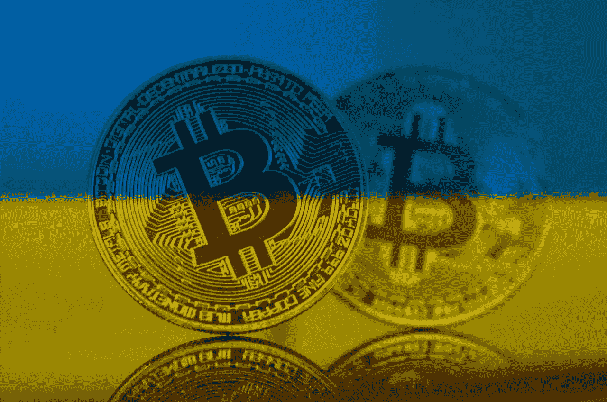
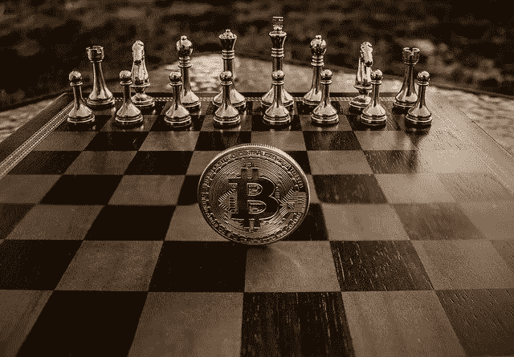
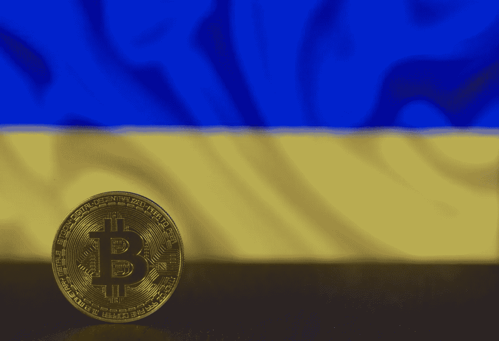

# 战后的乌克兰将成为数字资产增长的催化剂。

> 原文：<https://medium.com/coinmonks/post-war-ukraine-will-be-a-catalyst-for-digital-assets-growth-de8648f72ffe?source=collection_archive---------65----------------------->

随着与普京领导的俄罗斯的冲突继续，乌克兰人面临着一场保住自己国家的艰苦斗争。交战各国之间的和平谈判还没有真正产生实质性的结果；当乌克兰人渴望击退他们的入侵者时，俄罗斯军队没有退缩的迹象。制裁对俄罗斯经济和公民的严重影响不足以说服她的领导人取消这些尝试。俄罗斯的入侵使这个中欧国家的经济陷入困境，并导致数百万公民流离失所。

当世界其他国家继续谴责俄罗斯的行为并援助乌克兰时，这场冲突可能会持续一段时间。对乌克兰的支持来自世界各地，形式各异。像往常一样，加密货币社区正在参与进来。为了争取他们对东欧国家的支持，超过 1 亿美元的加密货币已被捐赠给乌克兰，以帮助他们摆脱困境。

通过捐赠获得数百万美元的加密货币，乌克兰获得了不止一个优势。除了这可能带来的金融强化，加密货币还提供了一个相对于传统系统更有效的金融系统。对于一个陷入战争的政府来说，一种“不可阻断的”价值交换手段就派上了用场。加密货币的基础技术造就了最灵活的交易。没有第三方，并为普遍接受的价值储存提供动力，它实际上意味着动荡。

看到加密货币在他的斗争中发挥的作用，乌克兰总统采取行动，使比特币成为该地区的法定货币。当你保管着一定数量的加密货币时，这是一件合理的事情。我们目前还不知道乌克兰到底是如何使用捐赠给他们的加密货币的，但至少我们可以猜测。比特币合法化的举措暗示了使用加密货币的积极效果；尤其是在这种时候。如果更多的国家会考虑对比特币和其他加密货币采取积极的政策，这是一个他们是否真正关注加密货币目前所扮演的角色的问题。

在冲突中，乌克兰展示了加密货币在动荡时期有多么有用。为其他国家考虑的一点。它已经在数字资产中扮演了重要的角色。即使在战后，乌克兰也将成为欧洲和世界其他地区数字资产的催化剂……这是显而易见的。

乌克兰现在是一片废墟。由于俄罗斯炮兵的炮击，乌克兰城市的重要建筑都在隆隆作响。一旦冲突结束，乌克兰将再次寻求重建国家。来自捐赠的资金将再次发挥作用。只要国家保持开放，接受加密货币捐赠，仁慈的加密货币社区将继续支持他们的复苏。作为一种法定货币，比特币和其他加密货币的捐赠将通过国家政府流通。可能是作为对协助发展计划的不同机构的付款。

在一个发展受到战争严重影响的国家，比特币铭刻在法律书籍中，采用未来解决方案来快速恢复和提升竞争力的需求是一个重要问题。优化的支付媒介和卓越的价值储存是很好的选择，比特币完全符合这一点。就像萨尔瓦多一样，乌克兰可能成为下一个利用数字资产促进国家发展的国家。

与萨尔瓦多人不同，乌克兰人以一种相当不幸的方式了解了使用加密货币等 swift 支付解决方案的好处。这场冲突期间的银行业经历已经足以让他们意识到比特币和其他加密货币在保管金融系统上的区别。许多人已经将大部分资金用于加密货币，这种情况甚至会在战后继续下去。

乌克兰将成为加密货币在动荡和复苏中相关性的双重案例研究。作为国家认可的交换媒介，它将在生活在这一地区的人们的正常生活中发挥作用。全世界都在关注着；乌克兰发生的每一个与加密货币有关的事件都是对其实用性的重大展示。对于一个受到如此多限制的概念，加密货币和区块链正在证明世界其他地方是错误的。在对比鲜明的时代扮演重要角色是多才多艺的证明。

[将我们的下一期出版物发送到您的邮箱](https://cryptoscripts.medium.com/subscribe)

加密货币脚本正在转变成一个由热情的加密货币和区块链信徒组成的社区！[加入冒险！](https://t.me/cryptocurrencyscripts)

# 你会喜欢看类似的文章吗？

[将我们的下一期出版物发送到您的邮箱](https://cryptoscripts.medium.com/subscribe)

**关注我们上** [**推特**](https://twitter.com/scriptscrypto) **关注我们上** [**中**](https://cryptoscripts.medium.com/) **关注我们上** [**发布 0x**](https://www.publish0x.com/@Dzoelx) **关注我们上** [**脸书**](https://www.facebook.com/scriptscrypto)

> 加入 Coinmonks [电报频道](https://t.me/coincodecap)和 [Youtube 频道](https://www.youtube.com/c/coinmonks/videos)了解加密交易和投资

# 另外，阅读

*   [阿联酋 5 大最佳加密交易所](https://coincodecap.com/best-crypto-exchanges-in-uae) | [SimpleSwap 评论](https://coincodecap.com/simpleswap-review)
*   购买 Dogecoin 的 7 种最佳方式
*   [最佳期货交易信号](https://coincodecap.com/futures-trading-signals) | [流动性交易所评论](https://coincodecap.com/liquid-exchange-review)
*   [用于 Huobi 的加密交易信号](https://coincodecap.com/huobi-crypto-trading-signals) | [Swapzone 审查](/coinmonks/swapzone-review-crypto-exchange-data-aggregator-e0ad78e55ed7)
*   最佳[密码交易机器人](https://coincodecap.com/best-crypto-trading-bots) | [购买索拉纳](https://coincodecap.com/buy-solana) | [矩阵导出评论](https://coincodecap.com/matrixport-review)