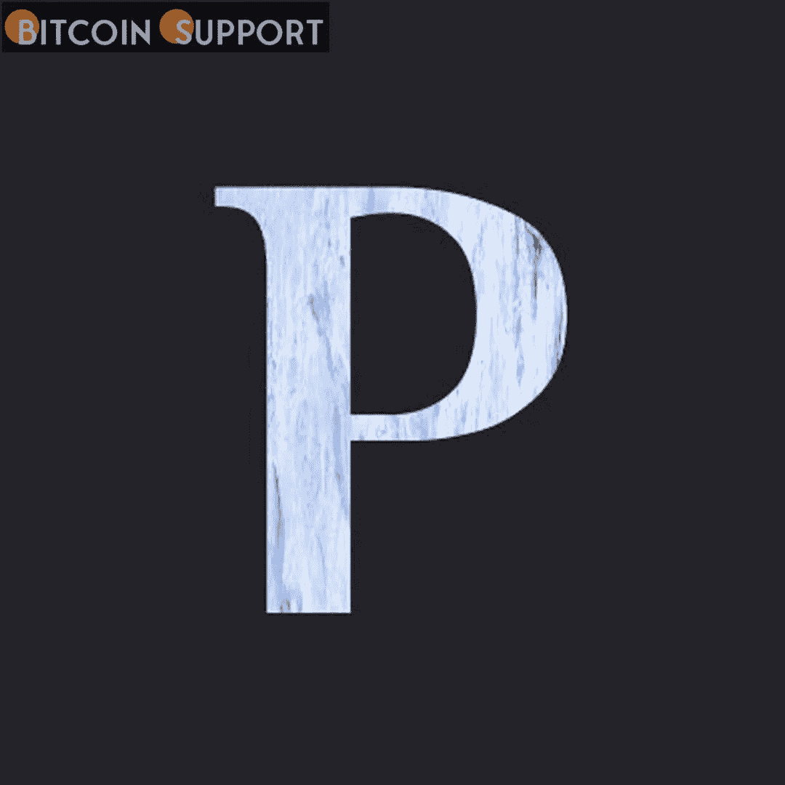

# Praxis 是一家城市建设公司，已经筹集了 1500 万美元的首轮融资

> 原文：<https://medium.com/coinmonks/praxis-a-city-building-business-has-raised-15-million-in-series-a-funding-3ad1f9111d85?source=collection_archive---------30----------------------->

**Visit our website:-** [**https://bitcoinsupports.com/**](https://bitcoinsupports.com/)

“一个更具活力的未来”——在主要加密风险投资公司的一轮投资后，Praxis 距离创建加密供电的城市乌托邦又近了一步。由彼得·泰尔赞助的城市建设企业 Praxis 已经从多家加密风险投资公司获得了 1500 万美元的首轮融资，其中包括 Paradigm Capital、Alameda Research 和 Three Arrows Capital。

据该公司网站介绍，纽约大学的德莱顿·布朗和波士顿学院的查理·卡利南于 2019 年共同创立了 Praxis，前身为蓝皮书城市，目的是“创造城市-密码国家，实现更具活力的未来”Praxis 寻求摆脱“人为稀缺的元经文”，以创建一个基于“共同理想”而非“工业时代劳动力市场原则”的城邦据报道，加密货币运营的城市将非常重视实用的建筑和环境技术。

https://Twitter . com/PraxisSociety/status/1499525850890481668

Praxis 尚未购买大量土地来开发他们的大都市，但有传言称他们正在考虑在地中海附近选址。联合创始人德莱登·布朗在 YouTube 的一次采访中说:

## “我们没有试图成为一个完整的主权国家或任何东西。”我们希望与政府合作，创造出让我们和他们都受益的神奇的东西。”

此轮投资者包括阿波罗项目和机器人风险投资公司，此外还有 Paradigm，Alameda Research 和三箭资本。数字企业家巴拉吉·斯里尼瓦桑(Balaji Srinivasan)和文克莱沃斯双胞胎是 Praxis 种子轮的投资者之一，去年年底筹集了 420 万美元。去年 11 月，Paradigm 取代 a16z 成为全球最大的加密风险投资基金，为其“新风险基金”筹集了 25 亿美元。

**访问我们的网站:-**[**https://bitcoinsupports.com/**](https://bitcoinsupports.com/)

**免责声明:这些是作者的观点，不应被视为投资建议。读者应该自己做研究。**

> 加入 Coinmonks [电报频道](https://t.me/coincodecap)和 [Youtube 频道](https://www.youtube.com/c/coinmonks/videos)了解加密交易和投资

# 另外，阅读

*   [无聊猿游艇俱乐部(BAYC)回顾](https://coincodecap.com/bored-ape-yacht-club-bayc-review) | [拜比特 vs 比特币基地](https://coincodecap.com/bybit-vs-coinbase)
*   [5 款最佳加密交易终端](https://coincodecap.com/crypto-trading-terminals) | [最佳 DeFi 应用](https://coincodecap.com/best-defi-apps)
*   [比特币基地 vs 瓦济克斯](https://coincodecap.com/coinbase-vs-wazirx) | [比特鲁点评](https://coincodecap.com/bitrue-review) | [波洛涅克斯 vs 比特鲁](https://coincodecap.com/poloniex-vs-bittrex)
*   [德国最佳加密交易所](https://coincodecap.com/crypto-exchanges-in-germany) | [Arbitrum:第二层解决方案](https://coincodecap.com/arbitrum)
*   [币安交易机器人](/coinmonks/binance-trading-bots-d0d57bb62c4c) | [OKEx 评论](/coinmonks/okex-review-6b369304110f) | [Atani 评论](https://coincodecap.com/atani-review)
*   [最佳加密交易信号电报](/coinmonks/best-crypto-signals-telegram-5785cdbc4b2b) | [MoonXBT 评论](/coinmonks/moonxbt-review-6e4ab26d037)
*   [如何在 Bitbns 上购买柴犬(SHIB)币？](https://coincodecap.com/buy-shiba-bitbns) | [买弗洛基](https://coincodecap.com/buy-floki-inu-token)
*   [CoinFLEX 评论](https://coincodecap.com/coinflex-review) | [AEX 交易所评论](https://coincodecap.com/aex-exchange-review) | [UPbit 评论](https://coincodecap.com/upbit-review)