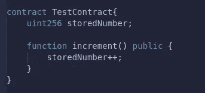
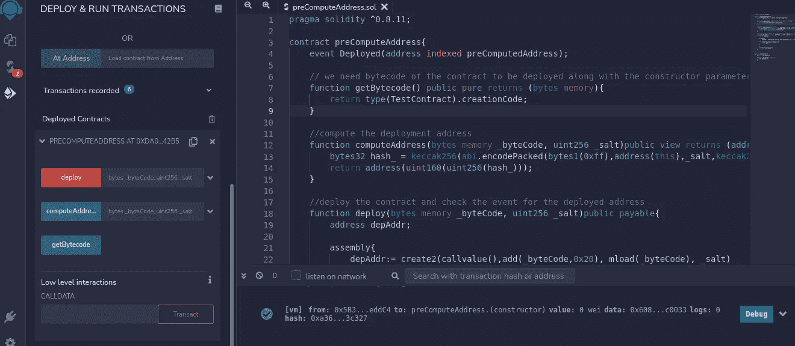
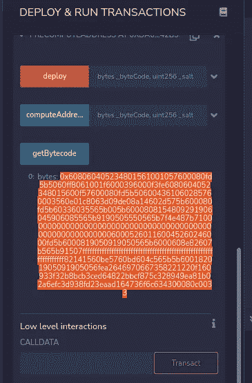
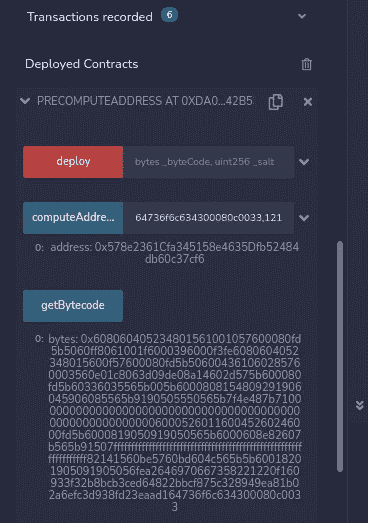
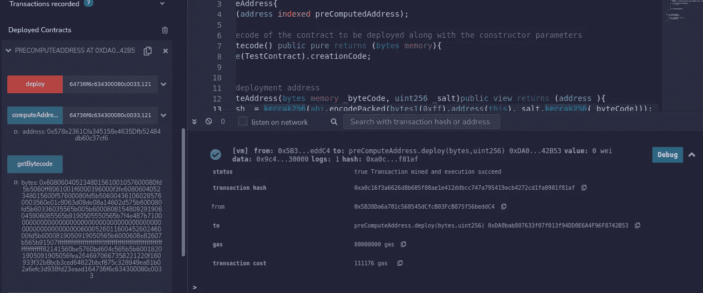
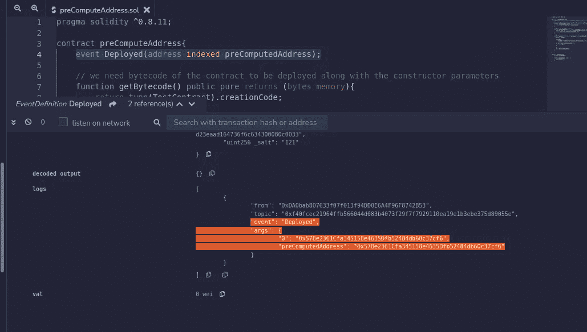

# 使用 CREATE2 预先计算合同部署地址

> 原文：<https://medium.com/coinmonks/pre-compute-contract-deployment-address-using-create2-8c01e80ab7da?source=collection_archive---------2----------------------->

在本文中，让我们看看如何在部署之前计算我们的合同在 EVM 区块链的部署地址。这里我们使用 EVM 的 CREATE2 操作码，它类似于 CREATE 操作码。

让我们部署“TestContract ”,并将部署的地址与我们预先计算的地址相匹配。所以让我们切换到[混音](http://remix.ethereum.org/)……你可以在这里查阅 Github [上的代码。](https://github.com/Vbhaskar125/DeploymentAddress-using-CREATE2)



TestContract

这是要部署的最简单的契约(注意，它没有任何构造函数参数…在本文的后面，我们将看到，如果它有构造函数参数，如何插入参数并获得字节码)

让我们创建一个名为“preComputeAddress”的契约，它预先计算地址并部署这个“TestContract”。

1.  它有一个用下面的签名计算地址的功能。它接受需要用 salt 计算地址的契约的字节码(把它想象成一个随机数)。

```
function computeAddress(bytes memory _byteCode, uint256 _salt)public view returns (address )
```

2.为了计算契约的字节码，让我们用下面的函数签名添加另一个函数。在这个函数中，我们使用“.creationCode”(查看文章末尾 runtimebytecode 和 initbytecode 之间的区别。creationcode 与 initbytecode 相同)

```
function getBytecode() public pure returns (bytes memory)
```

3.最后，我们将部署我们的契约，并用部署的地址发出一个事件

```
function deploy(bytes memory _byteCode, uint256 _salt)public payable
```

事件签名

```
 event Deployed(address indexed preComputedAddress);
```

让我们在 remix 中部署我们的预计算地址契约。检查这个 [Github repo](https://github.com/Vbhaskar125/DeploymentAddress-using-CREATE2) 的代码。



preComputedAddress.sol deployed

我们可以看到我们契约的三个功能暴露出来了。让我们获得我们希望部署的“测试契约”的字节码。如果契约有任何构造函数参数，它们会被编码并附加到契约的字节码中。



Highlighted is the bytecode for “TestContract”

现在让我们使用“computeAddress”函数来计算部署地址。这里它采用了上面计算的字节码和一个 salt。computeAddress()执行以下操作的 keccak256:a)从其开始部署的合同地址，b)传递的 salt(salt 只是一个使用的随机数)，c)以及字节代码的 keccak 256。这些参数以“0xff”为前缀，并按如下所示的顺序打包在一起。最后，地址是结果散列的最后 20 个字节。

```
keccak256(abi.encodePacked(bytes1(0xff),address(this),_salt,keccak256(_byteCode)));
```

remix 中的计算地址(使用 salt = 121)为“0x 578 e 2361 CFA 345158 e 4635 DFB 52484 db 60 c 37 cf 6”如下图所示。



现在让我们部署 TestContract 并检查事件日志中的地址。部署函数使用 EVM 的 CREATE2 操作码来部署合同。这将使用 EVM 汇编语言(yul)。



Event fired after the deploy function execution

让我们深入研究事件日志并找到部署地址。



deployed address in the event

正如您在代码中看到的，event Deployed 有一个名为 preComputedAddress 的索引参数。这可以在事件日志中看到。我们的预编译地址与部署的事件中的地址相同。

## 关于 CREATE2 的更多信息

创建 2 是一个 EVM 操作码。可以用 create2(v，p，n，s)调用。

其中 v 是调用中传递的以太值，p 是指向传递的字节码的起始指针，n 是字节码的大小，即从 p 到 p+n 是字节码。s 是通过的盐。这个函数返回部署的契约的地址(契约由字节码 p 到 p+n 定义)。

## 关于 initbytecode 和 runtimebytecode 的更多信息

存储在 chain 上的代码与我们在编译智能合同后得到的代码不同。

当我们将 datapayload 发送到 EVM 的一个 null/0 地址时，就会创建契约。我们发送的代码(字节码)是 init 代码，它运行并构造运行时代码。然后使用“sstore”操作码(没有构造器代码和私有变量)将该运行时代码存储在 EVM 上。因此，每当我们使用“extcodecopy”操作码获取契约代码时，都会返回 runtimebytecode。

## 进一步阅读

[](https://blog.smartdec.net/how-to-define-smart-contract-address-before-the-deploy-create2-use-case-for-decentralized-exchange-52b7daa7873b) [## 如何在加密交换的 Deploy: CREATE2 用例之前定义智能协定地址

### CREATE2 操作码是今年 2 月 28 日在君士坦丁堡硬分叉中引入的。

blog.smartdec.net](https://blog.smartdec.net/how-to-define-smart-contract-address-before-the-deploy-create2-use-case-for-decentralized-exchange-52b7daa7873b) [](https://www.youtube.com/channel/UCJWh7F3AFyQ_x01VKzr9eyA) [## 智能合同程序员

### 这个频道在开放的分散的区块链提供关于智能合同的免费教育。加入我们的冒险吧…

www.youtube.com](https://www.youtube.com/channel/UCJWh7F3AFyQ_x01VKzr9eyA) [](https://solidity-by-example.org/app/create2/) [## 使用 create 2 | Solidity by Example | 0 . 8 . 10 预计算合同地址

### 使用 create2 预计算合同地址

solidity-by-example.org](https://solidity-by-example.org/app/create2/) [](https://docs.openzeppelin.com/cli/2.8/deploying-with-create2) [## 使用 CREATE2 - OpenZeppelin 文档部署智能合同

### 操作码使我们能够预测将要部署合同的地址，而不必这样做…

docs.openzeppelin.com](https://docs.openzeppelin.com/cli/2.8/deploying-with-create2) 

> 加入 Coinmonks [电报频道](https://t.me/coincodecap)和 [Youtube 频道](https://www.youtube.com/c/coinmonks/videos)了解加密交易和投资

# 另外，阅读

*   [Bookmap 点评](https://coincodecap.com/bookmap-review-2021-best-trading-software) | [美国 5 大最佳加密交易所](https://coincodecap.com/crypto-exchange-usa)
*   最佳加密[硬件钱包](/coinmonks/hardware-wallets-dfa1211730c6) | [Bitbns 评论](/coinmonks/bitbns-review-38256a07e161)
*   [新加坡十大最佳加密交易所](https://coincodecap.com/crypto-exchange-in-singapore) | [购买 AXS](https://coincodecap.com/buy-axs-token)
*   [红狗赌场点评](https://coincodecap.com/red-dog-casino-review) | [Swyftx 点评](https://coincodecap.com/swyftx-review) | [CoinGate 点评](https://coincodecap.com/coingate-review)
*   [在印度投资的最佳密码](https://coincodecap.com/best-crypto-to-invest-in-india-in-2021)|[waz rix P2P](https://coincodecap.com/wazirx-p2p)|[Hi Dollar Review](https://coincodecap.com/hi-dollar-review)
*   [加拿大最佳密码交易机器人](https://coincodecap.com/5-best-crypto-trading-bots-in-canada) | [硬币评论](https://coincodecap.com/kucoin-review)
*   [火笔密码交易信号](https://coincodecap.com/huobi-crypto-trading-signals) | [点击查看](/coinmonks/hitbtc-review-c5143c5d53c2)