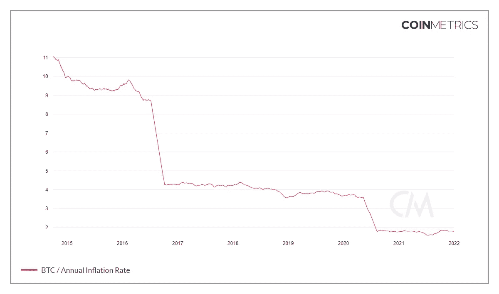
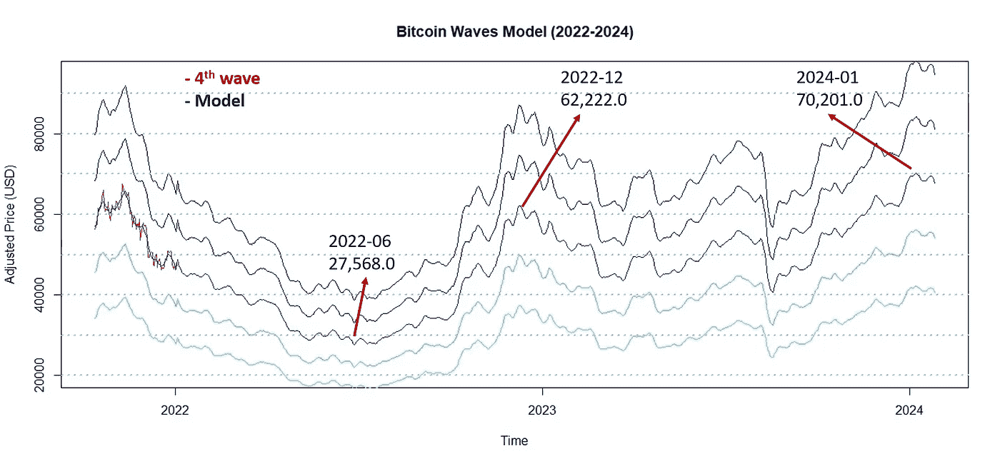
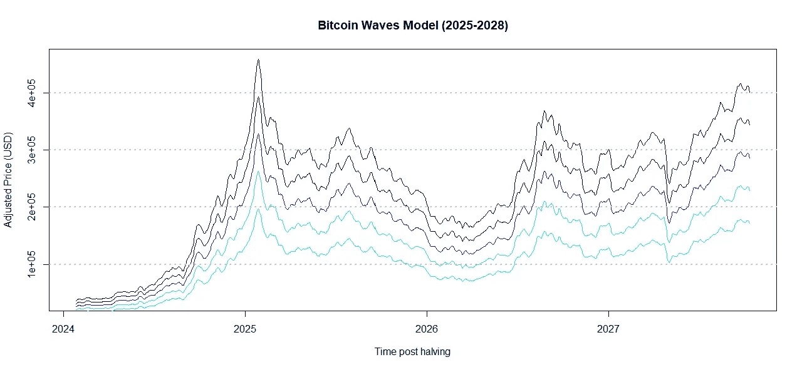
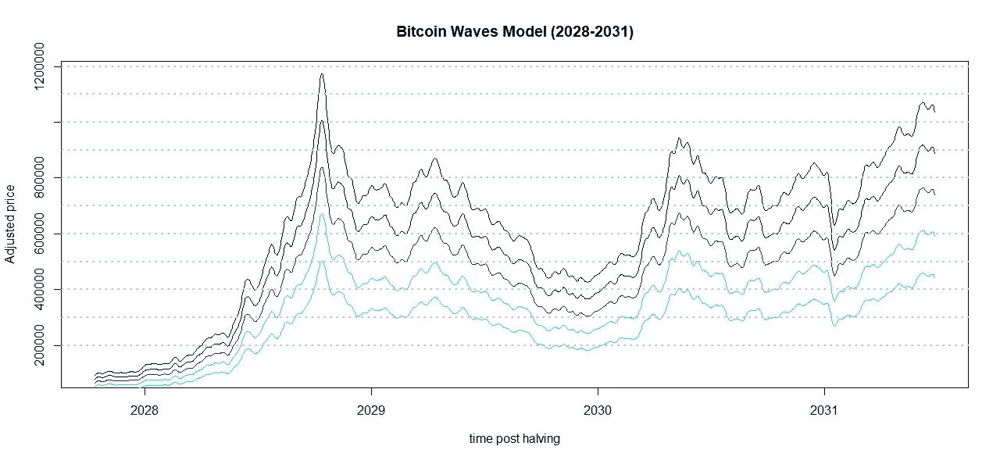
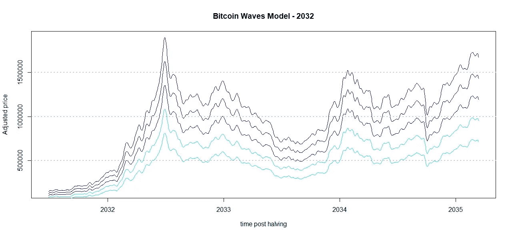

# 用比特币波动模型预测 2022-2032 年的价格走势

> 原文：<https://medium.com/coinmonks/predicting-2022-2032-price-action-with-bitcoin-waves-model-53abef08825f?source=collection_archive---------7----------------------->

## 介绍

很难想象，我们的祖先，我们的父母，我们的祖父母的所有工作都通过通货膨胀和财产权的丧失而被没收。比特币的出现通过分散决策和控制通胀来解决这一问题。

图 1 说明了比特币年通胀率减半的效应[1]。可以观察到，比特币通胀从 2020 年的 3.9%下降到 2021 年的 1.8%。

Figure 1\. Bitcoin annual inflation rate (From Coinmetrics).

距离下一个减半大约还有 815 天[2]，届时通货膨胀率将在 2024 年降至 0.8%，比特币将成为世界上通货膨胀率最低的经济体之一[3]。我们这一代人有一个被我们的祖先偷走的大好机会。

因此，在本研究中，比特币波动模型被应用并优化用于预测 2022 年至 2032 年之间的比特币价格。该模型通过将未来波浪近似为先前波浪的线性组合来预测下一个波浪[4，5]。

**最坏的情况**

第一波、第二波和第三波的线性组合产生了图 2 所示的当前场景(2022 年)的模型。另一方面，这波浪潮已经面对影响整个世界经济的新冠肺炎疫情，因此影响所有的预测模型。尽管如此，该模型显示出良好的性能特征(余弦相似性为 87.6%)。

Figure 2\. Bitcoin Waves Model (2022–2024).

在最糟糕的情况下，如果疫情持续存在，预计 2022 年 1 月后比特币的最低价格日期将是 2022 年 6 月，大约是减半后的 778 天。不过，价格将在 2022 年 12 月反弹，达到 62k。

**最佳场景**

2024 年减半后，比特币年通胀率将降至 0.8%，比特币波浪模型为比特币创造者设计了阳光灿烂的日子。价格可能在 2025 年 1 月达到 32.8 万英镑(图 3)。

Figure 3\. Bitcoin Waves Model (2025–2028).

最后，长期持有人将在 2028 年找到 847k 的价格(图 4)，在 2032 年找到 14m 的价格(图 5)。

Figure 4\. Bitcoin Waves Model (2028–2031).

Figure 5\. Bitcoin Waves Model (2032).

**结论**

本报告中应用的方法是通用的、快速的和简单的。比特币波动模型提供了一个有趣的调整，并允许我们使用线性组合来想象比特币的可能未来。如果模型是对的呢？

如果您喜欢这些内容，请考虑以下建议:

BTC:BC 1 qljlmuwq 9 gyvn 7 uhvwwypsj 4x 8 hcetuzhw 9 quh 0

BNB:bnb 159am 7 huy 53mg 7 sygnklrtxkahkdk 2 qxzmnk 0 GW

**致谢**

作者感谢中本聪、哈尔·芬尼、尼克·萨博、赵昌鹏、萨布丽娜·莫赖斯和安德烈·福斯。

**参考文献**

1.[网络图|硬币指标](https://charts.coinmetrics.io/network-data/)

2.[https://www.buybitcoinworldwide.com/pt/bitcoin-clock/](https://www.buybitcoinworldwide.com/pt/bitcoin-clock/)

3.[https://tradingeconomics.com/country-list/inflation-rate](https://tradingeconomics.com/country-list/inflation-rate)

4.[比特币浪潮:价格建模的线性组合| Edgar mora es | coin monks | 2021 年 3 月| Medium](/coinmonks/bitcoin-waves-a-linear-combination-for-price-modeling-2b89f72e552d)

5.

> 加入 Coinmonks [电报频道](https://t.me/coincodecap)和 [Youtube 频道](https://www.youtube.com/c/coinmonks/videos)了解加密交易和投资

## 另外，阅读

*   [分散交易所](https://blog.coincodecap.com/what-are-decentralized-exchanges) | [比特 FIP](https://blog.coincodecap.com/bitbns-fip) | [Pionex 评论](https://blog.coincodecap.com/pionex-review-exchange-with-crypto-trading-bot)
*   [用信用卡购买密码的 10 个最佳地点](https://blog.coincodecap.com/buy-crypto-with-credit-card)
*   [OKEx 评论](/coinmonks/okex-review-6b369304110f) | [Kucoin 交易机器人](/coinmonks/kucoin-trading-bot-automate-your-trades-8cf0ca2138e0) | [期货交易机器人](/coinmonks/futures-trading-bots-5a282ccee3f5)
*   [AscendEx Staking](https://blog.coincodecap.com/ascendex-staking)|[Bot Ocean Review](https://blog.coincodecap.com/bot-ocean-review)|[最佳比特币钱包](https://blog.coincodecap.com/bitcoin-wallets-india)
*   [霍比审核](https://blog.coincodecap.com/huobi-review) | [OKEx 保证金交易](https://blog.coincodecap.com/okex-margin-trading) | [期货交易](https://blog.coincodecap.com/futures-trading)
*   [Godex.io 审核](/coinmonks/godex-io-review-7366086519fb) | [邀请审核](/coinmonks/invity-review-70f3030c0502) | [BitForex 审核](https://blog.coincodecap.com/bitforex-review)
*   [Crypto.com 费用](/coinmonks/binance-fees-8588ec17965) | [僵尸加密审查](/coinmonks/botcrypto-review-2021-build-your-own-trading-bot-coincodecap-6b8332d736c7) | [替代品](https://blog.coincodecap.com/crypto-com-alternatives)
*   [有哪些交易信号？](https://blog.coincodecap.com/trading-signal) | [Bitstamp vs 比特币基地](https://blog.coincodecap.com/bitstamp-coinbase) | [买索拉纳](https://blog.coincodecap.com/buy-solana)
*   [ProfitFarmers 点评](https://blog.coincodecap.com/profitfarmers-review) | [如何使用 Cornix 交易机器人](https://blog.coincodecap.com/cornix-trading-bot)
*   [my constant Review](https://blog.coincodecap.com/myconstant-review)|[8 款最佳摇摆交易机器人](https://blog.coincodecap.com/best-swing-trading-bots)
*   [MXC 交易所评论](/coinmonks/mxc-exchange-review-3af0ec1cba8c) | [Pionex vs 币安](https://blog.coincodecap.com/pionex-vs-binance) | [Pionex 套利机器人](https://blog.coincodecap.com/pionex-arbitrage-bot)
*   [我的密码交易经验](/coinmonks/my-experience-with-crypto-copy-trading-d6feb2ce3ac5) | [比特币基地评论](/coinmonks/coinbase-review-6ef4e0f56064)
*   [CoinFLEX 评论](https://blog.coincodecap.com/coinflex-review) | [AEX 交易所评论](https://blog.coincodecap.com/aex-exchange-review) | [UPbit 评论](https://blog.coincodecap.com/upbit-review)