# 预测有情绪和没有情绪的比特币价格

> 原文：<https://medium.com/coinmonks/predicting-bitcoin-price-with-and-without-sentiment-697710760f3b?source=collection_archive---------1----------------------->

# TL；速度三角形定位法(dead reckoning)

这篇文章专注于使用深度学习模型来试验使用新闻来源预测比特币情绪，然后将该情绪应用于比特币价格预测模型，该模型使用区块链特征，如交易数量、哈希率、内存池大小等。(即不仅仅是市场价格)。然后对结果进行分析，以确定情绪对预测模型准确性的影响。如果你需要一本入门书，我在这里提供了单词嵌入、长短记忆(LSTM)网络和卷积神经网络(CNN)的简要概述。

该代码可在 https://github.com/pahurlocker/bitcoin-price-prediction 的[获得。在以后的文章中，我会写更多关于代码和模型特性的内容。Python、Tensorflow、scikit-learn、](https://github.com/pahurlocker/bitcoin-price-prediction) [Optuna](https://optuna.org/) 和 [Rubicon ML](https://github.com/capitalone/rubicon-ml) 用于实现。

***免责声明** —本文仅用于信息和教育目的，不应被视为财务建议。我没有使用这些模型的预测来做交易决定，也不建议其他人这样做。

# 介绍

预测任何金融工具的近期价格波动都是一项艰巨的任务，尤其是像比特币这样的加密货币那样波动的金融工具。单单技术分析就忽略了构成市场情绪的人类互动，而这种互动会对市场的运动产生重大影响。情绪是一个重要因素，但很难有效及时地捕捉，因为它来自许多不同的来源，并具有不同程度的影响。

衡量加密货币领域情绪的重点主要集中在不太权威的声音上，这些声音通常来自 Twitter 或 Reddit 等社交媒体平台上的各种影响者。随着加密货币成为主流，权威和可信的新闻来源将在塑造市场情绪方面发挥越来越重要的作用。这促使我尝试确定权威新闻来源的情绪对预测比特币价格的影响。下图显示了在用于训练和测试所开发模型的时间段内比特币的价格。极易波动！

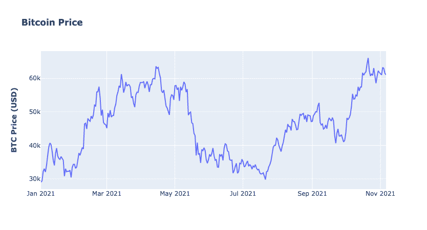

Bitcoin price between January 1, 2021 and November 5, 2021.

# 方法

这项实验通过确定是否可以通过添加情绪数据来提高仅使用技术时间序列信息的深度学习预测模型的准确性，来检查新闻文章的情绪和比特币价格之间的相互作用。这需要建立一个成功预测新闻文章情绪的模型，并将这些特征添加到预测比特币价格(回归)和比特币价格会上升还是下降(分类)的模型中。在这篇文章中，我主要关注回归模型。

平均绝对百分比误差(MAPE)用于测量回归模型的性能，准确度用于测量分类模型的性能。以下是 MAPE 和精确度的计算:

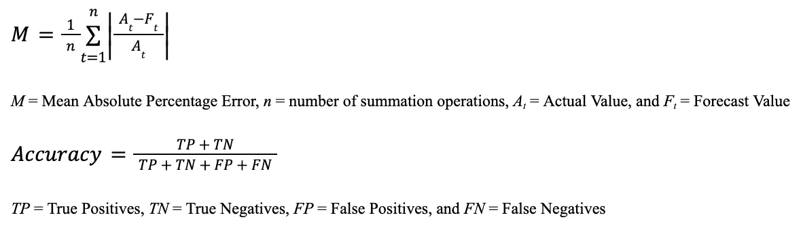

系统流程如下图所示，代码可在[https://github.com/pahurlocker/bitcoin-price-prediction](https://github.com/pahurlocker/bitcoin-price-prediction)获得。

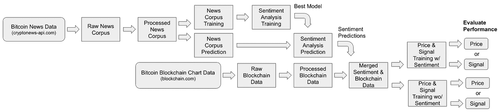

Pipeline view of Bitcoin price prediction system.

自述文件提供了有关如何通过命令行执行系统不同阶段的详细信息。数据包括在内，Optuna 用于超参数优化，因此您可以运行自己的实验，并根据需要调整模型。

# 数据和特征工程

比特币新闻数据收集自 cryptonews-api.com，时间跨度为 2021 年 1 月 1 日至 2021 年 11 月 5 日。来自 cryptonews-api.com 的信息仅提供文章摘要，因此进一步的信息是使用 Python 报纸库搜集的。

最初的语料库包括该时间段的 23，912 条记录。福布斯、美国消费者新闻与商业频道电视台、比特币、雅虎财经、彭博市场和财经、路透社、福克斯商业、彭博科技、Coindesk 和美国消费者新闻与商业频道的文章都被保留为新闻来源，导致语料库中共有 16，162 篇文章。训练集由两个特征组成，全文文本和极性(0 表示负面，1 表示正面)。使用 80%的训练集和 20%的测试集来拆分数据。

出于价格和信号预测的目的，从 Blockchain.com 收集了比特币区块链信息。Blockchain.com API 拥有丰富的市场数据，分为四类:货币统计、市场信号、区块详情、挖掘信息和网络活动。这些指标每天都有，检索时间与新闻文章相同，从 2021 年 1 月 1 日到 2021 年 11 月 5 日。两种类型的技术指标，简单移动平均线和指数移动平均线，是使用每日比特币价格计算的。计算了 10 天和 50 天简单和指数移动平均价格的特征。

情感分析模型在 2021 年 1 月 1 日至 2021 年 6 月 6 日之间的新闻语料数据上进行训练。然后使用训练好的情感模型预测 2021 年 6 月 7 日至 2021 年 11 月 5 日新闻的情感(1 代表积极，0 代表消极)。然后，对每篇新闻文章的预测情绪进行每天的平均，并与同一时期的比特币区块链数据合并。这些数据为比特币价格回归和分类模型提供了基础，训练集和测试集各占 70%和 30%。

# 实验

本节详细介绍了用于情绪分析和比特币价格预测和分类的数据准备、系统和模型，以及每个阶段的结果。各种深度学习架构被用于情绪分析、价格和信号预测，这些可以在代码库中更详细地查看。支持该实验的系统具有以下流程:

*   检索并保存原始新闻语料库和区块链数据(2021 年 1 月 1 日至 2021 年 11 月 5 日)
*   将训练数据分段用于情感分析，并执行 80/20 训练/测试分割(2021 年 1 月 1 日和 2021 年 6 月 6 日)
*   使用超参数优化训练情感模型
*   坚持表现最佳的情感模型
*   预测每天(2021 年 6 月 7 日和 2021 年 11 月 5 日)的新闻语料库和平均值的情绪
*   通过将预测的情绪值与区块链数据合并，准备用于价格回归和分类的训练数据，并执行 80/20 训练/测试分割(2021 年 6 月 7 日和 2021 年 11 月 5 日)
*   使用带有和不带有情绪数据的超参数优化来训练价格回归和分类模型，以确定对模型准确性的影响

# 情感分析

## 数据准备

为了准备用于情感分析的数据，所有单词都被转换为小写，并且数字、标点符号和停用词都被删除。Keras tokenizer 用于将文本转换为向量，并填充长度为 100 的序列。记号赋予器被保存为 pickle 文件，以便在稍后阶段使用训练好的模型进行预测。使用 80%的训练集和 20%的测试集来拆分数据。

## 深度学习模型

LSTM 和 CNN 模型的第一层利用嵌入层。每个嵌入层的词汇大小设置为 10，000，输入长度为 100，这与每个序列的填充相匹配。嵌入层每次都结合 LSTM 和 CNN 模型进行训练。每个模型的最终层利用具有 1 个单位和 sigmoid 激活的致密层。使用二进制交叉熵作为损失函数，使用准确度来衡量模型的性能。

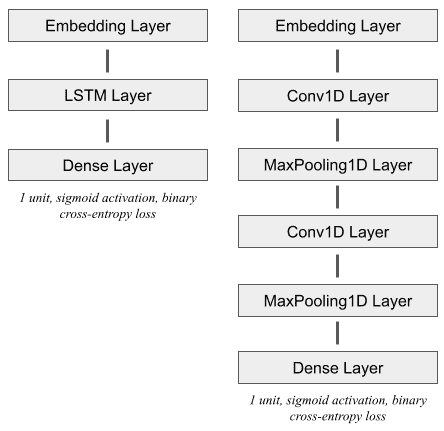

Sentiment analysis model architectures.

# **价格和信号预测的深度学习模型**

## 数据准备

为了准备回归和分类模型的数据，使用时间步长 *t* 和特征 *f* 将数据整形为序列 *S* ，如下图所示。数据准备过程产生*天数* - *t-* 1 序列 *S* 。有 20 个 *f* 和用于回归的目标变量价格，21 个 *f* 和用于分类的目标变量信号。因此，每个 *f* 都包含在长度为 20 或 21 的每日值向量中。当添加情感特征时，有 21 个和 22 个特征用于回归和分类。实验值为 5、10 和 20 的 *t* 的数量决定了每个时间步中包含多少个大小为 *f* 的特征向量。每个 *S* 或*S【I】*中有 *t* 个特征向量。

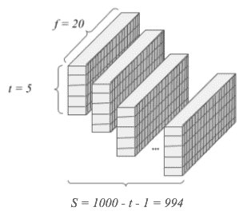

Example structure of data processed with 5 time steps *t* into 994 sequences *S* with 20 features *f* in each daily vector.

第 t + 1 天的价格或信号是通过使用前 t 天的特征向量来预测的。例如，当为回归模型选择 5 天时间步长时，第 6 天之前的 5 个特征向量( *t* +1)用于预测第 6 天的价格。使用 70%的训练集和 30%的测试集来拆分数据。使用 scikit-learn 的最小-最大标度库对数据进行归一化。

## 深度学习模型

每个模型中的层数保持不变，因为早期的实验表明，额外的层数会由于过度拟合而对模型性能产生负面影响。RNN 由单个 LSTM 输入层、泄漏 ReLu 激活层、下降层和具有一个输出单元的密集层组成。CNN 由单个二维卷积层、平坦层和具有一个输出单元的密集层组成。线性活化用于回归的最终致密层，而 sigmoid 活化用于分类。损失函数对于回归是均方误差，对于分类是二元交叉熵。除了这两个模型之外，还开发了各种其他模型体系结构，每个模型的结果将在下面提供。

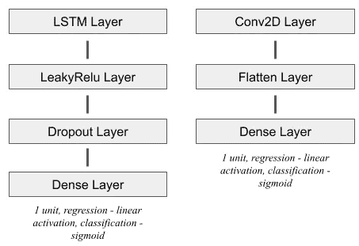

Bitcoin price prediction model architectures.

# 实验结果

## 情感分析实验结果

使用超参数优化对各种长短期记忆(LSTM)和卷积神经网络(CNN)模型架构执行实验。下表中的结果表明，表现最好的 CNN 模型略微优于表现最好的 LSTM 模型。CNN 模型被选择用于向比特币价格回归和分类模型添加情绪特征。

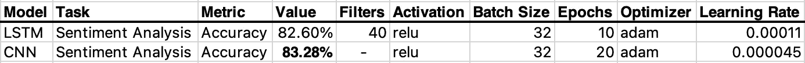

Best experiment results for sentiment analysis models with hyperparameter optimization.

下图描绘了比特币的价格和表现最好的 CNN 模型预测的情绪。一天的平均情绪值在 0.3 到 1 之间。这些值被添加到区块链图表数据中，作为一个称为极性的特征。请注意，情绪值和比特币价格具有相似的波动模式。在大部分时间里，市场情绪也趋于 0.5 及以上。

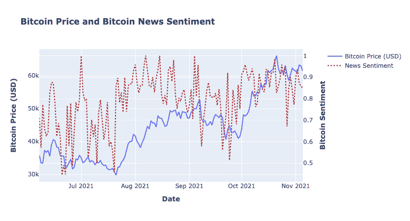

Bitcoin price and news sentiment between June 7, 2021 and November 5, 2021.

下图显示了价格和用于比特币价格预测的特征之间的相关性。虽然诸如块大小和散列率之类的特征与价格有更强的相关性，但是在价格和极性之间至少有适度的相关性。所以这些模型并不完美，当然有更好的情绪模型，但是对于这个实验来说已经足够了。

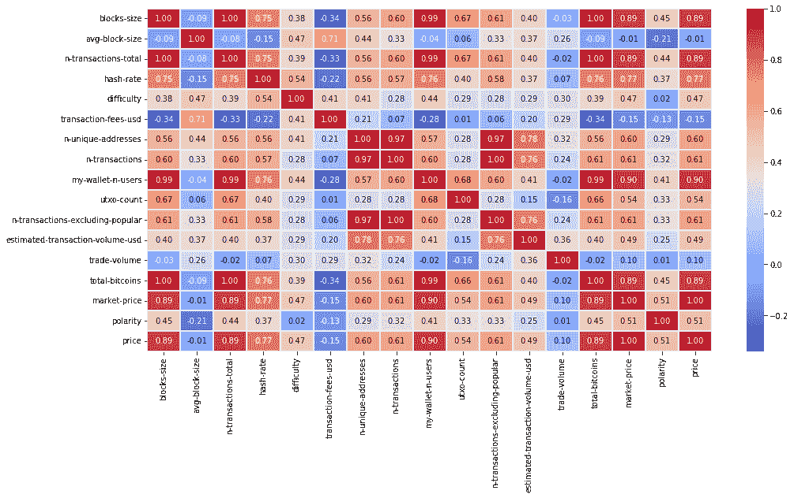

Spearman correlation of price, blockchain features and news sentiment.

## 价格回归和分类实验结果

使用超参数优化执行实验，超参数的可能值如下表所示。实验中使用了 1、5 和 10 天的预测时间范围(回想一下数据准备部分)。

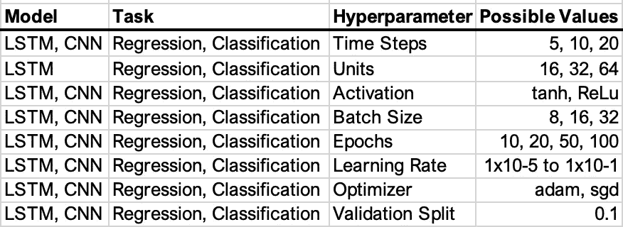

Hyperparameter settings for deep learning regression and classification models.

超参数优化(使用 Optuna)用于执行 150 项训练研究，每项研究进行 100 次试验，预测 1、5 和 10 天，总共 450 项研究。每个时间步长值(5、10、20)和模型类型(LSTM 和 CNN)的研究数量相等。下表提供了每次试验中最佳性能模型的结果(粗体值是每个预测日和时间步长的最低值，下划线值是预测日的最佳值)。按照自述文件中的说明自己运行这些实验。以下是一些主要观察结果:

**1 预测日**

*   整体最精确的模型，MAPE 为 0.0071
*   有情感的模型最准确
*   LSTM 模型有更强的结果

**5 个预测日**

*   最精确的模型的 MAPE 为 0.4853
*   没有情感的模型最准确
*   LSTM 模式表现最好，CNN 模式紧随其后

**10 天预测**

*   最精确的模型的 MAPE 为 1.0645
*   没有情感的模型最准确
*   两种类型混合使用时，CNN 模型表现最佳

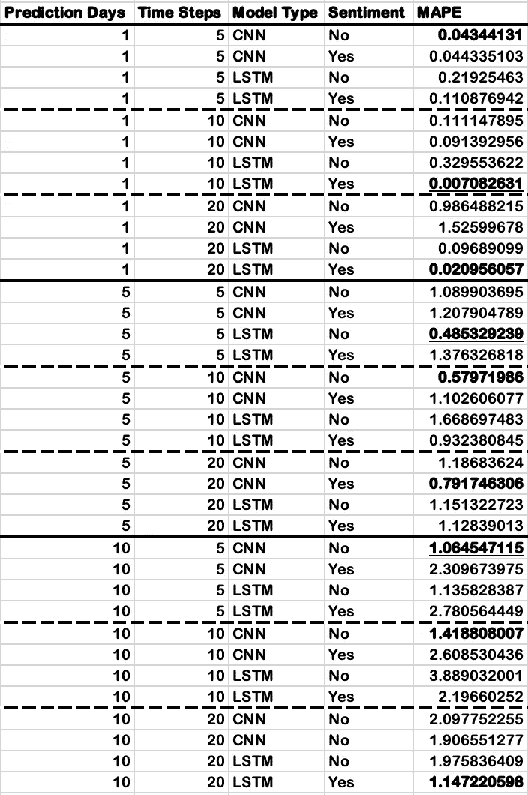

Best experiment results predicting 5 days for deep learning regression models with and without sentiment using hyperparameter optimization.

下面的可视化表明，使用新闻情绪的模型对于 1 个预测日更准确，但是它对 5 天和 10 天的模型的准确性有负面影响。

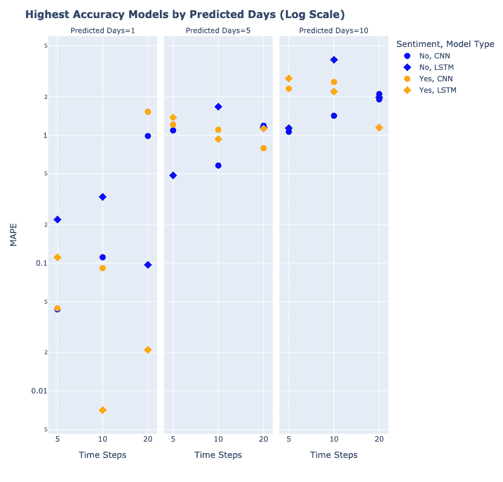

我决定观察 MAPE 在所有研究中的分布，看看我是否能证明新闻情绪对模型准确性的重要性。请记住，使用 Optuna 的研究各有 100 项试验，因此我正在查看 150 项研究中这些试验的分布情况。如果这还不清楚，请查看代码并了解更多关于 [Optuna](https://optuna.org/) 如何工作的信息。在所有预测日长的研究中，MAPE 在 0.007%到 10%之间。下图导致了以下观察结果:

*   MAPE 总体上是右倾的
*   具有 20 个时间步长的 CNN 模型对所有预测的日期都有广泛的分布，并且显然不太准确
*   具有 5 和 10 个时间步长的 CNN 模型对于所有预测的日期都是右偏的，并且更加准确
*   20 个时间步长的 LSTM 模型对所有预测日都是右偏的，这证明了它的“记忆”价值

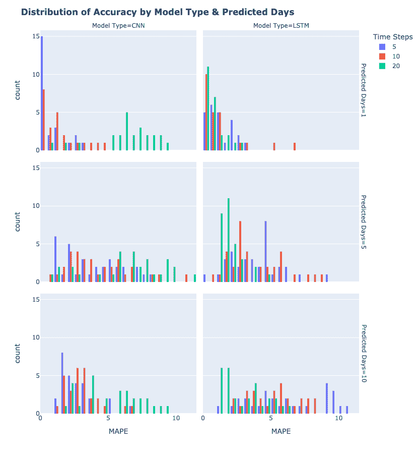

继续观察 MAPE 在所有研究中的分布，下图显示了在预测的第 5 天和第 10 天，带有情绪的模型的准确性逐渐下降。以下是主要观察结果:

*   对于 1 个预测日，有和没有情绪的模型有一个右偏
*   预测第 5 天和第 10 天的情绪模型越来越不准确
*   对于预测的第 5 天和第 10 天，不带情绪的模型比带情绪的模型更准确

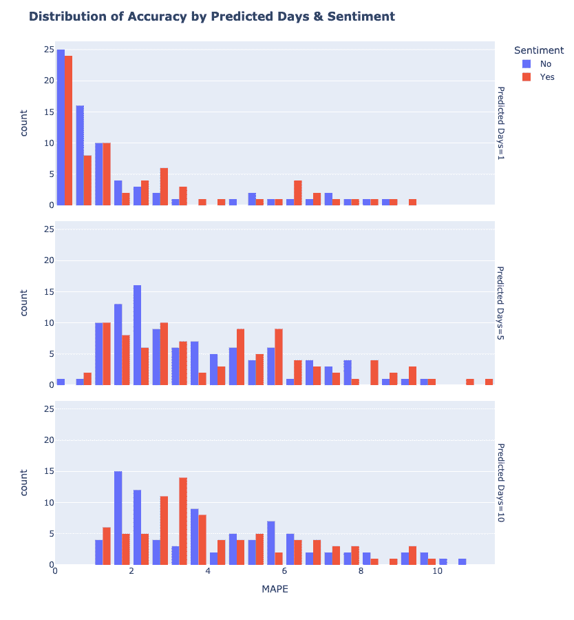

# 结论

这个实验评估了情绪对比特币价格预测模型准确性的影响。这表明新闻情绪确实对比特币价格预测模型的预测能力有影响。我得出了以下结论:

*   比特币价格和新闻情绪之间存在相关性，包含它的模型达到了最高的准确性(这里没有大的启示！)
*   新闻情绪显著提高了短期回归预测的准确性，因为它们成功地捕捉了情绪趋势(尤其是具有较大时间步长的 LSTMs)
*   新闻情绪对长期回归预测的准确性有负面影响，因为它们正在失去情绪趋势

在本实验中，新闻情绪在较短时间范围内的益处以及新闻情绪在较长时间范围内的负面影响可能归因于时间序列数据不是静态的。鉴于新闻情绪和比特币价格的高度波动性，这些趋势可能会在相对较短的时间内消失，这导致不同时间范围内模型表现的微小但一致的差异。

作为这个实验的结果，可以得出一个推论，即在任何时间范围内，有效地捕捉新闻情绪趋势作为一个特征，将导致更准确的模型。然而，需要做更多的工作来验证这一假设。该项目和以下项目代表了与该工作相关的改进和额外研究的机会:

*   为情绪分析和价格预测任务尝试不同的模型架构，以提高准确性(参见代码回购，了解我在这里没有涉及的其他模型架构)
*   引入社交媒体情绪分析，评估有无新闻情绪和社交媒体情绪对比特币价格预测的影响
*   增加培训语料库中的天数
*   引入不同的回溯测试策略，以进一步验证结论(即通过超参数调整进行前向验证)
*   训练预测 7、30、90 等的模型。未来几天验证情绪趋势的假设
*   测试交易策略中表现最好的模型，以确定现实世界的适用性

# 参考

**代码回购**:【https://github.com/pahurlocker/bitcoin-price-prediction】T2(包括数据、代码、研究结果)

【Blockchain】比特币区块链数据来源:T4

**新闻语料库数据来源**:cryptonews-api.com

Sezer、Omer Berat、Gudelek、Mehmet Ugur 和 Ozbayoglu、Ahmet Murat。**“深度学习的金融时间序列预测:系统性文献综述:2005–2019。”**arXiv.org，2019。[https://arxiv.org/abs/1911.13288](https://arxiv.org/abs/1911.13288)。

布莱恩·佩里·卡雷拉。**“情绪对比特币价格形成的影响。”**，2018。[https://sites . duke . edu/djepa pers/files/2018/06/brianperrycarrera-dje . pdf](https://sites.duke.edu/djepapers/files/2018/06/brianperrycarrera-dje.pdf)。

Lamon，Connor，Nielsen，Eric，和 Redondo，E. **“使用新闻和社交媒体情绪的加密货币价格预测。”**，2017。[http://cs 229 . Stanford . edu/proj 2017/final-reports/5237280 . pdf](http://cs229.stanford.edu/proj2017/final-reports/5237280.pdf)。

黄、辛、、、黄、唐雪娇、、Jayachander Surbiryala、Vasileios Iosifidis、、。**“基于 LSTM 的加密货币预测情感分析”【arXiv.org 】, 2021 年。[https://arxiv.org/abs/2103.14804v2](https://arxiv.org/abs/2103.14804v2)。**

卡拉维丘斯，维陶塔斯。**“利用情绪分析预测日间比特币价格走势。”** *ResearchGate* ，2017。[https://doi.org/10.1108\/JRF-06-2017-0092](https://doi.org/10.1108%5C/JRF-06-2017-0092)。

我是吴英东。**“有效预测加密货币价格的新闻情感分析”** *国际知识工程杂志* 5，第 2 期(2019):47–52。[https://doi.org/10.18178/ijke.2019.5.2.116](https://doi.org/10.18178/ijke.2019.5.2.116)。

罗格农、拉维尼娅、斯图尔特·海德和莎拉·张。**“加密货币市场的新闻情绪:与外汇市场的实证比较”** *《国际金融分析评论》*69(2020 年 5 月):101462。【https://doi.org/10.1016/j.irfa.2020.101462】T4。

Ji，Suhwan，Jongmin Kim 和 Hyeonseung Im。**“利用深度学习进行比特币价格预测的对比研究。”**数学 7，第 10 期(2019 年 9 月 25 日):898。[https://doi.org/10.3390/math7100898](https://doi.org/10.3390/math7100898)。

Sean McNally 和 Jason Roche，**《利用机器学习预测比特币价格》。** Euromicro 并行、分布式和基于网络的处理国际会议(2018 年 3 月):第 26 届。[http://norma.ncirl.ie/2496/1/seanmcnally.pdf](http://norma.ncirl.ie/2496/1/seanmcnally.pdf)

> 加入 Coinmonks [电报频道](https://t.me/coincodecap)和 [Youtube 频道](https://www.youtube.com/c/coinmonks/videos)了解加密交易和投资

# 另外，阅读

*   [如何购买 Monero](https://coincodecap.com/buy-monero) | [IDEX 评论](https://coincodecap.com/idex-review) | [BitKan 交易机器人](https://coincodecap.com/bitkan-trading-bot)
*   [CoinDCX 评论](/coinmonks/coindcx-review-8444db3621a2) | [加密保证金交易交易所](https://coincodecap.com/crypto-margin-trading-exchanges)
*   [红狗赌场评论](https://coincodecap.com/red-dog-casino-review) | [Swyftx 评论](https://coincodecap.com/swyftx-review) | [CoinGate 评论](https://coincodecap.com/coingate-review)
*   [Bookmap 评论](https://coincodecap.com/bookmap-review-2021-best-trading-software) | [美国 5 大最佳加密交易所](https://coincodecap.com/crypto-exchange-usa)
*   [如何在 FTX 交易所交易期货](https://coincodecap.com/ftx-futures-trading) | [OKEx vs 币安](https://coincodecap.com/okex-vs-binance)