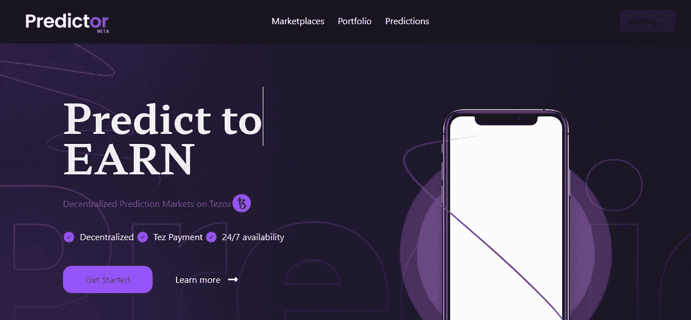
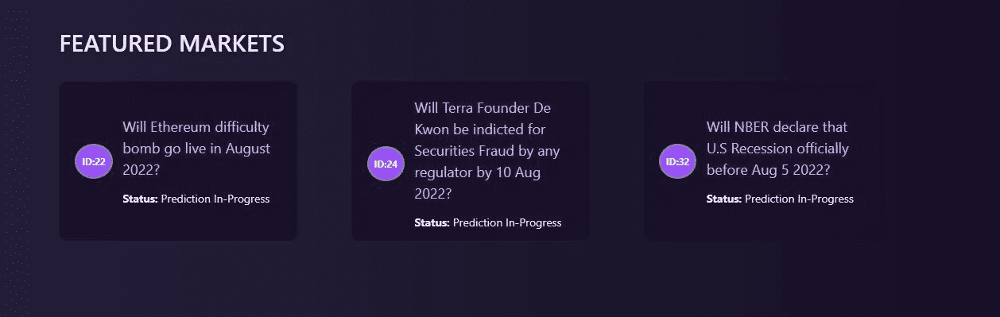
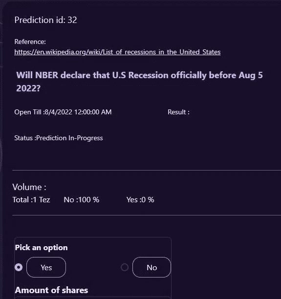
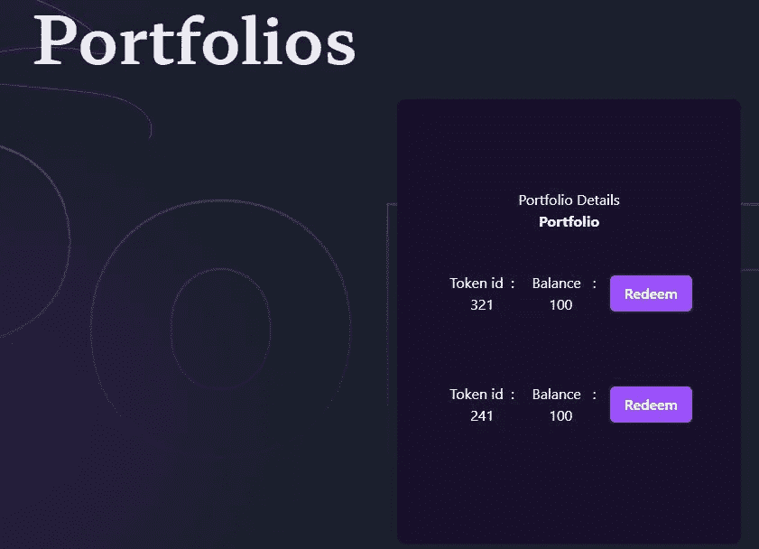

# 预言者

> 原文：<https://medium.com/coinmonks/predictor-da7efb0163ca?source=collection_archive---------32----------------------->

*Tezos 上分散的预测市场*

# 预测市场

*预测市场*是为了做出预测和/或从正确的预测中获益而创建的市场。这些市场的主要目的是预测未来事件，而合约的设计是为了方便提取预测中使用的信息。它们被用来准确预测政治竞赛、体育赛事的结果，偶尔也预测经济结果。

Predictor

# 关于预测器:

Predictor 是 Tezos 上的一个分散式预测市场，它通过一个不可信的 oracle 来预测气候变化、碳价格、天气和传染病传播等不活跃的数据。Predictor 的主要目标是民主化和分散化可操作输入的真实知识。

# 任务:

1.  成为通用预测工具，使其成为任何或所有类型预测的首选平台
2.  为信息公开的各种风险提供套期保值市场，如航班延误、天气等。
3.  让所有用户都能将知识货币化并获得声誉
4.  培养对社会和环境问题的意识，如气候变化事件、温度、碳价格、covid 计数等
5.  提供公正的价值发现。

# 设计:

*   预测市场——没有 AMM 的同注分彩机制。
*   不可信的神谕— [谢林要点 2](https://blog.ethereum.org/2014/03/28/schellingcoin-a-minimal-trust-universal-data-feed)

# 用户:

预测者计划从群众的智慧中获益。在预测者生态系统中有三组非互斥的人群。他们是创造者、预测者和报告者。

## 创作者:

创建者将被列入白名单。创建者将通过输入预测声明、选项、开始和截止日期来创建预测合同，创建预测也需要付费，以避免不必要的行为者和垃圾邮件。当预测者购买创造者创造的预测份额时，创造者获得一份佣金。

## 预测因素:

预测者才是这个平台真正的客户。他们浏览预测，并购买他们想要的预测令牌。由于预测令牌符合 FA2，预测者可以在任何 Tezos 指数中交易它们。一旦预测结果出来，他们就用代币兑换 Tez 中的中奖金额。

## 记者:

记者主要和神谕打交道。他们是帮助确定预测结果的人。白名单上的记者将 Tez 作为抵押品，一旦结果出来，他们就为每个预测的结果投票。如果他们选择的选项被宣布为预测的最终结果，他们会得到一点奖励，并且他们会因为每一个错误的报告而损失 10%的股份。在 24 小时内获得 80%记者投票的绝对多数的选项将被宣布为相应预测的结果。

# 流程:

预测者遵循同注分彩的投注方式。因此，每个选项的几率在开始时都是未知的，只有在预测结束后才能推断出来。所有事件份额有相同的价格 0.01 Tez。工作流程如下

## 提议阶段

1.  一个创造者创造了一个预言
2.  管理员可以取消一个特定的预测，如果细节不完整或误导
3.  如果没有问题，预测将开始交易

## 预测阶段

1.  预测者通过购买相应的代币(通过支付 tez)为给定的预测选择他们最喜欢的选项
2.  所有的 tez 都聚集在池子里。
3.  计划后，预测关闭。计算每个选项的几率。

## 交易阶段

1.  预测者可以在预测结束之前或之后的任何时间以任何指数交易他们的代币。
2.  预测事件发生并且结果已知。

## 报告阶段

1.  记者通过对神谕中的选项进行投票来报道结果。
2.  具有绝对多数的选项被宣布为最终结果

## 赎回阶段

1.  拥有获胜代币的预测者将其代币兑换成 tez。

# 未来的步骤

未来计划采取以下步骤

1.  与 Stablecoin(大量美元、美元兑日元、USDT 货币)集成—基于 Tezos 的 stable coin
2.  创建标量预测的选项
3.  添加仅信誉预测合同。在这里，只有不可交易/不可转让的代币，而不是 tez，将提供给获胜者，代表他们的声誉。
4.  封闭群体预测——个人和组织只在熟人或客户中对某个事件下注的一种选择。集团外的人被限制交易相同的合约。它将使预测成为现有离线博彩公司的服务概念，这些公司希望将他们的工作转移到区块链。

# 初速电流状态

Dapp 在 Tezos Mainnet 中可用。通过一个新的移动友好的用户界面，Predictor 可供用户创建和预测。

 [## 预言者

### 预测者-分散预测市场

predictor.tez.page](https://predictor.tez.page/) 

电报:[https://t.me/predictor_tez](https://t.me/predictor_tez)

推特:【https://twitter.com/DaoPredictor 

领英:【https://www.linkedin.com/company/predictor-dao/ 

> 加入 Coinmonks [电报频道](https://t.me/coincodecap)和 [Youtube 频道](https://www.youtube.com/c/coinmonks/videos)了解加密交易和投资

# 另外，阅读

*   [Bookmap 点评](https://coincodecap.com/bookmap-review-2021-best-trading-software) | [美国 5 大最佳加密交易所](https://coincodecap.com/crypto-exchange-usa)
*   最佳加密[硬件钱包](/coinmonks/hardware-wallets-dfa1211730c6) | [Bitbns 评论](/coinmonks/bitbns-review-38256a07e161)
*   [新加坡十大最佳加密交易所](https://coincodecap.com/crypto-exchange-in-singapore) | [购买 AXS](https://coincodecap.com/buy-axs-token)
*   [红狗赌场评论](https://coincodecap.com/red-dog-casino-review) | [Swyftx 评论](https://coincodecap.com/swyftx-review) | [CoinGate 评论](https://coincodecap.com/coingate-review)
*   [投资印度的最佳密码](https://coincodecap.com/best-crypto-to-invest-in-india-in-2021)|[WazirX P2P](https://coincodecap.com/wazirx-p2p)|[Hi Dollar Review](https://coincodecap.com/hi-dollar-review)
*   [加拿大最佳加密交易机器人](https://coincodecap.com/5-best-crypto-trading-bots-in-canada) | [库币评论](https://coincodecap.com/kucoin-review)