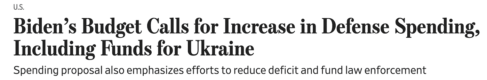

# 为新冷战做准备——对紧缩的重新解读

> 原文：<https://medium.com/coinmonks/preparation-for-the-new-cold-war-a-reinterpretation-of-austerity-970457982114?source=collection_archive---------50----------------------->

**1。行情更新:**

首先，让我们简要回顾一下我在之前关于俄罗斯-乌克兰危机的文章中的观点(链接如下):

[*https://medium . com/@ mwk 300/1-俄乌-危机-视角-框架-美中-贸易战-77b21b2d42be*](/@mwk300/1-russia-ukraine-crisis-view-in-the-framework-of-the-us-china-trade-war-77b21b2d42be)

1.  短期来看，战争平息后市场可能会反弹。
2.  从中期来看，在美联储的鹰派立场改变之前，市场将继续看跌。
3.  从长期来看，美联储再次转向鸽派后，市场将上涨。

两个星期过去了，我认为这个场景仍然有效。目前几乎没有迹象表明战争已经结束，但自 3 月中旬 FOMC 以来，美国市场已经飙升了 10%。这说明战争对市场的负面影响得到了一定程度的缓解。

那么，这是新一轮牛市的前兆，还是只是暂时的反弹？我把我的钱押在后者上。

过去两周的买家可分为五类:

1.  一群人相信美联储最终会像面对经济放缓时一样放松腰带。
2.  一群认为通货膨胀是暂时的，一旦油价和供应链问题得到解决，通货膨胀就会得到抑制的人。
3.  TINA 集团:在这个低息时代，除了股票别无选择。
4.  一群愚蠢的人，他们从来没有感觉到市场机制的变化，仍然沉浸在 20-21 牛市的荣耀中。
5.  每季度重新平衡投资组合的机构投资者(解释:资产配置比例通常在许多机构中规定。例如，60/40 基金必须将 60%的资产投资于股票，40%投资于债券。重新平衡通常每季度进行一次，大约在 1 月 1 日、4 月 1 日、7 月 1 日和 10 月 1 日进行。由于股价在 3 月中旬大幅下跌，投资组合比例应该是 55/45，而不是 60/40。他们应该在 4 月 1 日左右买入股票再次达到 60/40。).

第四组和第五组没什么好谈的。对于第 2、3、4 组来说，也许是在 FOMC 之后立即买入的正确时机。然而，在我看来，似乎仍然需要很多时间，直到一切都按照他们的设想发展。

为了理解这次反弹的特点，我想强调的是，现在市场仍然处于“紧缩预期正在转变为信心”的阶段。也就是说，流动性的实际吸收还没有开始。溢出的干粉仍在小心翼翼地寻找藏身之处。

因此，我认为，这种大幅飙升只不过是一个消化过剩流动性的过程。因此，在美联储紧缩政策结束之前，我仍然对市场刷新历史高点持负面看法。

**2。冷战的回归——紧缩的另一个催化剂。**

根据我之前的文章，美联储突然宣布紧缩的原因是:

1.  抑制通货膨胀
2.  攻击中国

在这篇文章中，我想补充第三个原因:为新冷战时代做准备。

拜登政府昨天提议将国防预算增加 10%。这个数字从去年 12 月提案中的 5 个上升到了 10 个。关于这一点，我想分享一篇来自《福布斯》的丰富文章(链接如下):

 [## “和平红利”的终结对美国人意味着什么

### 在他的国情咨文中，拜登总统强调了俄罗斯入侵乌克兰以及美国及其北约如何…

www.forbes.com](https://www.forbes.com/sites/nicksargen/2022/03/03/what-the-end-of-the-peace-dividend-will-mean-for-americans/?sh=31674e8f7a8f) 

让我复制并粘贴文章中的一段:

> “在 20 世纪 80 年代，里根总统建立了美国的防御能力，以遏制苏联扩张的威胁。他的目标是在军事上超过苏联，因为他知道苏联的经济无法与美国的实力相匹敌。结果是美国军费开支相对于整个十年的联邦总支出稳步增长。里根之所以能够做到这一点，是因为保罗·沃克尔(Paul Volcker)领导下的美联储成功地控制住了通胀。”

乌克兰危机不仅仅是一场地区冲突，而是给长期处于和平状态的人们敲响了警钟。第二个军事力量在西方世界的门槛上入侵该国，而不是似乎总是有冲突的中东。这一象征性事件标志着美中俄霸权战争的新阶段，显示出引发每个国家更大国防预算的迹象。美国军备增加 10%可能是个开始。如果这种趋势持续下去，通胀将不可避免地受到压力，因为军备的增加等同于更多的政府支出。

这就需要鲍威尔再考虑一个变量。沃尔克通过将利率提高到近 20%来控制通货膨胀，从而帮助里根在冷战期间进行军事扩张。鲍威尔会重蹈前任的覆辙吗？这可能是投资需要考虑的另一个因素。

更进一步，我们也可以用这个框架来理解美联储在 12 月突然转向鸽派。去年底一句“加息”从一个人鸽口中说出，让市场震惊。

乌克兰事件在二月份开始成为焦点。然而，我们应该记住，在此之前几个月，军事紧张局势已经浮出水面。11 月 28 日，92000 名俄罗斯军队已经集结在乌克兰边境。12 月 7 日，拜登向普京发出公开警告。所以，考虑到这一背景和当前形势，美联储之所以在去年底转向鹰派，是因为它预测到通过美国情报机构入侵乌克兰的可能性很高，并开始为可能的通胀而锁定和加载。

**3。那么，下一步是什么？**

四月即将来临。是的。又一个财报季即将到来。未来一个月市场最具决定性的因素将是收益报告。之后，在 5、6 月份市场重心向 FOMC 转移的过程中，股市的波动性会再次上升。

让我们继续关注，看看它如何发展。

***欢迎反馈！***

> 加入 Coinmonks [电报频道](https://t.me/coincodecap)和 [Youtube 频道](https://www.youtube.com/c/coinmonks/videos)了解加密交易和投资

# 另外，阅读

*   [如何使用 Solidity 在以太坊上创建 DApp？](https://coincodecap.com/create-a-dapp-on-ethereum-using-solidity)
*   [币安 vs FTX](https://coincodecap.com/binance-vs-ftx) | [最佳(SOL)索拉纳钱包](https://coincodecap.com/solana-wallets)
*   [如何在 Uniswap 上交换加密？](https://coincodecap.com/swap-crypto-on-uniswap) | [A-Ads 审查](https://coincodecap.com/a-ads-review)
*   [加密货币储蓄账户](/coinmonks/cryptocurrency-savings-accounts-be3bc0feffbf) | [YoBit 评论](/coinmonks/yobit-review-175464162c62)
*   [Botsfolio vs nap bots vs Mudrex](/coinmonks/botsfolio-vs-napbots-vs-mudrex-c81344970c02)|[gate . io 交流回顾](/coinmonks/gate-io-exchange-review-61bf87b7078f)
*   [CoinFLEX 评论](https://coincodecap.com/coinflex-review) | [AEX 交易所评论](https://coincodecap.com/aex-exchange-review) | [UPbit 评论](https://coincodecap.com/upbit-review)