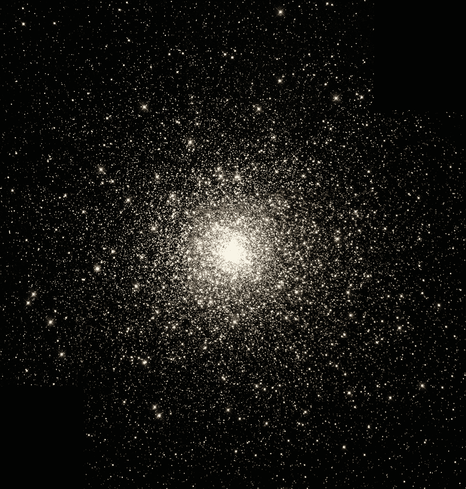

# 为宇宙生态系统中的原子爆炸做准备

> 原文：<https://medium.com/coinmonks/prepare-for-an-atomic-explosion-in-the-cosmos-ecosystem-385e874990ce?source=collection_archive---------6----------------------->

## 这位开拓者的道路才刚刚开始

[https://unsplash.com/photos/OVO8nK-7Rfs](https://unsplash.com/photos/OVO8nK-7Rfs)

在这篇文章中，我有 4 个想法想要传达。

首先，我想画一幅画，把宇宙放在某个历史背景下。比特币在 13 年前(2009 年)推出，以太坊在 7 年前(2015 年)推出，而宇宙在 3 年前(2019 年)推出。