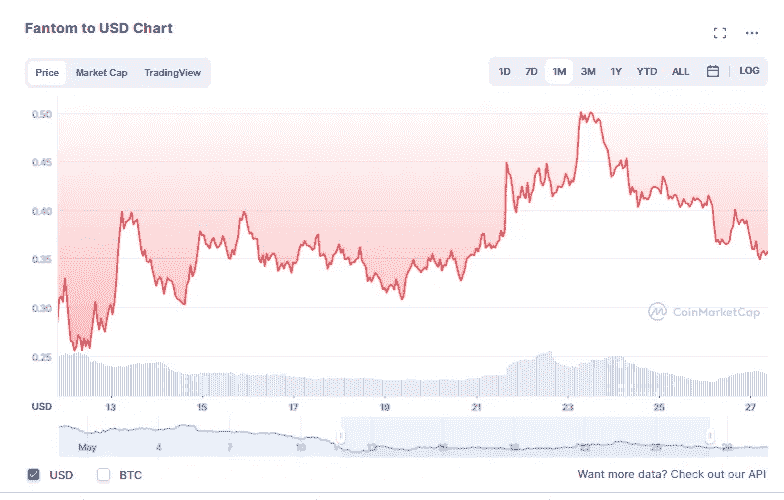
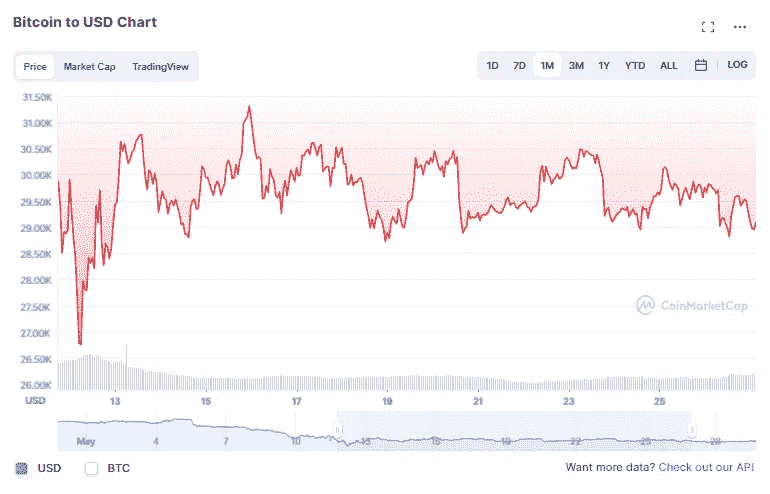
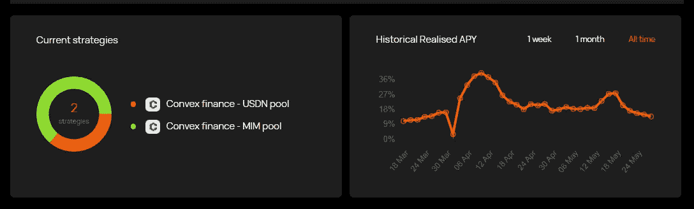
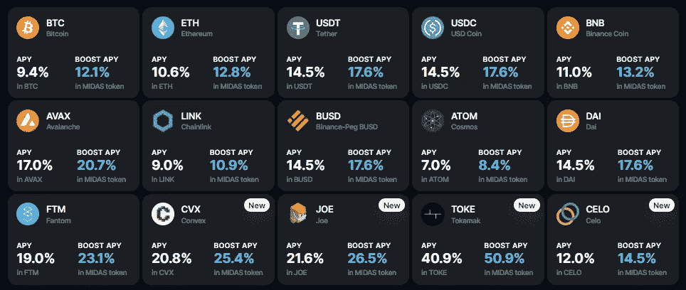

# 准备冬眠(也就是我的熊市策略)

> 原文：<https://medium.com/coinmonks/preparing-for-hibernation-a-k-a-my-strategies-for-the-bear-market-42b45ee9058?source=collection_archive---------7----------------------->

Ain’t no bull about it

大家好，像往常一样，这些都不是财务建议，只是为了娱乐和教育目的。请做你自己的研究，找到什么投资可能最适合你。

# 我们正处于熊市，对吗？

虽然我希望我是，但我不是一个技术分析的人——并不是说我不相信它，而是因为我从来没有真正花时间去理解它。我确实跟踪了许多人，他们是我反复听到的共识，即我们肯定处于熊市，熊市可能会持续几个月，如果不是几个月的话。我听说的熊市的最好指标之一可能是，不管是否有[看涨消息](https://www.cnbc.com/2022/05/26/jamie-dimons-jpmorgan-says-bitcoin-has-significant-upside-now.html)，你都会继续看到市场暴跌，这种情况一直在疯狂发生。无论如何，这篇文章的重点不是讨论市场是看涨还是看跌，而是强调一些我将采用的策略，因为我们可能会在相当长的一段时间内看跌。

# 策略一。专注于积累您的替代硬币

如果你像我一样，你可能在所谓的蓝筹股(SOL，$AVAX)或其他显示出巨大前景的股票(如$NEAR 或$RUNE)上遭受了重大损失。鉴于所有这些价格已经完全下跌，你可能仍然持有你现在的超低价硬币不想出售，因为你只是不想意识到你的损失。如果你在等待，并且在价格恢复之前不打算做任何事情，那么在你等待的时候让这些代币为你工作是有意义的，无论是通过单边下注(这样你就不会有非永久性的损失)还是加入验证器。尽管他们的网站不一定是最新的，但无论你在哪里投资，我都会定期将它与 stakingrewards.com 的[清单进行比较，看看我是否获得了最好的预期回报。](https://www.stakingrewards.com/)

# 策略二。做空过度的硬币

这是一个非常直接的方法，但是也有更多的风险。基本上，如果市场的其他部分(尤其是 BTC/瑞士联邦理工学院)保持相对平稳或下跌，而某样东西真的很强劲，那么我真的怀疑这种强劲会持续多久。以过去一周$FTM 的近期价格行为为例:

$FTM 在一周内从 0.25 美元多一点涨到了 0.50 美元，现在又回到了 0.35 美元左右。作为参考，在同一时期，BTC 的价格走势相对平稳:

因此，通过查看$FTM 泵，您可以推断出$FTM 泵的原因与整体市场情绪无关，如果您假设整体市场情绪非常悲观，那么上涨的东西最终肯定会回落是有道理的。

# 策略三。堆积现金/稳定硬币

如果我们处于长期熊市，我们很可能还没有看到底部。现在，我认为即使是最好的交易者也会同意，把握市场时机是不可能的，你可以让 rekt 试图抓住下跌的刀，但我在任何地方读到的普遍共识是，确保你手头有现金，以确保你可以购买任何可能出现的下跌，这是非常明智的。就我个人而言，我试图尽可能多地持有稳定的货币，而不是实际的美元，尽管它们可能有风险。对于 stablecoins，我的目标是努力从我的 stablecoins 上赚取更多的 APY，而不是我在当前通货膨胀率下的损失，否则对我来说不值得冒这个险，我宁愿坚持菲亚特。我看到的最好的地方？

[**《祖纳米协议》**](https://app.zunami.io/) **(目前 13.41%的对/戴)**

Zunami 是一种相对较新的协议，允许您从、或戴的存款中获得杠杆收益。现在，尽管 Zunami 已经过审计，过去有时会给出高达 40%左右的 APY 利率，但我仍不完全相信它，原因很简单，因为他们成立的时间不长，还因为他们将 USDN 作为他们的策略之一。我个人对 USDN 了解不多，只知道它是一个算法稳定币，在整个 Terra 惨败之后，我对算法稳定币有点警惕。不过很酷的是，他们已经在协议网站上将以太扫描页面链接到他们执行的策略。再说一次，只有两个月大，他们还没有通过我的寿命测试，可变利率可能会像过去一周一样继续下降。

****(目前 14.5%的对、、、戴)****

****

**如果你关注了我以前在 Midas 上的任何帖子，你可能已经知道我是一个忠实的粉丝，原因有几个——他们一直拥有任何集中式平台可用的最佳费率，并且他们已经这样做了 4 年多(在加密年中是永远的半年)。我认为 Midas 最大的缺点是不像 Zunmai，他们的策略不够透明。然而，值得称赞的是，他们现在已经在多个 ama 中表示，当他们不得不不断调整以适应市场条件和风险水平的变化时，很难保持战略的透明度。这些策略的变化也反映在他们最近的一些利率下调上，从 20%的 APY 下调到现在的 14.5%(注意，如果你想在 Midas Token 上计息，stablecoins 的利率目前为 17.6%)。)**

**还有其他好地方可以放你的马桶盖吗？当然可以。但我认为，许多这些地方要么在原生 stablecoins 中没有回报，要么没有自动复合，这最终要么给你留下一个快速贬值的非原生令牌(*参见 [$PTP](https://coinmarketcap.com/currencies/platypus-finance/) )，要么需要更多的手动工作来重新复合。**

# **策略四。BTC 靶场贸易**

**现在，这也伴随着相当大程度的风险，但如果我们真的可能会看到一个长时间的捕蟹，那么对我来说，无论给定的范围是什么，继续低买高卖都是有意义的。再一次，如果你看一下 BTC 最近的价格变动，它已经在 29k 到 30k 的范围内徘徊了相当一段时间:**

****

**因此，我已经下了一系列限价单，在 BTC 触及 29k 时买入，然后在触及 30k 时卖出。理论上，你可以用任何像螃蟹一样疯狂的令牌来做这件事，但对于 BTC，如果它最终向下突破到 25k 的范围(这很可能)，我个人不会太介意我错过了 14%的低点，因为我相信从长远来看，BTC 最终会再次达到 ATH 的水平。相反，如果我错过了 ATH，因为我卖了 30k，嗯…我最大的抱怨是我太早获利了。**

# **结论**

**听着，熊市糟透了，而且在很多时候，熊市都很无聊。我还坚信，我们还没有看到熊市的底部，但与此同时，我一直在研究和琢磨不同的方法，以潜在地利用它有多糟糕，我希望其他人也是如此。**

**你想出的策略中有没有这里没有提到的？如果是这样，我很想听听他们的故事。一如既往，感谢您花时间阅读这篇文章，请务必在 twitter 上关注我:[https://twitter.com/CryptosWith](https://twitter.com/CryptosWith)**

> **加入 Coinmonks [电报频道](https://t.me/coincodecap)和 [Youtube 频道](https://www.youtube.com/c/coinmonks/videos)了解加密交易和投资**

# **另外，阅读**

*   **[如何匿名购买比特币](https://coincodecap.com/buy-bitcoin-anonymously) | [比特币现金钱包](https://coincodecap.com/bitcoin-cash-wallets)**
*   **[币安 vs FTX](https://coincodecap.com/binance-vs-ftx) | [最佳(SOL)索拉纳钱包](https://coincodecap.com/solana-wallets)**
*   **[比诺莫评论](https://coincodecap.com/binomo-review) | [斯多葛派 vs 3Commas vs TradeSanta](https://coincodecap.com/stoic-vs-3commas-vs-tradesanta)**
*   **[Capital.com 评论](https://coincodecap.com/capital-com-review) | [香港的加密借贷平台](https://coincodecap.com/crypto-lending-hong-kong)**
*   **[如何在 Uniswap 上交换加密？](https://coincodecap.com/swap-crypto-on-uniswap) | [A-Ads 评论](https://coincodecap.com/a-ads-review)**
*   **[WazirX vs CoinDCX vs bit bns](/coinmonks/wazirx-vs-coindcx-vs-bitbns-149f4f19a2f1)|[block fi vs coin loan vs Nexo](/coinmonks/blockfi-vs-coinloan-vs-nexo-cb624635230d)**