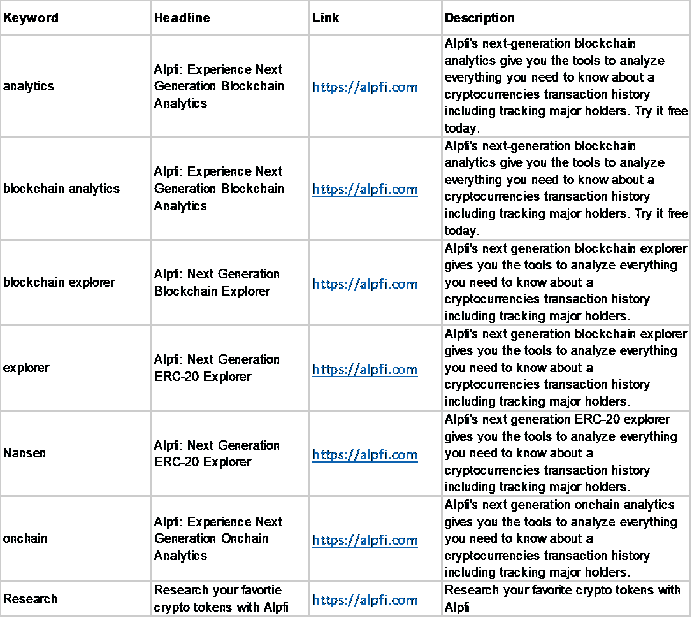
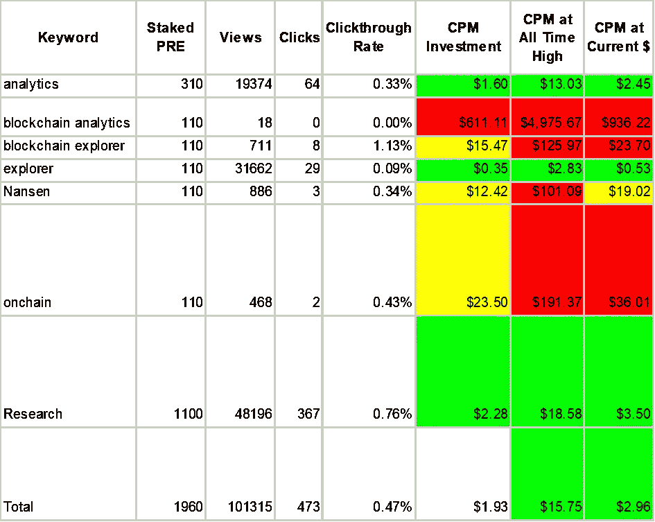
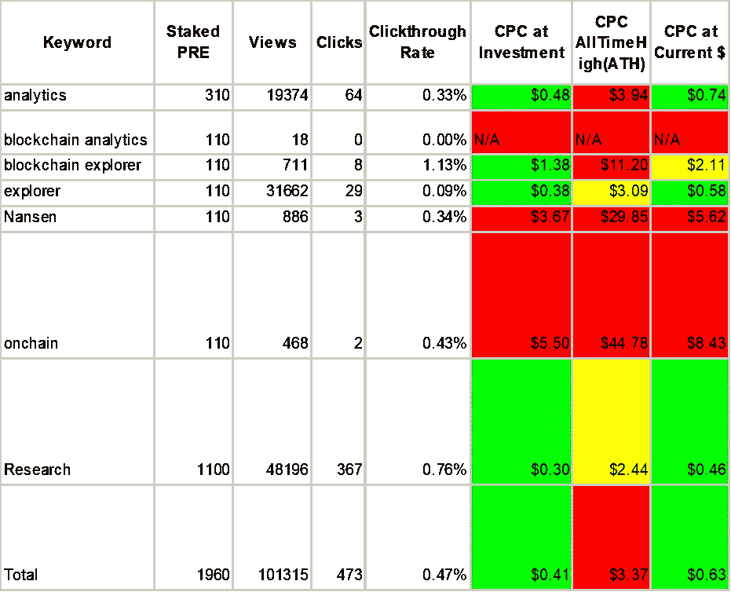

# 预研究关键词案例研究

> 原文：<https://medium.com/coinmonks/presearch-keywords-case-study-c55d6aa2ebeb?source=collection_archive---------10----------------------->

预搜索对广告商来说是一个很好的工具。搜索引擎采取了一种独特的付费广告方式。你可以为你或你的客户获得巨大的投资回报或增加你的利润。

我将解释关键字 Staking 是如何工作的，如何充分利用它，并展示一个如何使用它来推动结果的案例研究。

在我开始之前，我必须告诉你，这个博客中的所有链接都包括一个推荐代码，一旦你积极使用该平台 30 天，你和我都将获得免费 PRE。

# 什么是预搜索？

预搜索是一个分散的隐私搜索引擎。对于那些不熟悉分散化项目的人来说，它们是由多个人或组织控制资产的项目，而不是一个单一的实体。

预搜索引擎提供来自数百个不同搜索引擎的搜索结果，而不审查结果。它还通过在执行搜索之前擦除信息来保护用户数据。

您可以通过以下方式获得 PRE，即预搜索的货币:

1.  购买它
2.  使用搜索引擎
3.  运行节点

作为一名专业作家，我每天都用它来寻找由于谷歌使用的算法而可能不会在谷歌上显示的独特内容。我也使用关键字 Staking 营销业务。让我们看看如何关键字桩工程。

# 关键词标桩是如何工作的？

要在预搜索上进行关键词赌注，你需要创建一个账户，你可以在[account.presearch.org](https://account.presearch.org/signup?rid=2270247)完成。然后，您需要经历以下过程:

1.  购买预购代币
2.  去 https://keywords.presearch.org/[的](https://account.presearch.org/signup?rid=2270247)[？rid=2270247](https://keywords.presearch.org/)
3.  选择要下注的关键字
4.  写广告
5.  监控出价高于您的人的关键字

## 第一步:预先购买

可以从[https://marketplace.presearch.org/](https://marketplace.presearch.org/)[批量购买 PRE 1000？rid=2270247](https://account.presearch.org/signup?rid=2270247)

目前，你可以用不到 200 美元的美元、BTC 或瑞士法郎购买 1000 个，而去年的价格不超过 50 美元。

关键词标桩的工作方式是选择你想要使用的精确的搜索词。每个学期至少需要 100 分。

因此，1,000 PRE 将支付多达 10 个关键词，但这不像你的正常每次点击成本、每次印象成本或每次行动成本广告那样工作。

## 我用 PRE 买什么？

使用 Presearch，您可以购买 PRE，并能够显示您的广告，直到发生以下三种情况之一:

1.  有人比你出价高。
2.  你撤回或出售你的 PRE。
3.  网络实现了一种支付模式，开始耗尽你的赌注。

没错，直到 2022 年 7 月 1 日(很可能更久)，跑马圈地关键词不收取任何超过初始费用的费用。

[https://news . presearch . io/free-keyword-staking-extended-until-July-1-2022-BD 9375 ab 26 b 2](https://news.presearch.io/free-keyword-staking-extended-until-july-1st-2022-bd9375ab26b2)

他们会提前宣布未来是否会转向不同的付费模式，但现在你可以购买一些 PRE，将 PRE 放在你选择的关键词上，通过一次简单的支付获得印象和点击。

## 第二步:进入关键词锁定页面

你会想去 https://keywords.presearch.org/的[赌你的关键词。](https://keywords.presearch.org/)

## 第三步:赌注关键词:

您将单独对每个关键字下注(目前)。它将显示是否有人赌注，以及多少钱。

你必须击败任何出价，但人们可以设置通知，当他们被超越。尽量避免竞价战。他们对每个人都不好。

## 第四步:写你的广告

撰写广告包括 3 个部分:

1.  标题:最多 100 个字符
2.  描述:最多 250 个字符
3.  URL:您希望广告进入的页面

一旦你提交，你的广告将很快上线。

## 第五步:监控你的结果

你可以下载一个带有你的结果的电子表格。它目前只显示视图和点击数据，但我会争取更好的数据。也就是说，Presearch 是一个隐私搜索引擎，所以不要期望超过 CPM，CPC 和 CTR。

# 预搜索关键词锁定案例研究

一位前同事联系我，希望我能帮助 Alpfi.com 制作内容。对于那些不熟悉它的人来说，这是一个帮助人们分析项目和资产的区块链浏览器。我为他们写了几篇文章，并在 2021 年 10 月下旬开展了一场预调研广告活动，一直持续到 2022 年 5 月 20 日。

## 目标关键字

我选择了以下关键词:

1.  分析学
2.  区块链分析公司
3.  区块链探险家
4.  探险家
5.  南森
6.  onchain
7.  研究
8.  顶级持有者

除了南森(Alpfi 的竞争对手之一)和顶级持有者之外，我们保持了第一的位置。

## 广告创意

我们特意对所有东西都使用相似的广告，这样结果就不会有大的差异。以下是使用的标题。有些用于多个关键字。

我们使用了以下标题:

*   Alpfi:体验下一代区块链分析
*   Alpfi:下一代区块链探索者
*   阿尔菲:下一代 ERC-20 探索者
*   Alpfi:体验下一代在线分析
*   使用 Alpfi 搜索您最喜欢的加密令牌

这些描述包括:

我们还试图保持每个广告的描述相对相似，以尽量减少差异。以下是我们使用的描述:

1.  Alpfi 的下一代区块链分析工具为您提供了分析加密货币交易历史所需的一切信息的工具，包括跟踪主要持有人。今天免费试用。
2.  Alpfi 的下一代区块链浏览器为您提供了分析加密货币交易历史所需信息的工具，包括跟踪主要持有者。
3.  Alpfi 的下一代 ERC-20 浏览器为您提供了分析加密货币交易历史所需信息的工具，包括跟踪主要持有者。
4.  Alpfi 的下一代 onchain analytics 为您提供了分析加密货币交易历史所需信息的工具，包括跟踪主要持有人。
5.  使用 Alpfi 搜索您最喜欢的加密令牌

所有的广告都瞄准了主页[Alpfi.com](https://alpfi.com/)。总赌注低于 2，000 PRE，大多数关键字都设置在最低水平，但分析和研究的赌注更高。

# 准备好了解结果吧！

在 6 个月的时间里，有超过 100，000 次浏览和 473 次点击。这些数字并不惊人，但我们在 PRE 上花了不到 200 美元。

让我们来看看营销统计数据，使用:

1.  每印象成本(CPM)
2.  每次点击成本(CPC)
3.  点击率

## 每印象成本

CPM 通常以每 1000 次浏览的成本来衡量。我们的 CPM 是 1.94 美元，但根据你购买 PRE 的价格，类似的结果可能会产生 0.034 美元到 15.75 美元的价格，PRE 按当前价值计算大约产生 2.96 美元的 CPM。

理解这些数字本质上是理论上的是很重要的，因为我仍然持有所有这些 PRE。所以实际上，我用 100 美元获得了 200 美元的认知度，如果我今天卖出，我将从 PRE 的销售中获得近 300 美元。

Coloring is how Presearch Keywords compare to CPM models.

只要你的购买价格低于 0.30 美元，你就应该有一个合理的 CPM。

研究(48k)、资源管理器(32k)和最多印象分析(19k)。其余的每个都不到 1k。

## 每次点击成本

大多数数字营销者想知道的下一个营销行为是每次点击的成本。换句话说，让别人访问你的页面要花多少钱？

它花了我们大约 0.42 美元/点击，今天的价值可能在 0.64 美元左右(仍然值得尊敬)。在整个加密行业，任何低于 0.45 美元的东西都会产生比谷歌 1.85 美元更好的回报。

这些数字还是理论上的 CPC，因为我还有 PRE。我实际上获得了 193.93 美元的免费点击。

Coloring is compared to $1.85 Crypto Industry for Google PPC ads

研究(367)、分析(64)和探索者(29)获得了最多的点击。其他的都是个位数。

## 再来看点击率。

点击率就是点击率/浏览量。我们的结果是:

1.  分析:0.33%
2.  区块链分析:0
3.  区块链探索者:1.13%
4.  探险家:0.09%
5.  南森:0.34%
6.  环比:0.43%
7.  研究:0.76%
8.  总体:0.47%

点击率最高的是低容量，但也是表现最好的搜索之一的变体。“研究”一词是唯一一个表现好于平均水平的指标。

不幸的是，与其他广告相比，这些点击率相当低，但这在项目的初期是意料之中的。如果真的钱可能会损失，它们也会被不同地管理，因为我不会继续把钱扔在表现不佳的关键词上。

## 收益和损失的影响

作为企业所有者，您可能会经历加密资产的长期或短期收益，这将在您的投资回报中发挥作用。你应该向税务专家咨询如何最好地管理这些。

我无权提供投资建议。你做的任何投资决定都是风险自担。这篇文章的重点是营销的好处。为了获得最佳回报，我通常会在 52 周价格区间的低端寻找项目。

案例研究完成后，投资回报率为:

初始成本:196 美元

## 退货:

1.  200 美元的知名度
2.  193.93 美元的点击量
3.  PRE 值增加了 98 美元

总回报:491.93 美元+196 美元(初始投资)= 687.93 美元

净资产收益率:3.51

实际上，一个良好的广告可以在密码行业的预搜索关键词上产生有效的收益。如果价格回到 ATH，ROAS 将上升到 10.21。

对于那些很早就开始关键字赌注的人来说，他们可以看到更大的回报，因为 PRE once 的价值低于 1 美分，并且有更长的赌注期来赚取点击量。

我强烈建议至少在他们实施基于消费的广告模式之前，在预搜索上营销你的业务。即使在他们实施 CPM 或 CPC 模式后，我怀疑你会看到可观的投资回报。

## 这项研究的局限性。

这些搜索不到当时预搜索量的 1/10，000，并且集中在加密行业的特定部分。不能假设所有的搜索词都会产生可比较的结果。

我没有和 Alpfi 团队保持联系，所以我不能公布收入数字。我正在运行的另一个广告已经有了 6 倍的广告支出回报，一周内有 43 次浏览、5 次点击和 1 次购买。

# 结论

根据我的发现，任何企业主都应该考虑投资预搜索关键字桩。我的建议是从[预搜索市场](https://marketplace.presearch.org/calculator)购买 3000 个 PRE。

用 1,000 PRE 投资 10 个关键词。然后监视他们，看他们表现如何。用另外的 2,000 PRE 投资一个节点，这将产生更多的 PRE，可用于投资额外的关键字。

如果你需要帮助管理关键词或节点，我很乐意安排一次咨询。只需接触 bboushy@presearch.fan。

> 加入 Coinmonks [电报频道](https://t.me/coincodecap)和 [Youtube 频道](https://www.youtube.com/c/coinmonks/videos)了解加密交易和投资

# 另外，阅读

*   [Capital.com 审查](https://coincodecap.com/capital-com-review) | [港加密借贷平台](https://coincodecap.com/crypto-lending-hong-kong)
*   [如何在 Uniswap 上交换加密？](https://coincodecap.com/swap-crypto-on-uniswap) | [A-Ads 审核](https://coincodecap.com/a-ads-review)
*   [WazirX vs coin dcx vs bit bns](/coinmonks/wazirx-vs-coindcx-vs-bitbns-149f4f19a2f1)|[block fi vs coin loan vs Nexo](/coinmonks/blockfi-vs-coinloan-vs-nexo-cb624635230d)
*   [本地比特币审核](/coinmonks/localbitcoins-review-6cc001c6ed56) | [加密货币储蓄账户](https://coincodecap.com/cryptocurrency-savings-accounts)
*   [什么是保证金交易](https://coincodecap.com/margin-trading) | [美元成本平均法](https://coincodecap.com/dca)
*   [支持卡审核](https://coincodecap.com/uphold-card-review) | [信任钱包 vs MetaMask](https://coincodecap.com/trust-wallet-vs-metamask)
*   [Exness 回顾](https://coincodecap.com/exness-review)|[moon xbt Vs bit get Vs Bingbon](https://coincodecap.com/bingbon-vs-bitget-vs-moonxbt)