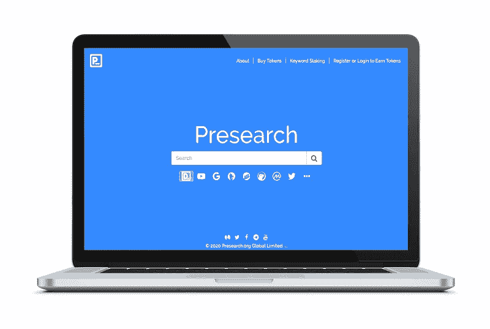
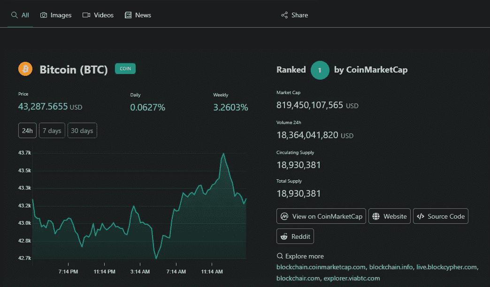
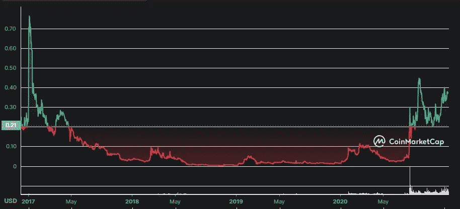

# 预先搜索奖励你的分散搜索引擎

> 原文：<https://medium.com/coinmonks/presearch-the-decentralized-search-engine-that-rewards-you-20f540357cbc?source=collection_archive---------3----------------------->

## 预搜索关注的是你的隐私。这是为了 web 3 时代。

[https://www.presearch.io/](https://www.presearch.io/)

Presearch 是第一个关注隐私的分散式搜索引擎。它由区块链技术提供动力。使用它可以获得奖励代币。还可以通过参与研究生态系统和运行节点获得 PRE 令牌。节点是运行在分布式计算机网络上的一个软件。我还会谈到预令牌。

2017 年，首席执行官科林·帕普(Colin Pape)和托马斯·勒克莱尔(Thomas LeClair)推出了 Presearch。

2021 年 9 月 1 日，预搜索被列为在英国和欧洲销售的所有新设备和工厂重置设备的默认选项。这一决定促进了 Presearch 的增长，并影响了谷歌在搜索引擎市场的主导地位。

这一决定是在与欧盟委员会就指控谷歌公司使用安卓系统加强其搜索引擎优势的长期法律斗争之后做出的。

*   当用户在预搜索上进行搜索时，他们的查询被发送到节点网关服务器。
*   网关将用户的搜索匿名化，删除他们的 IP 地址、设备、信息和任何跟踪代码，使他们的搜索匿名。
*   然后，网关根据节点的速度位置和信任级别选择节点。
*   网关然后向节点发送匿名化的搜索查询。
*   然后，该节点将搜索分发到可用的搜索索引以及许多其他资源，如外部搜索引擎、API 和数据库。
*   然后，节点检索结果并将它们返回给网关。
*   网关以预令牌的形式向节点运营商提供奖励。
*   然后，网关将结果、关键词广告和设置打包成一个结果集。关键字广告是通过使用关键字定位的广告投放的。
*   然后，网关将信息发送到预搜索 web 服务器。
*   web 服务器构建搜索用户体验，并将其返回给搜索者的 web 浏览器。最后，预搜索引擎以预令牌的形式向用户提供奖励。

这就是预搜索引擎如何提供高质量的搜索结果，同时保护和满足包括用户、节点运营商和具有预令牌的广告商在内的所有参与者的利益。

预搜索还提供了**关键字锁定**。如果你对一个给定的关键词下了最多的赌注，当有人在预搜索中搜索这个词时，你的广告就会出现。如果您选择将他们从给定的条款中删除，或者如果有人的赌注比您高，您的广告将不再显示。当你的 PRE 被标桩时，你仍然拥有它的所有权。

另一个很酷的功能是，当你搜索任何记录在 CionMarketCap 上的加密货币或代币时，你会得到如下图所示的结果。这种对加密货币和代币的支持被集成到搜索引擎中，使搜索过程更加容易。他们的数据来自 CoinMarketCap。

Me

PRE 是以太坊上的 ERC-20 代币。PRE 在 KuCoin、HitBTC、CoinEx、ProBit Global 和 1inch Exchange 上可用。它有大约 4 . 25 亿英镑的循环供应量。之前总供应量 10 亿，2020 年 4 月烧掉一半。现在预代币的**最大供应量为 500，000，000** 。

这是撰写本文时 PRE 的历史图表:

[https://coinmarketcap.com/currencies/presearch/](https://coinmarketcap.com/currencies/presearch/)

预搜索将受益于即将到来的以太坊网络 2.0 版本的更新。结果将是更便宜、更快捷的交易。此次更新也使以太坊网络更具可扩展性和稳定性。

在撰写本文时，CoinMarketCap 数据显示有 16840 名持有人。支持的钱包有信任钱包和元掩码。

2021 年 12 月 1 日，布道庆祝超过 300 万注册用户和 400 万搜索/天。

感谢阅读。您可以关注并订阅以了解最新信息。

你可以在 medium 和 Twitter 等社区上关注 Presearch。

 [## 预搜索媒体

### 从媒体上的预搜索中读取文字。Presearch 正在构建一个去中心化的搜索引擎——访问 www.presearch.io 或…

presearch.medium.com](https://presearch.medium.com/)  [## JavaScript 不可用。

### 编辑描述

twitter.com](https://twitter.com/presearchnews?s=20) 

您可以从这里开始运行节点:

 [## 预研究

### 你支持去中心化和开放的互联网，而不是由少数大型科技公司主导的互联网吗？现在你…

nodes.presearch.org](https://nodes.presearch.org/run) 

> 加入 Coinmonks [电报频道](https://t.me/coincodecap)和 [Youtube 频道](https://www.youtube.com/c/coinmonks/videos)了解加密交易和投资

## 另外，阅读

 [## 10 大最佳在线赌场|赢得并赢取免费 BTC 2022 | CoinCodeCap

### 编辑描述

blog.coincodecap.com](https://blog.coincodecap.com/best-online-casinos)  [## 2021 年最佳加密借贷平台| 6 大比特币借贷平台

### 获得比特币和其他加密货币的最佳贷款利率

medium.com](/coinmonks/top-5-crypto-lending-platforms-in-2020-that-you-need-to-know-a1b675cec3fa)  [## 2021 年 6 大最佳硬件钱包|顶级加密硬件钱包[更新]

### 最好的加密货币硬件钱包是绝对必要的。我们将在 NGRAVE、Ledger Nano X 和…

medium.com](/coinmonks/the-best-cryptocurrency-hardware-wallets-of-2020-e28b1c124069)  [## 2021 年最佳免费加密交易机器人

### 2021 年币安、比特币基地、库币和其他密码交易所的最佳密码交易机器人。四进制，位间隙…

medium.com](/coinmonks/crypto-trading-bot-c2ffce8acb2a)  [## 最佳 4 个加密交易信号电报通道

### 这是乏味的找到正确的加密交易信号提供商。因此，在本文中，我们将讨论最好的…

medium.com](/coinmonks/best-crypto-signals-telegram-5785cdbc4b2b)  [## 获取信号、交易机器人和套利

### 编辑描述

blog.coincodecap.com](https://blog.coincodecap.com/bitsgap-review)  [## 40 个最佳电报频道，用于加密、电影、表演和演讲| CoinCodeCap

### 编辑描述

blog.coincodecap.com](https://blog.coincodecap.com/best-telegram-channels)  [## 5 个最佳社交交易平台[2021] | CoinCodeCap

### 编辑描述

blog.coincodecap.com](https://blog.coincodecap.com/best-social-trading-platforms)