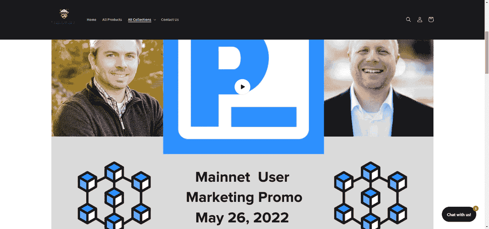
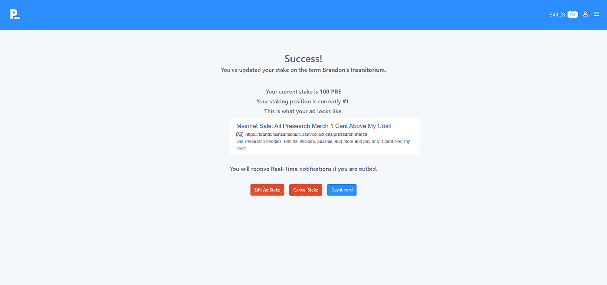
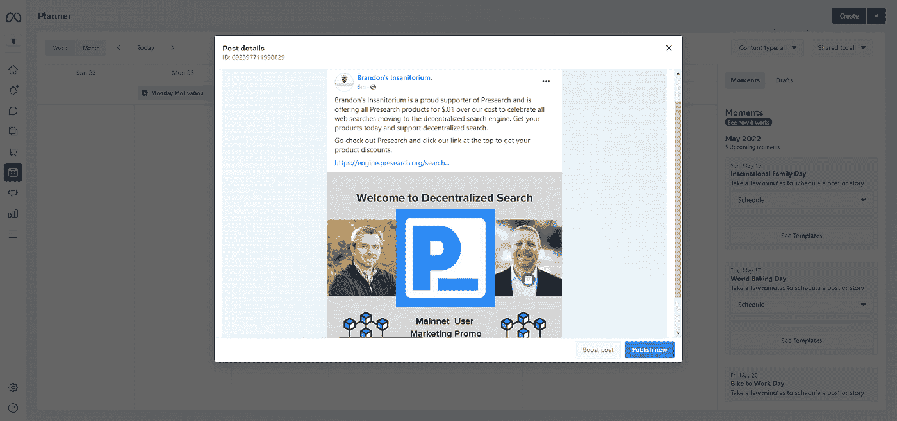

# 预研用户主网营销活动

> 原文：<https://medium.com/coinmonks/presearch-user-main-net-marketing-campaign-d647e2f7992?source=collection_archive---------24----------------------->

隐私搜索将会更加分散化。保持数据的私密性。

从 2022 年 5 月 26 日开始，所有搜索结果都将通过去中心化的节点运营商。

为了庆祝，我们有些人只提供预售折扣活动。我们将与您分享我们如何推出这些折扣活动。

我们将遵循以下 5 个步骤的基本策略:

1.  创建预搜索促销。
2.  创建带有促销代码的自定义登录页面。
3.  创建一个预搜索广告，标上你的企业名称。
4.  派人到 Presearch 查看您的广告。
5.  广告把他们带到打折页面。

让我们来看看如何做到这一点。

# 创建预搜索促销

你的晋升机会可大可小。这样做的目的是为了吸引流量、注意力，并有希望吸引会员进行预搜索。

一个用户正在创建一个 60%折扣的电子邮件活动。一旦你决定了你的晋升，写下细节，为下一步做好准备。

# 促销页面

在这一步中，您将创建一个页面，供用户在发布广告时访问。根据您的产品和技术组合，您希望该页面包括:

*   促销代码。
*   你在促销中提供的产品或服务。
*   你的产品描述和价格。
*   通过访问[您的推荐链接(这是我的链接)，邀请您加入 Presearch。](http://presearch.org/signup?rid=2270247)

你可以看看下面我是如何运行我的。

确保将 rid=更改为您的号码，除非您希望我推荐您。你可以在这里找到你的引荐链接:【http://presearch.org/account/referrals】T2

您可能希望在屏幕和电子邮件中包含推荐代码，以感谢他们的购买。

此外，确保将电子邮件收集设置为“选择加入”，因为这是某些地方的法律要求的。

# 创建预搜索广告

你需要去 http://keywords.presearch.org/的[制作你的广告。我们建议将目标关键字作为您的企业名称。](http://keywords.presearch.org/)

例如，如果你的公司名称是谷歌吸目标谷歌吸。使用你的企业名称将有助于减少竞争，并帮助每个人得到他们的广告给公众。

请记住，重点是帮助提高你的业务和预研的知名度，因为我们都喜欢这个项目。

你将不得不出价 100 英镑或更多的赌注关键字。然后你需要写广告。

广告文案包括:

1.标题:(最多 100 个字符)

2.描述:(最多 250 个字符)

3.广告链接:链接到你的促销网页。尽量保持在 75 个字符以内，或者使用链接缩写

4.使服从

它将带你到你的广告预览，看起来像下面这样。

请确保在尝试共享链接时对其进行测试。你可以在预搜索上找到我的广告[。如果您将“共享”链接与您的预搜索推荐代码一起使用，您可能需要编辑它。](https://engine.presearch.org/search?q=Brandon%E2%80%99s+Insanitorium&rid=2270247)

**错:**【https://engine.presearch.org/search?】T4q = Brandon % 25e 2% 2580% 2599s+Insanitorium&rid = 2270247

**右:**[https://engine.presearch.org/search?q = Brandon % E2 % 80% 99s+Insanitorium&rid = 2270247](https://engine.presearch.org/search?q=Brandon%E2%80%99s+Insanitorium&rid=2270247)

在我的例子中，我必须在三个地方去掉“25”。

现在是时候派人去你的广告了。

# 向人们展示您的广告

根据营销活动和平台的不同，有几种方法可以做到这一点。

# 电子邮件示例

一个预研用户的公司正在创建一个 60%的电子邮件活动，购买一件商品免费送货，以庆祝预研主网的推出。这将是该公司提供的最低折扣。他们希望通过这一活动将新的预购用户吸引到浏览器上。电子邮件看起来像这样:

“(贵公司名称)最近使用预搜索搜索引擎发起了一项广告活动。一个致力于保护你隐私的搜索引擎。

为了庆祝我们提供 60%的单品折扣和免费送货。

要查找特殊优惠券代码，请单击下面的链接，然后搜索(公司名称)。一旦你找到我们的广告，点击它找到特殊的优惠券代码。

重要提示:确保你的名单是自愿加入的。没有垃圾邮件。

[https://presearch.org/?rid=1234567](https://presearch.org/?rid=1234567)

如你所见，他没有直接链接到注册页面。您可以通过以“？”结束链接来链接到任何页面。rid=####### "

请随意使用他的模板。他也将为社交媒体做类似的事情。

# 社交媒体示例

我计划只使用社交媒体和这个博客来推广我的广告。

在社交媒体上，你希望简短、甜蜜、中肯。引起他们的注意，动作要快。

下面是我在脸书的帖子的样子。

仅供参考。你可以在促销期间购买图片作为拼图。2022 年 6 月 1 日停产。

# 用户转到折扣页面。

一旦他们点击你的广告，他们就会被带到你的登陆页面，在那里他们可以购物。这很简单，但是你可能需要几天时间来建立一个活动，这取决于你如何去做。查看以下参与公司列表。

# 参与公司

如果您希望参与此次活动，请发送电子邮件至 bboushy@presearch.fan，并提供徽标和链接，我会将您添加到当前参与的公司中。

如果你需要任何帮助，你也可以伸出手来。我很乐意帮助人们建立活动，只要他们是相当小的。对于更大的活动，我会提供 25%的自由职业者费用。

帮助支持私有和分散搜索。你可以使用下面的链接找到更多关于预搜索的信息。

支持在您喜爱的设备上进行分散和私人搜索。

**推介环节**:【https://presearch.org/signup?rid=2270247 

**运行一个节点**:[https://nodes.presearch.org](https://nodes.presearch.org/)
**关键词股权**:[https://keywords.presearch.org](https://keywords.presearch.org/)
**Info 站点**:[https://Presearch . io](https://presearch.io/)
**搜索与预搜索**:[https://presearch.com](https://presearch.com/)

**社区渠道:**

**电报**:[t.me/Presearch](http://t.me/presearch)
**推特**:[https://twitter.com/presearchnews](https://twitter.com/presearchnews)
**YouTube**:[https://www.youtube.com/c/Presearch/videos](https://www.youtube.com/c/Presearch/videos)
**不和**:[https://discord.presearch.com](https://discord.presearch.com/)
**心术**:[https://www.minds.com/presearch](https://www.minds.com/presearch/)
**Reddit:**[https://www.reddit.com/r/Presearch/](https://www.reddit.com/r/Presearch/) **Flote**

> *加入 Coinmonks* [*电报频道*](https://t.me/coincodecap) *和* [*Youtube 频道*](https://www.youtube.com/c/coinmonks/videos) *了解加密交易和投资*

# 另外，阅读

*   [3 商业评论](/coinmonks/3commas-review-an-excellent-crypto-trading-bot-2020-1313a58bec92) | [Pionex 评论](https://coincodecap.com/pionex-review-exchange-with-crypto-trading-bot) | [Coinrule 评论](/coinmonks/coinrule-review-2021-a-beginner-friendly-crypto-trading-bot-daf0504848ba)
*   [莱杰 vs Ngrave](/coinmonks/ledger-vs-ngrave-zero-7e40f0c1d694) | [莱杰 nano s vs x](/coinmonks/ledger-nano-s-vs-x-battery-hardware-price-storage-59a6663fe3b0) | [币安评论](/coinmonks/binance-review-ee10d3bf3b6e)
*   [Bybit Exchange 评论](/coinmonks/bybit-exchange-review-dbd570019b71) | [Bityard 评论](https://coincodecap.com/bityard-reivew) | [Jet-Bot 评论](https://coincodecap.com/jet-bot-review)
*   [3 commas vs crypto hopper](/coinmonks/3commas-vs-pionex-vs-cryptohopper-best-crypto-bot-6a98d2baa203)|[赚取加密利息](/coinmonks/earn-crypto-interest-b10b810fdda3)
*   最好的比特币[硬件钱包](/coinmonks/hardware-wallets-dfa1211730c6) | [BitBox02 回顾](/coinmonks/bitbox02-review-your-swiss-bitcoin-hardware-wallet-c36c88fff29)
*   [BlockFi vs 摄氏](/coinmonks/blockfi-vs-celsius-vs-hodlnaut-8a1cc8c26630) | [Hodlnaut 点评](/coinmonks/hodlnaut-review-best-way-to-hodl-is-to-earn-interest-on-your-bitcoin-6658a8c19edf) | [KuCoin 点评](https://coincodecap.com/kucoin-review)