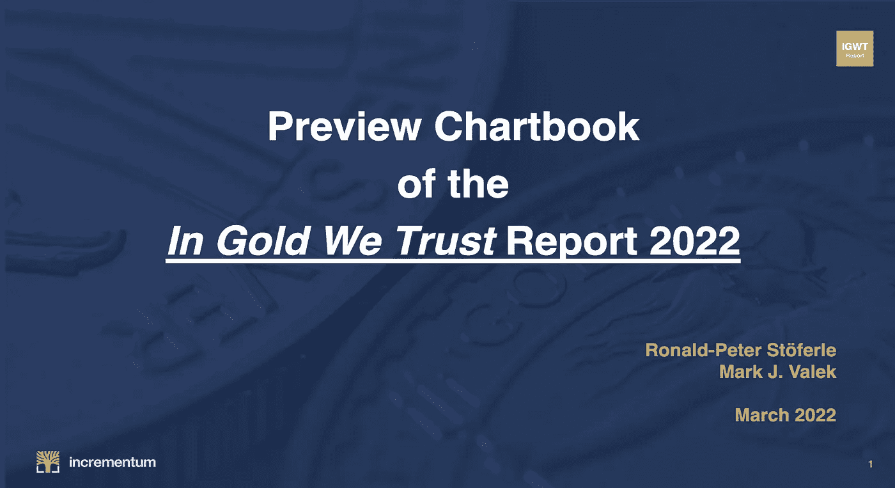
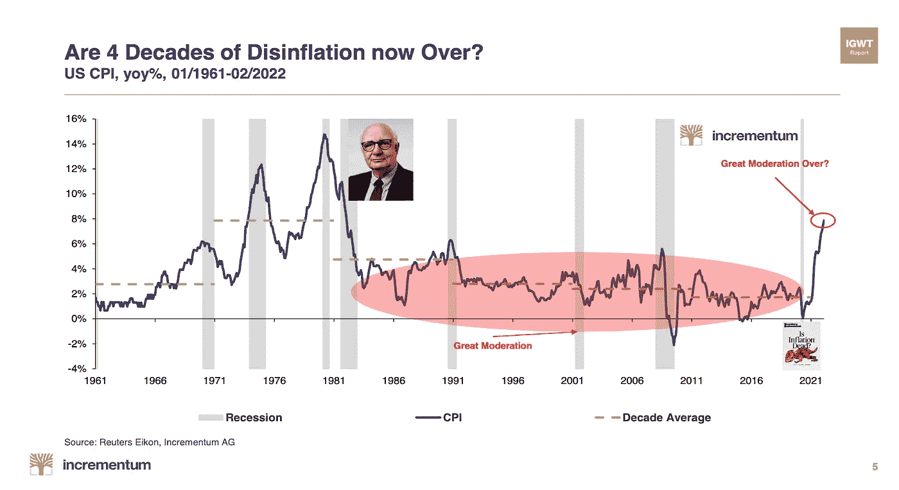
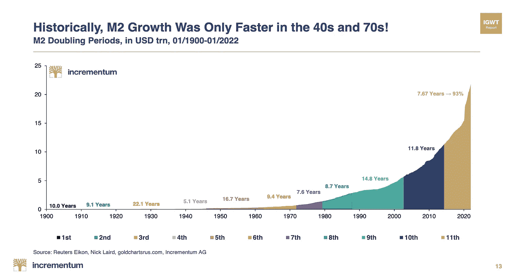
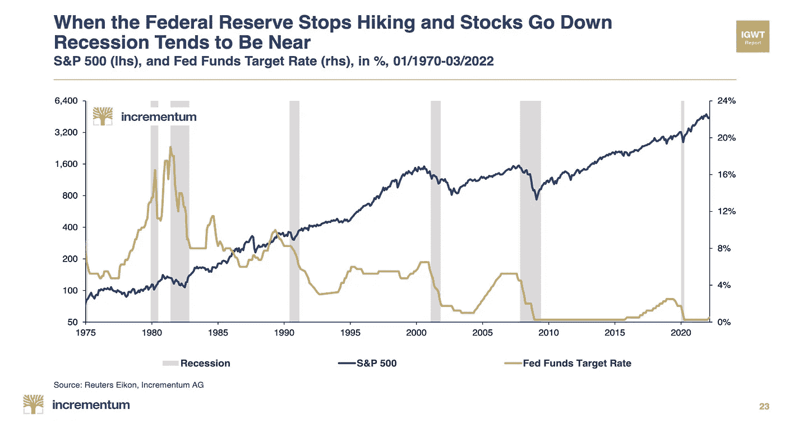
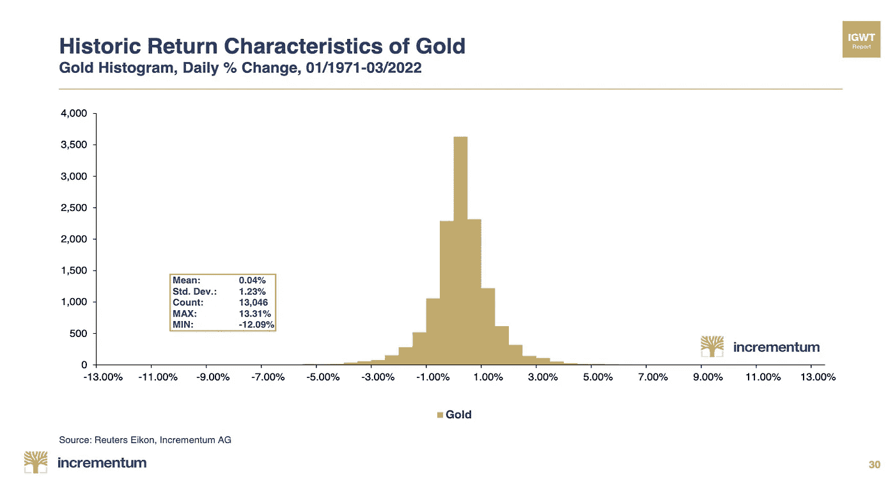
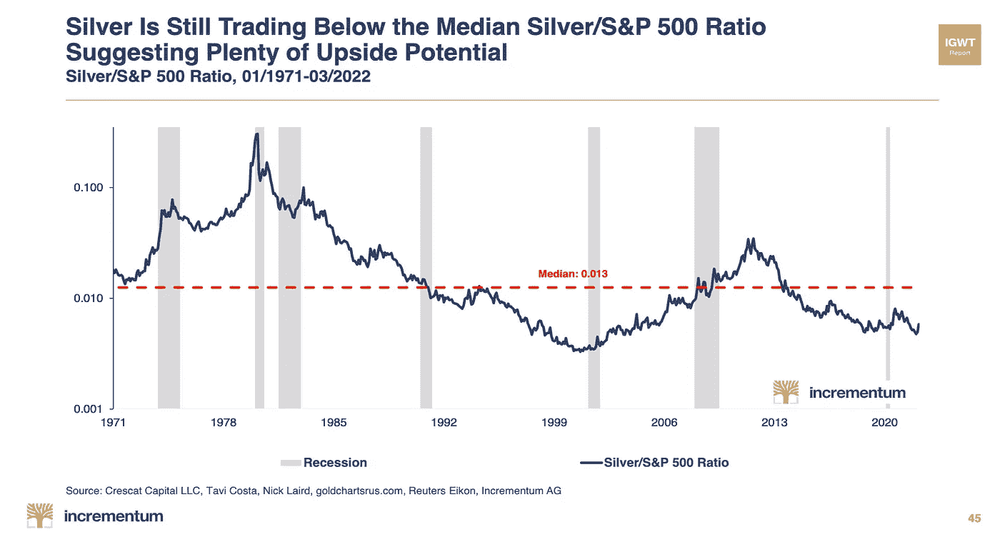
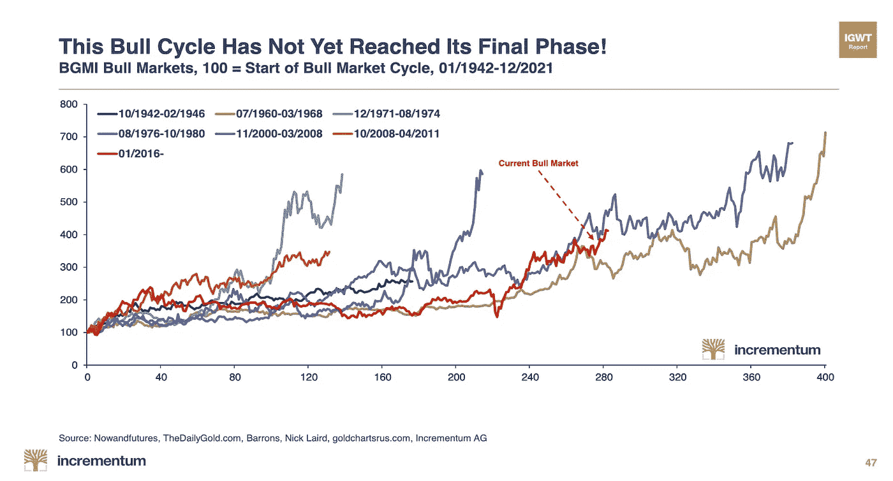
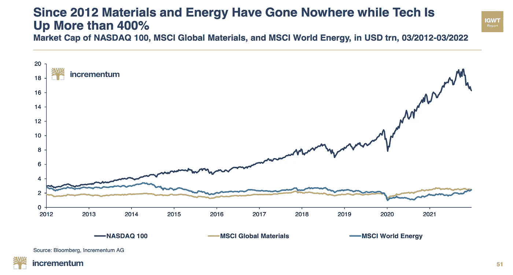

# 《2022 年 IGWT 报告》预览手册

> 原文：<https://medium.com/coinmonks/preview-chartbook-of-the-igwt-report-2022-1310fa4ebac3?source=collection_archive---------50----------------------->

春天到了，我们正疯狂地为今年的“我们信任的黄金”报告做准备。由于我们生活在这样一个动荡和变化的时代，这是相当困难的。但是，整个团队都在努力工作，尽可能提供最好的 IGWT 报告，但一如既往，我们准备迎接挑战。为了让每个人都有一个好心情，我们展示了 2022 年 IGWT 奥运会的预览图，其中包含了我们将在报告中展示的一些最重要的图表。对了，发布会在 64 天(5 月 24 日)！

点击这里查看或下载图表簿[，或者继续滚动查看图表簿中 40 多个图表中的几个。](https://www.incrementum.li/en/journal/preview-chartbook-igwt-2022/)

预览帐簿包含以下章节:

*   通货膨胀

*   宏观:滞胀安特波塔斯？

*   美国焦点

*   黄金的现状

*   银

*   黄金矿工

*   Quo Vadis？

完整的图表可以在[这里](https://www.incrementum.li/en/journal/preview-chartbook-igwt-2022/)查看或下载:

更多类似的故事或关于黄金、比特币和宏观经济的新闻和文章，请访问我们的网站[这里](https://ingoldwetrust.report/?lang=en)。

《2022 In Gold We Trust 报告》定于 5 月 24 日发布。您可以在[这里](https://ingoldwetrust.report/igwt/?lang=en)查看或下载 2021 年报告，或订阅接收 2022 年报告。

在 [Youtube](https://www.youtube.com/channel/UCO1kBepErpjsxa54ll7cB8Q) 、 [Twitter](https://twitter.com/IGWTreport) 或 [Linkedin](https://www.linkedin.com/showcase/ingoldwetrust-report/) 上关注我们。

> 加入 Coinmonks [电报频道](https://t.me/coincodecap)和 [Youtube 频道](https://www.youtube.com/c/coinmonks/videos)了解加密交易和投资

# 另外，阅读

*   [Bitsgap 审查](/coinmonks/bitsgap-review-a-crypto-trading-bot-that-makes-easy-money-a5d88a336df2) | [Quadency 审查](/coinmonks/quadency-review-a-crypto-trading-automation-platform-3068eaa374e1) | [Bitbns 审查](/coinmonks/bitbns-review-38256a07e161)
*   [密码本交易平台](/coinmonks/top-10-crypto-copy-trading-platforms-for-beginners-d0c37c7d698c) | [Coinmama 审核](/coinmonks/coinmama-review-ace5641bde6e)
*   [印度加密交易所](/coinmonks/bitcoin-exchange-in-india-7f1fe79715c9) | [比特币储蓄账户](/coinmonks/bitcoin-savings-account-e65b13f92451)
*   [OKEx vs KuCoin](https://coincodecap.com/okex-kucoin) | [摄氏替代品](https://coincodecap.com/celsius-alternatives) | [如何购买 VeChain](https://coincodecap.com/buy-vechain)
*   [币安期货交易](https://coincodecap.com/binance-futures-trading)|[3 comas vs Mudrex vs eToro](https://coincodecap.com/mudrex-3commas-etoro)
*   [如何购买 Monero](https://coincodecap.com/buy-monero) | [IDEX 评论](https://coincodecap.com/idex-review) | [BitKan 交易机器人](https://coincodecap.com/bitkan-trading-bot)