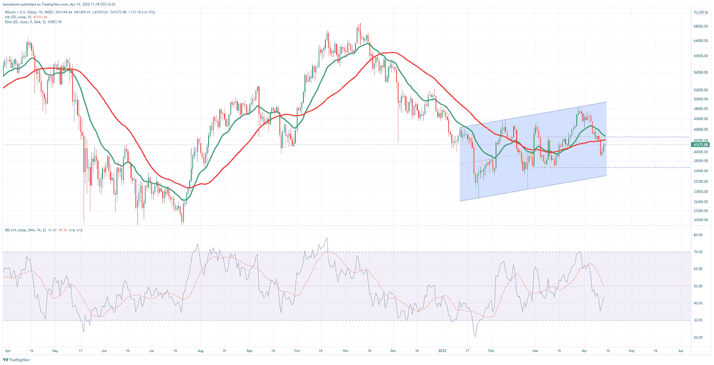
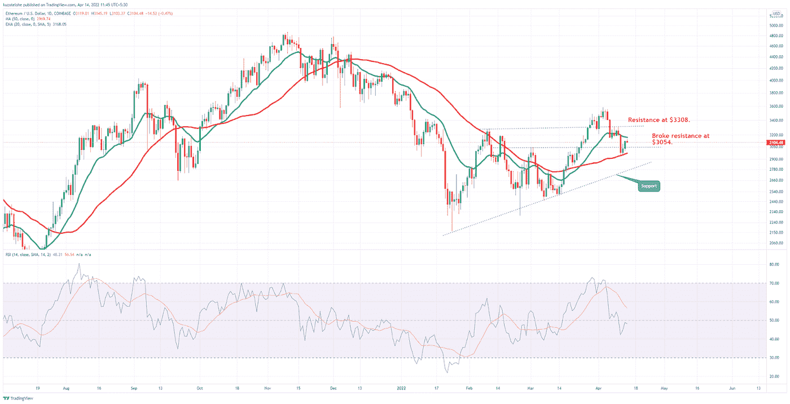
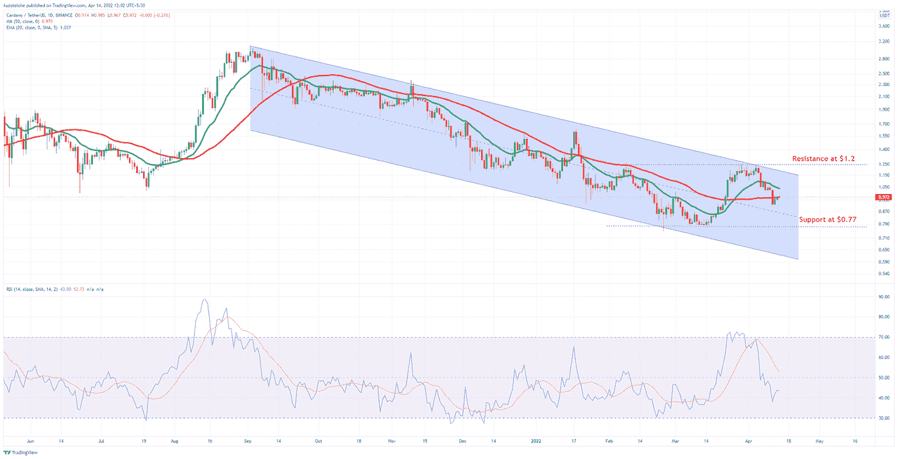
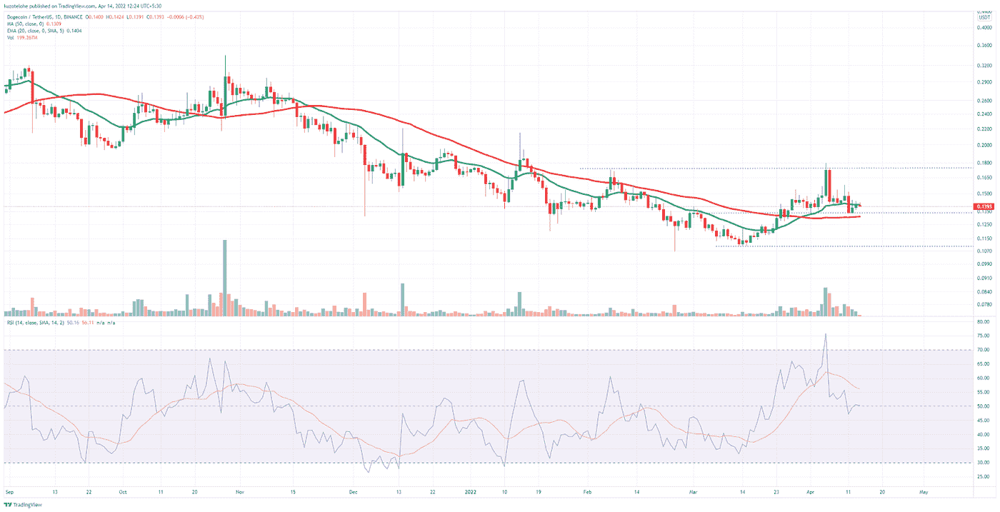
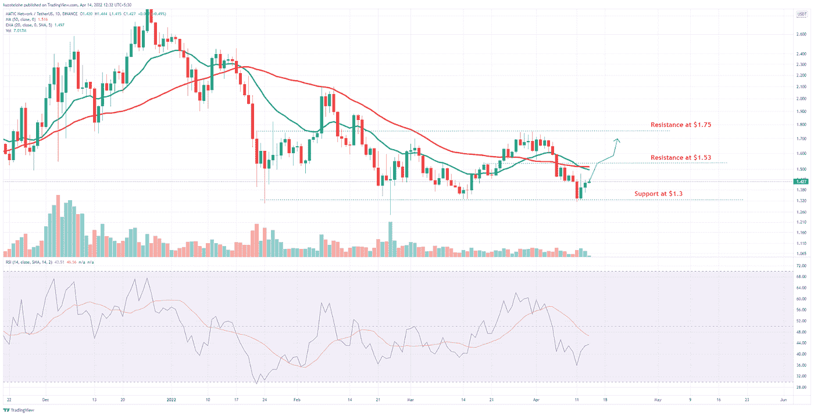

# 价格分析:BTC、ETH、ADA、DOGE、MATIC

> 原文：<https://medium.com/coinmonks/price-analysis-btc-eth-ada-doge-matic-d1c4fe813967?source=collection_archive---------56----------------------->

在本周早些时候密码市场的大抛售之后，多头又回到了游戏中。连续三天，市场显示绿色信号，但仍略低，以从每周的红蜡烛线完全恢复。

另一方面，非营利组织 Luna Foundation Guard 继续积累比特币，在 4 月 13 日又增加了 2508 个比特币。Luna Foundation 现在拥有 42406 个比特币，而 Elon Musk 的特斯拉拥有 43200 个比特币。

# 比特币

比特币对美元的价格回到了 40，000 美元的心理水平之上。在 4 月 11 日的大规模抛售之后，空头无法保持势头。周四上午，多头做了很大的努力，才使 BTCUSD pair 回到 41，000 美元以上。我们可以看到，一些投资者虽然数量不多，但在上次价格下跌中获利了结。在日蜡烛图中，BTCUSD 对在最近三天给出了三根绿色蜡烛线。50 天移动平均线继续高于 42，102 美元的价格。尽管比特币现在的交易价格高于心理水平，但它仍需要突破 42，638 美元和 50 天移动平均线的阻力，才能最终有望实现牛市。相反，如果空头反击并变得咄咄逼人，数字黄金的价格可能会跌回 37，384 美元。

# 以太坊

ETHUSD 货币对在 4 月 13 日突破了早期的阻力 3054 美元。空头未能跌破 50 天移动平均线。这表明 50 日均线支撑良好。目前，ETHUSD 货币对在 20 天指数移动平均线下方移动。多头需要突破 20 天移动平均线才能在 3308 美元的下一个阻力建仓。ETHUSD 市场非常重视上升趋势支撑。RSI 指标显示略低于 50，等待观望。

# 卡尔达诺

卡达诺兑美元的价格正在测试 50 天移动平均线，略微未能突破 1 美元的心理阻力。自去年 9 月以来，ADAUSD 货币对一直处于下跌趋势，不断创造更低的低点和更高的低点。本月初，美元对未能突破 1.2 美元的阻力。虽然 PoS Cardano 在过去两天略有改善，但如果未能突破 50 天移动平均线，则需要 0.77 美元的支撑。40 附近的 RSI 信号表明空头正在推动市场。卡尔达诺市场的交易量正在减少。

# Dogecoin

meme coin 之父 DOGE 在本月早些时候看到了更高的交易量，但未能突破 0.17 美元的最后阻力。DOGEUSD 对正在 50 天移动平均线上方运行，并测试 20 天指数移动平均线。如果多头能够拉动当前的价格运动，我们可以看到 DOGE 在 0.16 美元建仓。相反，如果空头咄咄逼人，DOGEUSD 市场可能需要 0.10 美元的支撑。

# 马蒂奇

以太坊侧链多边形令牌 MATIC 已经成功地支撑在 1.3 美元兑 1 美元。多头正在阻止空头进一步压低价格。尽管如果多头继续，MATICUSD 对正在 50 天移动平均线和 20 天指数移动平均线下方移动，下一个突破阻力在 1.53 美元，最终在 1.75 美元。RSI 指标在 40 附近发出信号，在过去的三天里，买入量显示为三根绿色蜡烛线。

注意:投资加密包含风险。提交人对资产损失没有责任。这只是为了教育和信息的目的，因此，它不应该被视为财务建议。请在投资前做好自己的研究。

> 加入 Coinmonks [电报频道](https://t.me/coincodecap)和 [Youtube 频道](https://www.youtube.com/c/coinmonks/videos)了解加密交易和投资

# 另外，阅读

*   [Bookmap 点评](https://coincodecap.com/bookmap-review-2021-best-trading-software) | [美国 5 大最佳加密交易所](https://coincodecap.com/crypto-exchange-usa)
*   最佳加密[硬件钱包](/coinmonks/hardware-wallets-dfa1211730c6) | [Bitbns 评论](/coinmonks/bitbns-review-38256a07e161)
*   [新加坡十大最佳加密交易所](https://coincodecap.com/crypto-exchange-in-singapore) | [购买 AXS](https://coincodecap.com/buy-axs-token)
*   [红狗赌场评论](https://coincodecap.com/red-dog-casino-review) | [Swyftx 评论](https://coincodecap.com/swyftx-review) | [CoinGate 评论](https://coincodecap.com/coingate-review)
*   [投资印度的最佳密码](https://coincodecap.com/best-crypto-to-invest-in-india-in-2021)|[WazirX P2P](https://coincodecap.com/wazirx-p2p)|[Hi Dollar Review](https://coincodecap.com/hi-dollar-review)