# 价格分析:BTC，ETH，BNB，XRP，露娜，SOL，ADA，AVAX，DOT，DOGE

> 原文：<https://medium.com/coinmonks/price-analysis-btc-eth-bnb-xrp-luna-sol-ada-avax-dot-doge-43d357464718?source=collection_archive---------82----------------------->

**Visit our website:-** [**https://bitcoinsupports.com/**](https://bitcoinsupports.com/)

比特币和大多数著名的替代币正试图维持高于其直接支撑位的价格，这表明短期趋势可能逆转。比特币(BTC)和大多数著名的加密货币都试图通过反弹各自的支撑位来为新的一周开个好头。

高盛(Goldman Sachs)是首批与迈克尔·诺沃格拉茨(Michael Novogratz)的银河数字交易部门完成场外“现金结算的加密货币期权交易”的美国大银行之一。这可能会说服其他大型银行探索启用场外加密货币交易。

不仅仅是一些国家看到了加密接受度的提高。根据加密货币交易所 KuCoin 的预测，2022 年非洲的加密交易将增加近 2670%。比特币塞内加尔的创始人努鲁认为，非洲超过 1000%的增长率在未来几年可能会继续。

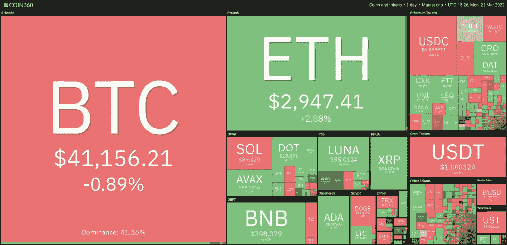

**Visit our website:-** [**https://bitcoinsupports.com/**](https://bitcoinsupports.com/)

分析师 Willy Woo 预测，比特币基于大宗补贴减半的四年价格周期可能会在未来过时，因为价格行为很可能受供需控制。比特币和其他加密货币会突破它们的头顶阻力位吗？要了解更多信息，让我们来看看十大加密货币的图表。

**BTC/USDT**

比特币目前在 42594 美元遭遇重大阻力，表明空头正在更高水平继续抛售。空头试图将价格压低到均线以下，而多头则努力将价格保持在均线以上。

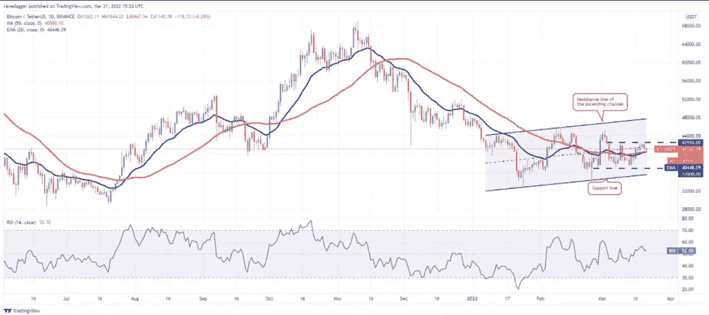

**Visit our website:-** [**https://bitcoinsupports.com/**](https://bitcoinsupports.com/)

两条均线都走平，相对强弱指数(RSI)接近中点，表明供需平衡。如果比特币的价格跌破移动平均线，BTC/USDT 的比特币可能会跌至 37000 美元。这表明二人组可能会在 42，594 美元到 37，000 美元的区间内多花一些时间。另一方面，如果价格从均线上强烈反弹，这表明情绪已经转向看涨，交易者正在适度下跌时买入。这可能会增加突破 42，594 美元的可能性。如果货币对维持在这个障碍之上，它可能上升到 45，400 美元和上升通道的阻力线之间的顶部区域。

**ETH/USDT**

3 月 19 日，Ether)跌破 3000 美元的头顶阻力位，但空头无力推动价格跌破 3 月 20 日的均线。这表明多头在小幅回调时买入。

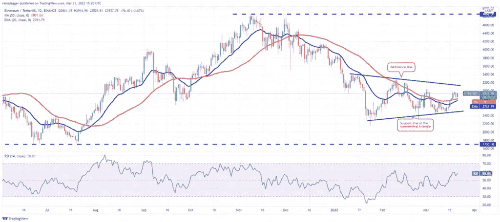

**Visit our website:-** [**https://bitcoinsupports.com/**](https://bitcoinsupports.com/)

多头的目标是将价格推至 3000 美元以上，并测试对称三角形的阻力线。这是一个关键的监测点，因为突破和收盘将表明趋势可能发生变化。此后，瑞士联邦理工学院/USDT 的组合可能飙升至 3500 美元。或者，如果价格跌破移动平均线，并跌破 3000 美元或三角形的阻力线，这表明该对货币可能会在三角形内多停留几天。

**BNB/USDT**

3 月 17 日，币安币(BNB)突破并收于 50 天简单均线(390 美元)上方，但多头无力延续领先优势。3 月 19 日烛台上长长的灯芯意味着更高水平的抛售即将到来。

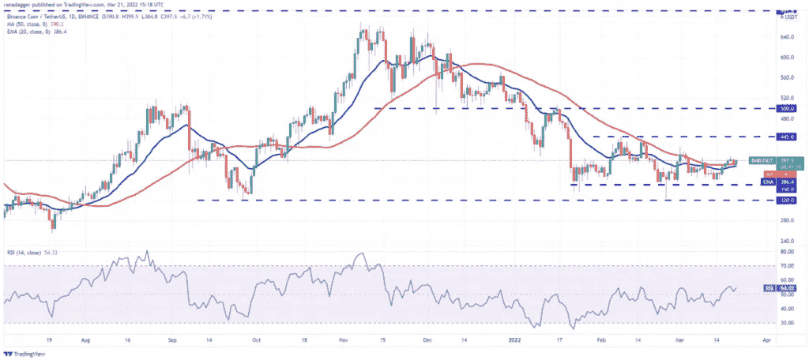

**Visit our website:-** [**https://bitcoinsupports.com/**](https://bitcoinsupports.com/)

3 月 20 日，BNB/USDT 组合反转，跌至 20 天指数移动平均线(386 美元)。稍微有利的一点是，多头已经设法将价格保持在这个水平以上。这表明多头把希望寄托在价格下跌上。

如果价格继续上涨并突破 407 美元上方，上涨趋势可能会继续，该对货币可能会反弹至 425 美元。这个水平可能会成为绊脚石，但如果被突破，下一个可能的止损点可能是 445 美元。

另一方面，如果价格下跌，跌破 20 天指数移动平均线，则表明缺乏更高层次的需求。这一对有可能跌至 350 美元。

**XRP/USDT**

3 月 18 日，XRP 反弹 20 天指数均线(0.77 美元)，3 月 19 日越过下降趋势线。空头再次捍卫了这一水平，但无法将市场推到 20 日均线以下。这意味着逢低积极买入。

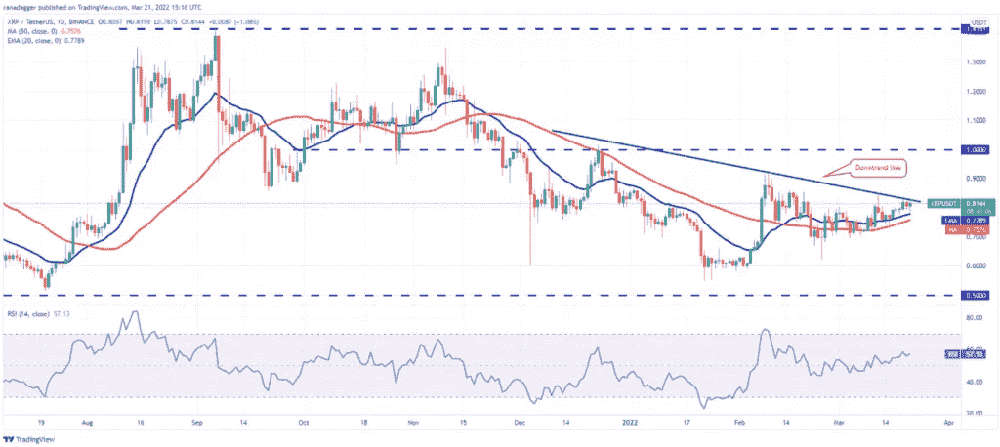

**Visit our website:-** [**https://bitcoinsupports.com/**](https://bitcoinsupports.com/)

两条均线都已经开始上行，RSI 进入正区，说明阻力最小的路径是向上的。如果多头能将价格推高并保持在下降趋势线之上，买盘可能会加速上涨，XRP/USDT 货币对可能会达到 0.91 美元。如果这一水平同样被突破，1 美元的心理障碍可能是下一站。

要占据上风，空头必须将价格拉到 50 日均线(0.75 美元)以下并持有。

**卢娜/USDT**

Terra 的卢娜令牌在 3 月 18 日跳开了 20 天指数移动平均线(86 美元)，发出交易者继续逢低买入的信号。

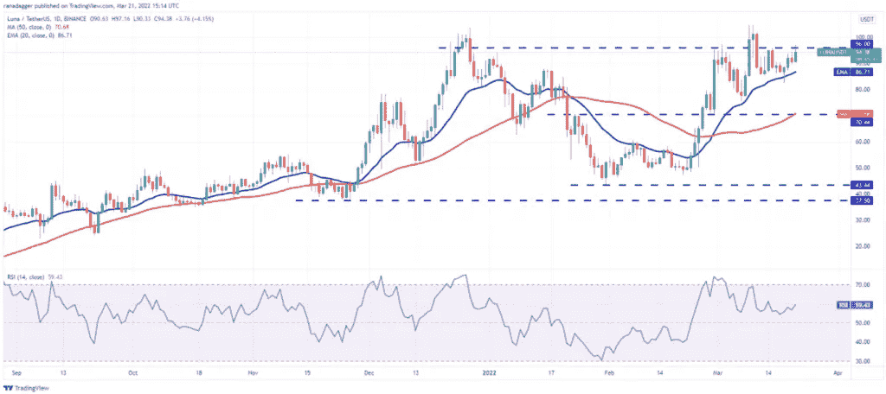

**Visit our website:-** [**https://bitcoinsupports.com/**](https://bitcoinsupports.com/)

买家将价格推高至 96 美元的坚固阻力位，空头正在此处进行激烈的战斗。如果多头攻克这一阻力位，卢纳/USDT 组合可能会重新测试 105 美元的历史高点。多头需要推动并保持价格在这一水平之上，以表明价格继续上涨。上涨的 20 日均线和正的 RSI 标志着买家的优势。

与这种想法相反，如果价格下跌并跌破 20 日均线，许多短线交易者可能会平仓。该货币对可能会跌破 70 美元的强支撑位。

**索尔/USDT**

3 月 19 日，索拉纳(SOL)试图突破下降趋势线上方，但空头另有想法。他们保持这一水平，并将价格拉低至 3 月 20 日的 20 天指数移动平均线(87 美元)。

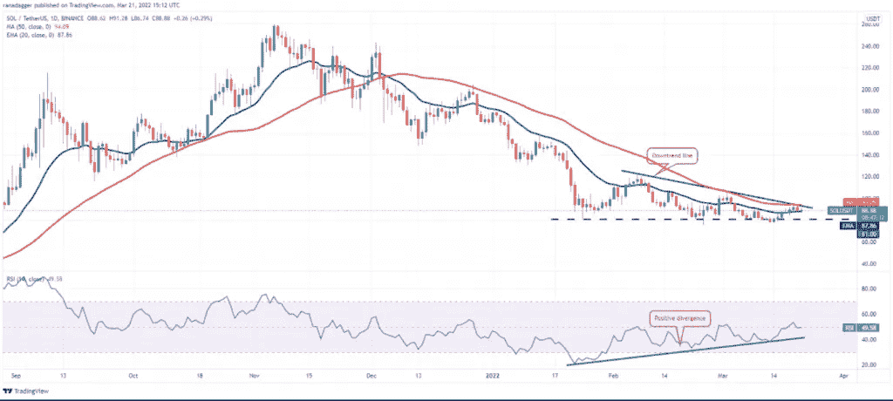

**Visit our website:-** [**https://bitcoinsupports.com/**](https://bitcoinsupports.com/)

买方成功地捍卫了 20 天指数移动平均线，并将寻求推动价格再次超过下降趋势线。

如果成功，下降三角形图案将被渲染无效。消极的设置失败是一个积极的指标，因为它套住了许多可能在预期崩溃时卖出的空头。之后，索尔/USDT 组合可能会尝试攀升至 106 美元，甚至 120 美元。另一方面，如果价格反转并跌破 20 日均线，这表明在更高的水平积极卖出。然后，该货币对可能会逐渐回撤至 81 美元的支撑位。

**阿达/USDT**

卡尔达诺(ADA)在 3 月 19 日突破了 20 天指数移动平均线(0.86 美元)，多头抵制了看跌者将价格拉低至 3 月 20 日水平以下的企图。这表明，买家正试图启动一个救济反弹。

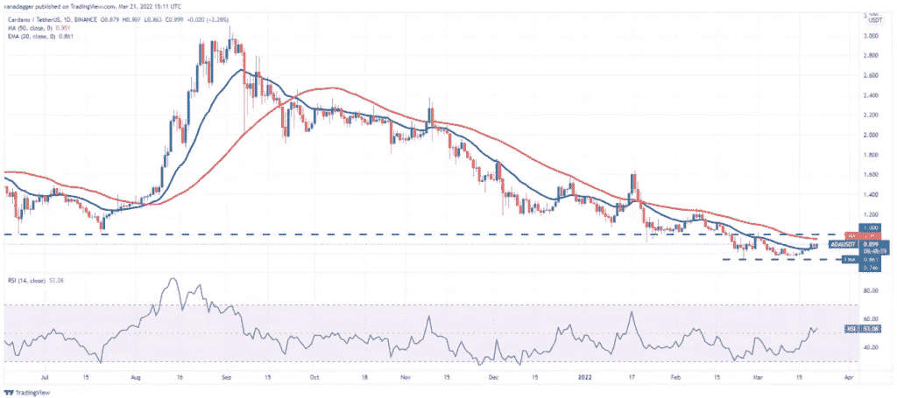

**Visit our website:-** [**https://bitcoinsupports.com/**](https://bitcoinsupports.com/)

多头现在将试图推高价格，并将其维持在 1 美元的阻力位之上。如果他们成功了，这将意味着趋势可能逆转。之后，ADA/USDT 货币对可能会反弹至下一个阻力位 1.26 美元。

或者，如果价格从当前水平或顶部阻力反转，并跌破 20 天指数移动平均线，这表明该货币对可能在未来几天内保持在 1 美元至 0.74 美元之间的区间波动。

**AVAX/USDT**

3 月 18 日雪崩(AVAX)收于下跌通道上方，3 月 20 日、21 日多头有效防守突破水平。

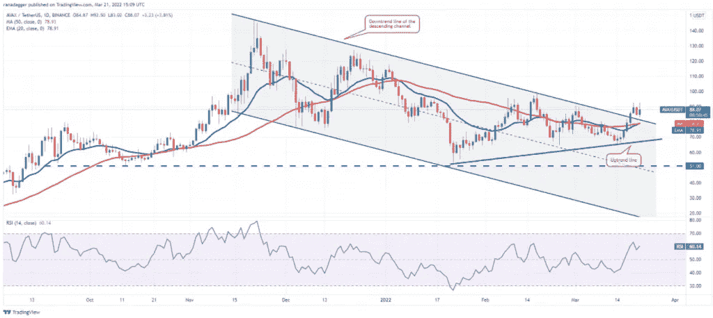

**Visit our website:-** [**https://bitcoinsupports.com/**](https://bitcoinsupports.com/)

20 日均线(78 美元)上涨，RSI 进入正区域，表明买方优势。如果多头继续将价格推至 93 美元上方，那么 AVAX/USDT 组合可能会飙升至 100 美元的心理里程碑。空头可能会试图在这个水平阻止上涨，但如果多头保持他们的立场，突破这个水平的可能性会增加。

如果价格跌破移动平均线，收盘低于当前水平，这种看涨观点将失效。

**DOT/USDT**

3 月 19 日，波尔卡多(DOT)破位，收盘突破 19 美元的上方阻力位，但多头无力扩大领先优势。3 月 20 日，空头利用这一机会，将价格拉低至 19 美元以下。

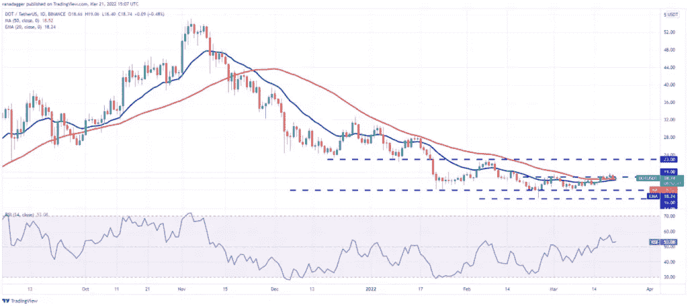

**Visit our website:-** [**https://bitcoinsupports.com/**](https://bitcoinsupports.com/)

稍微有利的一点是，多头成功地将价格保持在移动平均线之上。移动平均线持平，RSI 略高于中点，意味着空头可能正在失去控制。如果价格从当前位置攀升，多头将寻求突破 20 美元的顶部障碍。如果他们成功，点/USDT 对可能反弹到 23 美元，熊市可能会发动另一次重大尝试。如果价格突破并维持在 20 天指数移动平均线(18 美元)以下，这种看涨观点将在短期内变得不正确。这可能为可能的降价至 16 美元铺平道路。

**DOGE/USDT**

3 月 19 日，Dogecoin (DOGE)突破并收于 20 日指数均线(0.12 美元)上方，但多头无力挽留更高的水平。3 月 20 日，空头将该股拉回 20 天指数移动平均线以下。

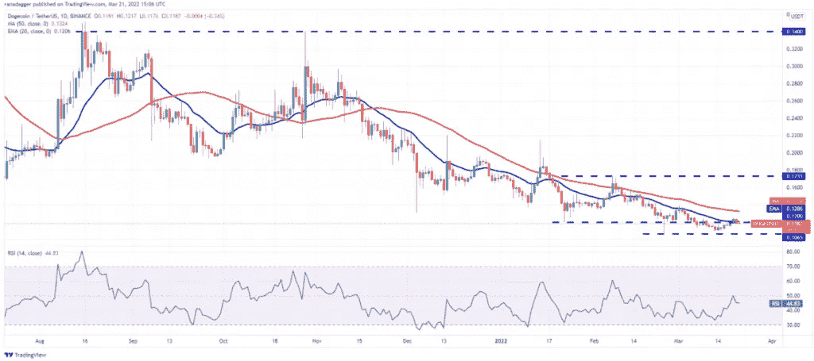

**Visit our website:-** [**https://bitcoinsupports.com/**](https://bitcoinsupports.com/)

20 天指数移动平均线正在走平，RSI 在中点徘徊，表明抛售压力可能正在缓解。如果买家能够推动价格超过 20 天指数移动平均线，并保持在那里，道格/USDT 对可能会飙升至 50 天简单移动平均线(0.13 美元)。多头必须克服这一障碍，为可能反弹至 0.17 美元铺平道路。或者，如果价格从当前水平反转，收于 3 月 20 日盘中低点以下，该货币对可能会跌至 0.10 美元的坚实支撑。

**访问我们的网站:-**[**https://bitcoinsupports.com/**](https://bitcoinsupports.com/)

**免责声明:以上为作者观点，不应视为投资建议。读者应该自己做研究。**

> 加入 Coinmonks [电报频道](https://t.me/coincodecap)和 [Youtube 频道](https://www.youtube.com/c/coinmonks/videos)了解加密交易和投资

# 另外，阅读

*   [比特币主根](https://coincodecap.com/bitcoin-taproot) | [排名前 6 的比特币信用卡](/coinmonks/bitcoin-credit-card-bc8ab6f377c6)
*   [最佳免费加密信号](https://coincodecap.com/free-crypto-signals) | [YoBit 评论](/coinmonks/yobit-review-175464162c62) | [Bitbns 评论](/coinmonks/bitbns-review-38256a07e161)
*   [huo bi 的加密交易信号](https://coincodecap.com/huobi-crypto-trading-signals) | [BitMEX 评论](https://coincodecap.com/bitmex-review)
*   [7 大最佳零费用密码交易平台](https://coincodecap.com/zero-fee-crypto-exchanges) | [购买流量令牌](https://coincodecap.com/buy-flow-token)
*   [分散交易所](https://coincodecap.com/what-are-decentralized-exchanges) | [比特 FIP](https://coincodecap.com/bitbns-fip) | [Pionex 评论](https://coincodecap.com/pionex-review-exchange-with-crypto-trading-bot)