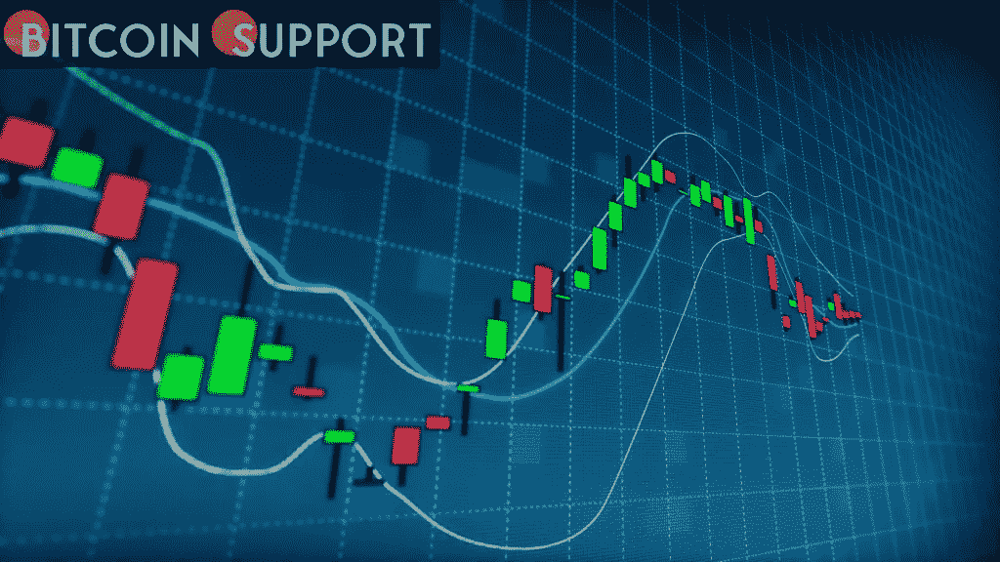
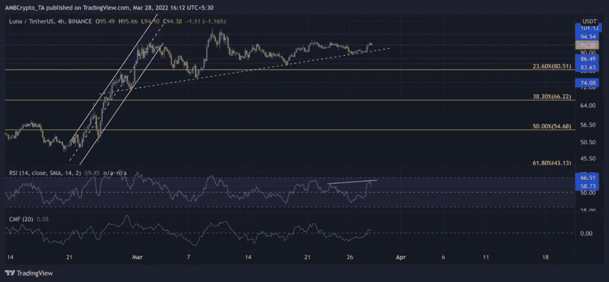
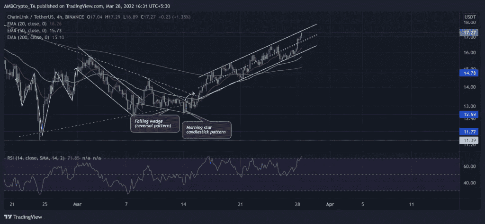
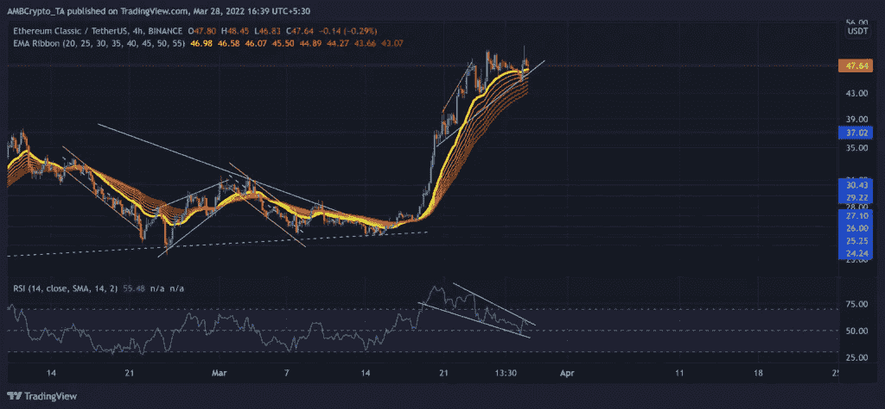

# 价格分析 Terra，Chainlink，Ethereum Classic

> 原文：<https://medium.com/coinmonks/price-analysis-terra-chainlink-ethereum-classic-97551faf5557?source=collection_archive---------91----------------------->

**Visit our website:-** [**https://bitcoinsupports.com/**](https://bitcoinsupports.com/)

四个多月后，隐币恐惧和贪婪指数已经进入“贪婪”区。因此，尽管近期技术指标显示超买，但 Chainlink 的价格仍高于 20/50/200 均线。

此外，3 月 28 日，Ethereum Classic 触及四个月高点，要求多头维持 RSI 均衡支撑位。此外，Terra 在建立了 23.6%的 Fibonacci 支撑位后，表现出了看涨倾向。

**Terra (LUNA)**

**Visit our website:-** [**https://bitcoinsupports.com/**](https://bitcoinsupports.com/)

在从 101 美元的长期阻力位回落后，LUNA 下跌了近 57%。因此，1 月 31 日跌至两个月低点。这个水平对应于 61.8%的斐波纳契回调。因此，多头可能会积聚足够的动力，推动价格飙升至 90 美元区间之外。

在从 2 月份的低点涨了三倍多之后，LUNA 在牛市趋势线支撑(白色，虚线)建立之后，保持了适度的上升趋势。从这里回调将挑战上述水平的支撑位，随后是 23.6%的水平。

出版时，LUNA 的股价为 94.38 美元。在 66 点遭遇阻力后，看涨的 RSI 在中线上方徘徊。在隐藏的熊市分歧之后，该公司试图测试 58 位水准，显示出指标放缓(白色)。此外，CMF 在越过零线后表现出看涨倾向。

**链环(LINK)**

**Visit our website:-** [**https://bitcoinsupports.com/**](https://bitcoinsupports.com/)

在多头跌破 25.75 美元大关后，抛售压力加大。因此，1 月 24 日，联系汇率跌至 14 个月低点。然而，随着 alt 自那时以来上涨了 50%以上，多头再次出现在 11.3 美元的水平。

LINK 在观察了晨星 4 小时运行图上的一个烛台状图案后，启动了价格发现阶段。目标是将价格推高至 20/50/200 均线以上。此外，随着 20 日均线仍然指向北方，多头保持了控制。

在本文发表时，LINK 的交易价格为 17.27 美元。在对中线支撑位进行多次测试后，RSI 进入了超买区。在短期内，从这个区域逆转的可能性是可以想象的。

**以太经典**

**Visit our website:-** [**https://bitcoinsupports.com/**](https://bitcoinsupports.com/)

ETC 的市值(相对于 2 月 11 日的峰值)已缩水逾三分之一，并于 2 月 24 日跌至一个月低点。从那以后，altcoin 一直在飙升，在短短 11 天内实现了惊人的 87.9%的回报率。ETC 在收复 37 美元水平后，飙升至均线上方，呈现单边看涨势头。因此，该指数在 3 月 28 日创下四个月来的新高。

本文发布时 ETC 交易价为 47.64 美元。当它在一个下降的楔形之间下沉时，RSI 处于下降趋势。多头需要维持中线支撑，以触发反转形态的潜在突破，避免更多灾难。

【https://bitcoinsupports.com/】访问我们的网站:- ****免责声明:以上为作者观点，不应视为投资建议。读者应该自己做研究。****

> **加入 Coinmonks [电报频道](https://t.me/coincodecap)和 [Youtube 频道](https://www.youtube.com/c/coinmonks/videos)了解加密交易和投资**

# **另外，阅读**

*   **[如何使用 Solidity 在以太坊上创建 DApp？](https://coincodecap.com/create-a-dapp-on-ethereum-using-solidity)**
*   **[最好的卡达诺钱包](https://coincodecap.com/best-cardano-wallets) | [Bingbon 副本交易](https://coincodecap.com/bingbon-copy-trading)**
*   **[氹欞侊贸易评论](https://coincodecap.com/anny-trade-review) | [Paybis 评论](https://coincodecap.com/paybis-review) | [Keevo 钱包评论](https://coincodecap.com/keevo-wallet-review)**
*   **[印度最佳 P2P 加密交易所](https://coincodecap.com/p2p-crypto-exchanges-in-india) | [柴犬钱包](https://coincodecap.com/baby-shiba-inu-wallets)**
*   **[8 大加密附属计划](https://coincodecap.com/crypto-affiliate-programs) | [eToro vs 比特币基地](https://coincodecap.com/etoro-vs-coinbase)**