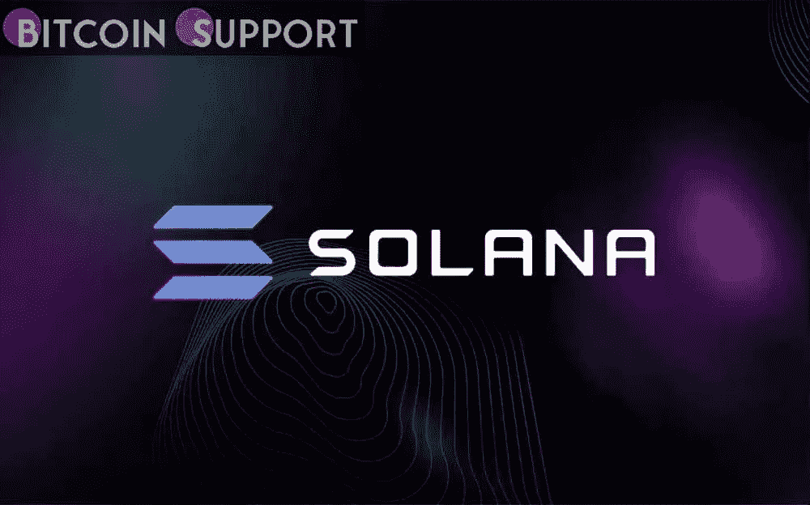
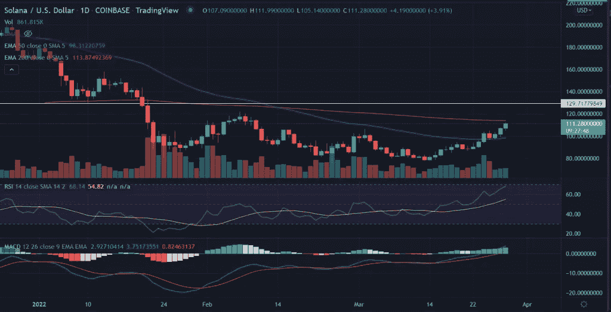

# 价格预测:索拉纳(SOL)价格目标在 200 日均线上方 130.0 美元

> 原文：<https://medium.com/coinmonks/price-prediction-solana-sol-price-targets-130-0-above-200-day-ema-1a6189e17803?source=collection_archive---------76----------------------->

**Visit our website:-** [**https://bitcoinsupports.com/**](https://bitcoinsupports.com/)

溶胶价格本周以积极的基调开始。价格延续了前一周的涨幅，周涨幅为 24%。低开后，SOL 迅速恢复，在 2 月以来未见的较高水平上交易。随着新的交易周开始，溶胶价格走高。

预期额外收益至 130.0 美元，高于 200 均线。动量震荡器已经转向有利于多头。索尔/美元现交易于 111.34 美元，当日上涨 3.92%。根据 CoinMarketCap 的数据，按市值计算，第八大加密货币的 24 小时交易量为 2481911734 美元。

**溶胶价格继续上涨**

**Visit our website:-** [**https://bitcoinsupports.com/**](https://bitcoinsupports.com/)

在日线图上，SOL 试图突破关键的 200 均线(指数移动平均线)水平 113.87 美元。该资产的持续买入趋势保持了自 3 月 14 日以来的涨幅。

经过一个月的时间，溶胶形成了一个‘圆底’结构。圆形底部形态是在资产长期下跌后形成的看涨反转形态。

***现在，一个日线收盘在上述均线之上，将在 130.0 美元处满足上行目标。***

另一方面，卖单激增或看涨情绪逆转可能会给溶胶价格带来下行压力。在这种情况下，不能排除向 50 日均线移动的可能性，50 日均线是 98.0 美元附近的即时下行支撑。此外，跌破上述水平可能会加剧抛售，空头目标是 80.0 美元。溶胶价格从 260 美元的历史高点下跌了近 70%。在 1 月下旬进一步下跌后，价格遏制了负面风险并得到巩固。

**技术指标:**

**RSI:**3 月 15 日，日线相对强弱指数飙升至均线上方，此后持续走高。目前在读 68。

**MACD:** 均线收敛发散发散维持中线上方多头倾斜。

**访问我们的网站:-**[**https://bitcoinsupports.com/**](https://bitcoinsupports.com/)

**免责声明:以上为作者观点，不应视为投资建议。读者应该自己做研究。**

> 加入 Coinmonks [电报频道](https://t.me/coincodecap)和 [Youtube 频道](https://www.youtube.com/c/coinmonks/videos)了解加密交易和投资

# 另外，阅读

*   [iTop VPN 审查](https://coincodecap.com/itop-vpn-review) | [曼陀罗交易所审查](https://coincodecap.com/mandala-exchange-review)
*   [比特币基地 vs 瓦济克斯](https://coincodecap.com/coinbase-vs-wazirx) | [比特鲁点评](https://coincodecap.com/bitrue-review) | [波洛涅克斯 vs 比特鲁](https://coincodecap.com/poloniex-vs-bittrex)
*   [美国最佳加密交易机器人](https://coincodecap.com/crypto-trading-bots-in-the-us) | [经常性回顾](https://coincodecap.com/changelly-review)
*   [A-Ads 审查](https://coincodecap.com/a-ads-review) | [Bingbon 审查](https://coincodecap.com/bingbon-review) | [Mudrex 投资](https://coincodecap.com/mudrex-invest-review-the-best-way-to-invest-in-crypto)
*   [瓦济里克斯 NFT 评论](https://coincodecap.com/wazirx-nft-review) | [比茨盖普 vs 皮奥克斯](https://coincodecap.com/bitsgap-vs-pionex) | [坦吉姆评论](https://coincodecap.com/tangem-wallet-review)