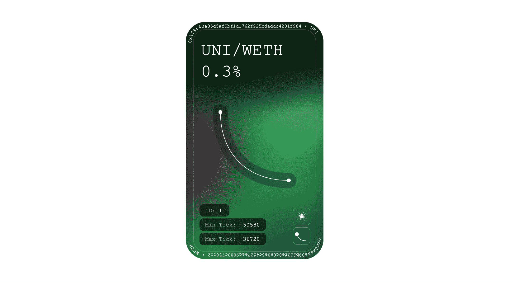

# Uniswap V3 NFT 头寸定价

> 原文：<https://medium.com/coinmonks/pricing-uniswap-v3-nft-positions-ad18608b8c81?source=collection_archive---------3----------------------->



Uniswap V3 NFT (Courtesy: Uniswap)

Uniswap V3 是多边形、以太坊、仲裁和乐观上最突出的 dex。但即使在 v3 池中锁定了超过 20 亿美元的流动性，也没有多少平台可以利用你的 NFT 头寸借入资产，以防有人需要资产来投资一个新的闪亮的 defi 项目，或者进入完全的 degen 模式并利用同一个 uniswap 池。

假设有两个令牌，令牌 a 和令牌 b。任何 2 个令牌在 uniswap 上都可以有 4 个池，按其费用等级区分。为了正确地给 v3 NFT 定价，需要以当前价格获取 NFT 头寸的可用代币数量。在不同的价格下，代币的比例将根据用户提供流动性的范围而不同。可以从 chainlink 或 twap oracle 获取 tokenA 和 tokenB 的当前价格，假设价格分别为 priceA 和 priceB。

```
function getPrices(address tokenA, address tokenB) public view returns (uint priceA, uint priceB) { uint _priceA = priceFeed.price(tokenA);
    uint _priceB = priceFeed.price(tokenB);

    priceA = 1 * 10**IERC20(tokenA).decimals();
    priceB = _priceB * IERC20(tokenB).decimals()/_priceA;}
```

这样得到的 priceA 和 priceB 是，如果 tokenA 的价格是 1 个单位，那么等价 tokenB 是多少，根据价格，它将帮助我们计算比率。

现在，我们计算用于在 Uniswap V3 中处理价格的 **sqrtPriceX96** ，首先我们需要计算价格比率的平方根，然后乘以 2**96，将其转换为 V3 中使用的定点表示。

```
function _sqrt(uint _x) internal pure returns(uint y) {
    uint z = (_x + 1) / 2;
    y = _x;
    while (z < y) {
        y = z;
        z = (_x / z + z) / 2;
    }
}function getSqrtPriceX96(uint priceA, uint priceB) public view returns (uint) {
    uint ratioX192 = (priceA << 192) / priceB;
    return _sqrt(ratioX192);
}
```

因此，现在我们有了基于 tokenA 和 tokenB 的 pricefeed 价格的当前 sqrtPriceX96。Uniswap V3 池中的价格范围按分笔成交点划分，以管理分笔成交点之间的集中流动性。给定 sqrtPriceX96，我们现在将计算价格的分笔成交点(这将是较低的分笔成交点)。可以使用 Uniswap TickMath 库获取，这里是相关函数的链接[https://docs . unis WAP . org/protocol/reference/core/libraries/tick math # gettickatzqrtratio](https://docs.uniswap.org/protocol/reference/core/libraries/TickMath#gettickatsqrtratio)

```
function getTick(uint160 sqrtPriceX96) public view returns (int24 tick) {
    tick = TickMath.getTickAtSqrtRatio(sqrtPriceX96);
}
```

在获得分笔成交点后，我们将从 Uniswap V3 头寸管理器中获取头寸的下限、上限分笔成交点和流动性金额。使用此流动性数量、下限价格点、上限价格点和之前计算的价格点，根据我们头寸的价格计算当前价格点的 tokenA 和 tokenB 的数量，使用 uni swap[https://docs . uni swap . org/protocol/reference/periphery/libraries/LiquidityAmounts # getamountsforliquidity](https://docs.uniswap.org/protocol/reference/periphery/libraries/LiquidityAmounts#getamountsforliquidity)提供的 liquidity amounts 库

```
function tokenAmounts(int24 tick, uint tokenId) public view returns(uint amountA, uint amountB) {
    (,,,,,int24 tickLower, int24 tickUpper,uint liquidity,,,uint128 feeA,uint128 feeB) = uniNFTPosManager.positions(tokenId);
   (amountA, amountB) = LiquidityAmounts.getAmountsForLiquidity(
      TickMath.getSqrtRatioAtTick(tick),
      TickMath.getSqrtRatioAtTick(tickLower),
      TickMath.getSqrtRatioAtTick(tickUpper),
      liquidity
    );
}
```

现在我们有了当前价格头寸的 tokenA 和 tokenB 的数量，然后我们可以将它们各自的价格相乘，得到 **V3 NFT 头寸的实际价格。**

```
function getActualPrice(uint amountA, uint amountB, address tokenA, address tokenB) public view returns (uint price) { price = amountA*priceFeed.price(tokenA) + amountB*priceFeed.price(tokenB);}
```

现在，我们有了 NFT 代币的价格，我们可以用它来创造借贷市场或由 Uniswap V3 NFT 担保的稳定的货币。这是回购的链接，其中包含 Uniswap V3 NFTs 的定价代码[https://github.com/0xparashar/UniV3NFTOracle](https://github.com/0xparashar/UniV3NFTOracle)

如果有什么问题，请在 https://twitter.com/AnkitParashar 的[给我打电话或者发一个公关。](https://twitter.com/AnkitParashar)