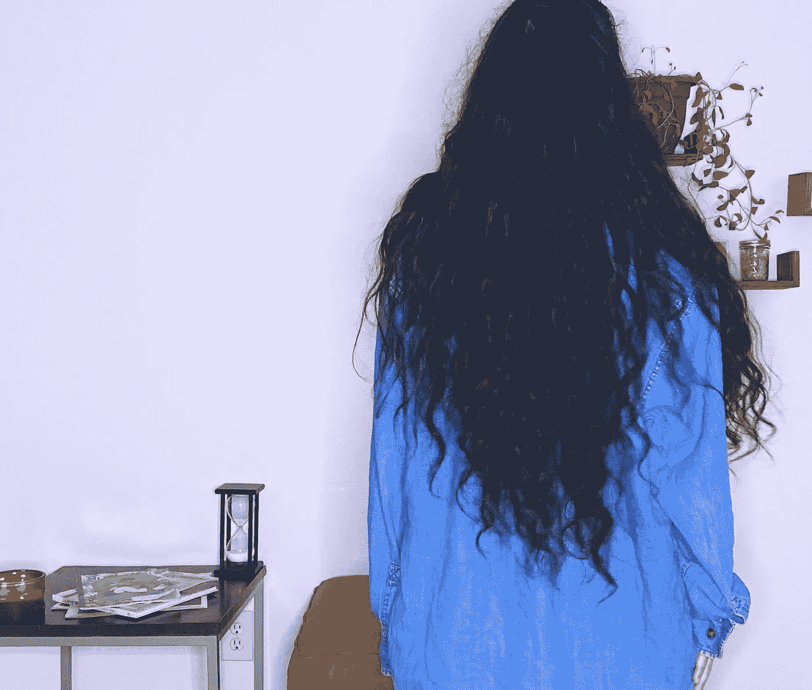
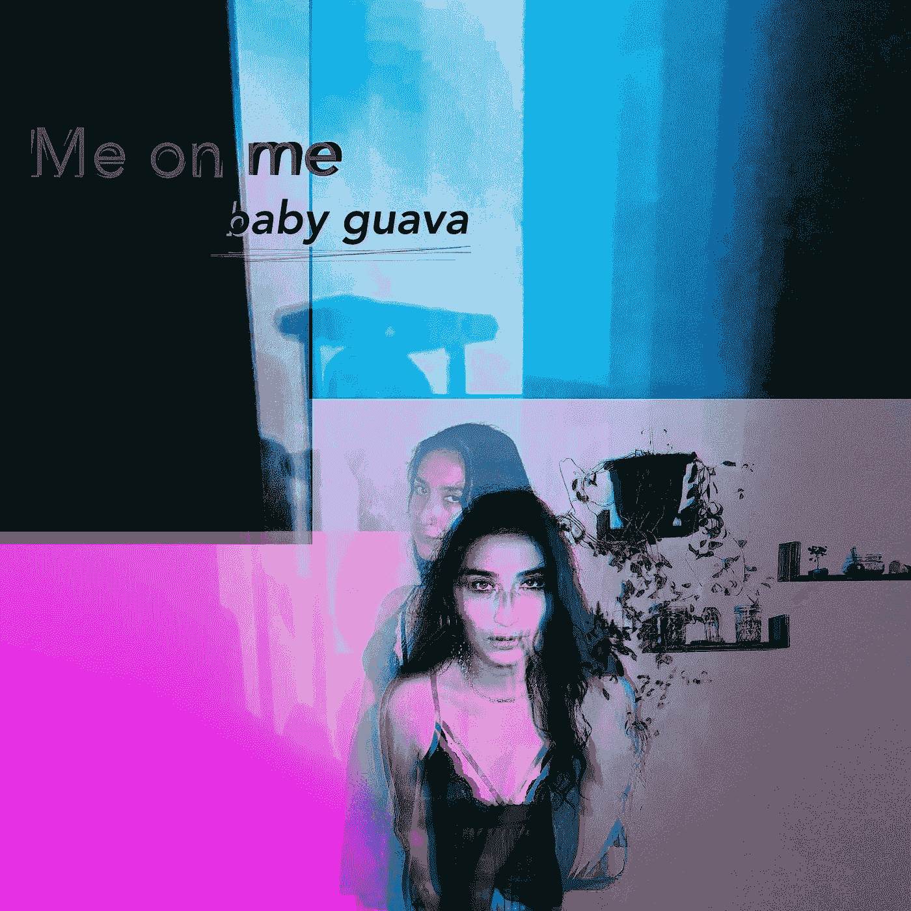
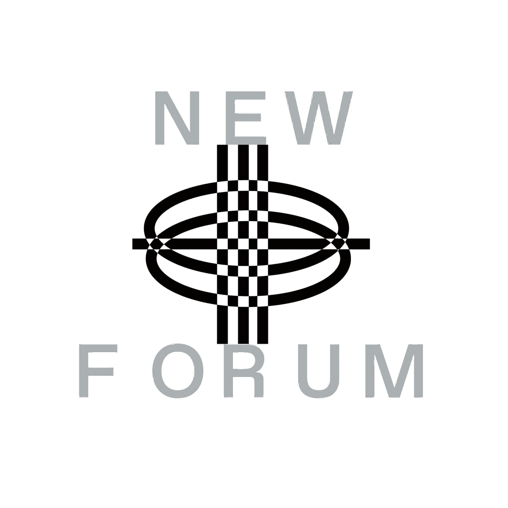

# Princesa7 分享音乐 NFTs 经验，NFTs 和 Web3 社区对创作者经济的影响

> 原文：<https://medium.com/coinmonks/princesa7-shares-music-nfts-experience-the-impact-of-nfts-web3-communities-on-the-creator-e93172a422b4?source=collection_archive---------62----------------------->

Princesa7 | Multidisciplinary Artist | Founder Of [@7laelia7](https://twitter.com/7laelia7) & Founding Member Of Protein

Princesa7 加入了我们的新论坛的另一个信息丰富和鼓舞人心的插曲。Princesa7 是一位多学科艺术家，也是蛋白质的创始成员。在她的采访中，我们谈到了 Web3 社区，他们即将推出的首张 Web2 mixtape——princesa _ speaking . zip，他们其他令人兴奋的项目，以及他们作为蛋白质一部分的经历。

Princesa7 对健康和社区护理充满热情，并发起了一项名为 Laelia(发音为 LEE-lee-ah)的倡议，旨在弥合精神、健康和社会影响之间的差距，以及如何将其应用于 Web3 文化。

# 公主 7 号是怎么掉进 NFT 和韦伯的兔子洞的？

Princesa7 分享说，他们的导师有一个名为 Swopes So Dope 的播客；在成为他们的导师之前，他们有一天听了她的播客，意识到他们以一种无法描述的方式与她产生了共鸣。

> “我上了她的网站，她有一个基本上正在进行的导师项目；当我申请她的导师项目时，感觉像是在瞎猜，因为她接受申请，但不接受新的学员，而碰巧她决定接受我……”——Princesa 7

普林塞萨和她的导师开始每月通电话，在电话中，她帮助他们回到作为自由职业者或签约艺术家的正轨。在整个旅途中，她也给了公主许多很好的建议。据普林塞萨说，她的导师登上了他们的船，并向他们解释了 NFTs 这是她 NFT 之旅的开始。

Princesa7 分享了更多关于她网络 3 转型的故事，并对在整个采访过程中握着她的手的每一个人给予了赞扬。

她还谈到了她是如何偶然发现社交令牌的，这些令牌让她加入了一个名为模糊界限的不和谐社区，从那里，一个机会导致了另一个机会。

我们喜欢在 Web3 中听到这样的故事，因为我们是一个面向社区的空间。

# **Princesa7 分享了她放弃音乐 NFTs 的经历以及她从那次经历中得到的感悟。**

Princesa7’s Cover Art For Their Recent Music NFT Drop

他们分享说，他们学到了很多关于 NFT 音乐社区的东西，虽然它可能不是全面紧密的，但至少在她的朋友圈子里是这样；拉塔莎、伊玛妮、萨西以及其他在 Web3 中获得全职工作的人。

普林塞萨谈到了他们所在的音乐 NFT 社区，表达了他们中的大多数人对经济解放有着相似的意图。他们补充说，其他独立艺术家也觉得他们正在努力改变。作为独立艺术家，他们学到了很多个人责任；当涉及到与他们的朋友一起工作，并弄清楚如何不仅考虑他们的需要，而且考虑工程师、摄像师和服装设计师的需要。

> “国家艺术基金会给了很多人自由，让他们可以通过支持他们艺术作品的人来增加预算，而不是去申请资助或做一些类似的零工。它留下了很多时间来制作我们设想的那种音乐，但这真的是一个合作的空间……”——princesa 7

# 我们邀请 Princesa 7 分享他们作为蛋白质一部分的经历？

> “我对蛋白质的体验非常有活力，总体上是积极的……”——princesa 7

他们在蛋白质公司工作的经历教会了她一些关于自然道的事情；

*   有时区差异，有和兼职的人一起工作，所以有与人接触的问题，当有人有空回答你的问题时，不管它对你来说有多紧急。
*   有一个第一次做一件事的刀的问题。他们进一步解释说，他们正在做一个独立的蛋白质研究承包商项目，这是他们第一次做这样的事情，所以一路上会有打嗝。

Princesa 7 认为成为任何 DAO 的一部分都是对性格的真正考验，并在她的完整采访中更多地谈到了她在 Protein 工作的经验和积累的教训。

“在 Web2 内部创建了 Protein 组织的人之前没有做过 Web3 DAO。作为一名创始成员，我之前也没有用过 DAO，所以这是一系列的第一次，这需要一定程度的耐心，我觉得这是主要的教训，因为它带来了所有的美……”—princesa 7

Princesa 7 分享了她对类似 DAO 的结构如何支持创作者并消除 NFTs 成为炒作经济的担忧的观点。他们也分享了决定加入道成为艺术家的个人原因。

在这一集的结尾，Princesa7 一头扎进了他们的倡议 Laelia 背后的使命和愿景；弥合社会影响、心理健康和健康之间的差距。他们还分享了他们正在开发的令人兴奋的产品和服务项目。

> “我创造艺术，提供个性化、基于咨询的健康服务”

[加入社区](https://twitter.com/newforum_nco)了解[@](https://twitter.com/provenauthority)[7 babyguava 7](http://twitter.com/7babyguava7)并发现 web3 社区中的其他创始人和远见者！

✨Follow 公主和莱莉娅！✨

推特:[@](https://twitter.com/provenauthority)[7 baby guava 7](http://twitter.com/7babyguava7)|[@](https://twitter.com/discoxyz)[7 laelia 7](http://twitter.com/7laelia7)insta gram:@[7 baby guava 7](http://instagram.com/7babyguava7)| @[7 laelia 7](http://instagram.com/7laelia7)Linktree:[https://linktr.ee/7laelia7](https://linktr.ee/7laelia7)

#新论坛#网络 3 #音乐论坛#道#社区#创造经济

爱 x 新论坛

# Twitter @newforum_nco

不和谐[@加入](https://discord.gg/DHepA4WTkN)

# 新论坛

[NewForum](https://newforum.notion.site/newforum/Welcome-to-NewForum-48f9661398ec4ec6a1af37fcc96dc926) 由 [Newcoin Foundation](https://newcoin.org/) 提供支持，专注于促进去中心化社交应用的扩展，也被称为 Social 3.0，形成一个生态系统和一个由远见者、创造者和投资者组成的社区。它为思想者提供了一个安全的交流、传播和分享思想的空间，以确保一个新网络的自觉和道德发展，嵌入关怀、自由和创造力的价值观。✨每周新集！在 [Twitter](https://twitter.com/newforum_nco) 、 [Newlife](https://newlife.io/) 、 [Youtube](https://www.youtube.com/channel/UCWvHyau1nIJBffmaaj6FmbQ) 和 [LinkedIn](https://www.linkedin.com/showcase/newforum/) 上关注我们，了解 web3 的更多信息，认识生态系统！加入生态系统[不和](https://discord.gg/DHepA4WTkN)！

> *加入 Coinmonks* [*电报频道*](https://t.me/coincodecap) *和* [*Youtube 频道*](https://www.youtube.com/c/coinmonks/videos) *了解加密交易和投资*

# 另外，阅读

*   [Bookmap 点评](https://coincodecap.com/bookmap-review-2021-best-trading-software) | [美国 5 大最佳加密交易所](https://coincodecap.com/crypto-exchange-usa)
*   最佳加密[硬件钱包](/coinmonks/hardware-wallets-dfa1211730c6) | [Bitbns 评论](/coinmonks/bitbns-review-38256a07e161)
*   [新加坡十大最佳加密交易所](https://coincodecap.com/crypto-exchange-in-singapore) | [购买 AXS](https://coincodecap.com/buy-axs-token)
*   [红狗赌场评论](https://coincodecap.com/red-dog-casino-review) | [Swyftx 评论](https://coincodecap.com/swyftx-review) | [CoinGate 评论](https://coincodecap.com/coingate-review)
*   [投资印度的最佳密码](https://coincodecap.com/best-crypto-to-invest-in-india-in-2021)|[WazirX P2P](https://coincodecap.com/wazirx-p2p)|[Hi Dollar Review](https://coincodecap.com/hi-dollar-review)
*   [加拿大最佳加密交易机器人](https://coincodecap.com/5-best-crypto-trading-bots-in-canada) | [库币评论](https://coincodecap.com/kucoin-review)