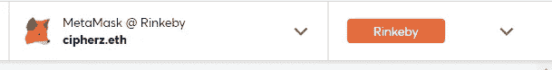

# 生产合同安全性—第 2 部分

> 原文：<https://medium.com/coinmonks/production-contract-security-part-2-b631a67b6b4e?source=collection_archive---------17----------------------->

现在，您对什么是 multisig 以及它如何帮助您有了基本的了解，让我们实际设置一个。我将带你在 Rinkeby 上设置一个，但在 Homestead 或任何其他受支持的链上的过程是相似的。

# 灵知安全

*Gnosis Safe* 大概是之前钱包上最流行最安全的 multisig 了。据我所知，它没有被黑客攻击，这是我所使用的。头转向[https://gnosis-safe.io/app/welcome](https://gnosis-safe.io/app/welcome)开始。接下来，将您的元掩码钱包连接到`Rinkeby`，并连接您想要使用的地址。请注意，您将需要 Rinkeby test eth 来将保险箱部署到链中——这毕竟是一个智能契约。

*如果你需要一些 Rinkeby eth，这是我最近找到的最好的地方——*[https://rinkebyfaucet.com/](https://rinkebyfaucet.com/)

一旦您连接了 eth 和元掩码，请确保您的钱包已连接，并且您已在右上角的网络列表中选择了正确的网络。

现在 Gnosis 知道了将保险箱部署到哪个网络以及谁将部署它，在欢迎页面上选择`Create new Safe`选项。

—

一旦您选择创建一个新的保险箱，将会出现一个向导来引导您完成这个过程。

*   将网络验证为 Rinkeby
*   给你的保险箱命名——它不能放在区块链上。这对你来说只是个方便
*   所有者和确认—您可以在这里添加保险箱的所有者和所需的签名比例，以便执行交易。我们将使用当前连接的 web3 帐户作为所有者，并将所需的确认设置为 1，因为此时我们是唯一的所有者。如果对你有帮助的话，你也可以为你的所有者帐户添加一个更加用户友好的名称关联
*   完成上述操作后，您将看到一个摘要和将保险箱部署到区块链的选项。它应该看起来像这样。

*   点击`Create`,它会打开 Metamask 让你签名并支付部署费用。一旦你确认了交易，它就被挖掘了，你现在应该有一个全新的`Gnosis Safe`可以玩了。部署完成后——确保单击`Get Started`将保险箱加载到 UI 中。成本非常低，而且我非常确定 Gnosis 使用了`Minimal Proxy`设计——如果你感兴趣，我这里有一篇关于它的文章[。](https://blog.originprotocol.com/a-minimal-proxy-in-the-wild-ae3f7b8da990)

你应该可以在左边的导航栏中看到你部署的 gnosis safe，但是有时候 gnosis 会出现缓存或其他问题。**如果你在那条船上，这篇文章应该能帮到你。**

# *酷…现在怎么办？*

*所以，你有一个多重信号，现在呢？你能用它做什么？嗯，你可以做的一件事就是把你的资产储存在里面——就像你储存其他资产一样。唯一的问题是，现在，你可以选择多人对钱包外的转账是否有效发表意见，而且你不会冒单个受损账户耗尽你的个人或公司资金的风险。然而，为了实现这一点，我们需要向 multisig 添加另一个签名者，因为我们在设置它时只添加了一个签名者。*

> **交易新手？试试* [*密码交易机器人*](/coinmonks/crypto-trading-bot-c2ffce8acb2a) *或* [*复制交易*](/coinmonks/top-10-crypto-copy-trading-platforms-for-beginners-d0c37c7d698c)*

# *添加其他签名者*

## *硬件钱包*

*在我们开始添加另一个签名帐户之前，我想备份并推荐您集成使用硬件 [Ledger Nano S](https://shop.ledger.com/products/ledger-nano-s) 而不是简单的 Metamask 帐户签名——它简单、便宜、安全，并且相对易于使用。我从 2017 年开始使用它们，从未有过更换的理由。买一个 3 包，给你的团队使用——我不会添加一个没有硬件钱包的签名者。所以，话虽如此，我们继续。*

## *种子期监管*

*我说过我会继续，但我撒谎了。我想让你明白签名者在这个多重签名中的作用有多重要。不仅您的 multisig 上的每个签名者都应该有一个硬件钱包，而且他们应该实践安全卫生，以确保他们支持设备的种子短语不会丢失或被盗。这个种子短语比设备本身更重要，因为它允许您恢复任何硬件或软件钱包并签署交易。这里有一些好的建议，如果使用正确的组合应该让你晚上睡得好。确保每个团队成员都遵守这个标准。*

*   *把你的种子短语放在银行的保险箱里*
*   *和*
*   *将你的种子短语放在银行的密码保护 u 盘上*
*   *把你的钥匙分成碎片，把其中的一部分交给你信任的人来保管*
*   *有创意，但不要把它存放在网上或不安全的地方*

## *添加另一个签名者——这次是真的*

*一旦您确定您的共同签名人已保护了他们的签名地址，您就可以将他们添加到 multisig。为此，选择您新创建的 multisig，向下滚动并选择`Settings`，向下滚动到`Owners`并选择它。您应该会看到类似这样的内容。*

**

*选择`Add new owner`，它会引导你添加新的签名人。这些步骤是*

*   *添加人类可读的名称和地址*
*   *设置必需的签名—让我们将确认设置为 2/2，这样所有签名者都必须签名，以便我们进行测试*

*您应该有一个如下所示的对话框*

**

*注意我是怎么加的`mark.cipherz.eth`？这是一个 ENS(以太坊名称服务)子域的例子，如果您的签名者是您组织的一部分，那么为他们分配子域可能是一个好主意。*我们将在后面的文章中讨论 ENS 和子域。现在，不要担心，想叫你的第二个签名人就叫吧。**

*点击`Submit`，签署后续 Metamask 交易。请注意，您必须使用部署 multisig 时使用的同一帐户进行连接，因为您正在修改 onchain 合同以包括签名人并更改所需的最少签名。完成后，您应该会看到类似这样的内容。*

**

*如果您再次转到`Owners`，您将看到添加了新的签名人。*

**

# *试驾一下吧*

*因此，我们现在在 Rinkeby 上有了一个具有多个签名者的功能性多重签名。我们现在将做一个简单的测试，使用它安全地存储一些 Rinkeby eth，并将其转移到我们选择的地址。这涵盖了我们在[上一篇文章](https://cipherz.medium.com/production-contract-security-part-1-81583b7bde75)中谈到的`Asset Risk`。首先，让我们将一些 Rinkeby eth 转移到 multisig 地址，并验证它是否出现在我们的余额中。要获取部署地址，请单击左侧窗格中合同旁边的`copy`图标。*

**

*现在你有了一个 multisig 地址，通过一个基金账户转移一些 Rinkeby eth 到这个地址。即。原始部署帐户。我会等…*

**注意，复制的地址前面会有一个* `*rink:*` *前缀——这是一个很好的安全预防措施，可以强制您再次检查地址。**

*现在，您应该可以在 multisig 中看到一个余额。在这种情况下，我转移了如下所示的. 5 eth。*

**

*现在，您一直在等待的时刻到了—执行需要多个签名者的交易…*

*导航至`Assets -> Coins`并点击出现在 eth 天平上的`Send`按钮。*

**

*填写转账信息—您可以将它发送给任何人或任何您想要的东西，但我将它发送回我自己，如下所示。*

**

*点击 Review 并查看交易摘要—一旦您确认无误，点击`Submit`并用 metamask 在交易上签名。如果您是精英中的一员，请不要忘记批准您的硬件钱包。您应该会看到一个如下图所示的屏幕，表明所需的 2 人中有 1 人已经签署了交易。*

**

*然后，您可以在浏览器中复制当前 url，并将其发送给需要签名的人。他们将看到一个类似的页面，但能够确认交易(请注意，您已经签署，该选项现在是灰色的)*

**

*最后一个签名者可以选择执行交易，但是如果他们是小气鬼，他们可能会委托另一个签名者来执行交易。*

**

*一旦他们提交并且一个签名者执行(支付)交易，您就完成了。查看下面的已执行交易摘要，并验证您的余额，以查看 eth 是否已发送。*

**

# *结论*

*在本文中，我们设置了一个`Gnosis Safe`，向其中添加了另一个签名者，并利用两个签名者在 multisig 契约上执行了一个事务。这很简单，但在鲨鱼出没的 crypto 水域中非常强大。能够在一个钱包中托管资产，如 eth、erc20 令牌和 NFT(是的，您可以存储 NFT ),并且具有多签名者的灵活性，这是您和您的项目不可或缺的。在下一篇文章中，我们将更进一步，让我们的 gnosis safe `own`成为另一个契约，并使用多个签名者对其执行管理操作。在那之前，陶醉在你的知识中，祝贺你做得很好！*