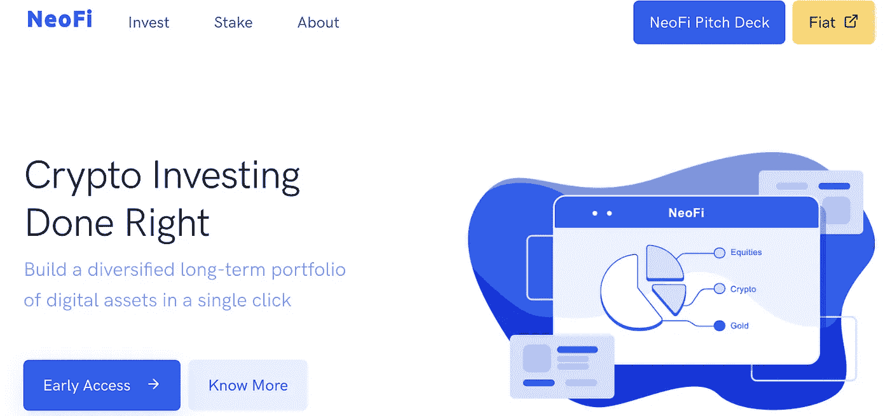

# 项目审查:NeoFi

> 原文：<https://medium.com/coinmonks/project-review-neofi-26f2c2e0869e?source=collection_archive---------51----------------------->

最近，我通过 [Zignaly 的](/coinmonks/project-review-zignaly-part-1-cd814fcc8dd6)launch pad([zig pad](https://zignaly.com/app/login/?ret=%2Fapp%2Fdashboard%2F))偶然发现了一个有趣的项目，名字叫 [NeoFi](https://neofi.app/index.html) ($NeoFi)。下面，我详述了我在我的 Twitter 帖子[上分享的一些想法，并详细回顾了这个项目。](https://twitter.com/ahmedashafi/status/1505958533661036544?s=20&t=0aKTfQezylgonZy21i8M9Q)

# 产品是什么？

NeoFi 的核心是其精心策划的长期加密投资组合产品，只需点击一下鼠标即可投资。潜在投资者可以从各种产品中进行选择，包括按市值排名的顶级项目、被动收入来源和/或主题投资(例如大量投资游戏、meta、oracles 等的投资组合)。此外，该平台允许你向专业交易员和风投模仿你的投资组合。

这些投资产品和策略是基于由专业交易员、对冲基金等开发、提炼和实施的经验。如果你喜欢自己去，该产品也为你开发自己的定制产品组合做好了准备。

最让我感兴趣的是，这些不是简单的买入并持有投资组合产品，而是专业的资产管理公司保持监督&算法不断模仿市场变化重新平衡投资组合。因此，如果资产 A 被指定为任何策划的投资组合的 25%，并且由于价格上涨而成为整个篮子的 35%，则算法将实现收益并再投资于其他组成投资组合资产，从而保持原始权重。这是主动管理的一个很好的例子，它确保跟踪误差——达不到基准回报的短缺风险——减少。

# **对谁有吸引力？**

我觉得这种产品类似于资产管理公司在菲亚特世界向股票和债券市场的投资者提供的产品。该剧主要是:

-增加多样化——这对于较小的投资组合是不可能的

-委托研究——这是小投资者不擅长的

-主动管理——小投资者几乎没有时间做这个。

我坚信 Neo Finance 提供的产品将像菲亚特资产管理公司一样吸引零售客户，像这样的项目将成为密码领域新零售的催化剂。原因是他们让外行人的加密变得简单&这就是加密投资的发展。分散的交易所很复杂，而集中的交易所解决了这个问题。现在，NeoFi 这样的服务是简化加密的下一个前沿。

# 代币呢？

$NeoFI 是整个生态系统的核心令牌。该团队在费用折扣方面为代币创造了效用，并增加了赌注/储蓄产品的 APY，同时还设置了一个消耗机制，以便代币保持紧缩状态。最重要的是，默认情况下，每个篮子都有 3%至 5%的 NeoFi 权重，这意味着管理下的更高资产不断创造对令牌和价格升值的需求。

除此之外，这项服务还不是免费的。作为中介，NeoFi 受益于固有的收入模式，从客户指导的经纪业务以及在客户和资产管理公司两端提供的服务中获利。这一点很重要，因为缺乏收入不是项目的出发点。这是一种爱好。

# 结论

在撰写本文时，IDO 将在几个小时后在 ZigPad 关闭，明天将在[MEXC Global](https://www.mexc.com/)&[Pancake Swap](https://pancakeswap.finance/swap)上市。在密码领域一些最强大的孵化器的支持下，这个项目是一个值得关注的项目，我的牛市论点主要是由他们专注于解决现实世界的问题并使其成为一个固有的收入模型。

> 免责声明:文章中提出的观点是作者的个人观点，不代表其雇主的观点，也不是财务建议。在投资或使用文中提到的任何产品之前，请做好自己的研究。作者可能会也可能不会投资于任何特定的产品。

> 加入 Coinmonks [电报频道](https://t.me/coincodecap)和 [Youtube 频道](https://www.youtube.com/c/coinmonks/videos)了解加密交易和投资

# 另外，阅读

*   [10 本关于加密的最佳书籍](https://coincodecap.com/best-crypto-books) | [英国 5 个最佳加密机器人](https://coincodecap.com/uk-trading-bots)
*   [Koinly 回顾](https://coincodecap.com/koinly-review) | [Binaryx 回顾](https://coincodecap.com/binaryx-review) | [Hodlnaut vs CakeDefi](https://coincodecap.com/hodlnaut-vs-cakedefi-vs-celsius)
*   [40 个最佳电报频道](https://coincodecap.com/best-telegram-channels) | [1xBit 回顾](https://coincodecap.com/1xbit-review) | [Keevo 钱包回顾](https://coincodecap.com/keevo-wallet-review)
*   [如何在印度购买以太坊？](https://coincodecap.com/buy-ethereum-in-india) | [如何在币安购买比特币](https://coincodecap.com/buy-bitcoin-binance)
*   [在美国如何使用 BitMEX？](https://coincodecap.com/use-bitmex-in-usa) | [BitMEX 评论](https://coincodecap.com/bitmex-review) | [买入索拉纳](https://coincodecap.com/buy-solana)
*   [德国最佳加密交易所](https://coincodecap.com/crypto-exchanges-in-germany) | [Arbitrum:第二层解决方案](https://coincodecap.com/arbitrum)