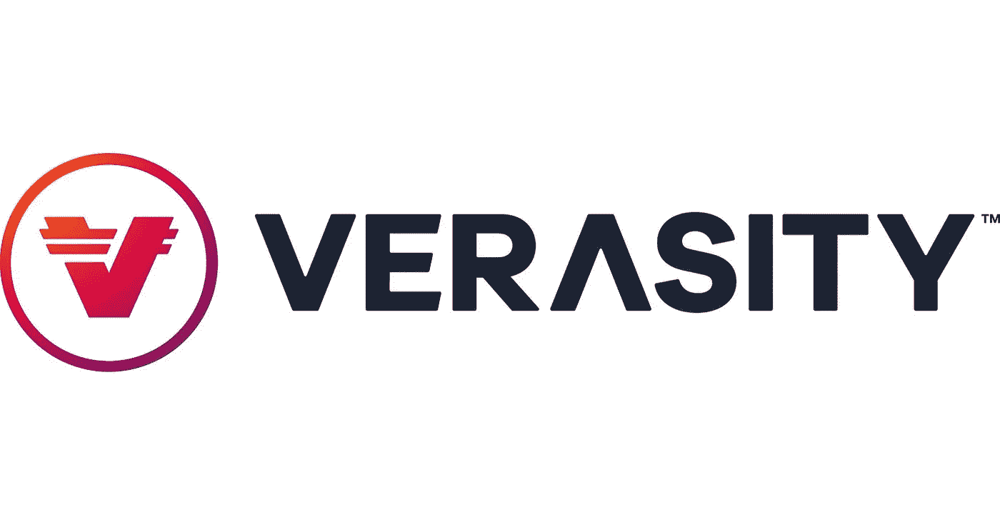

# 项目回顾:真实性-第 1 部分

> 原文：<https://medium.com/coinmonks/project-review-verasity-part-1-81b2ccb1699f?source=collection_archive---------48----------------------->

我一直对 rypto 项目感兴趣，这些项目在为它们的令牌创造效用的同时解决了现实世界的问题。我相信，在成千上万的项目中，这一特征是区分那些成功的人和那些落后的人的首要标准。一个这样的项目是[真实度](https://verasity.io/)。

作为一个基础设施，Verasity 旨在服务三个核心市场:电子竞技、广告技术和 NFT。所有这三个垂直市场在认证交换方面都提出了独特的挑战。让我们一个一个地简化它。

# 电子竞技

据估计，电子竞技产业是一个年收入 10 亿美元的庞然大物，并且呈现指数级增长。但问题是，收入是由出版商通过媒体吸引观众的能力驱动的，因为这涵盖了比赛的成本，包括锦标赛参与者的奖金。现在，如果观众身份没有得到认证，这就产生了搭便车的问题，并最终导致收入损失。类似地，如果只是机器人创造了浏览量，增加了参与者的回报，那么损失的还是发布者。

Verasity 通过为在他们的 [VeraEsports](https://verasity.io/esports) 门户网站上举办的锦标赛提供观看和赚取的前置广告来解决这一问题，你最初可以付费观看，并根据你的参与情况，获得奖励。这一举两得。身份验证从一开始就是基于区块链的，而奖励管理由于情绪驱动算法消除了欺诈风险。

# AdTech

据 Verasity [网站](https://verasity.io/adtech)报道，广告欺诈造成的损失可能很快达到 1000 亿美元。简单来说，广告欺诈是*“计算机生成的广告互动，旨在欺骗发布者和广告商，使其相信广告来自真实用户”*。这是一个真正的问题，而且比任何其他垂直行业都更严重，我认为这是真实性的最大价值所在。那么，他们如何解决这个问题呢？

答案是[获得专利的观看验证技术](https://verasity.io/documents/verasity_pov.pdf)，它能够对观众进行身份验证，同时检查参与度和其他参数，而不会干扰观众体验。然后，根据第三方&内部数据对该视图进行确证，以评定其真假，只有合法交易通过基于区块链的高速支付系统进行处理。这又一次一举两得。你有一个进入观众体验的认证入口，收入只为真实的观看付费，这与传统媒体相反，在传统媒体中，这些观看有机会被游戏化。

# 非同质化通证

这个垂直市场仍在发展中，但它要解决的问题是真实的。NFT 市场的增长意味着，它将催生机会主义者，这些人会试图欺骗买卖双方。Verasity 旨在将视图验证技术扩展到这一领域，在这一领域，NFT 艺术不仅得到了认证，而且卖家和列出艺术的市场也得到认证。虽然[的细节](https://verasity.io/nfts)还很粗略，因为产品仍在开发中，但这一想法似乎在一个几乎每个区块链项目都旨在推出自己的元宇宙的世界中有很多用处，这自然会成为更广泛的共享多元宇宙的一部分。

这就是产品。但是，[令牌](https://coinmarketcap.com/currencies/verasity/)呢？继续阅读[这里的](/@ahmedabidshafi/project-review-verasity-part-ii-6166266ef196)了解所有产品如何在代币&中反映出长期存在的价值。

> *免责声明:本文中的观点仅代表作者个人观点，不代表其雇主的观点，也不代表财务建议。在投资或使用文中提到的任何产品之前，请做好自己的研究。作者可能会也可能不会投资于任何特定的产品。*

> 加入 Coinmonks [电报频道](https://t.me/coincodecap)和 [Youtube 频道](https://www.youtube.com/c/coinmonks/videos)了解加密交易和投资

# 另外，阅读

*   [红狗赌场评论](https://coincodecap.com/red-dog-casino-review) | [Swyftx 评论](https://coincodecap.com/swyftx-review) | [CoinGate 评论](https://coincodecap.com/coingate-review)
*   [Bookmap 点评](https://coincodecap.com/bookmap-review-2021-best-trading-software) | [美国 5 大最佳加密交易所](https://coincodecap.com/crypto-exchange-usa)
*   [如何在 FTX 交易所交易期货](https://coincodecap.com/ftx-futures-trading) | [OKEx vs 币安](https://coincodecap.com/okex-vs-binance)
*   [CoinLoan 评论](https://coincodecap.com/coinloan-review) | [YouHodler 评论](/coinmonks/youhodler-4-easy-ways-to-make-money-98969b9689f2) | [BlockFi 评论](https://coincodecap.com/blockfi-review)
*   [XT.COM 评论](https://coincodecap.com/profittradingapp-for-binance)币安评论 |
*   [SmithBot 评论](https://coincodecap.com/smithbot-review) | [4 款最佳免费开源交易机器人](https://coincodecap.com/free-open-source-trading-bots)
*   [比特币基地僵尸程序](/coinmonks/coinbase-bots-ac6359e897f3) | [AscendEX 审查](/coinmonks/ascendex-review-53e829cf75fa) | [OKEx 交易僵尸程序](/coinmonks/okex-trading-bots-234920f61e60)