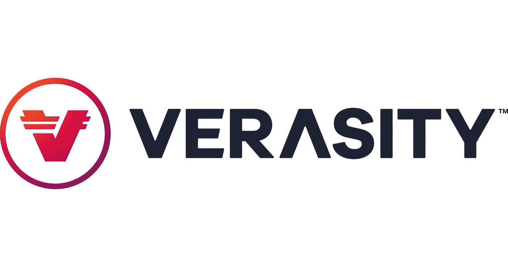

# 项目回顾:真实性—第二部分

> 原文：<https://medium.com/coinmonks/project-review-verasity-part-ii-6166266ef196?source=collection_archive---------53----------------------->

从长期来看，代币价格是代币本身价值的反映，从代币持有者的角度来看，代币本身的效用决定了代币的内在价值。在[真实度](https://verasity.io/)的案例中，我们知道产品本身有潜力对解决现实世界问题的三个不同垂直领域产生改变游戏规则的影响。像任何加密项目一样，Verasity 的团队试图通过让整个 Verasity 生态系统围绕 [$VRA](https://coinmarketcap.com/currencies/verasity/) 来标记这一价值命题，然后采取定位行动来添加这些实用功能。下面我们按照这些思路简化$VRA。

# 生态系统的燃料

在 Verasity 生态系统中，你需要完成的每一件事都离不开$VRA。除了作为治理和赌注协议的非常正常的效用之外，硬币还有许多适当的或预期的效用，以反映其所属生态系统的内在价值。

在电子竞技中，你使用$VRA 支付流媒体电子竞技赛事，并在$VRA 观看赛事获得报酬。该奖励可以兑换成现实世界的奖励。在 AdTech 内部，$VRA 是使用技术和进行收入支付的可接受的支付模式。接下来，很可能$VRA 也将成为即将到来的 NFT 核查协议的气体。

# 地区开发

真实吸引了 3 个不同的社区:游戏(电子竞技)、内容(广告技术)和艺术(非艺术)。这进一步细分为提供者和消费者:

-玩家、观众和主机(电子竞技)
-出版商、观众&主机(广告技术)
-艺术家、买家&主机(NFT)

所有的小组和子小组都代表了这个项目所服务的一个独特的领域&这已经为$VRA 带来了一个强大的社区追随者，随着项目的发展，这种追随者会随着时间的推移而增加。最终结果是这些子群体之间更多的合作努力，在真实生态系统之上建立他们的社区，这将导致对$VRA 的更多需求。

# 战略伙伴关系

该项目已达成各种战略合作伙伴关系，将知名品牌引入其平台，随着采用率的增长，将导致对$VRA 的更多需求。

一个例子是 PUBG，据估计，截至 2020 年 12 月，其日活跃用户数为 3000 万。在 Verasity 上举办的 PUBG 电子竞技比赛创造了对$VRA 的即时需求，随着采用率的增长，这种需求将会飙升。

第二个例子来自广告技术领域，是 Brightcove。同样，这是 70 多个国家的 3，000 家客户，他们正在寻找无缝的货币化基础设施，以防止广告欺诈和向数亿客户发布广告，并可以与 Verasity 的 watch and earn 协议集成。同样，由于$VRA 处于生态系统的核心，这创造了对代币的需求。

# 令牌组学

整体而言，将只会发行 100 亿美元的 VRA 代币(目前的供应量约为 45 亿)。凭借 2 亿美元的市值，token 可以轻松地在 5X 上市，但对于一项旨在解决垂直行业问题的技术来说，其估值仍然只有区区 10 亿美元，而这些垂直行业本身就是数十亿美元的行业。

# 结论

在我看来， ***不是财务建议，总是做自己的研究*** ，以上因素使$VRA 成为一个很好的长期赌注。随着采用的增加和生态系统中硬币效用的增加，可以推断价格行为将随之而来。如果是时间的问题。

> *免责声明:本文观点仅代表作者个人观点，不代表其雇主的观点，也不代表财务建议。在投资或使用文中提到的任何产品之前，请做好自己的研究。作者可能会也可能不会投资于任何特定的产品。*

> 加入 Coinmonks [电报频道](https://t.me/coincodecap)和 [Youtube 频道](https://www.youtube.com/c/coinmonks/videos)了解加密交易和投资

# 另外，阅读

*   [Bitsgap 审查](/coinmonks/bitsgap-review-a-crypto-trading-bot-that-makes-easy-money-a5d88a336df2) | [Quadency 审查](/coinmonks/quadency-review-a-crypto-trading-automation-platform-3068eaa374e1) | [Bitbns 审查](/coinmonks/bitbns-review-38256a07e161)
*   [密码本交易平台](/coinmonks/top-10-crypto-copy-trading-platforms-for-beginners-d0c37c7d698c) | [Coinmama 评论](/coinmonks/coinmama-review-ace5641bde6e)
*   [印度的加密交易所](/coinmonks/bitcoin-exchange-in-india-7f1fe79715c9) | [比特币储蓄账户](/coinmonks/bitcoin-savings-account-e65b13f92451)
*   [OKEx vs KuCoin](https://coincodecap.com/okex-kucoin) | [摄氏替代度](https://coincodecap.com/celsius-alternatives) | [如何购买 VeChain](https://coincodecap.com/buy-vechain)
*   [币安期货交易](https://coincodecap.com/binance-futures-trading)|[3 commas vs Mudrex vs eToro](https://coincodecap.com/mudrex-3commas-etoro)
*   [如何购买 Monero](https://coincodecap.com/buy-monero) | [IDEX 评论](https://coincodecap.com/idex-review) | [BitKan 交易机器人](https://coincodecap.com/bitkan-trading-bot)