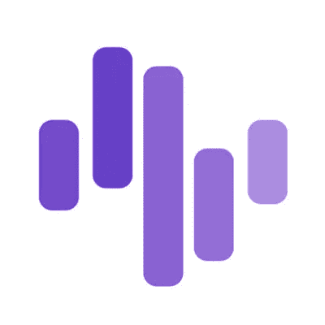

# 项目回顾:Zignaly —第 1 部分

> 原文：<https://medium.com/coinmonks/project-review-zignaly-part-1-cd814fcc8dd6?source=collection_archive---------34----------------------->

有数以千计的加密项目&每天都有大量的新项目推出，有时理解把辛苦赚来的钱放在哪里可能会令人生畏，尤其是如果你是这个领域的新手。这变得很棘手，因为社交媒体上充斥着人们的故事，通常是匿名的，他们在某个特定的硬币上赚了 100 倍(或他们声称如此)，并宣传下一个 100 倍，让你跳上马车。不是这样的，你经常会发现自己被熊市和牛市的争论、支撑线和阻力线、图表、工具和连锁数据搞糊涂了。

如果以上是你，我承认这是我进入这个空间时的我，放心。因为我在[zig analy](https://zignaly.com/)为你准备了终极加密入门包。在这里，我给你 3 个选择 Zignaly 作为平台开始你的加密之旅的主要理由。

# **1。解决问题**

为了成功，每个区块链项目都需要有一个用例。假设一家公司没有产品出售，没有生产设施，只有一个保存股东记录的办公室。你会投资这样一家公司的股票吗？答案是响亮的“不”。那么 Zignaly 是做什么的呢？嗯很多。

从最简单的意义上来说，Zignaly 是一个社交投资平台，它将投资者与代表投资者投资/交易的专业交易员联系起来，或者为他们提供信号，让他们自己进行交易，以换取利润分享或费用。你可以把它想象成一只共同基金或交易所交易基金(ETF ),但这是在一个分散的环境中。你投资传统的菲亚特共同基金和/或 ETF，因为你没有专业知识或时间来研究和交易标的股票。Zignaly 从加密的角度做了同样的事情，但不是给你一个投资的选择，而是提供了多种不同策略的选择，包括但不限于现货、期货、低/高频交易等。

通过利用 Zignaly 的平台，您可以选择与谁一起投资，选择什么样的策略，在 zig naly 的平台上，经过审查的交易者及其回报历史的资料会指导您做出最佳选择。这不是很神奇吗？嗯，是的，但这不是它的结束。

# **2。信任度较低的环境**

自中本聪撰写《比特币白皮书》以来，最大的野心就是创造一个信任度更低的金融系统。对于传统的法定共同基金或 ETF，你的钱在一家管理公司的控制之下，该公司可能会也可能不会把你的最佳利益放在心上(伯尼·麦道夫想起来了吗？)当然，作为一个刚刚起步的人，像你这样的人很难将你的资金交给笔记本电脑屏幕另一边的陌生人。输入 Zignaly。

根据利润分享协议，通过使用智能 API，Zignaly 确保您的资金始终安全地存放在您的交易所账户中。你投资的交易者不能控制你的资金，除了把它们投资到一个既定的策略上。这为创造经济交流的无信任环境创造了条件。在 Zignaly 的世界里，不需要 SEC 类型的监管机构来监管资产管理公司，但仍然会失败！

# **3。目标一致性**

最后，目标一致。在菲亚特的世界里，资产管理公司为其他投资者投资和管理基金。然而，他们很少投入自己的资金。其结果是一个委托代理问题，菲亚特世界试图通过无数昂贵而无效的监管监督来监管这个问题(问问任何人关于安然的情况)。在 Zignaly，专业交易者被要求说到做到。因此，你投资的任何交易者都不是在玩你的钱，而是通过把他们自己的钱投入到他们为你做的交易中来参与游戏(本质上，你是以一种自动化的无信任的方式进行复制交易，一个专业的交易者)。如果他为你输了，那他也是为自己输了。这种目标一致性保证了你和你投资的交易者的利益是一致的。这里没有华尔街的免费出狱卡！

可以推断，Zignaly 是一个伟大的产品，它解决了一个重要的空白，可以帮助你迈出加密的第一步，或者如果你太忙而无法全职交易。接下来，我将回顾一下 [$ZIG](https://coinmarketcap.com/currencies/zigcoin/) ，这是为 Zignaly 生态系统提供动力的硬币，它将让你深入理解为什么它应该是你投资组合的重要组成部分。

> 免责声明:文章中提出的观点是作者的个人观点，不代表其雇主的观点，也不是财务建议。在投资或使用文中提到的任何产品之前，请做好自己的研究。作者可能会也可能不会投资于任何特定的产品。

> 加入 Coinmonks [电报频道](https://t.me/coincodecap)和 [Youtube 频道](https://www.youtube.com/c/coinmonks/videos)了解加密交易和投资

# 另外，阅读

*   [7 个最佳零费用加密交易平台](https://coincodecap.com/zero-fee-crypto-exchanges)
*   [最佳网上赌场](https://coincodecap.com/best-online-casinos) | [期货交易机器人](/coinmonks/futures-trading-bots-5a282ccee3f5)
*   [去中心化交易所](https://coincodecap.com/what-are-decentralized-exchanges)|[Bitbns FIP](https://coincodecap.com/bitbns-fip)|[Bingbon 评论](https://coincodecap.com/bingbon-review)
*   [用信用卡购买密码的 10 个最佳地点](https://coincodecap.com/buy-crypto-with-credit-card)
*   [加拿大最佳加密交易机器人](https://coincodecap.com/5-best-crypto-trading-bots-in-canada) | [Bybit vs 币安](https://coincodecap.com/bybit-binance-moonxbt)
*   [阿联酋 5 大最佳加密交易所](https://coincodecap.com/best-crypto-exchanges-in-uae) | [SimpleSwap 评论](https://coincodecap.com/simpleswap-review)
*   购买 Dogecoin 的 7 种最佳方式
*   [最佳期货交易信号](https://coincodecap.com/futures-trading-signals) | [流动性交易所评论](https://coincodecap.com/liquid-exchange-review)
*   [用于 Huobi 的加密交易信号](https://coincodecap.com/huobi-crypto-trading-signals) | [Swapzone 审查](/coinmonks/swapzone-review-crypto-exchange-data-aggregator-e0ad78e55ed7)
*   最佳[密码交易机器人](https://coincodecap.com/best-crypto-trading-bots) | [购买索拉纳](https://coincodecap.com/buy-solana) | [矩阵导出评论](https://coincodecap.com/matrixport-review)