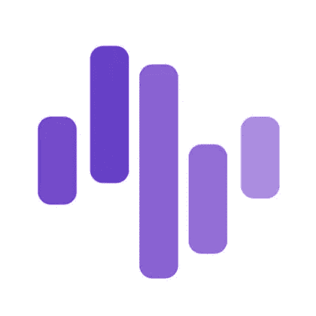

# 项目回顾:Zignaly —第 2 部分

> 原文：<https://medium.com/coinmonks/project-review-zignaly-part-2-31932e54c0d4?source=collection_archive---------44----------------------->

我相信你已经带着嫉妒的心情听说过，一些人投资了一种闻所未闻的股票或硬币，当它成为街谈巷议的话题时，他们是如何成为百万富翁的。之前，我们回顾了为什么对于刚开始从事加密工作的人来说, [Zignaly](https://zignaly.com/) 平台是一个很好的产品。今天，我们深入探讨为什么你应该在你的投资组合中持有 [$ZIG](https://coinmarketcap.com/currencies/zigcoin/) ，这是支持 Zignaly 生态系统的硬币，有三个原因。

1.  **多种用例**

大多数硬币的问题在于它们缺乏任何真正的实用性。用简单的经济学术语来说，任何没有效用的资产都没有内在价值，除了市场赋予它的价值。不是用$ZIG。Zignaly 的人们非常聪明，已经围绕$ZIG 开发了整个生态系统，这是生态系统的本地货币。

通过在 ZIG 金库中持有您的$ZIG 硬币，您可以通过下注自动获得被动收入(更多$ZIG！)并获得奖励(Zig Vault 项目——免费获得其他项目的代币！).更重要的是，您可以付费使用该平台(打折！)在一家新的公用事业公司下，投标那些打算筹集资金来启动自己的生态系统的经过审查的项目(这太早了！).这仅仅是该团队倡导在不久的将来推出多个其他实用程序的开始。

**2。收入增长**

收入很少或没有收入的项目最终会失败或成为迷因。无论你创造了多少效用，都必须有一个潜在的创收战略来维持持续的发展&帮助创造驱动生态系统的硬币的内在价值。这就是为什么在目前的牛市中(或者说不管剩下的是什么)，兑换硬币有着惊人的表现。

以 Zignaly 为例，在 5 月 21 日的崩盘和 11 月 21 日的高峰之间，Zignaly 的活跃用户数量从 6 万增长到了 35 万。根据一些估计，截至本文撰写之时，注册用户数量为 400，000！

随着新零售进入这个领域&他们中的大多数人预计会看到复制交易的价值，你可以预计用户群的这种增长趋势将继续下去。Zignaly 的收入模式主要是从支付给交易员的成功费用中抽取一部分&通过经纪人计划赚取回扣，他们是定向交易的一部分。更多的用户意味着平台更多的收入，因为他们从更高的副本交易量中获利——所有这些最终都反映在$ZIG 的价格上，因为整个生态系统都围绕着它。

**3。社区建设**

社交投资平台是伟大的社区建设者，不仅仅是底层平台，还有所有与之相关的人。这个过程是互利的，因为平台和与之相关的所有人都相互受益。

在 Zignaly 的案例中，您有:

*   如果他们各自的社区或潜在的社区成员通过 Zignaly 渠道来，通过提供回扣和折扣，在 Zignaly 生态系统之上建立他们的社区的专业交易者试图吸引更多的副本交易者；
*   Zig Vault 项目将已建立的 Cyrpto 项目社区吸引到平台上，在那里他们可以持有$ZIG 并免费获得他们所代表或感觉最强烈的加密货币；
*   Zig Pad 将早期项目社区吸引到平台上，他们可以持有$ZIG，并在他们一直渴望进入市场的项目的 IDO 上咬一口。更重要的是，随着平台在 healthy APR 的[(第一个是提供 1700%的 APR)](https://twitter.com/zignaly/status/1498560890773417984?s=20&t=RAGP9mIsZ1tkR4fLHyhCig) 为这些启动平台项目启动赌注和奖励池，这些社区有动力继续参与平台和$ZIG。

所有这些有什么用？这是简单的需求和供给。$ZIG 是所有社区建设和互动的核心，由于供应有限且受制于缓慢的发布时间表，平台为$ZIG 提供的效用越多，用户的需求就越高，持有他们的硬币的倾向就越高，从而进一步减少供应以进行积极的交易。这一点在$ZIG 交易的集中交易所的巨大买卖价差中得到了强烈的反映。更重要的是，该项目正在进行强制性的每月回购和燃烧，从而进一步削减供应。最终结果？供应冲击来了！

**结论**

虽然估值指标很棘手，尤其是在高波动性的加密领域，但没有理由认为上述所有因素不会对$ZIG 的价格产生积极影响。不是财务建议，总是做自己的研究，但目前的估值为长期持有人提供了显著的上升空间，这就是为什么$ZIG 是我最大的投资组合，因为上面讨论的基本面。

在本文“付印”时，Zignaly 已经[宣布](https://www.coindesk.com/business/2022/03/03/crypto-investment-platform-zignaly-secures-up-to-50m-in-financing-deal/)总部位于卢森堡的 GEM 将注入 5000 万美元的新资金，为其不断增长的合作伙伴、投资者和支持者名单增添新成员。根据团队的说法，[这些资金主要用于进一步的项目开发活动，包括技术开发、研究、广告、团队建设和加强生态系统的法律方面。目标？](/zignaly/zignaly-secures-50-million-in-funding-8cf6b0e7ddeb)

**“让 Zignaly 成为世界上任何地方任何人的最佳社交投资平台”**

> 免责声明:文章中提出的观点是作者的个人观点，不代表其雇主的观点，也不是财务建议。在投资或使用文中提到的任何产品之前，请做好自己的研究。作者可能会也可能不会投资于任何特定的产品。

> 加入 Coinmonks [电报频道](https://t.me/coincodecap)和 [Youtube 频道](https://www.youtube.com/c/coinmonks/videos)了解加密交易和投资

# 另外，阅读

*   [ProfitFarmers 回顾](https://coincodecap.com/profitfarmers-review) | [如何使用 Cornix Trading Bot](https://coincodecap.com/cornix-trading-bot)
*   [如何匿名购买比特币](https://coincodecap.com/buy-bitcoin-anonymously) | [比特币现金钱包](https://coincodecap.com/bitcoin-cash-wallets)
*   [瓦济里克斯 NFT 评论](https://coincodecap.com/wazirx-nft-review) | [比茨盖普 vs 皮奥克斯](https://coincodecap.com/bitsgap-vs-pionex) | [坦吉姆评论](https://coincodecap.com/tangem-wallet-review)
*   [如何使用 Solidity 在以太坊上创建 DApp？](https://coincodecap.com/create-a-dapp-on-ethereum-using-solidity)
*   [币安 vs FTX](https://coincodecap.com/binance-vs-ftx) | [最佳(SOL)索拉纳钱包](https://coincodecap.com/solana-wallets)
*   如何在 Uniswap 上交换加密？ | [A-Ads 审查](https://coincodecap.com/a-ads-review)
*   [加密货币储蓄账户](/coinmonks/cryptocurrency-savings-accounts-be3bc0feffbf) | [YoBit 审核](/coinmonks/yobit-review-175464162c62)
*   [Botsfolio vs nap bots vs Mudrex](/coinmonks/botsfolio-vs-napbots-vs-mudrex-c81344970c02)|[gate . io 交流回顾](/coinmonks/gate-io-exchange-review-61bf87b7078f)
*   [CoinFLEX 评论](https://coincodecap.com/coinflex-review) | [AEX 交易所评论](https://coincodecap.com/aex-exchange-review) | [UPbit 评论](https://coincodecap.com/upbit-review)
*   [AscendEx 保证金交易](https://coincodecap.com/ascendex-margin-trading) | [Bitfinex 赌注](https://coincodecap.com/bitfinex-staking) | [bitFlyer 点评](https://coincodecap.com/bitflyer-review)