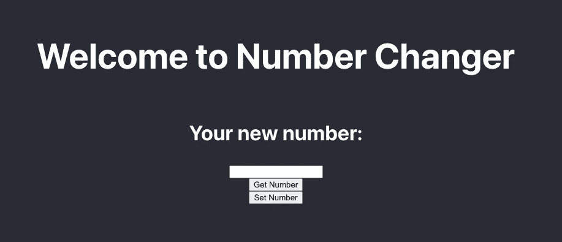

# 使用 Hardhat & Truffle 的项目设置—第 5 部分

> 原文：<https://medium.com/coinmonks/project-setup-using-hardhat-truffle-part-5-2d66dbc2c3c3?source=collection_archive---------5----------------------->


Photo by [Mahesh Ranaweera](https://unsplash.com/@mahesh_ranaweera?utm_source=medium&utm_medium=referral) on [Unsplash](https://unsplash.com?utm_source=medium&utm_medium=referral)

对于这个项目的最后一部分，我们将使用 React 将我们的合同连接到前端。因为这是关于编写智能合同的，所以我们不会过多地设计页面样式。

# 块菌前端设置

## 清单

这里是连接到前端之前的快速检查列表

*   加纳切还在跑
*   我们的合同被编译， ***build*** 目录在我们的 ***src*** 目录下
*   在另一个终端，切换到本项目的 ***src*** 目录

```
cd truffle-example/src
```

*   运行 ***npm start*** 以确保 React 正在工作，您应该得到类似于以下内容的内容:

```
Compiled successfully!You can now view truffle-example in the browser.Local:            http://localhost:3000On Your Network:  http://192.168.5.107:3000Note that the development build is not optimized.To create a production build, use yarn build.
```

现在一切都设置好了，让我们将前端连接到我们的契约

在 ***src*** 下，找到文件 ***App.js*** ，默认代码应该是这样的:

现在删除下面的代码，我们将编写自己的脚本，结果应该是一个空白页

```
import './App.css'; function App() {return (<div className="App"><header className="App-header"><h1>Welcome to Number Changer</h1><h3>Your new number:</h3><input /><button>Get Number</button><button>Set Number</button></header></div>);}export default App;
```

您的页面现在应该如下所示:



## 与区块链互动

首先，我们需要安装 Web3.js 库并将其导入到我们的文件中，这允许我们与区块链进行交互

> 点击了解更多关于 Web3.js 库[的信息](https://web3js.readthedocs.io/en/v3.0.0-rc.5/)

在终端中，键入:

```
npm i web3
```

在 App.js 中，添加

```
import Web3 from “web3”;
```

现在，我们将需要导入我们的合同 ABI，以便我们可以从区块链访问我们的智能合同的功能

```
import NumberChanger from "./build.NumberChanger.json";
```

***App.js*** 的前 3 行应该是这样的

```
import './App.css';import Web3 from "web3";import NumberChanger from "./build/NumberChanger.json";
```

现在我们需要用 ***Web3.js*** 通过创建它的一个实例来连接到区块链。因为我们用 ***ganache-cli*** 创建了一个本地区块链，所以地址将在 localhost:8545 上

```
const web3 = new Web3("http://localhost:8545")
```

> 这是硬编码的，当您连接到 testnet 或 mainnet 时会有所不同

接下来，我们需要获取我们的合同地址，以便 Web3.js 可以连接到它。当 Truffle 迁移智能合约时，它给出了关于交易的信息，合约的地址是其中之一。

```
2_NumberChanger.js==================Deploying 'NumberChanger'-------------------------> transaction hash:    0xc879826ffe4bb0d246edd988a414ad2b6544c85a8bde98cabd0e140c91ebd02f> Blocks: 0            Seconds: 0> contract address:    0x7c2481b87100844E11df966BcCD55E82A138Fe84> block number:        3> block timestamp:     1639941021> account:             0x8f506C687ec10f6c91B7E3A368aF150D970Ccbec> balance:             99.9916596> gas used:            125653 (0x1ead5)> gas price:           20 gwei> value sent:          0 ETH> total cost:          0.00251306 ETH> Saving migration to chain.> Saving artifacts-------------------------------------> Total cost:          0.00251306 ETH
```

我们现在将获取合同地址并将其存储在一个变量中。

```
const contractAddress = "0x7c2481b87100844E11df966BcCD55E82A138Fe84";
```

> 部署时，您的合同地址将与我的不同

在我们有了合同地址和合同的 ABI 之后，我们现在可以获取合同的函数并调用它们。让我们通过 Web3.js 方法将它们传递给 ***契约(契约 ABI，契约的地址)*** 将它们存储在一个名为契约的变量中

```
const contract = new web3.eth.Contract(NumberChanger.abi, contractAddress);
```

> 合同的 abi 必须加上 ***。ABI***

您的代码现在应该如下所示:

```
import './App.css';import Web3 from "web3";import NumberChanger from "./build/NumberChanger.json";const contractAddress = "0x7c2481b87100844E11df966BcCD55E82A138Fe84";function App() {const web3 = new Web3("http://localhost:8545");let contract = new web3.eth.Contract(NumberChanger.abi, contractAddress);return (<div className="App"><header className="App-header"><h1>Welcome to Number Changer</h1><h3>Your new number:</h3><input /><button>Get Number</button><button>Set Number</button></header></div>);}export default App;
```

既然我们能够与区块链上的合同进行交互，我们现在将编写一个函数来从州获取当前的数字，并通过更改州来设置一个新的数字

因为我们必须在 React 中改变状态，所以从 ***react*** 中导入 ***useState***

```
import {useState} from "react";
```

然后我们将在函数内部声明

```
const [number, setNewNumber] = useState();
```

现在我们将创建一个从合同中获取号码的函数

```
async function getNumber() {try {const getStateNumber = await contract.methods.getNumber().call();setNewNumber(getStateNumber);} catch (error) {console.log("Error:", error);}}
```

通过使用*的 ***方法*** 属性，然后使用智能契约中的 ***getNumber()*** 函数，最后使用。 ***调用()*** 来检索存储在状态变量中的数字*

*既然我们能够从区块链中检索 state 中设置的数字，现在让我们编写一个函数，用 setter 函数来更改 number 变量的状态*

```
*async function changeNumber() {// Assign array of accounts into getAccount variablelet getAccount = await web3.eth.getAccounts();// Calling setNumber function and using first account to send transactionawait contract.methods.setNumber(number).send({ from: getAccount[0] });// Resets input and h3 to blanksetNewNumber("");}*
```

*我们使用 Web3.js 的***get accounts()***方法从 Ganache 获取帐户，然后给它分配一个变量。然后使用***contract . methods***类似于我们的 ***getNumber()*** 函数，我们将使用它从区块链调用我们的智能合约中的 ***setNumber()*** 函数，并传入用户将输入的新号码。然后我们将使用 ***send()*** 方法并传入我们想要交易的账户。*

*代码应该是这样的…*

*最后，我们将在 ***返回*** 中实现函数并更新页面上的状态:*

*最终的代码应该如下所示:*

*现在，通过设置数字然后获取它们来进行实验。您还应该注意到，每次设置支付交易费的号码时，第一个帐户中的资金余额都会降低。*

# *带安全帽的前端设置*

## *清单*

*   *确保 HardHat 节点正在后台运行*
*   *我们的合同已经编译好了， ***工件*** 目录在我们的 ***src*** 目录下*
*   *在另一个终端，切换到本项目的 ***src*** 目录*

```
*cd hardhat-example/src*
```

*   *运行 ***npm start*** 以确保 React 正在工作，您应该得到类似于以下内容的内容:*

```
*Compiled successfully!You can now view truffle-example in the browser.Local:            http://localhost:3000On Your Network:  http://192.168.5.107:3000Note that the development build is not optimized.To create a production build, use yarn build.*
```

*现在一切都设置好了，让我们将前端连接到我们的契约*

*在 ***scr*** 下，找到文件 ***App.js*** ，默认代码应该是这样的:*

*现在删除下面的代码，我们将编写自己的脚本，结果应该是一个空白页*

```
*import './App.css';function App() {return (<div className="App"><header className="App-header"><h1>Welcome to Number Changer</h1><h3>Your new number:</h3><input /><button>Get Number</button><button>Set Number</button></header></div>);}export default App;*
```

*您的页面现在应该如下所示:*

**

## *与区块链互动*

*首先，我们需要安装 Web3.js 库并将其导入到我们的文件中，这允许我们与区块链进行交互*

> *点击了解更多关于 Web3.js 库[的信息](https://web3js.readthedocs.io/en/v3.0.0-rc.5/)*

*在终端中，键入:*

```
*npm i web3*
```

*在 App.js 中，添加*

```
*import Web3 from “web3”;*
```

*现在，我们将需要导入我们的合同 ABI，以便我们可以从区块链访问我们的智能合同的功能*

```
*import NumberChanger from "../src/artifacts/contracts/NumberChanger.sol/NumberChanger.json";*
```

****App.js*** 前 3 行应该是这样的*

```
*import './App.css';import Web3 from "web3";import NumberChanger from "../src/artifacts/contracts/NumberChanger.sol/NumberChanger.json";*
```

*现在，我们需要通过创建一个实例，用 ***Web3.js*** 连接到区块链。因为我们用 ***npx hardhat 节点*** 创建了一个本地区块链，所以地址在 localhost 上:8545*

```
*const web3 = new Web3("http://localhost:8545");*
```

> *这是硬编码的，当您连接到 testnet 或 mainnet 时会有所不同*

*接下来，我们需要获取我们的合同地址，以便 Web3.js 可以连接到它。当 Hardhat 运行部署脚本***npx had hat run scripts/deploy . js***时，它给出了关于契约地址的信息。*

```
*Number deployed to: 0xe7f1725E7734CE288F8367e1Bb143E90bb3F0512*
```

*我们现在将获取合同地址并将其存储在一个变量中。*

```
*const contractAddress = "0xe7f1725E7734CE288F8367e1Bb143E90bb3F0512";*
```

> *部署时，您的合同地址将与我的不同*

*在我们有了合同地址和合同的 ABI 之后，我们现在可以获取合同的函数并调用它们。让我们通过 Web3.js 方法将它们传递给 ***Contract(合同 ABI，合同的地址)*** 将它们存储在一个名为 Contract 的变量中*

```
*const contract = new web3.eth.Contract(NumberChanger.abi, contractAddress);*
```

> *合同的 abi 必须附加 ***。ABI****

*您的代码现在应该如下所示:*

```
*import './App.css';import Web3 from "web3";import NumberChanger from "../src/artifacts/contracts/NumberChanger.sol/NumberChanger.json";const contractAddress = " 0xe7f1725E7734CE288F8367e1Bb143E90bb3F0512";function App() {const web3 = new Web3("http://localhost:8545");let contract = new web3.eth.Contract(NumberChanger.abi, contractAddress);return (<div className="App"><header className="App-header"><h1>Welcome to Number Changer</h1><h3>Your new number:</h3><input /><button>Get Number</button><button>Set Number</button></header></div>);}export default App;*
```

*既然我们能够与区块链上的合同进行交互，我们现在将编写一个函数来从州获取当前的数字，并通过更改州来设置一个新的数字*

*因为我们必须在 React 中改变状态，所以从 ***react*** 中导入 ***useState****

```
*import {useState} from "react";*
```

*然后我们将在函数内部声明*

```
*const [number, setNewNumber] = useState();*
```

*现在我们将创建一个从合同中获取号码的函数*

```
*// Function that gets number from the smart contractasync function getNumber() {try {const getStateNumber = await contract.methods.getNumber().call();setNewNumber(getStateNumber);} catch (error) {console.log("Error:", error);}}*
```

*我们可以通过使用*的 ***方法*** 属性，然后使用智能契约中的 ***getNumber()*** 函数，最后使用 ***，从我们的契约中获取存储在 state 中的数字的值。*调用()**来检索存储在状态变量中的数字**

**既然我们能够从区块链中检索 state 中设置的数字，现在让我们编写一个函数，用 setter 函数来更改 number 变量的状态**

```
**async function changeNumber() {// Assign array of accounts into getAccount variablelet getAccount = await web3.eth.getAccounts();// Calling setNumber function and using first account to send transactionawait contract.methods.setNumber(number).send({ from: getAccount[0] });// Resets input and h3 to blanksetNewNumber("");}**
```

**我们使用 Web3.js 的 ***getAccounts()*** 方法从 Hardhat 节点获取帐户，然后给它分配一个变量。然后使用 ***contract.methods*** 类似于我们的 ***getNumber()*** 函数，我们将使用它从我们来自区块链的智能合约中调用我们的 ***setNumber()*** 函数，并传入用户将输入的新号码。然后我们将使用 ***send()*** 方法并传入我们想要交易的账户。**

**代码应该是这样的…**

**最后，我们将在 ***返回*** 中实现这些功能并更新页面上的状态，如下所示:**

**最终的代码应该如下所示:**

**现在，通过设置数字然后获取它们来进行实验。您还应该注意到，每次设置支付交易费的号码时，第一个帐户中的资金余额都会降低。**

**这是本系列文章的结尾，介绍了如何使用 Truffle 和 Hardhat 来开发、部署智能合约并与之交互。**

**感谢您一起踏上这一旅程，敬请关注更多关于区块链、智能合约等的文章！**

> **加入 Coinmonks [电报频道](https://t.me/coincodecap)和 [Youtube 频道](https://www.youtube.com/c/coinmonks/videos)了解加密交易和投资**

## **另外，阅读**

*   **[印度最佳 P2P 加密交易所](https://blog.coincodecap.com/p2p-crypto-exchanges-in-india) | [柴犬钱包](https://blog.coincodecap.com/baby-shiba-inu-wallets)**
*   **[8 大加密附属计划](https://blog.coincodecap.com/crypto-affiliate-programs) | [eToro vs 比特币基地](https://blog.coincodecap.com/etoro-vs-coinbase)**
*   **[最佳以太坊钱包](https://blog.coincodecap.com/best-ethereum-wallets) | [电报上的加密货币机器人](https://blog.coincodecap.com/telegram-crypto-bots)**
*   **[交易杠杆代币的最佳交易所](https://blog.coincodecap.com/leveraged-token-exchanges)**
*   **[AscendEx Staking](https://blog.coincodecap.com/ascendex-staking)|[Bot Ocean Review](https://blog.coincodecap.com/bot-ocean-review)|[最佳比特币钱包](https://blog.coincodecap.com/bitcoin-wallets-india)**
*   **[Bitget 回顾](https://blog.coincodecap.com/bitget-review)|[Gemini vs block fi](https://blog.coincodecap.com/gemini-vs-blockfi)|[OKEx 期货交易](https://blog.coincodecap.com/okex-futures-trading)**
*   **[美国最佳加密交易机器人](https://blog.coincodecap.com/crypto-trading-bots-in-the-us) | [不断回顾](https://blog.coincodecap.com/changelly-review)**
*   **[在印度利用加密套利赚取被动收入](https://blog.coincodecap.com/crypto-arbitrage-in-india)**
*   **[霍比评论](https://blog.coincodecap.com/huobi-review) | [OKEx 保证金交易](https://blog.coincodecap.com/okex-margin-trading) | [期货交易](https://blog.coincodecap.com/futures-trading)**
*   **[麻雀交换评论](https://blog.coincodecap.com/sparrow-exchange-review) | [纳什交换评论](https://blog.coincodecap.com/nash-exchange-review)**