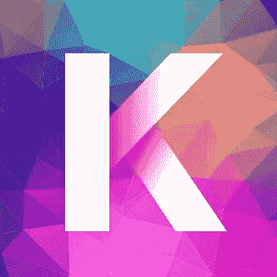
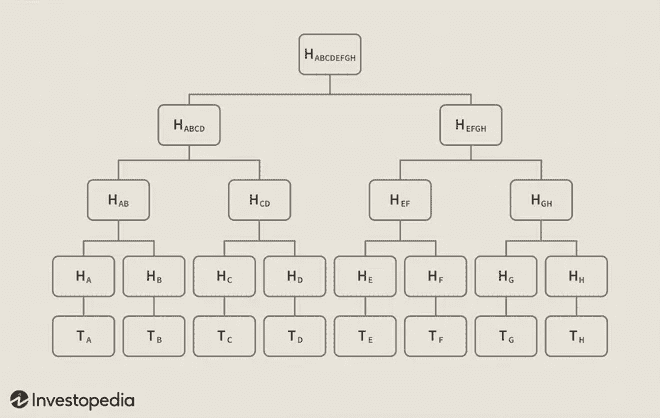

# 有前途的项目:Kadena(KDA)

> 原文：<https://medium.com/coinmonks/promising-projects-kadena-kda-5a640d170c34?source=collection_archive---------12----------------------->

[https://twitter.com/kadena_io](https://twitter.com/kadena_io)

在验证区块链网络上的交易之前，必须就事件的顺序达成一致，因为一旦块被添加到链中，它就不能被更改或删除。工作证明(PoW)和利益证明(PoS)等共识机制允许遍布全球的分布式网络以无信任的方式达成协议，并维护网络安全。在对比特币的 PoW 机制消耗过多电力进行持续审查后，其他方法作为替代方案取得了成果。

以太坊是第一个为其备受期待的以太 2.0 合并提出 PoS 基础设施的区块链之一。用你的资金来验证交易消耗更少的能量，并提供更快的终结。然而，也有人对基于利害关系的共识机制的分散性表示关切。验证者的股份越大，他们对共识和回报的影响就越大，因此资本利润率高的验证者仍然可以将网络引向最符合他们利益的方向。

在可扩展性方面，区块链网络往往会随着拥塞的增加而变慢，这也导致了更高的交易费用。本周的前景使多链方法的扩展更加可行，并提供了一种新的支付天然气费用的方式。 [**嘉手纳**](https://kadena.io) 区块链的基础设施是独一无二的。

**嘉手纳**

Kadena 是一种混合的工作验证区块链网络，可在不增加计算消耗的情况下进行扩展。这是唯一一个同时配备了公共链和私有链的网络，通过一种称为 [**Pact**](https://docs.kadena.io/basics/whitepapers/pact-smart-contract-language) 的定制智能契约语言相互连接，这也是由 Kadena 团队设计的。PoW 系统的安全功能与多区块链相结合，使得嘉手纳几乎不可能受到攻击。

能源消耗和天然气费用往往会随着网络流量而波动，Kadena 前所未见的**加密加油站**允许建立在 Kadena 基础上的企业为其客户支付天然气费用，无论是否拥堵，能源消耗都保持不变。目前共有 20 个公共区块链，每秒最终处理高达 **480，000 个事务**，每个新的区块链都提高了吞吐量和最终处理能力。

**约定**

类似于以太坊的计算语言 Solidity，Kadena 的 Pact 语言编写了可以在分布式网络上执行的智能合约。代码是人类可读的，这意味着它可以被普通人而不仅仅是开发人员检查。Solidity 最大的限制之一是它是图灵完全的，这意味着用这种语言创建的任何程序都可以在另一台服务器上完全模拟或复制。2016 年导致以太坊硬分叉创建以太坊经典的 Dao 黑客攻击是以太坊代码中潜在漏洞的结果。因为 Pact 语言是**图灵不完全的**，代码中的 bug 更难创建，甚至更容易识别，因为它们不容易被模拟。

**KDA**

嘉手纳的本地令牌(KDA)被用作公用令牌，以支付交易费用和补偿矿工向链中添加区块。根据 Coinmarketcap 的数据，目前有 10 亿枚代币的固定供应量，其中 1.71 亿枚在流通中。嘉手纳公司的大部分令牌分配给了矿工，目前的排放率约为每月 194 万个令牌。完整的分配方案如下所示:

70%留给矿工

为平台预留 20%

6%留给投资者

3%留给贡献者

1%在进行交易时被烧毁

**链网**

Chainweb 是 Kadena 的公共多链网络，由底层哈希链编织在一起。通过简单的支付验证(SPV)，用户可以在区块链无缝转移硬币并验证交易，而无需处理整个区块链。区块链交易配备了一个“哈希”来表示它们的有效性(就像一个确认号)。这些散列成对分组，然后放入第二个散列中，其中包含以前的事务。每个散列对被散列在一起，直到剩下一个散列，称为 **Merkle 根**，形成所谓的 **Merkle 树。**

Image by Julie Bang © Investopedia 2020

Merkle 树是一种数据结构，它将区块链事务安全地存储到组中，而不是单独出现。上图中的字母“T”和“H”代表树中的**事务**和**散列**。底部的事务被散列，分组成对，并放入它们自己的散列中，减少了前两行的对的数量。这个过程一直重复，直到只剩下一个散列，它的内容中包含该散列下的所有其它散列。内在的每个区块链

嘉手纳的区块链网络包含了所有其他链条的 Merkle 根，而不是每一笔交易。这降低了能耗和存储空间，使 Kadena 无需消耗额外的资源即可进行扩展。

**李书行**

企业不再需要在私有总账的安全性和公共总账的性能之间做出选择。嘉手纳的私有第二层区块链****构成了一个巨大的侧链，每秒支持高达 8000 次交易，并且可以与嘉手纳的 Chainweb 互换。企业可以将业务运营和公司见解存储在单独的数据库中，而不会降低性能。****

******底线******

****规模化仍然是区块链技术的一个障碍。随着解决方案的不断探索，每个人都在寻找一种方法来解决冲突，而不损害区块链的其他方面，特别是安全和吞吐量。尽管如此，Kadena 的区块链模式仍是一个革命性的壮举，但只有时间才能证明其基础设施如何抵挡实时网络参与。****

> ****加入 Coinmonks [电报频道](https://t.me/coincodecap)和 [Youtube 频道](https://www.youtube.com/c/coinmonks/videos)了解加密交易和投资****

# ****另外，阅读****

*   ****[8 大加密附属计划](https://coincodecap.com/crypto-affiliate-programs) | [eToro vs 比特币基地](https://coincodecap.com/etoro-vs-coinbase)****
*   ****[最佳以太坊钱包](https://coincodecap.com/best-ethereum-wallets) | [电报上的加密货币机器人](https://coincodecap.com/telegram-crypto-bots)****
*   ****[交易杠杆代币的最佳交易所](https://coincodecap.com/leveraged-token-exchanges) | [购买 Floki](https://coincodecap.com/buy-floki-inu-token)****
*   ****[3Commas 对 Pionex 对 Cryptohopper](https://coincodecap.com/3commas-vs-pionex-vs-cryptohopper) | [Bingbon 评论](https://coincodecap.com/bingbon-review)****
*   ****[加密复制交易平台](/coinmonks/top-10-crypto-copy-trading-platforms-for-beginners-d0c37c7d698c) | [如何在 WazirX 上购买比特币](/coinmonks/buy-bitcoin-on-wazirx-2d12b7989af1)****