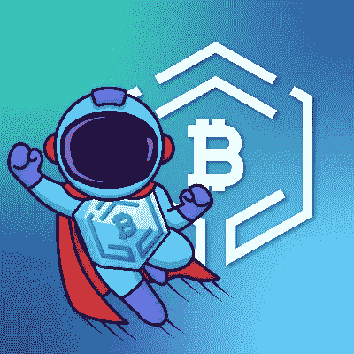

# 有前途的项目:新闻加密(NWC)

> 原文：<https://medium.com/coinmonks/promising-projects-newscrypto-68ffbdf939a4?source=collection_archive---------42----------------------->

[https://twitter.com/NwcPublic](https://twitter.com/NwcPublic)

到目前为止，这个新的十年见证了加密货币识别的大幅增长。从比特币在 2020 年底的大规模反弹，到 El Savador 接受它为法定货币，以及经济制裁的结果，加密现在已经成为俄罗斯和乌克兰冲突中的一个讨论话题。更不用说政府关于监管和稳定的讨论，以及零售公司卷入 NFT 的危机；可以肯定地说，无论我们的经济走向何方，区块链技术都在目的地等着我们。

每天都有更多的人继续加入加密生态系统；虽然这些人的动机可能各不相同(通常是通过迷因币寻求快速利润)，但投资者了解这个领域是很重要的，因为它无疑是复杂的。本周的前景了解在加密货币等无许可生态系统中培养的必要性，并为新手和有经验的交易者提供了一个平台，这些交易者希望获得最新的可靠、准确的信息，并获得创新的金融工具和工具来帮助他们的交易企业。 [**NewsCrypto**](https://app.newscrypto.io) 是一款集娱乐和教育于一体的互动资源，以革命性的方式在变幻莫测的市场中脱颖而出。

**新闻加密**

NewsCrypto 成立于 2019 年 10 月，其使命是通过教育和帮助有抱负和有经验的交易者来实现全球加密货币的采用。这是一个由各种服务和程序组成的生态系统，包括专业级分析工具、支持跨链集成的链上协议(将数据从一个区块链传输到另一个)以及打包到一个平台中的教育工具。这个生态系统是由网络的本地货币(NWC)推动的，它允许访问优质服务，并可在多个外部链之间互换，如 Polygon 和币安的智能链。用户可以了解他们最喜欢的货币，区块链世界的最新消息，并了解更多关于加密生态系统本身的信息。

**新闻加密学院**

“首先，教育新成员成为加密世界的一部分非常重要”

-新闻加密[白皮书](https://newscrypto.io/whitepaper.pdf)

从了解加密货币的基本原理，到分布式账本技术和 DeFi 等更复杂的主题，该学院计划可以帮助扩展各级交易者的知识。学院中心对平台上的所有用户都是免费的，由世界顶级交易者和密码领域的创新头脑设计。课程包括学习如何阅读图表、加密交易策略，以及辨别在区块链犯下的各种网络犯罪，等等。在成为一名优秀的加密货币交易者的道路上，用户必须能够在承担任何真正的风险之前测试新获得的策略。NewsCrypto 计划在今年发布一个交易模拟器，让会员用指标和工具进行实验，为他们找到完美的策略(在其他项目中，我们将在另一节中介绍)。)

**平台**

该协议的平台分为两个版本:基础层和专业层。用户在创建一个免费帐户后就可以访问基本层。除了学术计划之外，会员还可以了解最新的头条新闻，并有权使用特定的分析工具来查看图表。专业层是一种付费订阅服务(在 NWC 付费)，允许用户访问所有可用的交易和分析资源，以及对加密世界的深入了解。以下是 NewsCrypto 团队提供的一些指标和工具(以及其他工具):

*人工智能价格情绪-人工智能被用于根据通过新闻媒体和社交网络接收的数据预测各种资产的收盘价。

*套利——套利是指在不同市场买卖证券，从不同交易所的差价中获利的行为；NWC 的套利工具帮助用户在网络支持的交易所内寻找套利机会。

*相关性——虽然技术分析在交易中起着重要的作用，但是市场之外的外部因素也必须考虑进去。NWC 的相关性工具有助于揭示那些影响价格运动的根本原因，比如一家公司推出了新产品。

*基本面分析报告——NWC 的分析师团队每周创建基本面报告，涵盖特定加密货币项目的文档。

*鲸鱼警报——资本利润率高的市场参与者(被称为鲸鱼)比散户投资者对市场的影响力更大。鲸鱼警报工具突出了大量的市场活动。

该平台还配备了一个社区论坛，供交易者创建和分享自己的技术分析报告。然后，其他成员可以预测特定市场的下一步行动，并在做出正确假设后获得奖励；这些报告的创建者也根据他们的报告吸引的参与度获得奖励。这些奖励以 NWC 代币的形式出现。

**NWC**

NewsCrypto 的原生货币是平台内部经济的燃料。建立在恒星区块链(XLM)，这种公用事业令牌提供了难以置信的低费用几乎即时终结。该平台上的所有交易都在 NWC 结算，其通货紧缩率烧掉了从会员费和订阅费中获得的 20%的代币，使得剩余的代币价值更高。随着越来越多的成员加入网络，越来越多的代币被烧掉；NWC 的价值是由平台的整体成功决定的。最初的供应量为 2.8 亿代币，其中 32.9%由公司保留，14.41%分配给社区发展和补偿员工，还有 3.5%被列为储备基金。另外 50%可以在公开市场上买到。

**其他发展**

除了像 NewsCrypto 一样是一个教育和有洞察力的生态系统，乐趣还不止于此。由于网络的原生货币是建立在 Stellar 的网络上的，所以以某种方式回馈是正确的。NWC 的 **Stellar-Polygon bridge** 让 Stellar 链上的持有者能够将 XLM 的股份转移到 Polygon 的网络，与保利蓬勃发展的 DeFi 社区互动。设置不同的节点操作符，将数据从一个区块链传输到另一个；面的(MATIC)区块链上的令牌以数字方式包装并表示为(wXLM ),并以 1:1 的比例进行转换。一旦转换完毕，代币就可以重新转换回它们原来的 XLM 形式，并转移回它们原来的钱包。

今年晚些时候，NewsCrypto 计划推出自己的[元宇宙](https://newscrypto.io/metaverse)，让用户完全沉浸在这个创新的生态系统中。专业会员将有能力定制他们的个人办公室，以及获得额外的资源，如我前面提到的新的**贸易模拟器**；交易者可以评估市场上的不同策略，并在不承担任何实际损失的情况下进行实验。学院中心将被转换为一系列数字教室，供用户注册课程、参加研讨会和一对一会议，以及主持自己的会议。

你一直想交易加密货币吗？现在是这么做的最佳时机(说真的，市场价格处于严重低位)。那些希望开始和增长你的加密和 web3 知识的人，我的推荐代码将在下面发布以创建一个帐户。参与进来永远不会太迟，在这一点上，接受区块链技术的教育只能帮助你。

推荐链接:[https://app.newscrypto.io/register/sign-up?referral=e5db98a3](https://app.newscrypto.io/register/sign-up?referral=e5db98a3)

> *加入 Coinmonks* [*电报频道*](https://t.me/coincodecap) *和* [*Youtube 频道*](https://www.youtube.com/c/coinmonks/videos) *了解加密交易和投资*

# 另外，阅读

*   [3 商业评论](/coinmonks/3commas-review-an-excellent-crypto-trading-bot-2020-1313a58bec92) | [Pionex 评论](https://coincodecap.com/pionex-review-exchange-with-crypto-trading-bot) | [Coinrule 评论](/coinmonks/coinrule-review-2021-a-beginner-friendly-crypto-trading-bot-daf0504848ba)
*   [莱杰 vs n 格拉夫](/coinmonks/ledger-vs-ngrave-zero-7e40f0c1d694) | [莱杰纳诺 s vs x](/coinmonks/ledger-nano-s-vs-x-battery-hardware-price-storage-59a6663fe3b0) | [币安评论](/coinmonks/binance-review-ee10d3bf3b6e)
*   [Bybit Exchange 审查](/coinmonks/bybit-exchange-review-dbd570019b71) | [Bityard 审查](https://coincodecap.com/bityard-reivew) | [Jet-Bot 审查](https://coincodecap.com/jet-bot-review)
*   [3 commas vs crypto hopper](/coinmonks/3commas-vs-pionex-vs-cryptohopper-best-crypto-bot-6a98d2baa203)|[赚取加密利息](/coinmonks/earn-crypto-interest-b10b810fdda3)
*   最好的比特币[硬件钱包](/coinmonks/hardware-wallets-dfa1211730c6) | [BitBox02 回顾](/coinmonks/bitbox02-review-your-swiss-bitcoin-hardware-wallet-c36c88fff29)
*   [BlockFi vs Celsius](/coinmonks/blockfi-vs-celsius-vs-hodlnaut-8a1cc8c26630)|[Hodlnaut 点评](/coinmonks/hodlnaut-review-best-way-to-hodl-is-to-earn-interest-on-your-bitcoin-6658a8c19edf) | [KuCoin 点评](https://coincodecap.com/kucoin-review)