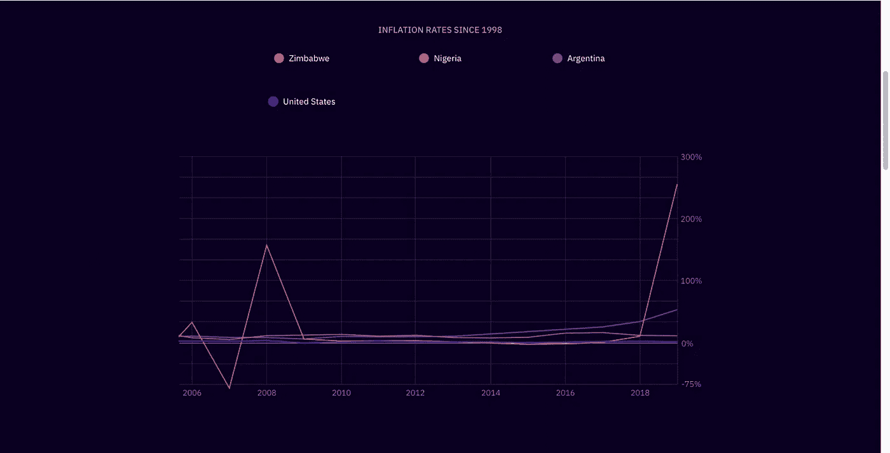

# 有前途的项目:恒星(XLM)

> 原文：<https://medium.com/coinmonks/promising-projects-stellar-xrp-3530a3fa464e?source=collection_archive---------33----------------------->

[https://twitter.com/StellarOrg](https://twitter.com/StellarOrg)

由于海外工人和企业在国际范围内运营的增加，跨境支付已成为更常用的补偿解决方案。这些交易涉及居住在不同国家的发送者和接收者将货币价值从一种法定货币兑换成另一种法定货币(例如:美元对比索)。然而，这些支付通常会导致监管和转换率方面的高昂费用。平均而言，处理交易需要 2-5 天；对于单个交易所，多个银行和实体必须进行沟通，以评估交易费用和可能的税收(取决于国家/货币)。

本周的展望旨在通过使用现实世界的货币、证券和商品来加强我们的现代金融支付系统。 [**Stellar**](https://www.stellar.org) 使所有的交易媒介整合在一个单一的网络上，提供低廉的交易费用、近乎即时的终结性和透明性。我们将讨论 Stellar 平台的基本原理和特性，并重点介绍一些值得注意的使用案例。

**恒星**

你可以把 Stellar 看作是定制 stablecoins 的一个枢纽；用户可以创建自己的数字令牌，并将其与他们选择的任何资产类别挂钩。用户必须创建一个帐户，并在相关钱包中存储少量名为流明的重要令牌，才能开始使用该平台。通过要求每个网络参与者在他们的钱包中保留一部分流明，网络不太可能遭受垃圾邮件攻击，并且更可能保持效率。Stellar 的平均费用估计为 0.0001 流明，这包括铸造代币，以及在网络的分散交换中进行互动。

**分散交换**

Stellar 的非托管交换使用户能够在彼此之间交易和转移资产。与常规交易类似，订单存储在订单簿中，直到履行或取消。订单按价格-时间优先顺序排列，那些以最高价格买入/卖出的订单被放在订单簿的顶部，首先被执行。当多个订单的价值相等时，它们将按照最先提交的订单进行排列。为了确保完全履行所有交易，用户帐户具有用于交换资产的购买和出售义务，任何不履行这些义务的行为(即，用户试图转移多于其钱包中可用代币的代币)将被自动取消。Stellar 的交易所也有利于评估**路径支付**的转换率。

**路径支付**

star 的路径支付大大减少了参与处理跨境交易的中间商。金融机构代表发送方和接收方相互通信以兑换货币。Stellar 参与者可以在单次交易中转移和兑换代币。居住在美国的用户可以向网络发送请求，以便向世界各地的人发送欧元。系统随后在交易所中搜索最佳兑换率，在该兑换率中价格和金额被锁定并且发送者执行交易。发件人和收件人的地址通过称为**锚**的实体桥接在一起，这些实体将恒星网络与现实世界的金融系统连接起来。

**主播**

这类网络参与者就像是一位**先知**，将恒星的区块链与我们的金融部门联系在一起。成为锚意味着能够向分散化的账户提供存款和提款等金融服务。star 上的锚是受监管的资本服务业务或金融科技公司，要履行这一职位，参与者需要提供以下两种服务中的至少一种:

稳定币的发行比例为 1:1，为存款和提款提供了资本储备。

通过监管流程服务(每个国家的政策各不相同)，将金融网络与锚定国的银行系统连接起来。

有关 star 定位标准的更多信息，请参见平台的[文档页面。](https://www.stellar.org/learn/anchor-basics)

**恒星流明**

作为一个将多种货币连接到一个系统的网络，Stellar 并不想为了表示中立而创建本地代币。流明是恒星网络的效用令牌；货币用户使用支付费用。目前比特币的供应量为 500 亿流明，按照 Coinmarketcap 的数据，流通中的比特币为 247 亿。代币供应量的很大一部分被分配给恒星发展基金会，该基金会鼓励增长并促进恒星网络。

**使用案例**

与法定货币挂钩的数字代币可以对全球其他国家和地区产生重大影响。在海外工作的员工可以以更低的价格，以更快的速度将汇款汇回给家人。对于不同的国家，通货膨胀率可能是相当不稳定的，看看下表，我们可以看到不同地区的利率。

[https://www.stellar.org/foundation](https://www.stellar.org/foundation)

看到美国如何保持比其他国家更稳定的汇率，居住在津巴布韦等地的公民(假设他们持有津巴布韦货币硬币)可以将他们的津巴布韦元代币兑换成美元代币，以对冲他们国家的通货膨胀。这方面一个值得注意的用例是托管平台 [**Vibrant**](https://vibrantapp.com) ，它使澳大利亚公民能够购买和持有美国稳定债券，以对冲他们国家的通货膨胀(也建立在 Stellar 的网络上)。新闻媒体和教育中心 [**新闻加密**](/coinmonks/promising-projects-newscrypto-68ffbdf939a4) 在 Stellar 的区块链上为他们的网络创建了原生令牌，并在 Stellar 和 Polygon (MATIC)之间建立了一座桥梁，将 XLM 持有者与 MATIC 的 DeFi 生态系统连接起来。

恒星可以在国际范围内重建商业。无论如何，我们都会找到一种方法来绕过这些阻碍我们前进的财务障碍。

> *加入 Coinmonks* [*电报频道*](https://t.me/coincodecap) *和* [*Youtube 频道*](https://www.youtube.com/c/coinmonks/videos) *了解加密交易和投资*

# 另外，阅读

*   [有哪些交易信号？](https://coincodecap.com/trading-signal) | [Bitstamp vs 比特币基地](https://coincodecap.com/bitstamp-coinbase) | [买索拉纳](https://coincodecap.com/buy-solana)
*   [ProfitFarmers 回顾](https://coincodecap.com/profitfarmers-review) | [如何使用 Cornix Trading Bot](https://coincodecap.com/cornix-trading-bot)
*   [十大最佳加密货币博客](https://coincodecap.com/best-cryptocurrency-blogs) | [YouHodler 评论](https://coincodecap.com/youhodler-review)
*   [my constant Review](https://coincodecap.com/myconstant-review)|[8 款最佳摇摆交易机器人](https://coincodecap.com/best-swing-trading-bots)
*   [MXC 交易所评论](/coinmonks/mxc-exchange-review-3af0ec1cba8c) | [Pionex vs 币安](https://coincodecap.com/pionex-vs-binance) | [Pionex 套利机器人](https://coincodecap.com/pionex-arbitrage-bot)