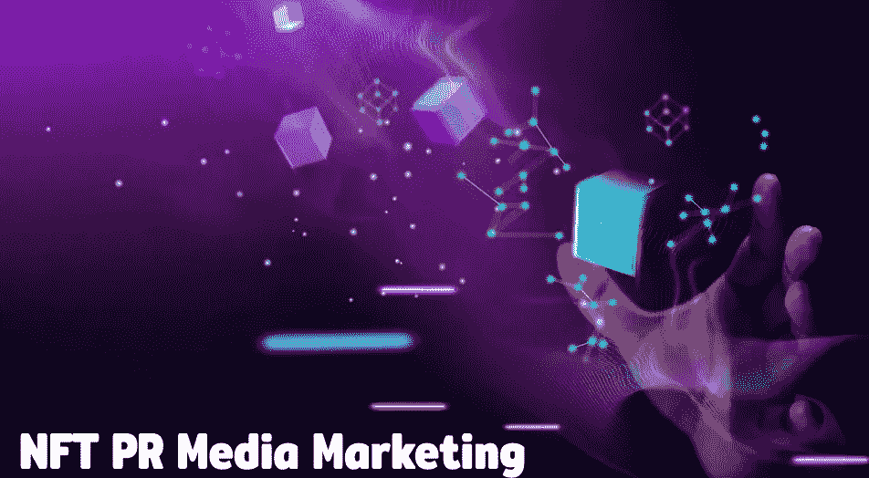

# 通过有效的 NFT 公关媒体营销推广您的业务

> 原文：<https://medium.com/coinmonks/promote-your-business-with-effective-nft-pr-media-marketing-e407eae2f7b8?source=collection_archive---------41----------------------->

不可替代代币现在正成为街谈巷议的话题。现在，每个人都在谈论 NFTs。此外，他们正以惊人的速度购买非功能性食品。在 NFT 的许多市场上，为数字空间中的所有 NFT 爱好者开发和销售的 NFTs 的比率非常高。每个人都在思考的首要问题是，一项数字资产是如何以数千乃至数百万美元的价格出售的？可能的答案是所有权。所有权一直是每个人购买资产的首要品质，它可以是实物或数字，所有权是购买资产的主要原因。当数字资产在互联网上交易或冲浪时，它们是不合法的，因为所有权很容易被伪造，它们是不真实的。

> 加入 Coinmonks [电报集团](https://t.me/joinchat/Trz8jaxd6xEsBI4p)，了解加密交易和投资

因此，付费持有数字资产不是正确的想法，因为相应的资产可以免费提供给用户。但是，在区块链技术的帮助下，一切都完全黯然失色了。所有权受到保护，它们存放在区块链。在区块链的帮助下，以 NFTs 的名义进行数字资产交易成为可能。此外，这项技术还创造了更多的投资机会。因此，使 NFTs 成为未来坚实的业务平台。

> 如果一个密码爱好者有兴趣开发一个 NFT，并在拍卖中出售，由于数字市场的激烈竞争，NFT 应该在市场上有一定的影响力。所以，为了让你的 NFT 红起来， [**NFT 公关媒体营销**](https://bit.ly/3mpEi9g) 就做好了。数字空间中有许多营销策略，但公关媒体营销是数字空间中最有效的策略之一。

## **NFT 营销-简要说明**

目前，在数字空间中有无数的 NFT。此外，并非所有的国家森林论坛都为所有人所熟知。这是由于该领域的广泛竞争。因此，NFT 营销是扭转局面的最佳方式，可以为平台带来大量的受众或卖家。因此，NFT 营销在 NFT 项目的成功中起着举足轻重的作用。

## **NFT 公关媒体营销**

数字市场上有各种各样的**NFT 营销服务。从社交媒体营销到影响者营销，这些服务是非常可扩展和巨大的。此外，在这些服务中，公关媒体营销有望在很短的时间内为项目带来极高的用户率。**

****

**一般来说，NFT 营销是由相关公司或用户完成的。营销是以直接的方式进行的。例如，在社交媒体营销中，关于 NFT 的信息由用户直接发布在平台上。最常用的平台是**脸书、Instagram 和 Twitter。**这里发生的营销是由用户直接完成的。当用户获得关于 NFT 的信息时，它将直接来自用户。因此，用户访问 NFT 项目的动力相对来说要少得多。与 NFT 公关媒体营销不是这样，信息和营销数据提供给第三方人物。这个第三方人物将发布关于你的 NFT 项目。因为关于你的项目的信息来自第三方，信任和驱动因素会相对较高。公关媒体营销机构使用的方式有很多，比如发布广告、在社交媒体平台上推广等等。**

## ****NFT 公关媒体营销的首要有利因素****

**在推销资产时，首要质量是信任因素。如果 NFT 的买家对你的 NFT 项目感到信任，NFT 的资产最有可能被收购。说到正常营销，推广是由 NFT 老板做的。众所周知，总会有被业主完全淹没的项目积极点。这就是 NFT 公关媒体营销解决方案的优势所在。公关营销让买家在自己和 NFT 项目之间建立起牢固的信任。当推广由第三方人物提供时，NFT 的质量和价值将被显示出来。因此，大量的买家将有兴趣参观上述 NFT 市场，查看 NFT 项目。**

## ****最后的想法，****

**现在，NFT 公关媒体营销是完美的解决方案，为用户谁想要把他们的 NFT 项目到一个新的水平。市场上有各种各样的 NFT 营销服务，但最好的是 NFT 公关媒体营销。这项营销服务由 NFT 顶级营销机构提供。密码市场上有许多代理机构。因此，做彻底的研究，并选择最好的一个领域。**