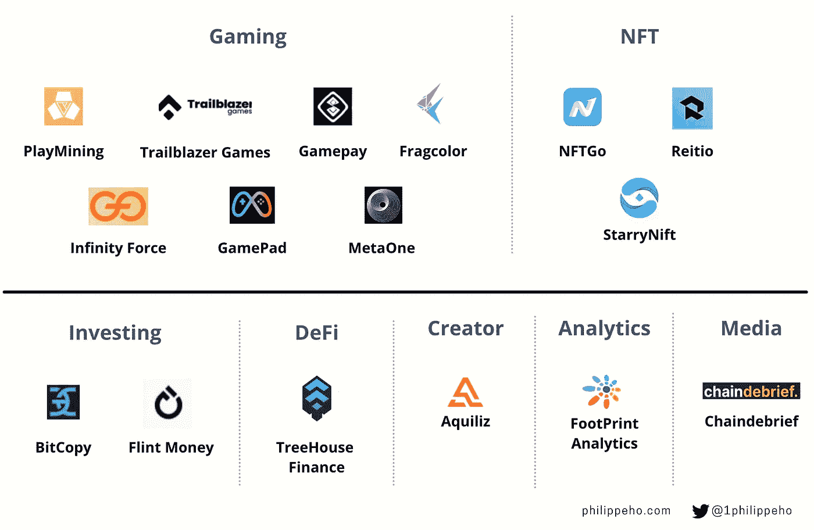
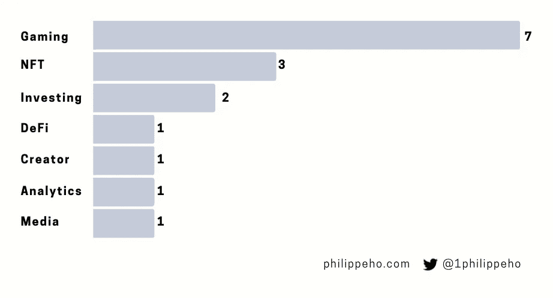

# 资金证明-新加坡:Q1 22 种子期前和种子期交易的调查

> 原文：<https://medium.com/coinmonks/proof-of-funding-singapore-a-look-into-q1-22-pre-seed-and-seed-deals-8fdf93990b9a?source=collection_archive---------45----------------------->

欢迎来到“PoF:资金证明”。一份季度时事通讯，细分了特定地理区域的 web3/ crypto 空间中的所有种子前和种子交易。

这一期，让我们来关注一下**新加坡**。

Q1 2022 期间完成了 16 笔交易，总融资额为 6515 万美元(不包括 Alqilliz、StarryNift 和 Fragcolor，其融资额未披露)。

**tree house Finance**以 1800 万美元筹集了一轮最多的资金，由一家“未披露身份的大型金融科技投资者”牵头，其他几家公司也参与其中，包括币安、光速、温特穆特和 Jump Capital。

Breakdown by company type

# **博彩**

## PlayMining，*$ 1200 万*——种子

[Playmining](https://dea.sg/) 是全球 GameFi(基于游戏的分散金融)行业领先的 NFT 游戏平台。作为世界上第一个赚取代币经济的游戏，该服务于 2020 年 5 月 26 日推出，目前拥有来自 100 个国家的超过 200 万名玩家。

## 开拓者游戏，820 万美元——种子资金

[开拓者游戏](https://trailblazer.games/)是一家基于 Web3 的游戏开发商，为 Web 和移动平台创造引人入胜的娱乐游戏体验。

## 无限力量，550 万美元——种子

Infinity Force 是一个平台，允许区块链游戏玩家创建新的公会，招募成员，并管理他们的表现。

## 游戏手柄，250 万美元——种子

[GamePad](https://gamepad.co/) 是一个策划、培育并加速顶级游戏、公会和元宇宙项目的平台。

## 游戏费用:120 万美元——种子期前

Gamepay 是一家元宇宙公司，它创造游戏来赚取专注于多元宇宙的游戏。

## MetaOne，120 万美元——种子

[MetaOne](https://metaone.gg/) 为 GameFi 开发者提供公会管理解决方案。

## FragColor —未披露

T21 正在开发一个完全分布式的游戏平台和创作系统。

# **NFT**

## NFT go——675 万美元——种子

是一个 NFT 数据聚合器，用户可以在这里找到关于 NFT 的信息。

## 关系——80 万美元——种子期前

Reitio 是第一个 MetaFi 协议，它在一个分散的元宇宙推动了无限的创新。

## StarryNift —未披露

StarryNift 是第一个为 NFT 收藏品提供创作、孵化、拍卖和交易的综合游戏化平台和一站式商店。

# **投资**

## 弗林特钱，510 万美元——种子

[火石钱](https://www.flint.money/)是一款全球加密投资应用。

## BitCopy，150 万美元——种子

BitCopy 是一种加密拷贝交易服务。

# **DeFi**

## 树屋融资，1800 万美元——种子资金

[Treehouse Finance](https://www.treehouse.finance/) 是一个 DeFi 分析平台，为 DeFi 用户提供数据、分析和风险管理，并推动社区创新。

# **创建者**

## Aqilliz —未披露

[Aqilliz](https://aqilliz.com/) 在数字营销领域构建区块链解决方案，恢复品牌、平台和消费者之间的平衡。

# **分析**

## 足迹分析，150 万美元—种子

[足迹分析](https://www.footprint.network/dashboards)是一个发现和可视化区块链数据的分析平台。

# **媒体**

## 连锁汇报，90 万美元—种子

[链汇报](https://chaindebrief.com/)作为专用于加密的媒体平台运行。

# of investments by category

# **方法论**

我在 Crunchbase 数据库中跟踪了新加坡公司在 2022 年 1 月 1 日至 2022 年 3 月 31 日期间筹集的所有 pre-seed 和 seed 轮次，涉及以下四个行业标准:区块链、加密货币、游戏和比特币。

# 反馈

在这里告诉我你的想法，并在推特上关注我！

> 加入 Coinmonks [电报频道](https://t.me/coincodecap)和 [Youtube 频道](https://www.youtube.com/c/coinmonks/videos)了解加密交易和投资

# 另外，阅读

*   [如何在 FTX 交易所交易期货](https://coincodecap.com/ftx-futures-trading) | [OKEx vs 币安](https://coincodecap.com/okex-vs-binance)
*   [CoinLoan 评论](https://coincodecap.com/coinloan-review) | [YouHodler 评论](/coinmonks/youhodler-4-easy-ways-to-make-money-98969b9689f2) | [BlockFi 评论](https://coincodecap.com/blockfi-review)
*   [XT.COM 评论](https://coincodecap.com/profittradingapp-for-binance) | [币安评论](https://coincodecap.com/xt-com-review)
*   [SmithBot 评论](https://coincodecap.com/smithbot-review) | [4 款最佳免费开源交易机器人](https://coincodecap.com/free-open-source-trading-bots)
*   [比特币基地僵尸工具](/coinmonks/coinbase-bots-ac6359e897f3) | [AscendEX 审查](/coinmonks/ascendex-review-53e829cf75fa) | [OKEx 交易僵尸工具](/coinmonks/okex-trading-bots-234920f61e60)